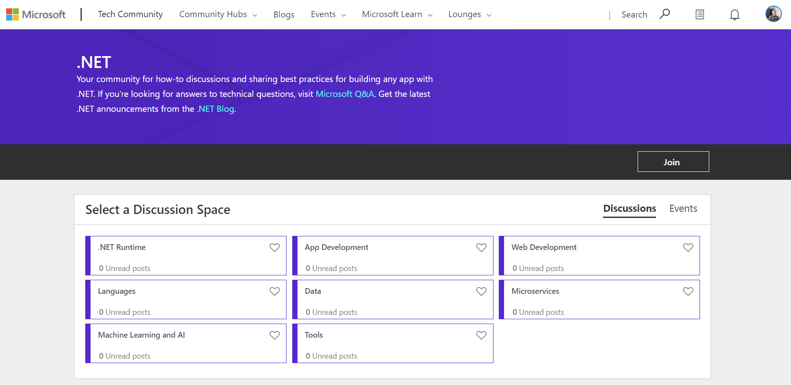
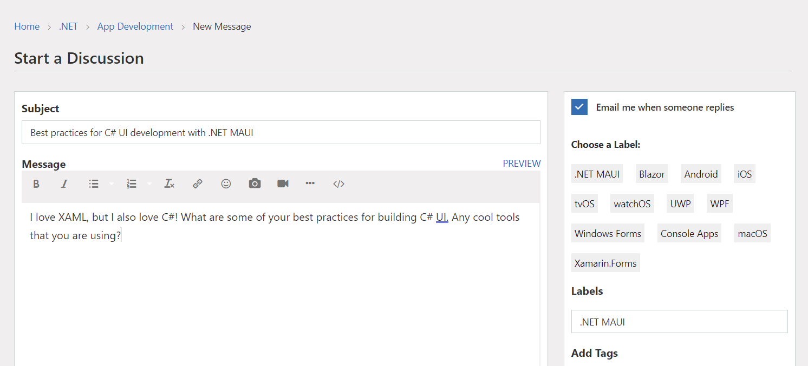
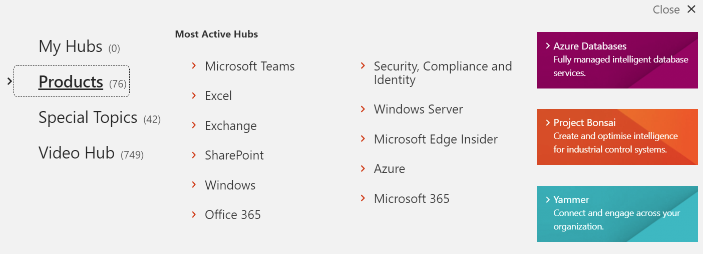
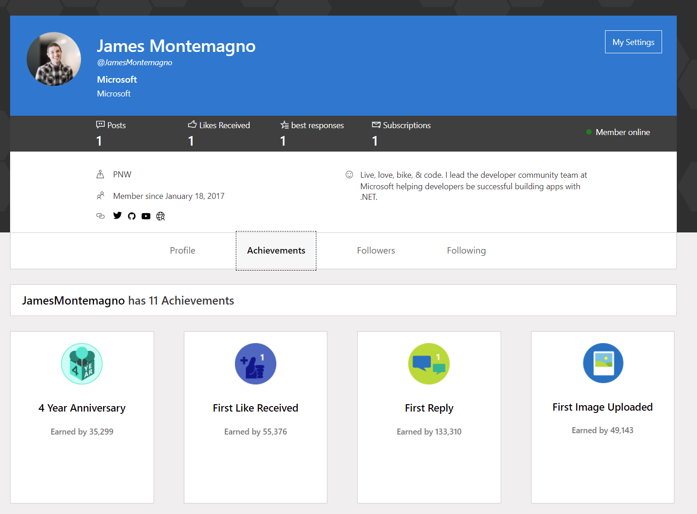

.NET is a unified platform enabling developers to build world class applications across operating systems and platforms. There is a global community of millions of developers building apps with .NET and helping other developers get started with .NET. Last year, we started our journey in unifying .NET communities when it comes to discussions and getting technical help. First, we [launched Microsoft Q&A for .NET](https://docs.microsoft.com/answers/products/dotnet?WT.mc_id=friends-0000-jamont), a home for technical questions and answers for .NET. This hub has seen huge growth month over month  in the number of visitors, questions, and answers from the community and Microsoft employees. We want to thank everyone for being so involved in Q&A which has lead to over 80% of questions being answered every month!

We aren't done yet, as we have heard feedback from our developer community that a space is needed to have more interactions beyond Q&A. You have told us you are looking for a dedicated forum where you have technical discussions, talk about best practices, chat about new releases, and share how-to guidance. That is why were are pleased to announce the [.NET Tech Community Forums](https://techcommunity.microsoft.com/t5/net/ct-p/dotnet) for all .NET developer topics & discussions!

## Tech Community Features

No matter if you are a web developer, mobile & desktop developer, into microservices, data, machine learning, or just getting started, there is a discussion space for you! Simply join the [.NET tech community](https://techcommunity.microsoft.com/t5/net/ct-p/dotnet), pick a discussion space, start a new discussion, and collaborate with other .NET developers!

### Follow Topics

Every topic on the .NET Tech Community can be followed so you can get updates through e-mail, RSS feeds, or on your tech community home page.

### Join more communities

The best part of the .NET Tech Community is that it is part of the entire Microsoft Tech Community. There are a plethora of product and special topic community hubs that you can join, follow, and start discussions on.

### Build your profile and earn achievements

Who doesn't like getting achievements and kudos for helping out the community and discussing your favorite topics!

Check out the [.NET Tech Community](https://techcommunity.microsoft.com/t5/net/ct-p/dotnet) today!
