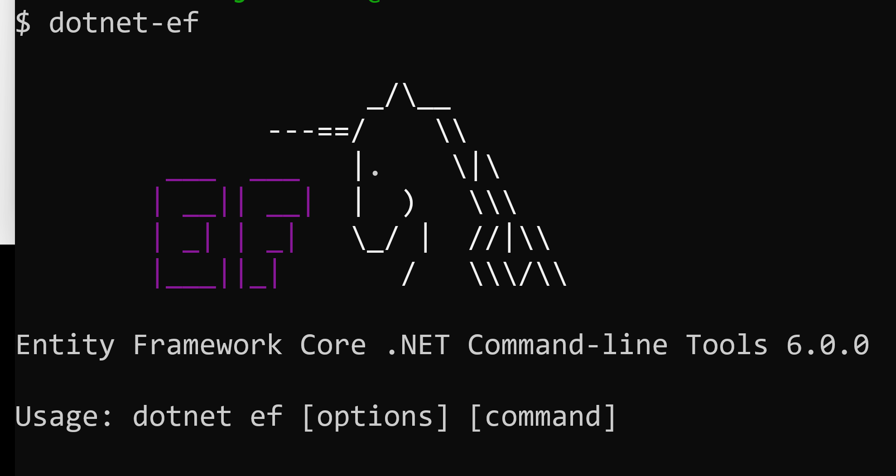

The Entity Framework Core team has released the generally available version of EF Core 6.0 in parallel with [.NET 6](https://devblogs.microsoft.com/dotnet/announcing-net-6/). 
EF Core 6 is available as a set of [NuGet Packages](https://www.nuget.org/packages/Microsoft.EntityFrameworkCore/6.0.0). At the end of this blog post you will find a [packages](#packages) section that lists all of the
available packages and describes what they are used for.

EF Core 6.0 is a modern, cloud-native-friendly data access API that supports multiple backends. Get up and running with a document-based Azure Cosmos DB container using only a few lines of code, or use your LINQ query skills to extract the data you need from relational databases like SQL Server, MySQL, and PostgreSQL. EF Core is a cross-platform solution that runs on mobile devices, works with data-binding in client WinForms and WPF apps "out of the box", and can even run inside your browser!

Did you know it is possible to embed a SQLite database in a web app and use Blazor WebAssembly to access it using EF Core? Check out [Steven Sanderson's excellent video](https://youtu.be/kesUNeBZ1Os) to see how this is possible. Combined with the power of .NET 6, EF Core 6.0 delivers major performance improvements and even scored 92% better on the industry standard Tech Empower Fortunes benchmark compared to EF Core 5.0 running on .NET 5. The EF Core team and global OSS community have built and published many resources to help you get started. 

This blog post lists a few ways to learn about new features and get up and running with Entity Framework Core as quickly as possible.

The first step in your journey should always be the comprehensive documentation available online at [https://docs.microsoft.com/ef](https://docs.microsoft.com/ef). There you will find
everything from a [step-by-step guide to build your first EF Core app](https://docs.microsoft.com/ef/core/get-started/overview/first-app) to a comprehensive list of [what's new in EF Core 6](https://docs.microsoft.com/ef/core/what-is-new/ef-core-6.0/whatsnew). If you find anything missing, let us know via [GitHub issues](https://github.com/dotnet/EntityFramework.Docs/issues) and/or
submit a pull request.

> __Note__: various samples ready to build and run are available on GitHub at: [What's New in EF Core 6 Samples](https://github.com/dotnet/EntityFramework.Docs/tree/main/samples/core/Miscellaneous/NewInEFCore6).

Check out our [EF Core Community Standup EF Core 6.0 retrospective](https://youtu.be/cx6IUURncgk) to hear from the team and several community members about the release. We also presented [What's New with EF Core 6.0](https://youtu.be/_1fJeW4F3ts) at .NET Conf 2021. Be sure to check out community member Julie Lerman's comprehensive article [EF Core 6: Fulfilling the Bucket List](https://codemag.com/Article/2111072/EF-Core-6-Fulfilling-the-Bucket-List).

For excellent advice regarding updating your existing apps, read [Updating your ASP.NET Core and/or EF Core Application to .NET 6](https://www.thereformedprogrammer.net/updating-your-asp-net-core-ef-core-application-to-net-6/).

## Get to Know EF Core 6.0

The following major areas were added or improved in EF Core 6.0, and each has several resources to help you get started.

### Azure Cosmos DB

The EF Core team invested heavily to ensure that working with Azure Cosmos DB is a first class experience. From simplifying configuration to supporting raw SQL and delivering diagnostics, we believe this is a full featured option for working with the popular NoSQL database.

|Resource Type|Title|
|:--|:--|
|🎞️ Video|[.NET Conf: EF Core 6 and Azure Cosmos DB](https://youtu.be/zQC9D00pr6I)|
|🎞️ Video|[Azure Cosmos DB and EF Core](https://youtu.be/nEqH_XfCfho)|
|🎞️ Video|[Cosmos Live TV: What's New with EF Core 6 for Cosmos DB](https://youtu.be/VUyavt95CkQ)|
|🎞️ Video|[On .NET: Working with EF Core and Azure Cosmos DB](https://youtu.be/MicJm1hRNKU)|
|📃 Official Docs|[Cosmos Provider Enhancements](https://docs.microsoft.com/ef/core/what-is-new/ef-core-6.0/whatsnew#cosmos-provider-enhancements)|

### Compiled Models

EF Core parses configuration information to build a working model of how the domain maps to the underlying database. The time it takes to compile the memory increases as the number of entities, properties, and relationships grows. Customers with apps in distributed environments or using platforms like Azure Functions require fast startup times. Compiled models addresses this by building the model at development time, significantly improve the time to first query result.

|Resource Type|Title|
|:--|:--|
|🎞️ Video|[Introducing EF Core Compiled Models](https://youtu.be/XdhX3iLXAPk)|
|📖 Blog Post|[Compiled Models](https://devblogs.microsoft.com/dotnet/announcing-entity-framework-core-6-0-preview-5-compiled-models/)|
|📃 Official Docs|[Compiled Models](https://docs.microsoft.com/ef/core/what-is-new/ef-core-6.0/whatsnew#compiled-models)|

### Configure Conventions

Imagine you want to impose a string column length limit of 200 characters on every table in your database. If you have hundreds of entities, this would require either applying data annotations or performing fluent configuration for every table. Pre-configuration conventions allow you to specify a rule as a convention that becomes the default unless you opt-out. This can potentially save hundreds of lines of code and allows you to make changes in a single place.

|Resource Type|Title|
|:--|:--|
|📖 Blog Post|[Configure Conventions](https://devblogs.microsoft.com/dotnet/announcing-entity-framework-core-6-0-preview-6-configure-conventions/)|
|📃 Official Docs|[Pre-convention Model Configuration](https://docs.microsoft.com/ef/core/what-is-new/ef-core-6.0/whatsnew#pre-convention-model-configuration)|

### Migration Bundles

A popular feature of EF Core is the ability to track schema changes by version for your database. This capability is called migrations. Traditionally, migrations are embedded in your target application. They would require you to deploy the app along with the .NET SDKs and runtime to execute. To simplify this step as a part of continuous deployment, the EF Core team built migration bundles. These are self-contained, standalone executables that apply the migrations as part of your CI/CD pipeline.

|Resource Type|Title|
|:--|:--|
|📖 Blog Post|[Introducing DevOps-friendly EF Core Migration Bundles](https://devblogs.microsoft.com/dotnet/introducing-devops-friendly-ef-core-migration-bundles/)|
|📃 Official Docs|[Migration Bundles](https://docs.microsoft.com/ef/core/what-is-new/ef-core-6.0/whatsnew#migration-bundles)|

### Performance

The team's aggressive focus on performance resulted in a 92% improvement for the full stack of EF Core 6 on .NET 6 over EF Core 5 on .NET 5 according to the industry standard TechEmpower benchmark.

|Resource Type|Title|
|:--|:--|
|🎞️ Video|[Visualizing Database Query Plans](https://youtu.be/Zhy5antRDJk)|
|🎞️ Video|[Performance Tuning an EF Core Application](https://youtu.be/VgNFFEqwZPU)
|📖 Blog Post|[EF Core Performance](https://devblogs.microsoft.com/dotnet/announcing-entity-framework-core-6-0-preview-4-performance-edition/)|
|📃 Official Docs|[Improved Performance on TechEmpower Fortunes](https://docs.microsoft.com/ef/core/what-is-new/ef-core-6.0/whatsnew#improved-performance-on-techempower-fortunes)|

### Temporal Tables

SQL Server supports temporal tables. This is an audit mechanism that tracks every change to a database table and exposes it in a queryable format. EF Core recently added first class support to create, query, and even restore entries from temporal tables.

|Resource Type|Title|
|:--|:--|
|🎞️ Video|[SQL Server Temporal Tables and EF Core 6](https://youtu.be/2aCgKM41NFw)
|📖 Blog Post|[Prime your flux capacitor: SQL Server temporal tables in EF Core 6](https://devblogs.microsoft.com/dotnet/prime-your-flux-capacitor-sql-server-temporal-tables-in-ef-core-6-0/)|
|📃 Official Docs|[SQL Server Temporal Tables](https://docs.microsoft.com/ef/core/what-is-new/ef-core-6.0/whatsnew#sql-server-temporal-tables)|

### GraphQL

The team focused on the GraphQL experience and although there aren't specific changes in EF Core 6.0 related to GraphQL, here are some resources that show how well the two technologies work together.

|Resource Type|Title|
|:--|:--|
|🎞️ Video|[Modern Data APIs with EF Core and GraphQL](https://youtu.be/GBvTRcV4PVA)|
|🎞️ Video|[GraphQL with EF Core 6 and HotChocolate 12](https://youtu.be/4nqjB_z5CU0)|

## Packages

The EF Core packages for EF Core 6 include:

* [Microsoft.EntityFrameworkCore](https://www.nuget.org/packages/Microsoft.EntityFrameworkCore/6.0.0) - The main EF Core package
* [Microsoft.EntityFrameworkCore.SqlServer](https://www.nuget.org/packages/Microsoft.EntityFrameworkCore.SqlServer/6.0.0) - Database provider for Microsoft SQL Server and SQL Azure
* [Microsoft.EntityFrameworkCore.Sqlite](https://www.nuget.org/packages/Microsoft.EntityFrameworkCore.Sqlite/6.0.0) - Database provider for SQLite
* [Microsoft.EntityFrameworkCore.Cosmos](https://www.nuget.org/packages/Microsoft.EntityFrameworkCore.Cosmos/6.0.0) - Database provider for Azure Cosmos DB
* [Microsoft.EntityFrameworkCore.InMemory](https://www.nuget.org/packages/Microsoft.EntityFrameworkCore.InMemory/6.0.0) - The in-memory database provider
* [Microsoft.EntityFrameworkCore.Tools](https://www.nuget.org/packages/Microsoft.EntityFrameworkCore.Tools/6.0.0) - EF Core PowerShell commands for the Visual Studio Package Manager Console
* [Microsoft.EntityFrameworkCore.Design](https://www.nuget.org/packages/Microsoft.EntityFrameworkCore.Design/6.0.0) - Shared design-time components for EF Core tools
* [Microsoft.EntityFrameworkCore.SqlServer.NetTopologySuite](https://www.nuget.org/packages/Microsoft.EntityFrameworkCore.SqlServer.NetTopologySuite/6.0.0) - SQL Server support for spatial types
* [Microsoft.EntityFrameworkCore.Sqlite.NetTopologySuite](https://www.nuget.org/packages/Microsoft.EntityFrameworkCore.Sqlite.NetTopologySuite/6.0.0) - SQLite support for spatial types
* [Microsoft.EntityFrameworkCore.Proxies](https://www.nuget.org/packages/Microsoft.EntityFrameworkCore.Proxies/6.0.0) - Lazy-loading and change-tracking proxies
* [Microsoft.EntityFrameworkCore.Abstractions](https://www.nuget.org/packages/Microsoft.EntityFrameworkCore.Abstractions/6.0.0) - Decoupled EF Core abstractions
* [Microsoft.EntityFrameworkCore.Relational](https://www.nuget.org/packages/Microsoft.EntityFrameworkCore.Relational/6.0.0) - Shared EF Core components for relational database providers
* [Microsoft.EntityFrameworkCore.Analyzers](https://www.nuget.org/packages/Microsoft.EntityFrameworkCore.Analyzers/6.0.0) - C# analyzers for EF Core
* [Microsoft.EntityFrameworkCore.Sqlite.Core](https://www.nuget.org/packages/Microsoft.EntityFrameworkCore.Sqlite.Core/6.0.0) - Database provider for SQLite without a packaged native binary

We have also published the 6.0.0 release of the [Microsoft.Data.Sqlite.Core](https://www.nuget.org/packages/Microsoft.Data.Sqlite.Core/6.0.0) ADO.NET provider.

## Installing dotnet ef

To execute EF Core migration or scaffolding commands, you'll have to install the EF Tools package as either a global or local tool.



If you already installed a previous version of the tool, update it with 

```cmd
dotnet tool update --global dotnet-ef
```

If this is your first time installing the tool, use:

```cmd
dotnet tool install --global dotnet-ef
```

It's possible to use this new version of `dotnet ef` with projects that use older versions of the EF Core runtime. For more information on the tool, read: [Get the Entity Framwork Core Tools](https://docs.microsoft.com/ef/core/get-started/overview/install#get-the-entity-framework-core-tools).

## Conclusion

Speed. Performance. Improved capabilities across the board. This version of EF Core 6.0 is optimized to work on your platform of choice and connect to your database of choice. Accelerate your development and speed up your performance and make the move to EF Core 6.0!
