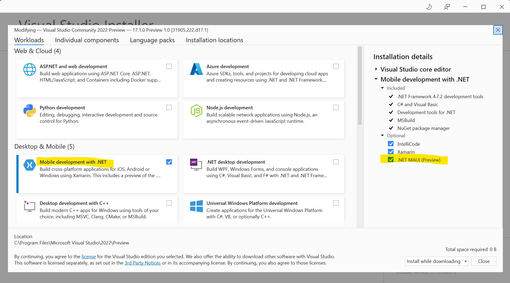
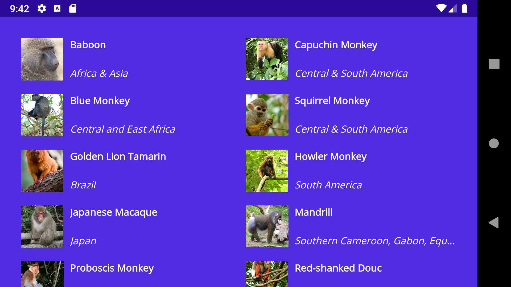

.NET Multi-platform App UI preview 10 is now available atop [the stable release of .NET 6](https://devblogs.microsoft.com/dotnet/announcing-net-6/), and you can acquire it today in the preview channel of Visual Studio 2022. This new release includes the merging of the remaining Windows App SDK dependencies, and ongoing progress to complete the remaining controls and control features.

## Installing .NET MAUI

Now to install .NET MAUI, you will want to make sure you are using the preview version of Visual Studio 2022 (17.1) which ships today alongside the stable 17.0 release. When installing, all you need is the "Mobile development with .NET" workload which by default provides the ".NET MAUI (Preview)" dependencies. In a future release, .NET MAUI will be promoted to its own top level workload.



That's it! No more additional extensions needed, and you're ready to begin developing with .NET MAUI.

## Update on controls and features

New in this release are handler implementations of `CollectionView` and `IndicatorView`. Other controls have also seen properties implement for `VerticalTextAlignment`, `TextTransform`, and more. For a complete list of the changes and improvements, see the [release notes](https://github.com/dotnet/maui/releases/tag/6.0.101-preview.10).

`CollectionView` covers most of the same virtualized list based scenarios as `ListView` and adds support for other layouts such as horizontal and grid. Here is a vertical scrolling grid spanning two columns:



```xaml
<CollectionView ItemsSource="{Binding Monkeys}"
                ItemsLayout="VerticalGrid, 2">
    <CollectionView.ItemTemplate>
        <DataTemplate>
            <Grid Padding="10">
                <Grid.RowDefinitions>
                    <RowDefinition Height="60" />
                </Grid.RowDefinitions>
                <Grid.ColumnDefinitions>
                    <ColumnDefinition Width="70" />
                    <ColumnDefinition Width="*" />
                </Grid.ColumnDefinitions>
                <Image Grid.RowSpan="2" 
                        Source="{Binding ImageUrl}" 
                        Aspect="AspectFill"
                        HeightRequest="60" 
                        WidthRequest="60">
                    <Image.Clip>
                        <RectangleGeometry Rect="0,0,160,160"/>
                    </Image.Clip>
                </Image>
                <Label Grid.Column="1" 
                        Text="{Binding Name}" 
                        FontAttributes="Bold"
                        TextColor="White"
                        VerticalOptions="Start"
                        LineBreakMode="TailTruncation" />
                <Label Grid.Column="1" 
                        Text="{Binding Location}"
                        LineBreakMode="TailTruncation"
                        FontAttributes="Italic" 
                        TextColor="White"
                        VerticalOptions="End" />
            </Grid>
        </DataTemplate>
    </CollectionView.ItemTemplate>
</CollectionView>
```

For more information on how to use these controls, check out our documentation:

* [CollectionView](https://docs.microsoft.com/xamarin/xamarin-forms/user-interface/collectionview/)
* [IndicatorView](https://docs.microsoft.com/xamarin/xamarin-forms/user-interface/indicatorview)

## Get Started Today

First thing's first, install Visual Studio 2022 Preview (17.1 Preview 1) and confirm .NET MAUI (preview) is checked under the "Mobile Development with .NET workload". Ready? Open Visual Studio 2022 and create a new project. Search for and select .NET MAUI.

Preview 10 [release notes are on GitHub](https://github.com/dotnet/maui/releases/tag/6.0.101-preview.10) and we have captured the top changes in a [migration guide in the wiki](https://github.com/dotnet/maui/wiki/Migrating-from-Preview-9-to-10). For additional information about getting started with .NET MAUI, refer to our [documentation](https://docs.microsoft.com/dotnet/maui/get-started/installation).

## Feedback Welcome

Visual Studio 2022 previews are incrementally enabling new features for .NET MAUI. As you encounter any issues with debugging, deploying, and editor related experiences, please use the Help > Send Feedback menu to report your experiences.

Please let us know about your experiences using .NET MAUI to create new applications by engaging with us on GitHub at [dotnet/maui](https://github.com/dotnet/maui).

For a look at what is coming in future releases, visit our [product roadmap](https://github.com/dotnet/maui/wiki/roadmap), and for a status of feature completeness visit our [status wiki](https://github.com/dotnet/maui/wiki/status).
