[Visual Studio 2022](https://aka.ms/vs2022gablog) and [.NET 6.0](https://aka.ms/dotnet6-GA) have some great new features for Visual Basic developers. Some of these features can affect the way you write code every day. Many of the productivity features covered here are available to you whether you program for .NET Framework or for the latest version of .NET.

## Overall

Visual Studio 2022 has a new look, with the new Cascadia font and updated icons.  If you have customized your font, you may need to explicitly set your font to Cascadia. You have several Cascadia choices with different weights and  two styles: Mono and Code. Cascadia Mono is the default. Choose Cascadia Code if you would like ligatures. Ligatures express two or more characters as a single unit. For Visual Basic, this mainly affects the appearance of `>=`, `<=` and `<>`. Cascadia Code with ligatures looks like:

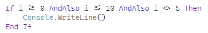

And with Cascadia Mono, you get the more traditional look:

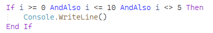

You can change your font in Tools > Options > Environment > Fonts and Colors.

For folks that like a dark theme, Visual Studio 2022 updates its dark theme with new colors that reduce eyestrain, improve accessibility, and provide consistency with the Windows dark theme. You can change your theme in Tools > Options > Environment > General. You can  set your theme to match your Windows theme by selecting "Use system settings."

Visual Studio now runs as a 64-bit process, with better performance for many operations and better handling of very large solutions. Since it’s now a 64 bit process, you may need to [update extensions]( https://marketplace.visualstudio.com) or [MSBuild tasks](https://aka.ms/msbuild-in-64-bit-visual-studio).

## Debugging

Visual Studio has several great variations of breakpoints. In Visual Studio 2022, as you move your cursor within the left margin, a dot will show up. Click it to find available types of breakpoints:

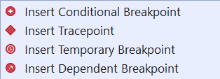

 When you select a breakpoint type that needs more information, the breakpoint settings dialog will appear in-line in your code:

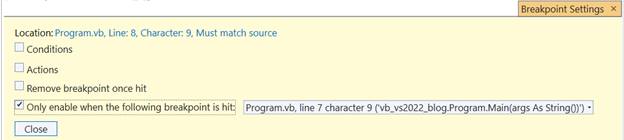

I setup several breakpoint variations to show the glyphs for different kinds of breakpoints:

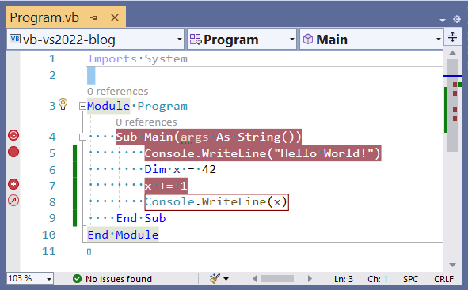

The breakpoint showing the clock symbol is a temporary breakpoint. As soon as it is hit, it will disappear. This is great if you want your application to run until you get to a certain spot, and then you have other exploration to do. The solid circle is a normal breakpoint, and the plus inside a circle indicates a conditional breakpoint.

The last glyph with the arrow is the most powerful. It represents a new kind of breakpoint - the dependent breakpoint. This breakpoint is hit if, and only if, another breakpoint is hit. I set a condition for the breakpoint on line 7 to `x = 5`. Since that breakpoint is not hit, the breakpoint on line 8 is not hit. I plan to use this when I want to stop at the first iteration of a loop, but only if an outer condition is met. Previously, I needed to enable one breakpoint until the outer condition was met, and only after that was hit enable a breakpoint inside the loop.

A tracepoint is like a breakpoint, but it continues execution. Use this to display a message in the output window. When you select a tracepoint, the breakpoint settings dialog opens and hovering over the information icon has great help:

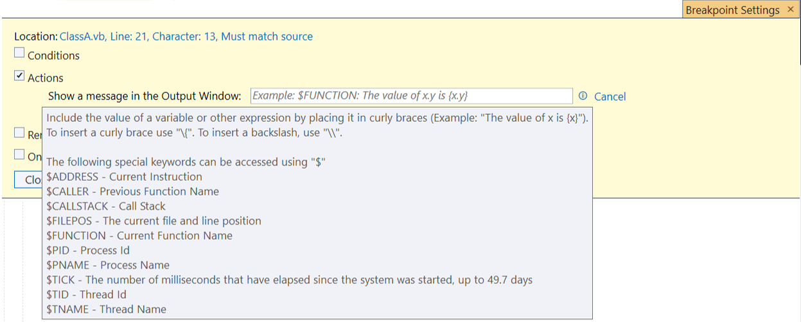

Tracepoints have been around for a while and Visual Studio 2022 makes them easier to setup.

You can combine many types of breakpoints, like the very powerful conditional tracepoints. Note that some combinations, like dependent tracepoints aren’t legal and you’ll see an error at the top of the dialog.

If you realize a breakpoint or a tracepoint is not on the correct line after you set it up, in Visual Studio 2022 you can just move it by dragging and dropping. Any conditions or breakpoint dependencies are maintained. Of course, if you move it outside the context of the condition, you will get errors notifying you of this. You can also use Ctrl-Z to reset a breakpoint you accidentally delete.

Sometimes you have breakpoints set up, but for now you want to skip all of them to get to your current location in code. You can do that in Visual Studio 2022 by right clicking the line you want to stop at and selecting “Force run to cursor”. This will act like “Run to cursor”, but bypass any breakpoints encountered along the way.

## Editor

A number of new features in the editor make your everyday coding smoother and more efficient.

### Subword navigation

You probably use Ctrl-Left and Ctrl-Right to move one word to the left and right. In Visual Studio 2022, you can use Ctrl-Alt-Left and Ctrl-Alt-Right to move left and right by parts of words:

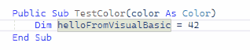

This supports the Pascal style of symbol naming.

### Inheritance Margin

The *inheritance margin* adds icons to the left margin representing where code is derived from other code, and where other code derives from this code. The icon is marked here with an arrow:  

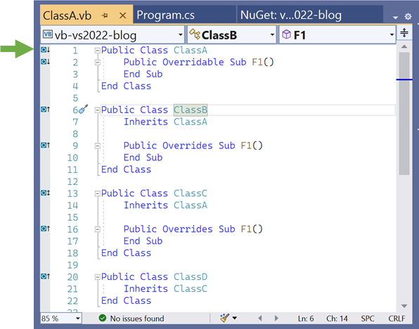

If you click on one of these icons, a popup will display the base or derived classes or methods:

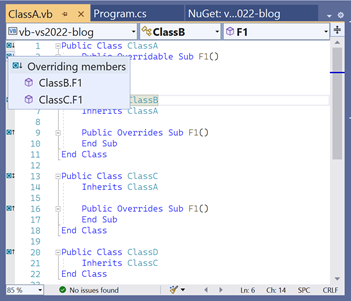

You can click on the popup entries to quickly navigate to the base or derived class or method.

You can enable or disable this feature in Tools > Options > Text Editor > Basic > Advanced and deselect Enable Inheritance Margin.

### Underline reassigned

The new *underline reassigned* feature  is for folks that want to know whether variables are reassigned, or remain set to their initial value. Any variables that are reassigned will look like:

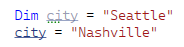

This is turned off by default. If you want hints to where data changes are happening, turn it on in Tools > Options > Text Editor > Basic > Advanced.

## IntelliSense for preprocessor symbols

Preprocessor symbols now have IntelliSense. The available symbols will appear after you type `#If`:

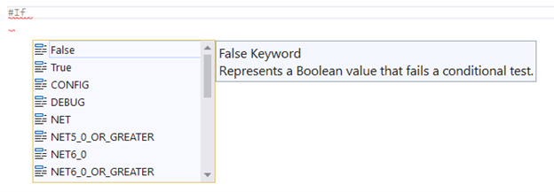

### Inline parameter name hints

Another optional feature is parameter name hints. When turned on it displays a small indicator for the parameter name:

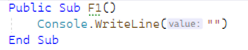

You can enable or disable this feature in Tools > Options > Text Editor > Basic > Advanced. This is disabled by default.

### Add missing Imports on paste

Visual Studio 2022 will add required namespace imports when you paste a code block which contains a code element requires a namespace import:

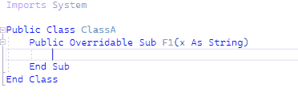

You can enable or disable this feature in Tools > Options > Text Editor > Basic > Advanced.

### Inline diagnostics

A very cool experimental feature is inline diagnostics. You can turn this on near the top of Tools > Options > Text Editor > Basic > Advanced as "Display diagnostics inline (experimental)." With this on, you’ll see errors on the line where they occur, in addition to seeing them in the Error List and as dots in the right scrollbar.

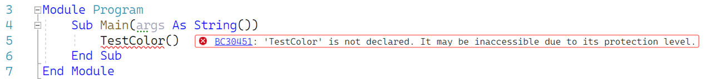

Red squiggles help us find code that has an error, but they can sometimes be hard to see. Inline diagnostics, make the errors are obvious and you don't have to hover to see the error text. Turning this on in code with few or no errors makes any new errors immediately obvious.

Check it out and let us know what you think using the Send Feedback icon in the upper right corner of Visual Studio.

## Refactoring

Several new refactorings help you write more correct and efficient code.

### Simplify LINQ expression

Passing a predicate to a LINQ method like `Any` is more efficient than first calling `Where` and then calling `Any`. You can position the cursor in a LINQ expression and hit "Ctrl ." to determine if the expression can be simplified. For example:

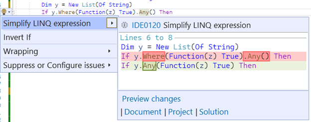

### Change methods to Shared

Shared methods do not rely on data within the instance of the class. You can identify the methods in your classes that could be `Shared`, and update them with the "Make static" refactoring. The use of the C# keyword `static` instead of `Shared` will be updated in an upcoming version of Visual Studio.

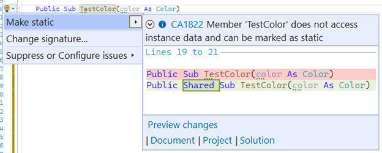

### Generate Overrides dialog supports search

The Generate Overrides dialog appears when you type "Ctrl .", you are in a class that has overridable methods, and you select "Generate Overrides." With a large number of potential overrides, it can be troublesome to pick out the item you want to override. The Generate Overrides dialog now offers a text box so you to filter to the overridable methods you’re interested in:

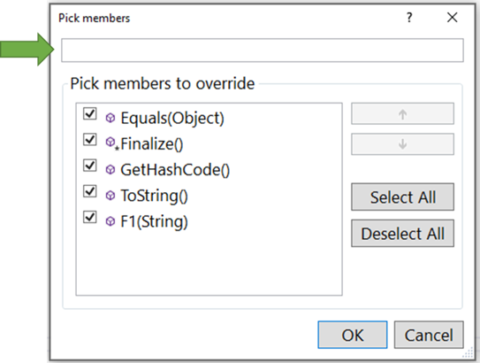

## WinForms startup

The [Visual Basic Application Model](https://docs.microsoft.com/dotnet/visual-basic/developing-apps/development-with-my/overview-of-the-visual-basic-application-model) provides the familiar Visual Basic experience for application startup, particularly for WinForms and WPF applications. This model has been updated in .NET 6.0 to support a new event: `ApplyApplicationDefaults`. This event lets you set application wide values that must be set before any forms or controls are created. These values are:

* `Font`: The global font for the application. The default font changed for .NET to provide an updated experience. This font is often desirable, but can cause issues where pixel perfect layout was done with the traditional .NET Framework font. (See the section [Known issues](#known-issues))

* `MinimumSplashScreenDisplayTime`: The minimum time for the splash screen to be displayed.

* `HighDpiMode`: WinForms applications can respond to the High DPI characteristics of the monitor where the application is being run. This happens via the default value `HighDpiMode.SystemAware`. If you need the .NET Framework behavior, use `HighDpiMode.DpiUnaware`.

To set these values, first open the file ApplicationEvents.vb:

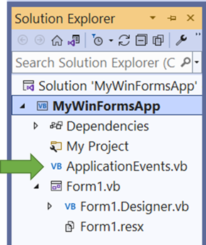

Then select "(MyApplication events)" in the middle combobox at the top of the edit window (marked with an arrow below). When this is selected, you'll be able to select "ApplyApplicationDefaults" from the right combobox:

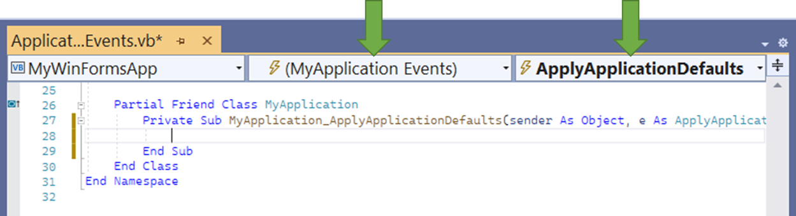

This will create the method and when you set values you set on the ApplyApplicationDefaultsEventArgs parameter, those values will be applied to your application before the first forms are created.

The common defaults will work for most applications and you will not need to specify anything for those applications.

### Support for C# `init` properties

C# introduced a feature called `init` properties which indicate that a property is immutable after the constructor completes. In Visual Basic 16.9, we added support for the following scenario:

* A C# project/assembly has a class that includes an `init` property
* A Visual Basic project has a class that inherits from this class
* The Visual Basic class sets the `init` property in its constructor

In Visual Basic 16 and below, this causes a compiler error. Starting in Visual Basic 16.9, you may set `init` properties in inherited Visual Basic constructors. If you need this feature, set the language version to `latest` or `16.9`.

```xml
  <PropertyGroup>
    <OutputType>Exe</OutputType>
    <RootNamespace>ConsoleApp1</RootNamespace>
    <TargetFramework>net6.0</TargetFramework>
    <LangVersion>latest</LangVersion>
  </PropertyGroup>
```

### Roslyn Source Generators

Roslyn Source Generators let you generate code at design time. We added this feature to Visual Basic earlier this year. You can find out more about [Roslyn Source Generators in this article](https://docs.microsoft.com/dotnet/csharp/roslyn-sdk/source-generators-overview).

## Hot Reload

Hot Reload builds on Edit and Continue technology. Instead of stopping at a breakpoint and then changing your code, just change your code and hit the Hot Reload button. For example, if you want to change the logic that runs on a button click – change your code and hit Hot Reload. The next time you click the button, your new logic will run - no breakpoints needed.  

One of the cool things about Hot Reload is that it works [wherever Edit and Continue work]( https://docs.microsoft.com/visualstudio/debugger/edit-and-continue-visual-basic?view=vs-2019), both .NET and .NET Framework.

Hot Reload is a core technology that covers many scenarios, however there are some edits that are not supported at this time. For example, if you move a WinForms control or change something in Properties, that change won’t currently appear in Hot Reload for C# or Visual Basic.  Also, if you add a control or other object that uses `WithEvents` to a Visual Basic application, you will receive a message that that you’ve made an unsupported change.

Hot Reload will cover more scenarios as it evolves in upcoming releases. Try it out with your applications to simplify the way you interact with Edit and Continue.  

## Upgrade your Visual Basic apps to .NET 6.0

If you are happy using .NET Framework, you can continue to use it with confidence. [.NET Framework 4.8 is the latest version of .NET Framework and will continue to be distributed with future releases of Windows.](https://dotnet.microsoft.com/platform/support/policy/dotnet-framework).

Many of the great features in this post apply to both .NET Framework and .NET.

If you want the new features we are introducing in the common libraries and supported workloads, you can move to .NET 6.0.

To explore upgrading, check out the [Upgrade Assistant](https://dotnet.microsoft.com/platform/upgrade-assistant) which now supports Visual Basic and is out of preview and generally available.

As part of your transition, you can also target [.NET Standard 2.0]( https://docs.microsoft.com/dotnet/standard/net-standard) to share code between .NET Framework and .NET, as well as between C# and Visual Basic.  

## Known issues

"Remove unused references" is present in the Solution Explorer right click dialog. While it can be used to remove project references, in at least some cases unused package references are not recognized.

The new `.editorconfig` dialog contains features for all languages, and many of the settings are specific to C#. This is because .`editorconfig` is often used at the root of a solution that contains multiple languages. We are working to improve how to include the language where settings are language specific.

Regarding WinForms fonts: The Visual Basic project (`.vbproj`) IntelliSense includes `<ApplicationDefaultFont>`. This is intended to determine the _design time_ font for the WinForms designer. As mentioned in the [WinForms startup](#winforms-startup) section above, the font used when your _application runs_ is the `Font` property you assign to the `ApplyApplicationDefaults` event argument in `MyApplication` (in `ApplicationEvents.vb`). Setting these both to the same font is intended to set the same font for design time and application runtime. _However, the `<ApplicationDefaultFont>` in `.vbproj` is currently ignored._ The WinForms team is working on this issue.

## In closing

As you can see here, the experience of Visual Basic just keeps getting better. We’ve enabled many new features in Visual Studio 2022 and we’re excited for you to download the new release and give it a try on your Visual Basic solutions.
