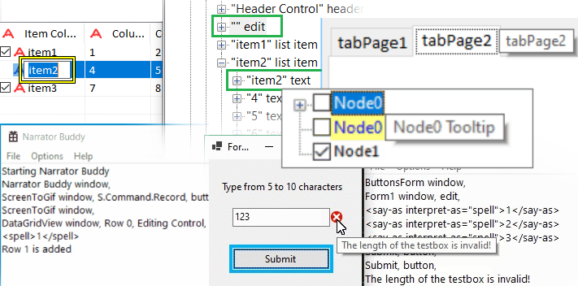
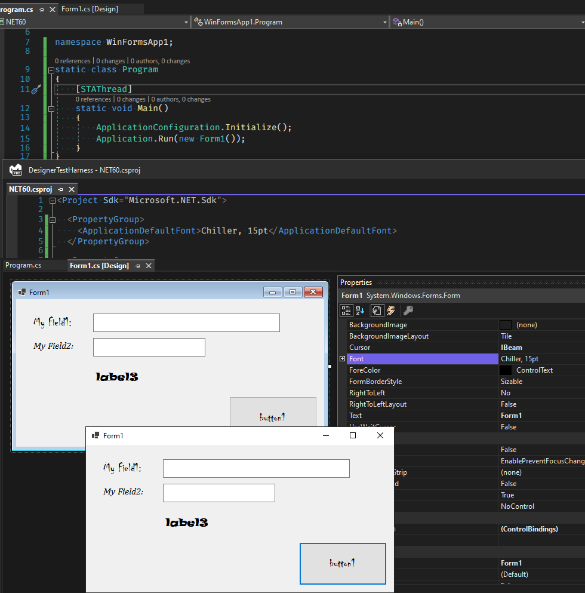
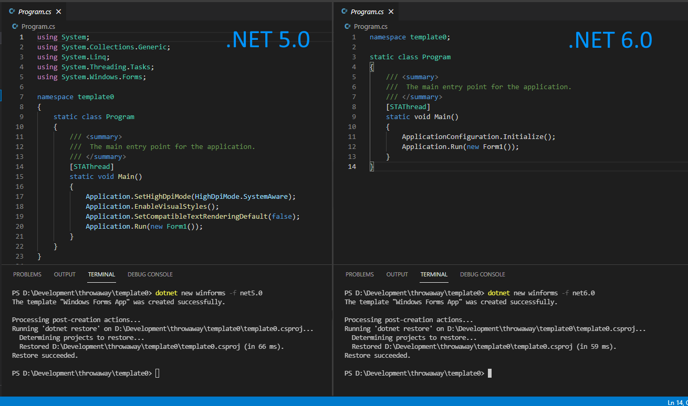
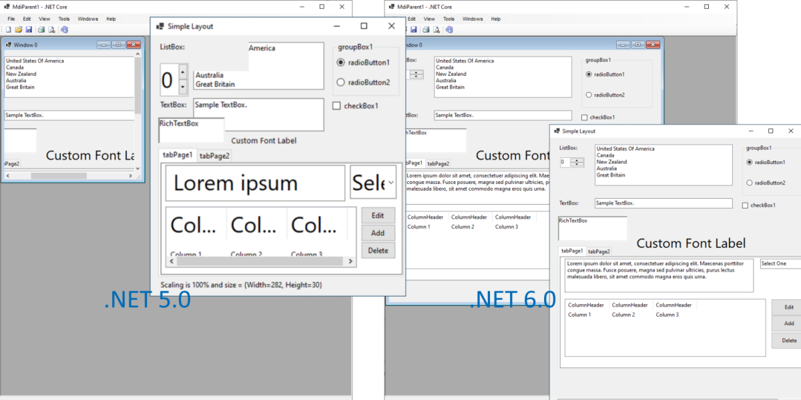
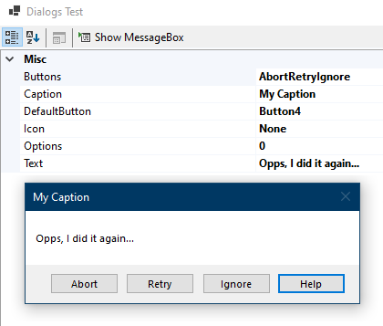

We continue to support and innovate in Windows Forms runtime. Let's recap what we've done in .NET 6.0.


## Accessibility improvements and fixes



Making Windows Forms applications more accessible to more users is one of the big goals for the team. Building on the momentum we gained in .NET 5.0 timeframe in this release we delivered further improvements, including but not limited to the following: 

* Improved support for assistive technology when using Windows Forms apps. UIA providers enable tools like Narrator and others to interact with the elements of an application. UIA is also often used to create test automation to drive apps.<br/>
We have now added UIA providers support for the following controls:
    - `CheckedListBox`
    - `LinkLabel`
    - `Panel`
    - `ScrollBar`
    - `TabControl`
    - `TrackBar`
* Improved Narrator announcements in `DataGridView`, `ErrorProvider` and `ListView` column header controls.
* Keyboard tooltips for the `TabControl`’s `TabPage` and the `TreeView`’s `TreeNode` controls.
* [ScrollItem Control Pattern](https://docs.microsoft.com/windows/win32/winauto/uiauto-implementingscrollitem) support for `ComboBoxItemAccessibleObject`.
* Corrected control types for better support of [Text Control Patterns](https://docs.microsoft.com/windows/win32/winauto/uiauto-implementingtextandtextrange).
* [ExpandCollapse Control Pattern](https://docs.microsoft.com/windows/win32/winauto/uiauto-implementingexpandcollapse) support for the `DateTimePicker` control.
* [Invoke Control Pattern](https://docs.microsoft.com/windows/win32/winauto/uiauto-implementinginvoke) support for the UpDownButtons component in `DomainUpDown` and `NumericUpDown` controls.
* Improved color contrast in the following controls: 
    - `CheckedListBox`
    - `DataGridView`
    - `Label`
    - `PropertyGridView`
    - `ToolStripButton`


## Application bootstrap

In .NET Core 3.0 we started to modernize and rejuvenate Windows Forms. As part of that initiative we changed the default font to Segoe UI, 9f ([dotnet/winforms#656](https://github.com/dotnet/winforms/pull/656)), and quickly learned that a great number of things depended on this default font metrics. For example, the designer was no longer a true WYSIWYG, as Visual Studio process is run under .NET Framework 4.7.2 and uses the old default font (Microsoft Sans Serif, 8.25f), and .NET application at runtime uses the new font. This change also made it harder for some customers to migrate their large applications with pixel-perfect layouts. Whilst we had provided [migration strategies](https://docs.microsoft.com/dotnet/core/compatibility/fx-core#default-control-font-changed-to-segoe-ui-9-pt), applying those across hundreds of forms and controls could be a significant undertaking.

To make it easier to migrate those pixel-perfect apps we introduced a new API (for more details refer to the [Application-wide default font](https://devblogs.microsoft.com/dotnet/whats-new-in-windows-forms-in-net-6-0-preview-5/#application-wide-default-font) post):

```csharp
void Application.SetDefaultFont(Font font)
```

However, this API wasn’t sufficient to address the designer’s ability to render forms and controls with the same new font. At the same time, with our sister teams heavily pushing for little code/low ceremony application templates, our `Program.cs` and its `Main()` method started looking very dated, and we decided to follow the general .NET trend and trim the boilerplate. Please welcome the new [Windows Forms application bootstrap](https://github.com/dotnet/designs/blob/main/accepted/2021/winforms/streamline-application-bootstrap.md):

```csharp
class Program
{
    [STAThread]
    static void Main()
    {
        ApplicationConfiguration.Initialize();
        Application.Run(new Form1());
    }
}
```

`ApplicationConfiguration.Initialize()` is a source generated API that behind the scenes emits the following calls:

```csharp
Application.EnableVisualStyles();
Application.SetCompatibleTextRenderingDefault(false);
Application.SetDefaultFont(new Font(...));
Application.SetHighDpiMode(HighDpiMode.SystemAware);
```

The parameters of these calls are configurable via [MSBuild properties](https://docs.microsoft.com/dotnet/core/project-sdk/msbuild-props-desktop#windows-forms-settings) in csproj or props files.
The Windows Forms designer in Visual Studio 2022 is also aware of these properties (for now it only reads the default font), and can show you your application (C#, .NET 6.0 and above) as it would look at runtime:



(_We know, the form in the designer still has that Windows XP look, We're working on it..._)

Please note that Visual Basic handles these application-wide default values differently. In .NET 6.0 Visual Basic introduces a new application event [`ApplyApplicationDefaults`](https://docs.microsoft.com/dotnet/api/microsoft.visualbasic.applicationservices.windowsformsapplicationbase.applyapplicationdefaults) which allows you to define application-wide settings (e.g., `HighDpiMode` or default font) in the [typical Visual Basic way](https://docs.microsoft.com/dotnet/api/microsoft.visualbasic.applicationservices.applyapplicationdefaultseventargs). The designer support for the default font configured via MSBuild properties is also coming in the near future. For more details head over to the dedicated Visual Basic blog post discussing [what's new in Visual Basic](https://devblogs.microsoft.com/dotnet/whats-new-for-visual-basic-in-visual-studio-2022).

## Template updates

As mentioned above we have updated our C# templates in line with [related changes in .NET workloads](https://docs.microsoft.com/dotnet/core/compatibility/sdk/6.0/csharp-template-code), Windows Forms templates for C# have been updated to support `global using` directives, file-scoped namespaces, and nullable reference types. Because a typical Windows Forms app consist of multiple types split across multiple files, for example, `Form1.cs` and `Form1.Designer.cs`, top-level statements are notably absent from the Windows Forms templates. However, the updated templates do include the application bootstrap code.




## More runtime designers

We have completed porting missing designers and designer-related infrastructure that enable building a _general-purpose designer_ (e.g., a report designer). For more details refer to our earlier [announcement](https://devblogs.microsoft.com/dotnet/whats-new-in-windows-forms-in-net-6-0-preview-5/#more-runtime-designers).


If you think we missed a designer that your application depends on, please let us know at our [GitHub repository](https://github.com/dotnet/winforms).


## High DPI and scaling fixes

We've been working through the high DPI space with the aim to get Windows Forms applications to correctly support [PerMonitorV2 mode](https://docs.microsoft.com/windows/win32/hidpi/high-dpi-desktop-application-development-on-windows#per-monitor-and-per-monitor-v2-dpi-awareness) out of the box. It is a challenging undertaking, and sadly we couldn't achieve as much as we'd hoped. Still in this release we made some progress, and we now can:
* Create controls in the same DPI awarenes as the application
* Correctly scale `ContainerControl`s and MDI child windows in PerMonitorV2 mode in most scenarios. There are still few specific scenarios (e.g., anchoring) and controls (e.g., `MonthCalendar`) where the experience is still subpar.



## Other notable changes

* New overloads for [`Control.Invoke()`](https://docs.microsoft.com/dotnet/api/system.windows.forms.control.invoke) and [`Control.BeginInvoke()`](https://docs.microsoft.com/dotnet/api/system.windows.forms.control.begininvoke) methods that take `Action` and `Func<T>` and allow writing more modern and concise code.
* New [`Control.IsAncestorSiteInDesignMode`](https://docs.microsoft.com/dotnet/api/system.windows.forms.control.isancestorsiteindesignmode) API  is complimentary to [`Component.DesignMode`](https://docs.microsoft.com/dotnet/api/system.componentmodel.component.designmode), and indicates if one of the ancestors of this control is sited, and that site in design mode. A dedicated blog post exploring this API is coming later, so stay tuned.
* Windows 11 style default tooltip behavior makes the tooltip remain open when mouse hovers over it, and not disappear automatically. The tooltip can be dismissed by CONTROL or ESCAPE keys.


## Community contributions
We’d like to call out a few community contributions:
* [@paul1956](https://github.com/paul1956) updated [`NotifyIcon.Text`](https://docs.microsoft.com/dotnet/api/system.windows.forms.notifyicon.text) limits text to 127 (https://github.com/dotnet/winforms/pull/4363).
* [@weltkante](https://github.com/weltkante)  enhanced [`FolderBrowserDialog`](https://docs.microsoft.com/dotnet/api/system.windows.forms.folderbrowserdialog) with `InitialDirectory` and `ClientGuid` properties in https://github.com/dotnet/winforms/pull/4645.
* [@weltkante](https://github.com/weltkante)  added link span to [`LinkClickedEventArgs`](https://docs.microsoft.com/dotnet/api/system.windows.forms.linkclickedeventargs) (https://github.com/dotnet/winforms/pull/4708) making it easier to migrate `RichTextBox` functionality targeting RichEdit v3.0 or below that relied on hidden text to render hyperlinks.
* [@AraHaan](https://github.com/AraHaan) updated the good old `MessageBox` with two new buttons `Try Again` and `Continue`, and made it possible to show four buttons at the same time (https://github.com/dotnet/winforms/pull/4746):<br/>

* [@kant2002](https://github.com/kant2002) was helping us making Windows Forms runtime more ILLink/NativeAOT-friendlier by adding [ComWrappers](https://docs.microsoft.com/dotnet/standard/native-interop/com-wrappers) and removing redundant RCWs. (https://github.com/dotnet/winforms/pull/5174 and https://github.com/dotnet/winforms/pull/4971 ).
* [@kirsan31](https://github.com/kirsan31) provided the ability to anchor minimized MDI children to TopLeft to match Windows MFC behavior in https://github.com/dotnet/winforms/pull/5221.


## Reporting bugs and suggesting features

If you have any comments, suggestions or faced some issues, please let us know! Submit Visual Studio and Designer
related issues via **Visual Studio Feedback** (look for a button in the top right corner in Visual Studio), and Windows
Forms runtime related issues at our [GitHub repository](https://github.com/dotnet/winforms).

Happy coding!
