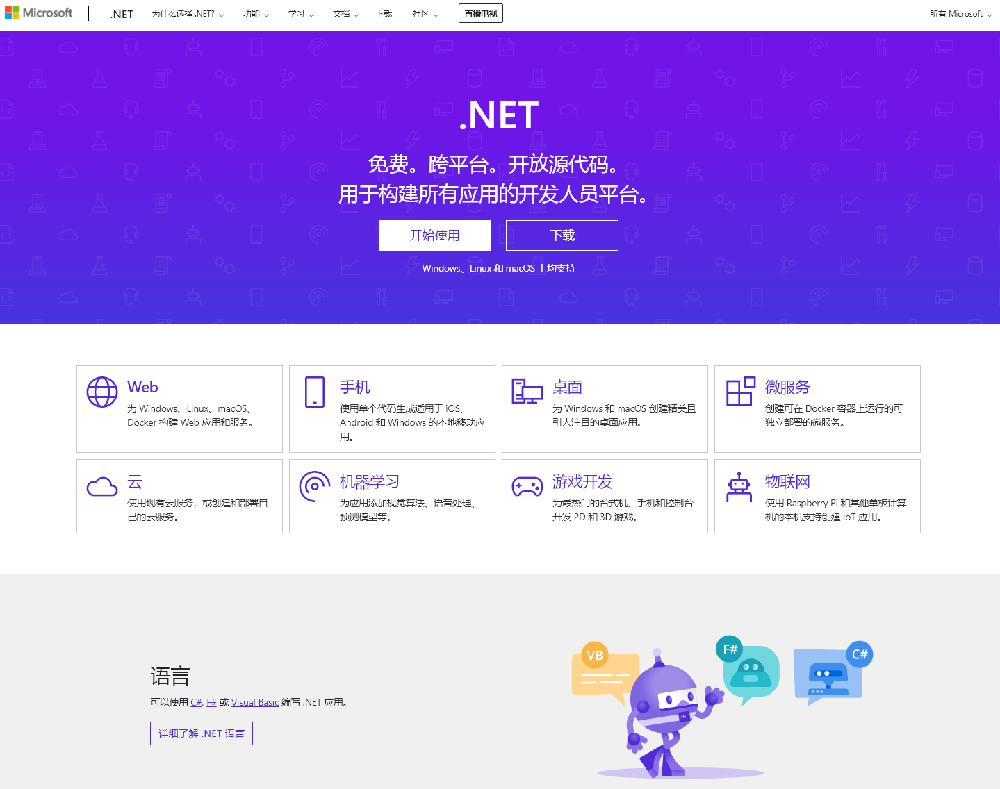
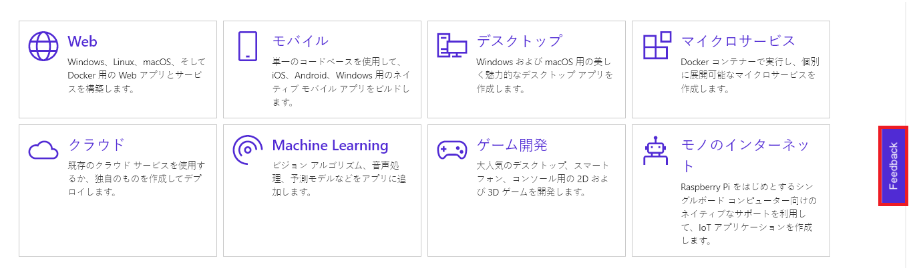
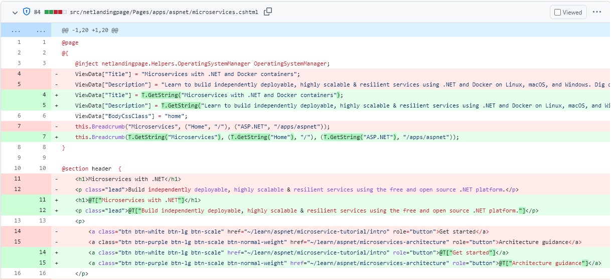

.NET is your platform for building all your apps and there's a global community of millions of developers out there. But until this day, the .NET website [dot.net](https://dotnet.microsoft.com) has been in English only. Removing the language barrier for learning about .NET allows us to reach that global community. That's why we're excited to announce the launch of our site in two additional languages today: Japanese and Simplified Chinese.



We aren't done yet! You'll notice that there are still some components of our site that are still only in English, which we'll be working to localize them in the coming months. We'd love to hear your feedback about adding support for even more languages. Let us know what you think in the comment section below.

If you find an issue with the site - whether it's a translation issue or another kind of problem, use the feedback button on the site to report it. We take the feedback very seriously and we're constantly updating the site based on your feedback. You can find the feedback button on the right-hand side on desktop browsers or on the bottom of the page on the mobile version. Here's an example of the desktop version:



## Implementation details

We're doing this project in several phases.

We chose to start the project with our main repository, which contains most of our content and code. That part of the site uses ASP.NET Core Razor Pages.

The first phase of the project consisted of globalizing the existing site and this change was launched several months ago. That phase was mostly transparent to customers since globalization consists of designing and implementing an application that is culture and language neutral. This consisted of:

* Adding the services to the middleware like calling the `AddViewLocalization` and `UseRequestLocalization` methods.
* Ensuring the code was culture neutral.
* Injecting the `IViewLocalizer` into the view (via the `_ViewImports.cshtml` file):

    ```razor
    @inject IViewLocalizer T;
    ```

* Identifying the strings that needed to be passed to the `IViewLocalizer`. The following image shows the before and after the globalization step for one of our pages:

    

For more information about the globalization and localization process in ASP.NET Core, see [Globalization and localization in ASP.NET Core](https://docs.microsoft.com/aspnet/core/fundamentals/localization).

The second phase consisted of localizing the site, translating the English resources into Japanese and Simplified Chinese, adding support for the ja-JP and zh-CN cultures with appropriate routing and error handling, and adding a language selector. We decided to use Portable Object (PO) files and [Orchard Core](https://orchardcore.net/) framework for this phase. We got lucky that the localization team at Microsoft had just finished adding support for PO files to their localization engine when we started the project, so it was perfect timing!

PO files are text-based files that contain the translated strings for a given language. There is one PO file for each language we support. Each string that was passed to the `IViewLocalizer` on the previous phase becomes the key for that particular resource. For example:

```text
msgid "Microservices with .NET and Docker containers"
msgstr "具有 .NET 和 Docker 容器的微服务"

msgid "Learn to build independently deployable, highly scalable & resilient services using .NET and Docker on Linux, macOS, and Windows."
msgstr "了解如何在 Linux、macOS 和 Windows 上使用 .NET 和 Docker 独立构建可部署、高度可缩放和可复原的服务。"
```

You can think of PO files as string dictionaries and Orchard Core helps us to map these key values to extract the data into the PO file. To use Orchard Core, we simply added a reference to the [OrchardCore.Localization.Core](https://www.nuget.org/packages/OrchardCore.Localization.Core/) NuGet package. Each time we update the content on the website, the string will be added to the English resources.po file, which contains empty `msgstr` values. The new and updated strings will be displayed in English on the site until we receive the translations back from the localization team a few days later.

For more information about PO files, see [Configure portable object localization in ASP.NET Core](https://docs.microsoft.com/aspnet/core/fundamentals/portable-object-localization).

The next phases will consist of localizing the other site components and adding additional languages.

### How culture detection will work on dot.net

The culture in the URL is represented by a language-region pair code. With this release, the site will now support the following cultures:

* en-US - English (United States)
* ja-JP - Japanese (Japan)
* zh-CN - Chinese (Simplified, China)

Users visiting the site will be able to access using a URL with or without the culture in it, such as, `https://dotnet.microsoft.com/download` or `https://dotnet.microsoft.com/ja-jp/download`.

If the request comes in with the culture specified, we'll serve the content in the specified culture.
If the request comes in without the culture specified, then we need to try to determine which culture to show by using the following process:

1. The site will look to see if the user has a cookie, and if found, it will redirect to that culture. The cookie will exist if the user has visited the .NET site before.

2. If no cookie was found, the site inspects the incoming request's Accept-Language HTTP header. That value indicates the language and locale that the client prefers. If it's one of the supported values, we'll display the content using that culture. Otherwise, we'll display the en-US culture.

If you wish to see the content in a different language, you can change the language using the language picker on the bottom of the page.

## Summary

A lot of people were involved on making this project happen. So many thanks to everyone involved!

I wanted to specifically call out some of the folks involved on reviewing the site ahead of the launch to make sure the translation quality was high and they sent us *literally* hundreds of feedback comments.

For Japanese, our thanks to: Akira Inoue, Hiroshi Yoshioka, Hiroyuki Mori, Kazuki Ota, Kazushi Kamegawa, Nobuyuki Iwanaga, Rie Moriguchi, Takayoshi Tanaka, Tetsuro Takao, Tetsuya Mori, Tomohiro Suzuki, Toshiyuki Takahagi, Yuji Shimano, and Yuta Matsumura.

For Simplified Chinese, our thanks to: Zhang Shanyou, Kinfey Lo, Christina Liang, Na Yang, and Cynthia Xin.

Stay tuned for further improvements and let us know what you think. I look forward to sharing more updates with you in the months ahead.