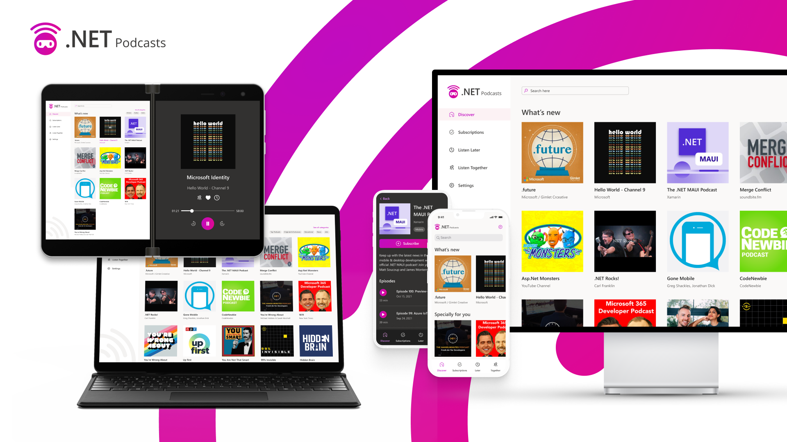
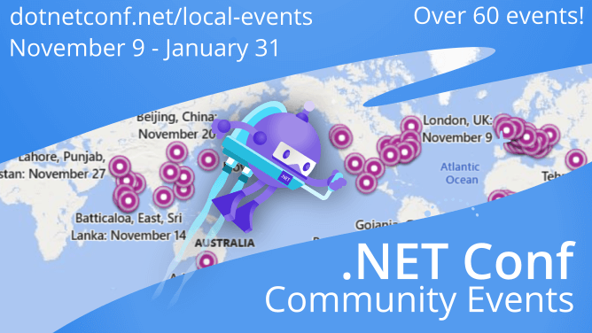

[.NET Conf 2021](https://www.dotnetconf.net) was the largest .NET Conf ever with over 80 sessions from speakers around the globe! We want to give a huge THANK YOU to all who tuned in live, asked questions in our Twitter feed, and participated in our fun and games.  The learning continues with [community-run events](https://dotnetconf.net/local-events) happening thru the end of January so make sure to check those out. Also, [watch the session replays](https://www.youtube.com/playlist?list=PLdo4fOcmZ0oVFtp9MDEBNbA2sSqYvXSXO) and keep an eye on our [conference GitHub repo](https://github.com/dotnet-presentations/dotNETConf/tree/master/2021/MainEvent/Technical) where we are collecting all the slides and demos from our presenters.

If you participated in .NET Conf 2021, please [give us your feedback](https://www.surveymonkey.com/r/dotnetconf) about the event so we can improve in 2022.

## On-Demand Recordings
We had a lot of awesome sessions from various teams and community experts that showed us all sorts of cool things we can build with .NET across platforms and devices. You can watch all of the sessions right now on the [.NET YouTube](https://www.youtube.com/playlist?list=PLdo4fOcmZ0oVFtp9MDEBNbA2sSqYvXSXO) or the new [Microsoft Docs events hub](https://docs.microsoft.com/events/dotnetconf-2021/).

What were your favorite sessions? Leave them in the comments below! I have so many favorites, but I loved the Productivity talk around Roslyn and AI with Mika:

<iframe src="https://docs.microsoft.com/_themes/docs.theme/master/en-us/_themes/global/video-embed.html?ev=dotnetconf-2021&session=supercharge-your-productivity-with-roslyn-and-ai" width="640" height="360" style="border: 0; max-width: 100%; min-width: 100%;"></iframe>

I also recommend the C# 10 session with Mads and Dustin.

<iframe src="https://docs.microsoft.com/_themes/docs.theme/master/en-us/_themes/global/video-embed.html?ev=dotnetconf-2021&session=whats-new-in-c-10" width="640" height="360" style="border: 0; max-width: 100%; min-width: 100%;"></iframe>

## Explore Slides & Demo Code

All of our amazing speakers have been uploading their PowerPoint slide decks, source code, and more on the official [.NET Conf 2021 GitHub page](https://github.com/dotnet-presentations/dotNETConf/tree/master/2021/MainEvent/Technical). Be sure to head over there to download all of the material from the event and don't forget you can still grab [digital swag](https://github.com/dotnet-presentations/dotNETConf/tree/master/2021/MainEvent/DigitalSWAG) as well! 

## .NET Podcasts App
We are happy to announce the release of .NET Podcast app, a sample application showcasing [.NET 6](https://dotnet.microsoft.com/download/dotnet/6.0), [ASP.NET Core](https://dotnet.microsoft.com/apps/aspnet), [Blazor](https://dotnet.microsoft.com/apps/aspnet/web-apps/blazor), [.NET MAUI](https://docs.microsoft.com/dotnet/maui/what-is-maui), [Azure Container Apps](https://azure.microsoft.com/services/container-apps/#overview), and more from the .NET Conf 2021 keynote!

Grab the [source code on GitHub](https://github.com/microsoft/dotnet-podcasts) and start exploring locally on your machine, or fork the repo and deploy to Azure with GitHub actions in a few easy steps.

## Launch After Party Q&A on December 16th

On December 16, 2021 .NET Conf and Visual Studio 2022 launch event speakers and experts will be LIVE to answer all of your questions. Learn more about the recent launch of Visual Studio 2022 and .NET 6, including tips and tricks, new features with the latest releases, and connect with others in your community.

[Register](https://docs.microsoft.com/events/learntv/dotnet-vs2022-dec-2021/) for the event today!

## Local .NET Conf Events

The learning continues with community-run events happening thru the end of January so make sure to check those out. 

Thanks again to everyone that made .NET Conf 2021 possible and we can't wait for even more .NET Conf events in 2022!
