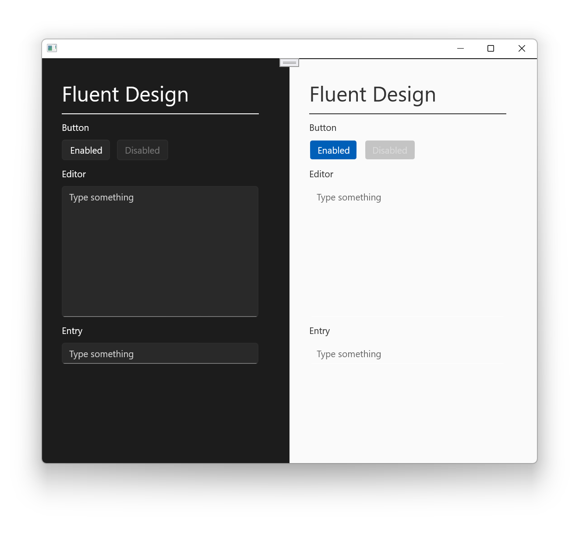
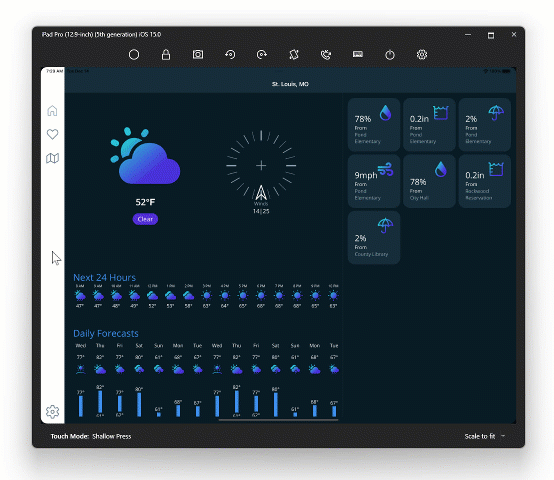

Today we are pleased to share .NET Multi-platform App UI (MAUI) Preview 11. In this release we have added the first batch of Fluent UI control styling, multi-window implementations, control features, and another set of iOS type alignment. These ongoing .NET MAUI previews run on the lastest preview of .NET 6 and are available with the new Visual Studio 2022 Windows preview shipping today. We are on track to ship a release candidate in Q1 2022, and final release in Q2 2022.

> The [source for the .NET Podcast app](https://devblogs.microsoft.com/dotnet/net-conf-2021-recap-videos-slides-demos-and-more/) showcased at .NET Conf 2021 has been published, and includes Blazor, .NET MAUI, and .NET MAUI Blazor Hybrid apps.

Let's take a deeper look at the highlights in preview 11.

## Windows Control Styling with the Fluent Design System

.NET MAUI provides platform-specific design and experience by default, so your apps get the right look and feel for each platform from a single code base without any additional effort. Windows 11 introduces new UI styling with the updated [Fluent Design System](https://www.microsoft.com/design/fluent/#/windows), and .NET MAUI styles all controls to use the latest. Subsequent previews will build upon this, adding more controls and support for themes. In Preview 11 you will see initial updates to:

* [Button](https://github.com/dotnet/maui/pull/3363)
* [Editor](https://github.com/dotnet/maui/pull/3444)
* [Entry](https://github.com/dotnet/maui/pull/3444)



## Multi-window Apps

One of the major updates to .NET MAUI compared to Xamarin.Forms is introducing multiple windows. `Application.Current.Windows` holds references to all windows you have created. To open a new window, it's as simple as:

```csharp
var secondWindow = new Window {
    Page = new MySecondPage {
        // ...
    }
};

Application.Current.OpenWindow(secondWindow);
```


To try this today targeting macOS and iPadOS, add a [SceneDelegate](https://github.com/dotnet/maui/blob/main/src/Controls/samples/Controls.Sample.SingleProject/Platforms/MacCatalyst/SceneDelegate.cs) to each respective platform folder and [update your info.plist](https://github.com/dotnet/maui/blob/main/src/Controls/samples/Controls.Sample.SingleProject/Platforms/MacCatalyst/Info.plist#L29-L49) to enable scenes.



The Windows App SDK implementation of multi-window will be in an [experimental release](https://docs.microsoft.com/windows/apps/windows-app-sdk/experimental-channel) until release in v1.1 (see [roadmap](https://github.com/microsoft/microsoft-ui-xaml/blob/main/docs/roadmap.md)).

## Templates and C# 10

Simplification is one of the main goals of .NET MAUI, to make it easier for everyone to build great apps. Going from multiple projects per platform to a single project is just one example of how we are doing that. In this release we have updated the templates using C# 10 patterns such as implicit usings and file-scoped namespaces, and added item templates for `ContentPage` and `ContentView`. Now when your project opts-in to using [ImplicitUsings](https://devblogs.microsoft.com/dotnet/welcome-to-csharp-10/#implicit-usings) you'll see a cleaner project file like our template's **MauiProgram.cs**.

```csharp
namespace Preview11;

public static class MauiProgram
{
	public static MauiApp CreateMauiApp()
	{
		var builder = MauiApp.CreateBuilder();
		builder
			.UseMauiApp<App>()
			.ConfigureFonts(fonts =>
			{
				fonts.AddFont("OpenSans-Regular.ttf", "OpenSansRegular");
			});

		return builder.Build();
	}
}
```

So, where did all the using statements go? We use [implicit global usings](https://docs.microsoft.com/dotnet/csharp/fundamentals/types/namespaces) to [gather them dynamically](https://github.com/dotnet/maui/pull/3267) so you don't need to worry about it. 

## iOS, macOS, and tvOS Type Alignment

As part of unifying Xamarin SDKs with .NET 6, we have been working through updating our Apple related SDKs to use the native `nint` and `nuint` types in .NET 6 rather than `System.nint` and `System.nuint`. This impacts existing libraries built for iOS, macOS, and tvOS using .NET 6. To adopt this change you must recompile your code against .NET 6, and if you explicitly use the types above you should update your .NET 6 code to use the C# types.

Read the [issue for this change on GitHub](https://github.com/xamarin/xamarin-macios/issues/13087) for more details.

## Get Started Today

Install Visual Studio 2022 Preview (17.1 Preview 2) and confirm .NET MAUI (preview) is checked under the "Mobile Development with .NET workload". If you already have 17.1 installed, then you can just perform an update from the Visual Studio installer.

Ready? Open Visual Studio 2022 and create a new project. Search for and select .NET MAUI.

Preview 11 [release notes are on GitHub](https://github.com/dotnet/maui/releases/tag/6.0.101-preview.11) and we have captured the top changes in a [migration guide in the wiki](https://github.com/dotnet/maui/wiki/Migrating-from-Preview-10-to-11). For additional information about getting started with .NET MAUI, refer to our [documentation](https://docs.microsoft.com/dotnet/maui/get-started/installation).

## Feedback Welcome

Please let us know about your experiences using .NET MAUI to create new applications by engaging with us on GitHub at [dotnet/maui](https://github.com/dotnet/maui).

For a look at what is coming in future releases, visit our [product roadmap](https://github.com/dotnet/maui/wiki/roadmap), and for a status of feature completeness visit our [status wiki](https://github.com/dotnet/maui/wiki/status).
