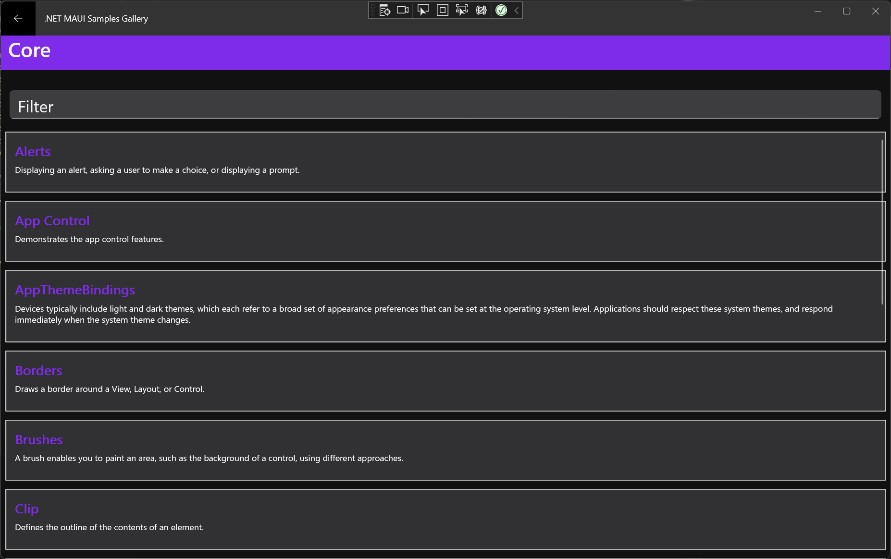
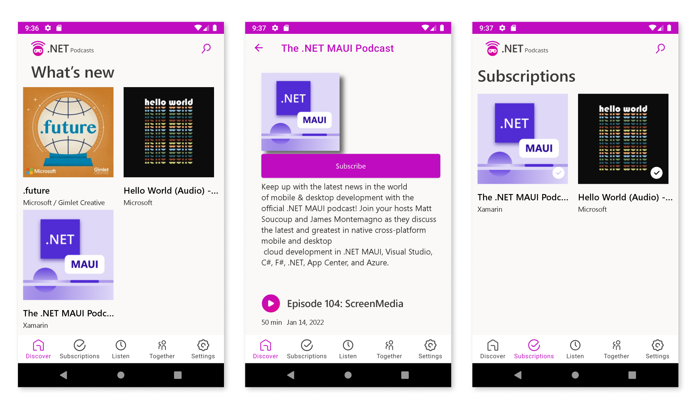

Today we are shipping a Preview 12 of .NET Multi-platform App UI with many quality improvements and some new capabilities. As we near shipping our first stable release, the balance of work begins to shift towards quality improvements and stabilization, though there are still some interesting new things to highlight:

* [New documentation](https://docs.microsoft.com/dotnet/maui/) for App icons, App lifecycle, Brushes, Controls, and Single Project.  
* FlyoutView handler implemented on Android ([#3513](https://github.com/dotnet/maui/pull/3513))
* Compatibility handlers added for `RelativeLayout` and `AbsoluteLayout` ([#3723](https://github.com/dotnet/maui/pull/3723))
* Z Index property added ([#3635](https://github.com/dotnet/maui/pull/3635))
* .NET 6 unification - iOS types ([Issue](https://github.com/xamarin/xamarin-macios/issues/13087))
* Windows extended toolbar - non-Shell ([#3693](https://github.com/dotnet/maui/pull/3693))



This release also brings an exciting enhancement to [Shell](https://docs.microsoft.com/xamarin/xamarin-forms/app-fundamentals/shell/). Let's take a deeper look at Shell in Preview 12.

## Navigation in .NET MAUI: Focus on Shell

Shell is an app scaffold that simplifies common app designs that use flyout menus and tabs. Within your Shell, commonly named `AppShell` in our examples, you start adding your app pages and arrange them in the navigation structure you want. For example, here is the .NET Podcast app sample:

```xaml
<Shell xmlns="http://schemas.microsoft.com/dotnet/2021/maui"
       xmlns:x="http://schemas.microsoft.com/winfx/2009/xaml"
       xmlns:pages="clr-namespace:Microsoft.NetConf2021.Maui.Pages"
       xmlns:root="clr-namespace:Microsoft.NetConf2021.Maui"
       xmlns:viewmodels="clr-namespace:Microsoft.NetConf2021.Maui.ViewModels"
       x:DataType="viewmodels:ShellViewModel"
       x:Class="Microsoft.NetConf2021.Maui.Pages.MobileShell">
    <TabBar>
        <Tab Title="{Binding Discover.Title}"
             Icon="{Binding Discover.Icon}">
            <ShellContent ContentTemplate="{DataTemplate pages:DiscoverPage}" />
        </Tab>
        <Tab Title="{Binding Subscriptions.Title}"
             Icon="{Binding Subscriptions.Icon}">
            <ShellContent ContentTemplate="{DataTemplate pages:SubscriptionsPage}" />
        </Tab>
        <Tab Title="{Binding ListenLater.Title}"
             Icon="{Binding ListenLater.Icon}">
            <ShellContent ContentTemplate="{DataTemplate pages:ListenLaterPage}" />
        </Tab>
        <Tab Title="{Binding ListenTogether.Title}"
             Icon="{Binding ListenTogether.Icon}"
             IsVisible="{x:Static root:Config.ListenTogetherIsVisible}">
            <ShellContent 
                ContentTemplate="{DataTemplate pages:ListenTogetherPage}" />
        </Tab>
        <Tab Title="{Binding Settings.Title}"
             Icon="{Binding Settings.Icon}">
            <ShellContent ContentTemplate="{DataTemplate pages:SettingsPage}" />
        </Tab>
    </TabBar>
</Shell>
```



Navigation in a Shell context is done with URI based routing. In the center image of the screenshot we have navigated to a details view which isn't represented in the XAML above. For pages that don't need to be visible, you can declare routes for them in code and then navigate to them by URI. You can see this again in the podcast app code "App.xaml.cs":

```csharp
Routing.RegisterRoute(nameof(DiscoverPage), typeof(DiscoverPage));
Routing.RegisterRoute(nameof(ShowDetailPage), typeof(ShowDetailPage));
Routing.RegisterRoute(nameof(EpisodeDetailPage), typeof(EpisodeDetailPage));
Routing.RegisterRoute(nameof(CategoriesPage), typeof(CategoriesPage));
Routing.RegisterRoute(nameof(CategoryPage), typeof(CategoryPage));
```

To move from the home screen to the details view, when the user taps the cover image the app executes a command on the `ShowViewModel` binding context:

```csharp
private Task NavigateToDetailCommandExecute()
{
    return Shell.Current.GoToAsync($"{nameof(ShowDetailPage)}?Id={Show.Id}");
}
```

> From anywhere in your app code you can access `Shell.Current` to issue navigation commands, listen to navigation events, and more. 

This also demonstrates one of the powerful features of navigation in Shell: query parameters for passing simple data. In this case the "Show.Id" is passed with the route and then Shell will apply that value to the binding context of `ShowDetailPage` making it instantly ready for use. The "QueryProperty" handles the mapping of querystring parameter to public property.

```csharp
 [QueryProperty(nameof(Id), nameof(Id))]
public class ShowDetailViewModel : BaseViewModel
{
    public string Id { get; set; }
}
```

### Shell and Dependency Injection

.NET MAUI's use of `HostBuilder` and powerful dependency injection have been a highlight of the previews. One of the top feedback items we have received about Shell is the desire to use constructor injection, and in this release thanks to the efforts contributor [Brian Runck](https://github.com/dotnet/maui/pull/3375) you can now use it!

Define your dependencies in the DI container, typically in the "MauiProgram.cs":

```csharp
public static class MauiProgram
    {
        public static MauiApp CreateMauiApp()
        {
            var builder = MauiApp.CreateBuilder();
            builder
                .UseMauiApp<App>();

            builder.Services
                .AddSingleton<MainViewModel>();

            return builder.Build();
        }
    }
```

Then in the page where want it injected:

```csharp
public partial class MainPage
{
    readonly MainViewModel _viewModel;

    public MainPage(MainViewModel viewModel)
    {
        InitializeComponent();

        BindingContext = _viewModel = viewModel;
    }
}
```

Shell offers a lot of styling and templating capabilities so you can quickly achieve most common needs. For more details check out the [Shell documentation](https://docs.microsoft.com/xamarin/xamarin-forms/app-fundamentals/shell/).

## Get Started Today

Before installing Visual Studio 2022 Preview, we highly recommend starting from a clean slate by [uninstalling all .NET 6](https://docs.microsoft.com/dotnet/core/install/remove-runtime-sdk-versions?pivots=os-windows#uninstall-net) previews and [Visual Studio 2022 previews](https://docs.microsoft.com/visualstudio/install/uninstall-visual-studio?view=vs-2022).

Now, install Visual Studio 2022 Preview (17.1 Preview 3) and confirm .NET MAUI (preview) is checked under the "Mobile Development with .NET workload". 

Ready? Open Visual Studio 2022 and create a new project. Search for and select .NET MAUI.

Preview 12 [release notes are on GitHub](https://github.com/dotnet/maui/releases/tag/6.0.200-preview.12). For additional information about getting started with .NET MAUI, refer to our [documentation](https://docs.microsoft.com/dotnet/maui/get-started/installation).

## Feedback Welcome

Please let us know about your experiences using .NET MAUI to create new applications by engaging with us on GitHub at [dotnet/maui](https://github.com/dotnet/maui).

For a look at what is coming in future releases, visit our [product roadmap](https://github.com/dotnet/maui/wiki/roadmap), and for a status of feature completeness visit our [status wiki](https://github.com/dotnet/maui/wiki/status).
