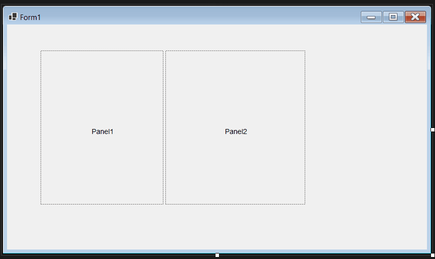
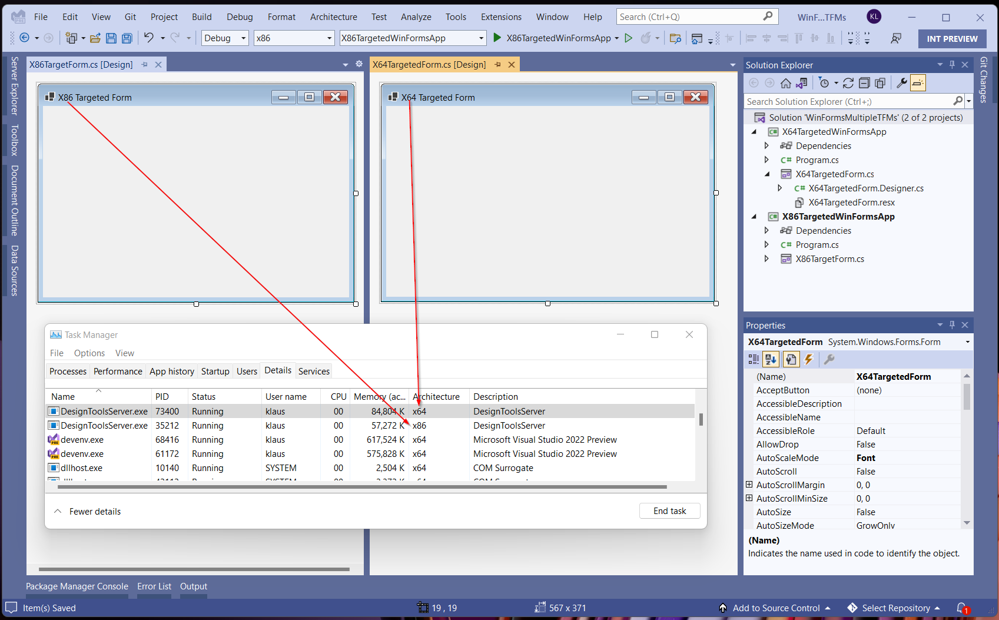
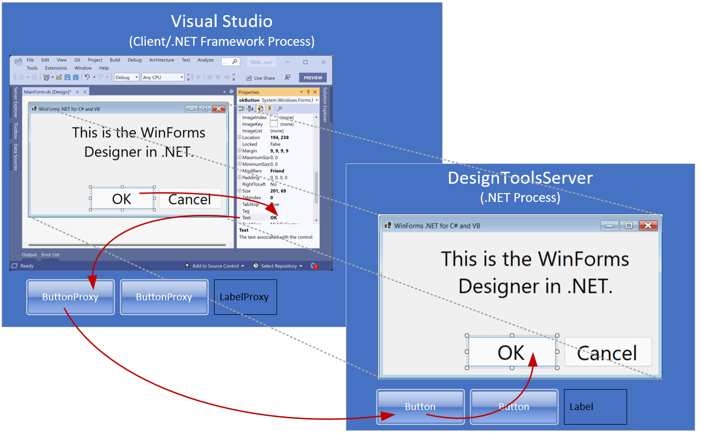

For the last several Visual Studio release cycles, the Windows Forms (WinForms) Team has been
working hard to bring the WinForms designer for .NET applications to parity with
the .NET Framework designer. As you may be aware, a new WinForms
designer was needed to support .NET Core 3.1 applications, and later .NET 5+
applications. The work required a near-complete rearchitecting of the designer,
as we responded to the differences between .NET and the .NET Framework based
WinForms designer everyone knows and loves. The goal of this blog post is to
give you some insight into the new architecture and what sorts of changes we
have made. And of course, how those changes may impact you as you create custom
controls and .NET WinForms applications.

After reading this blog post you will be familiar with the underlying problems
the new WinForms designer is meant to solve and have a high-level understanding
of the primary components in this new approach. Enjoy this look into the
designer architecture and stay tuned for future blogs!

## A bit of history

WinForms was introduced with the first version of .NET and Visual Studio in
2001\. WinForms itself can be thought of as a wrapper around the complex Win32
API. It was built so that enterprise developers didn’t need to be ace C++
developers to create data driven line-of-business applications. WinForms was
immediately a hit because of its WYSIWYG designer where even novice developers
could throw together an app in minutes for their business needs.

Until we added a support for .NET Core applications there was only a single
process, _devenv.exe_, that both the Visual Studio environment and the application
being designed ran within. But .NET Framework and .NET Core can’t both run
together within _devenv.exe_, and as a result we had to take the designer *out of
process*, thus we called the new designer - WinForms Out of Process Designer (or
*OOP designer* for short).

## Where are we today?

While we aimed at complete parity between the OOP designer and the .NET
Framework designer for the release of [Visual Studio 2022](https://aka.ms/vs2022gablog),
there are still a few issues on our backlog. That said, the OOP designer in its current iteration
already has most of the significant improvements at all important levels:

-   **Performance:** Starting with Visual Studio 2019 v16.10, the performance of
    the OOP designer has been improved considerably. We’ve worked on reducing
    project load times and improved the experience of interacting with controls
    on the design surface, like selecting and moving controls.

-   **Databinding Support:** WinForms in Visual Studio 2022 brings a
    streamlined approach for managing Data Sources in the OOP designer with the
    primary focus on *Object* Data Sources. This new approach is unique to the
    OOP designer and .NET based applications.

-   **WinForms Designer Extensibility SDK:** Due to the conceptional differences
    between the OOP designer and the .NET Framework designer, providers for 3rd
    party controls for .NET will need to use a dedicated WinForms Designer SDK
    to develop custom Control Designers which run in the context of the OOP
    designer. We have published a pre-release version of the SDK last month as a
    NuGet package, and you can [download it
    here.](https://www.nuget.org/packages/Microsoft.WinForms.Designer.SDK) We
    will be updating this package to make it provide IntelliSense in the first
    quarter of 2022. There will also be a dedicated blog post about the SDK in
    the coming weeks.

## A look under the hood of the WinForms designer

Designing Forms and UserControls with the WinForms designer holds a couple of
surprises for people who look under the hood of the designer for the first time:

1.  The designer doesn’t “save” (serialize) the layout in some sort of XML or
    JSON. It serializes the Forms/UserControl definition directly to code – in
    the new OOP designer that is either C\# or Visual Basic .NET. When the user
    places a Button on a Form, the code for creating this Button and assigning
    its properties is generated into a method of the Form called
    \`InitializeComponent\`. When the Form is opened in the designer, the
    \`InitializeComponent\` method is parsed and a *shadow .NET assembly* is
    being created on the fly from that code. This assembly contains an
    executable version of \`InitializeComponent\` which is loaded in the context
    of the designer. \`InitializeComponent\` method is then executed, and the
    designer is now able to display the resulting Form with all its control
    definitions and assigned properties. We call this kind of serialization
    *Code Document Object Model serialization*, or *CodeDOM serialization* for
    short. This is the reason, you shouldn’t edit \`InitializeComponent\`
    directly: the next time you visually edit something on the Form and save it,
    the method gets overwritten, and your edits will be lost.

2.  All WinForms controls have two code layers to them. First there is the code
    for a control that runs during runtime, and then there is a control
    *designer,* which controls the behavior at design-time. The control designer
    functionality for each control is not implemented in the designer
    itself. Rather, a dedicated control *designer* interacts with Visual Studio
    services and features.

    Let’s look at \`SplitContainer\` as an example:

      
    (SplitPanelUIDemo.gif)  
    
    The design-time behavior of the SplitContainer is implemented in an
    associated designer, in this case the \`SplitContainerDesigner\`. This class
    provides the key functionality for the design-time experience of the
    \`SplitContainer\` control:

    -   The way the outer Panel and the inner Panels get selected on mouse
        click.

    -   The ability of the splitter bar to be moved to adjust the sizes of the
        inner panels.

    -   To provide the Designer Action Glyph, which allows a developer using the
        control to manage the Designer Actions through the respective short cut
        menu.

When we decided to support apps built on .NET Core 3.1 and .NET 5+ in
the original designer we faced a major challenge. Visual Studio is
built on .NET Framework but needs to round-trip the designer code by serializing
and deserializing this code for projects which target a different runtime. While, with some
limitations, you *can* run .NET Framework based types in a .NET Core/.NET 5+
applications, the reverse is not true. This problem is known as “*type
resolution problem*”. A great example of this can be seen in the TextBox
control: in .NET Core 3.1 we added a new property called \`PlaceholderText\`. In
.NET Framework that property does not exist on \`TextBox\`. So, if the .NET
Framework based CodeDom Serializer (running in Visual Studio) encountered the
\`PlaceholderText\` property it would fail.

In addition, a Form with all its controls and components renders itself in the designer
at design time. Therefore, the code that instantiates the form and shows it in the
Designer window must also be executed in .NET and not in .NET Framework, so that
newer properties available only in .NET also reflect the actual appearance and
behavior of the controls, components, and ultimately the entire Form or UserControl.

Because we plan to continue innovating and adding new features in the future,
the problem only grows over time. So we had to design a mechanism that supported
such cross-framework interactions between the WinForms designer and Visual Studio.

### Enter the DesignToolsServer

Developers need to see their Forms in the designer looking precisely the way it
will at runtime (WYSIWYG). Whether it is \`PlaceholderText\` property from the
earlier example, or the layout of a form with the desired default font – the
CodeDom serializer must run in the context of the version of .NET the project is
targeting. And we naturally can’t do that, if the CodeDom serialization is
running in the same process as Visual Studio. To solve this, we run the designer
out-of-process (hence the moniker *Out of Process Designer*) in a new
.NET (Core) process called *DesignToolsServer*. The DesignToolsServer process
runs the same version of .NET and the same bitness (x86 or x64) as your
application.

Now, when you double-click on a Form or a UserControl in Solution Explorer,
Visual Studio’s designer loader service determines the targeted .NET version and
launches a DesignToolsServer process. Then the designer loader passes the code
from the \`InitializeComponent\` method to the DesignToolsServer process where
it can now execute under the desired .NET runtime and is now able to deal with
every type and property this runtime provides.

While going out of process solves the type-resolution-problem , it introduces a
few other challenges around the user interaction inside Visual Studio. For
example, the Property Browser, which is part of Visual Studio (and therefore
also .NET Framework based). It is supposed to show the .NET Types, but it can’t
do this for the same reasons the CodeDom serializer cannot (de)serialize .NET
types.

### Custom Property Descriptors and Control Proxies

To facilitate interaction with Visual Studio, the DesignToolsServer introduces
proxy classes for the components and controls on a form which are created in the
Visual Studio process along with the real components and controls on the form in
the DesignToolsServer.exe process. For each one on the form, an object proxy is
created. And while the real controls live in the DesignToolsServer process, the
object proxy instances live in the client – the Visual Studio process. If you
now select an actual .NET WinForms control on the form, from Visual Studio’s
perspective an object proxy is what gets selected. And that object proxy doesn’t
have the same properties of its counterpart control on the server side. It
rather *maps* the control’s properties 1:1 with custom proxy property
descriptors through which Visual Studio can talk to the server process.

So, clicking now on a button control on the form, leads to the following
(somewhat simplified) chain of events to get the properties to show in the
Property Browser:

1.  The mouse click happens on special window in the Visual Studio process,
    called the *Input Shield.* It acts like a sneeze guard, if you will, and is
    purely to intercept the mouse messages which it sends to the
    DesignToolsServer process.

2.  The DesignToolsServer receives the mouse click and passes it to the
    *Behavior Service*. The Behavior Service finds the control and passes it to
    the *Selection Service* that takes the necessary steps to select that
    control.

3.  In that process, the Behavior Service has also located the correlating
    *Control Designer*, and initiates the necessary steps to let that Control
    Designer render whatever adorners and glyphs it needs to render for that
    control. Think of the Designer Action Glyphs or the special selection
    markers from the earlier SplitPanel example.

4.  The Selection Service reports the control selection back to Visual Studio’s
    Selection Service.

5.  Visual Studio now knows, what object proxy maps to the selected control in
    the DesignToolsServer. The Visual Studio’s selection service selects that
    object proxy. This again triggers an update for the values of the selected
    control (object proxy) in the Property Browser.

6.  The Property Browser in turn now queries the Property Descriptors of the
    selected object proxy which are mapped to the proxy descriptors of the
    actual control in the DesignToolsServer’s process. So, for each property the
    Property Browser needs to update, the Property Browser calls *GetValue* on
    the respective proxy Property Descriptor, which leads to a cross-process
    call to the server to retrieve the *actual* value of that control’s
    property, which is eventually displayed in the Property Browser.

### Compatibility of Custom Controls with the DesignToolsServer

With the knowledge of these new concepts, it is obvious that adjustments to
existing custom control designers targeting .NET will be required. The extent to
which the adjustments are necessary depends purely on how extensively the custom
control utilize the typical custom Control Designer functionality.

Here’s a simple a simplified guide on how to decide whether a control would
likely require adjustments for the OOP designer for typical Designer
functionality:

-   Whenever a control brings a special UI functionality (like custom adorners,
    snap lines, glyphs, mouse interactions, etc.), the control will need to be
    adjusted for .NET and *at least* recompiled against the new WinForms
    Designer SDK. The reason for this is that the OOP Designer re-implements a
    lot of the original functionality, and that functionality is organized in
    different namespaces. Without recompiling, the new OOP designer wouldn’t
    know how to deal with the control designer and would not recognize the
    control designer types as such.

-   If the control brings its own *Type Editor*, then the required adjustments
    are more considerable. This is the same process the team underwent
    with the library of the standard controls: While the modal dialogs
    of a control’s designer can only work in the context of the Visual Studio
    process, the rest of the control’s designer runs in the context of the
    DesignToolServer’s process. That means a control with a custom type editor,
    which is shown in a modal dialog, always needs a Client/Server
    Control Designer combination. It needs to communicate between the modal UI
    in the Visual Studio process and the actual instance of the control in the
    DesignToolsServer process.

-   Since the control and most of its designers now live in the
    DesignToolsServer (instead of Visual Studio) process, reacting to a
    developer’s UI interaction by handling those in *WndProc* code won’t work
    anymore. As already mentioned, we will publishing a blog post that will
    cover the authoring of custom controls for .NET and dive into the .NET
    Windows Forms SDK in more details.

If a Control’s property, however, does only implement a custom Converter, then
no change is needed, unless the converter needs a custom painting in the
property grid. Properties, however, which are using custom Enums or provide a
list of standard settings through the custom Converter at design time, are
running just fine.

## Features yet to come and phased out Features

While we reached almost parity with the .NET Framework Designer, there are still
a few areas where the OOP Designer needs work:

-   The **Tab Order interaction** has been implemented and is currently tested.
    This feature will be available in Visual Studio 17.1 Preview 3.
    Apart from the Tab Order functionality you already found in the .NET
    Framework Designer, we have planned to extend the Tab Order Interaction,
    which will make it easier to reorder especially in large forms or parts of a
    large form.

-   The **Component Designer** has not been finalized yet, and we’re actively
    working on that. The usage of Components, however, is fully supported, and
    the Component Tray has parity with the .NET Framework Designer. Note though,
    that not all components which were available by default in the ToolBox in
    .NET Framework are supported in the OOP Designer. We have decided *not* to
    support those components in the OOP Designer, which are only available
    through .NET Platform Extensions (see [Windows Compatibility
    Pack](https://docs.microsoft.com/dotnet/core/porting/windows-compat-pack)).
    You can, of course, use those components directly in code in .NET, should
    you still need them.

-   The **Typed DataSet Designer** is not part of the OOP Designer. The same is
    true for type editors which lead directly to the SQL Query Editor in .NET
    Framework (like the DataSet component editor). Typed DataSets need the
    so-called *Data Source Provider Service*, which does not belong to WinForms.
    While we have modernized the support for *Object* Data Sources and encourage
    Developers to use this along with more modern ORMs like EFCore, the OOP
    Designer can handle typed DataSets on existing forms, which have been ported
    from .NET Framework projects, in a limited scope.

## Summery and key takeaways

So, while most of the basic Designer functionality is in parity with the .NET Framework Designer,
there are key differences:

* We have taken the .NET WinForms Designer out of proc. While Visual Studio 2022 is 64-Bit .NET Framework only,
the new Designer's server process runs in the respective bitness of the project and as a .NET process.
That, however, comes with a couple of breaking changes, mostly around the authoring of Control Designers.

* Databinding is focused around _Object_ Data Sources. While legacy support for maintaining
Typed DataSet-based data layers is currently supported in a limited way, for .NET we recommend
using modern ORMs like EntityFramework or even better: EFCore. Use the _DesignBindingPicker_
and the new Databinding Dialog to set up Object Data Sources.

* Control library authors, who need more Design Time Support for their controls than custom type editors,
need the [WinForms Designer Extensibility SDK](https://www.nuget.org/packages/Microsoft.WinForms.Designer.SDK).
Framework control designers no longer work without adjusting them for the
new OOP architecture of the .NET WinForms Designer.

Let us know what topics you would like hear from us around the WinForms Designer-
the new _Object Data Source_ functionality in the OOP Designer and the _WinForms Designer SDK_
are the topics already in the making and on top of our list.

Please also note that the WinForms .NET runtime is open source, and you can contribute!
If you have ideas, encountered bugs, or even want to take on PRs around the WinForms runtime,
have a look at the [WinForms Github repo](https://github.com/dotnet/winforms).
If you have suggestions around the WinForms Designer,
feel free to file new issues there as well.

Happy coding!
