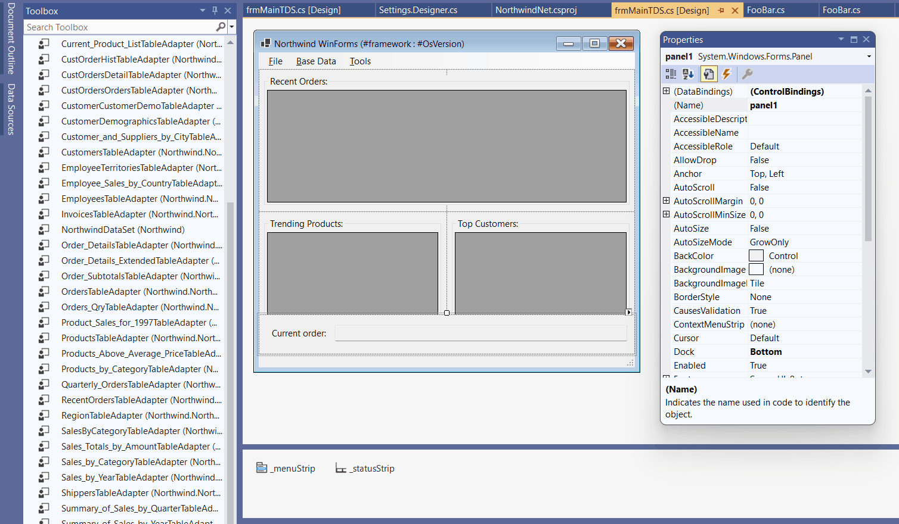
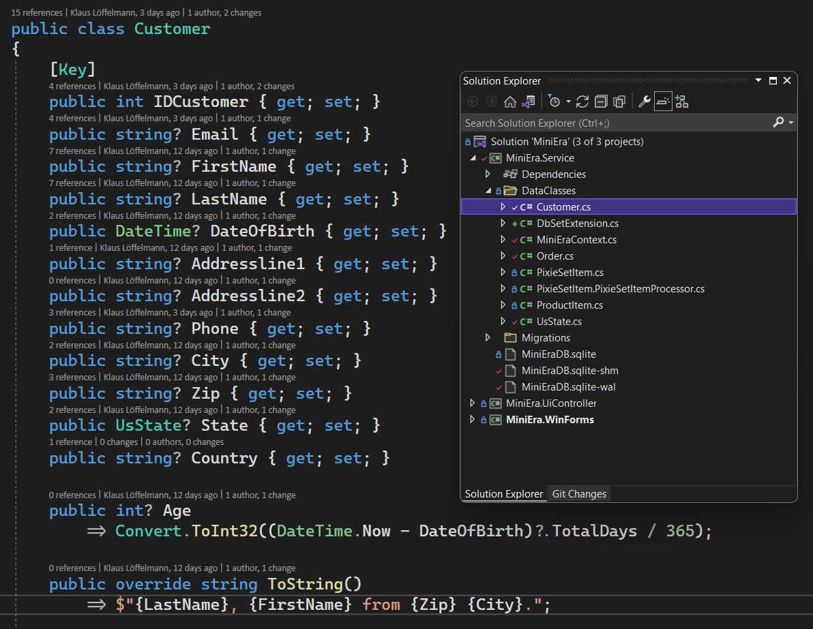
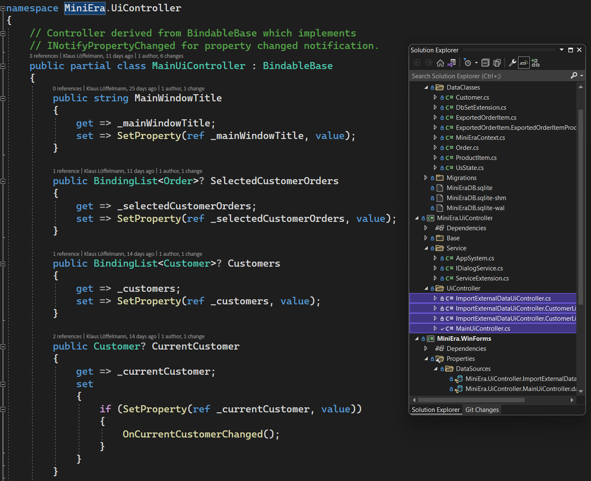
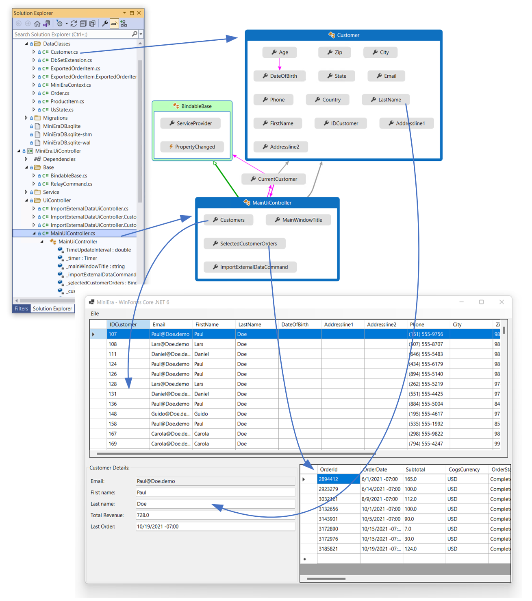
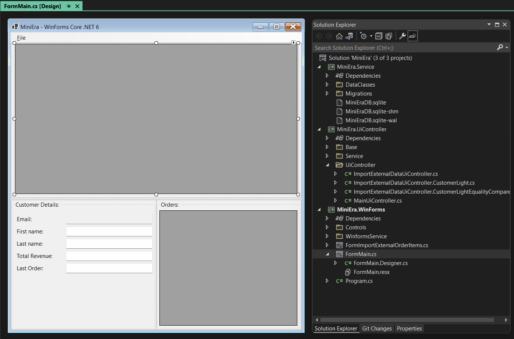
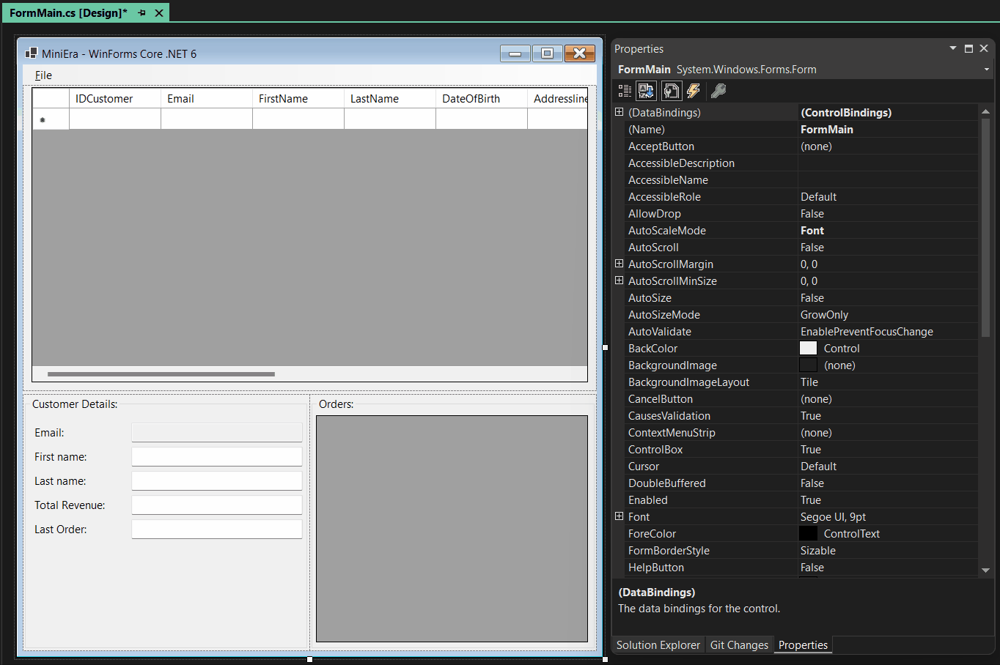
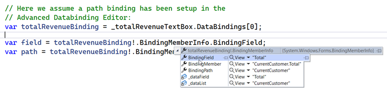

The design time support for databinding in the new Windows Forms (WinForms) .NET
Out of Process (OOP) Designer is different from the Framework Designer. The
WinForms OOP Designer has a new and easier approach for hooking up data sources,
focusing on *Object* Data Sources to support .NET based [object relational
mapper](https://en.wikipedia.org/wiki/Object%E2%80%93relational_mapping)
technologies (like the latest version of [Entity Framework Core – EF
Core](https://docs.microsoft.com/ef/core/) for short) which the WinForms team
recommends as a successor for Typed DataSets. This new approach was due to the
completely different architecture of the new WinForms OOP Designer, which we
have discussed [in the previous blog
post](https://devblogs.microsoft.com/dotnet/state-of-the-windows-forms-designer-for-net-applications/).
If you haven’t read it yet, you should do so first, as it is essential for a
better understanding of this post.

## Why is the Data Source Tool Window unavailable in .NET projects?

Essential to databinding in WinForms .NET Framework is the *Data Source Provider
Service*. This service runs in Visual Studio, and its responsibilities are as
follows:

- It generates and maintains Typed DataSets by connecting to a database data
    source (for example *Microsoft SQL Server* or *Oracle DB Server*).

- It detects types which are designed to act either as *Typed DataSet Data
    Sources* or *Object Data Sources*.

- It identifies potential *Object Data Sources* and sets those up in the
    project.

- It discovers legacy (for example SOAP-based) web services and sets them up
    in a way so they can act as data sources.

- It provides the UI functionality for the *Data Source Tool Window* in .NET
    Framework for WPF and WinForms applications. It also provides the UI Wizard
    to add new or maintain existing SQL Server connected data sources.

As of today, the Data Source Provider Service only works in the context of
Visual Studio, which means it can only type-resolve .NET Framework assemblies
and types. For .NET in its current version, the Data Source Provider Service is
not able to retrieve the necessary type information as it would need to operate
on the .NET Server Side (the
[*DesignToolsServer*](https://devblogs.microsoft.com/dotnet/state-of-the-windows-forms-designer-for-net-applications/#enter-the-designtoolsserver)).
This is the reason that the UI stacks which used to rely on the Data Source
Provider Service (WinForms, WPF) need to come up with alternatives for setting
up new data sources and at the same time support legacy scenarios as well as
possible. Providing feasible migration options, so that data access and
databinding technologies can be migrated Form by Form, with both data source
binding approaches (Typed DataSets *and* new ORMs based on Object Data Sources)
present over a period of time, was the main driver for the new databinding
functionality.

## Working with legacy Typed DataSets in the OOP Designer

To decouple WinForms from the dependency to the Data Source Provider Service,
there is now a new and quicker way to hook up new Object Data Sources.

That said, existing Typed DataSets definitions copied from Framework projects
can – with some limitations – be consumed by the OOP Designer even without that
service present. This means, data-bound Forms or UserControls using Typed
DataSets can be opened, and the Design Binding Picker (the drop-down editor in
the Property Browser to pick data sources for binding) will continue to provide
the necessary functionality to define the databinding of individual properties
of controls. At this time, though, no *new* Typed DataSets can be generated in
the context of a WinForms .NET application. It is also not possible, to
interactively update the schema for a Typed DataSet by querying the schema of
the assigned database. Necessary components (`DataSet` and for assigning the
data at runtime `tablenameTableAdapter`) to add a new binding definition can,
however, be added from the toolbox and hooked up manually – which means
*maintaining* legacy data-bound forms based on Typed Data Sets in .NET WinForms
projects is generally supported.

The following animated gif shows the process. Copy the Typed DataSet definition
from your existing Framework project to your new .NET project and see that all
necessary adapters and DataSets automatically appear in the toolbox on
recompile. You see: Clicking the Typed DataSet based data source on the Picker
does only set up the binding if the respective components are present in the
Component Tray.



## New Approaches when using Object Data Source Binding

Object Data Sources can, in contrast to Typed Data Sets, get their data through
all different kind of means. One of the most popular alternatives, which is a
great replacement for old-fashioned Typed DataSets, is Entity Framework Core (EF
Core for short). Apart from the fact that it has greater performance and a
bigger set of functionalities compared to Typed Data Sets, it also uses a
different approach in dealing with the permanent task of updating and
maintaining a database’s schema. While EF Core can principally be used in the
same way as Typed Datasets, which are generated based on an already existing
database, data objects based on EF Core can take a different more flexible and
more maintenance-friendly approach, which is called *Code first*.

[Code-first in this context
means](https://docs.microsoft.com/ef/core/#the-model), the class
definition defines the data structures/schemas, the relations between the
entities (tables), and then the actual database schema is derived from this
class definition: So-called migration-code updates the actual database
definition on the fly. The advantage: The underlying database technologies is
abstracted away: Code-first enables you to generate the schema for [many
different database
systems](https://docs.microsoft.com/ef/core/providers/?tabs=dotnet-core-cli):
SQL Server, SQLite, Oracle Server, In-Memory databases, Cosmos, PostgreSQL,
MySql – you name it!



Let’s consider the following scenario. We build a .NET 6 Windows Forms
application using [EF Core](https://docs.microsoft.com/ef/core/) code-first with
data classes defined in a dedicated class library. This way, we can reuse the
data layer code in other projects. But: In contrast what you would have done
with Typed DataSets, we are not binding the EF Core data classes directly to the
WinForms UI. The goal is to reduce the business logic code in the actual UI
(Forms/UserControls) and get rid as much as possible of the WinForms typical
“Code Behind” style. For that, we are introducing a set of properties to bind to
yet another Object Data Source, which implements the business logic instead. We
call this the *business logic UI-controller class*, or *UI-controller* for
short. And those are the properties, we bind. A few examples:

-   Instead of setting the window title text of a Form directly in code-behind
    in the Form, we have a property in the UI-controller for the windows title.
    And that we bind.

-   A *Save* button should only be enabled when there actually is something to
    save. Instead of enabling or disabling the button in Code-Behind in the
    Form, we are introducing for example a \`SaveButtonEnabled\` property in the
    UI-controller, which we then bind against the \`Enabled\` property of the
    button.

-   We can even utilize a concept which originated from WPF and is called
    [*Command
    Binding*](https://docs.microsoft.com/dotnet/desktop/wpf/advanced/commanding-overview?view=netframeworkdesktop-4.8).
    It’s suitable for elements like `ToolStripItems` (and the derived
    components `ToolStripButton`, `ToolStripMenuItem` and others) or
    `Button` controls and implemented via the `ICommand` interface: When the
    user clicks on such a button in the WinForms UI, and the command property of
    that button is bound to a respective property in the UI-controller class,
    the command executes the underlying business code in the business class
    logic rather than in some `Click` event code-behind.

A UI-controller class would look something like this:



Using a combination of data classes (which represent the Database) and
UI-controller(s) in this way as Object Data Sources has some advantages:

- **Business logic reuse:** The business logic is defined by business object
    (data source) classes independently of the UI. This means they can be reused
    in other scenarios. The same business objects which are used in a WinForms
    application could also be used for example in a Maui .NET mobile
    application.

- **Unit tests:** Since the business logic doesn’t include any specific
    UI-stack dependencies, it can be unit tested way more easily. That is a big
    advantage over the WinForms typical code-behind approach.

- **View model/UI Controller support:** Object Data Source classes can – or
    rather should – implement the \`INotifyPropertyChanged\` Interface. This
    enables data sources to act as UI-Controller classes (or View Models), which
    make them suitable to be reused in other UI Stacks.



Note: Although the binding infrastructure in WinForms is comparatively powerful,
it doesn’t have the flexibility of XAML-based binding which you might know from
WPF, UWP or Maui. For WinForms, you will most likely *always* be ending up with
some Code-Behind code to support UI-Controller binding scenarios, which are
otherwise difficult to implement just on the model/controller side. But that’s
OK and expected. For a better reusability of code and the ability to write code,
which is testable, it’s still worth the effort. And a migration to this way of
binding can be easily done over time, Form by Form, so it is really feasible and
can be planned for huge LOB apps. On top, we plan to further support and extend
[UI-controller centric scenarios in the .NET
7](https://github.com/dotnet/winforms/issues/4895) time frame for WinForms
projects.

## The New _Add Object Data Source_ Dialog

To use a certain class as your Object Data Source, start the binding process as
you previously would:

- Open the Design Binding Picker to add a new Object Data Source definition to
    your project.

- Click on the link *Add new Object Data Source* to find the type you want to
    use as a data source in your project.

- Use the *Filter* field to filter the selection by name. Note that types
    which implement the \`INotifyPropertyChanged\` interface (or derive from
    types which are based on that interface) are formatted in bold typeface.

- Use the checkboxes in the dialog to include or exclude types, which are not
    part of your project, or to control how the types are organized in the list.

The example in the animated GIF below shows how a slightly modified
`ToolStripMenuItem` component can be bound this way to a `Command`, and in
addition a DataGridView’s DataSource to a property of a UI-controller
representing a list of customers:



Here you see that adding `MainUIController` as an Object Data Source and
then binding its `Import` command to the `ImportExternalDataCommand`
property automatically led to the adding of the
`mainUiControllerBindingSource` component: In the Design Binding Picker you
can then pick that component as the actual data source.

## History lesson: why BindingSources as mediators and no direct binding?

Adding a `BindingSource` component for an Object Data Source as a mediator
between the data source and the target control/component is a concept which
WinForms adapted from the early beginning (.NET 2.0 back in 2005). The
`BindingSource` component acts as the so-called *currency manager*. *Currency*
in this context means, the `BindingSource` component manages which data item
in a list of items is the *current* one. This way of binding is also done for
scenarios, for which the data source is or provides only *one* object instance - a
UI-controller or a single data source item for a data entry form for example.
This principle is being kept for backwards compatibility reasons, which means
that any attempt to bind the first property to a newly added (object) data
source will *always* add a respective `BindingSource` component to the
component tray. The actual binding will then be hooked up to that
`BindingSource` component rather than to the data source directly.

**Note:** It is important to know in this context, that WinForms doesn’t
natively know the concept of type conversion based on the `IValueConverter`
interface as it is used in WPF, UWP or WinUI. Rather, a conversion during
binding can be done by handling the events, such as `Format` and `Parse`,
which are provided by the actual binding instances generated by the designer for
the binding in `InitializeComponent`. Like this:

```CS
public FormMain()
{
    InitializeComponent();

    // Current version of WinForms Databinding doesn't allow yet
    // IValueConverter, we do this instead:
    var totalRevenueBinding = _totalRevenueTextBox.DataBindings[0];

    // ConvertTo, here Decimal to String as an example:
    totalRevenueBinding.Format += (sender, eventArgs) =>
    {
        if (eventArgs.DesiredType != typeof(string))
        {
            return;
        }

        eventArgs.Value = ((decimal)eventArgs.Value!).ToString();
    };
    .
    .
    .
```

In this sample code we are assuming there is only one DataSource/Control binding
for a TextBox named `_totalRevenueTextBox`. We’re getting its `Binding`
definition and wire up to its `Format` event, where the actual conversion is
then handled at runtime.

## Improvements to Advanced Databinding

We also made improvements to the Advanced Databinding Editor. You use the
Advanced Databinding Editor for all properties which are not listed directly
under *Data Binding* in the Property Browser. This dialog now shows what component or
control you are binding to. It also shows what exact type of that control or
component you are editing. Also, rather than picking the binding trigger from a
drop-down list, you can now directly set that by clicking radio buttons, which
is quicker and more accessible.



The Advanced Databinding Dialog now allows to set up another binding scenario:
Sometimes it’s necessary that you define a whole property *path* in *complex*
binding scenarios – which are scenarios, where you are binding to a list rather
than to a single object instance. In those cases, the correlating
`BindingPath` and `BindingField` of the Binding’s instance
`BindingMemberInfo` property can now easily be set in the Advanced Databinding
Editor by entering the whole path in the *Path* entry field. If this field gets
the focus, *Path* and *Field* are merged, and you can edit the property path as
a whole. When that entry field later loses the focus again, *Path* and *Field*
are separated in the same way as they would show up if you’d queried them at
runtime through the Binding’s correlating `BindingMemberInfo` property:



## Summary and key takeaways

- Databinding in WinForms .NET is focused on Object Data Binding. We encourage
    developers to explore modern ORM technologies like Entity Framework Core,
    which can be used in their latest versions [in contrast to .NET
    Framework](https://docs.microsoft.com/ef/core/miscellaneous/platforms).

- Databinding of legacy technologies (Typed DataSets) is still supported,
    albeit with some limitations. Typed DataSet definitions can be copied from
    Framework projects, but new Typed DataSets cannot be created in .NET
    projects, nor can their schemas interactively be changed.  
    **Tip**: Old and new database mapping technologies can coexist in a WinForms project,
    so there is a *feasible* way to gradually migrate the underlying data layer
    technologies, one Form at a time.

- Object Data Sources are defined for the project through the *Design Binding
    Picker* in the Property Browser by clicking on the *Add New Object Data
    Source* link. The Data Source Provider Service is at the time not available
    for .NET projects (neither WinForms nor WPF). That is also the case for the
    Data Sources tool window, which relies on the Data Source Provider Service.

- Object Data Sources are a great tool migrating business “Code-behind” logic
    from Forms and UserControls into UI-stack-independent controller classes.
    This way, it becomes easier for WinForms apps to be unit tested or reuse
    business logic code in other contexts, and also have a clear migration path
    to introduce modern technologies in WinForms LOB Apps.

- The Advanced Databinding Dialog is now easier to handle and more accessible.
    It now also allows the definition for entering property paths for complex
    binding scenarios.

As always, please tell us which features you would like to see in the Designer
but also in the WinForms runtime around the databinding area.

Happy WinForms Coding!
