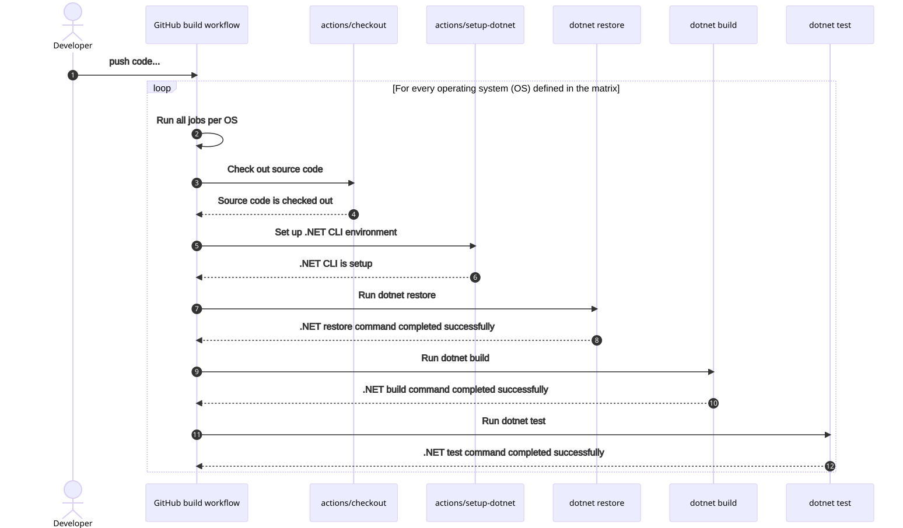
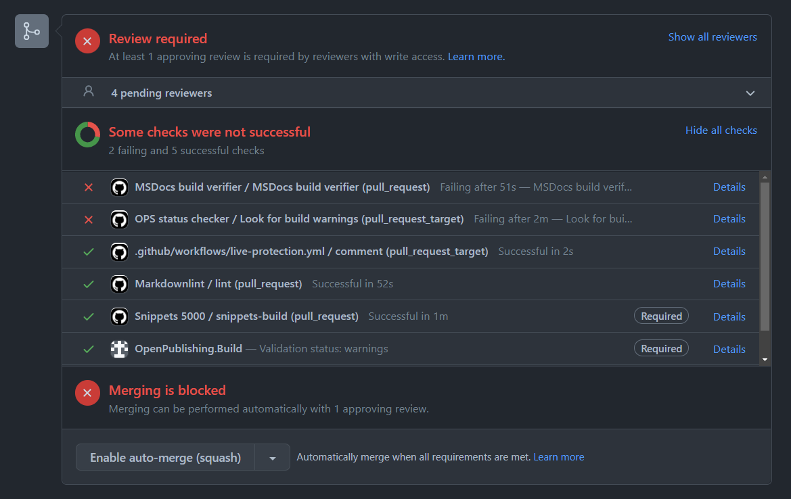
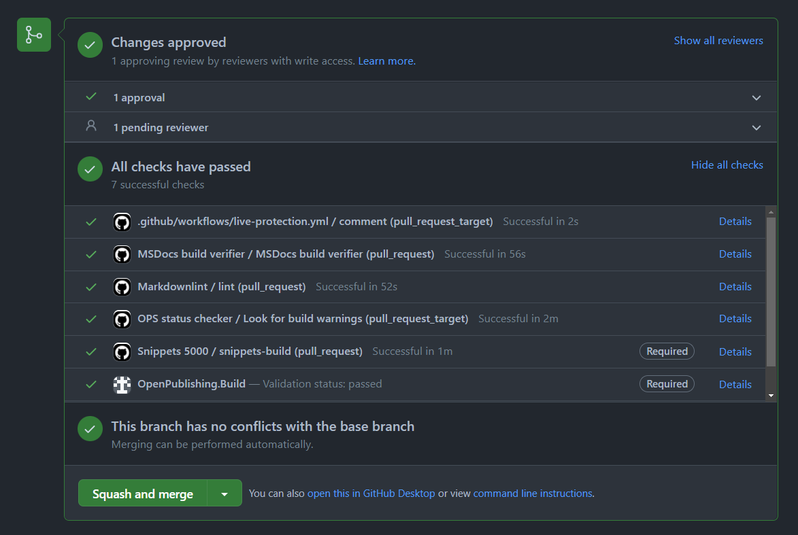

Hi friends, I put together two posts where I'm going to teach you the basics of the [GitHub Actions](https://github.com/features/actions) platform. In this first post, you'll learn how GitHub Actions can improve your .NET development experience and team productivity. I'll show you how to use them to automate common .NET app dev scenarios with workflow composition. In the next post, I'll show you how to create a custom GitHub Action written in .NET.

## An introduction to GitHub Actions

Developers that use GitHub for managing their git repositories have a very powerful continuous integration (CI) and continuous delivery (CD) feature with the help of GitHub Actions. A very common developer scenario is when developers propose changes to the default branch (typically `main`) of a GitHub repository. These changes, while often scrutinized by reviewers, can have automated checks to ensure that the code compiles and tests pass.

GitHub Actions allow you to build, test, and deploy your code right from your source code repository on <https://github.com>. GitHub Actions are consumed by GitHub workflows. A GitHub workflow is a YAML (either _*.yml_ or _*.yaml_) file within your GitHub repository. These workflow files reside in the _.github/workflows/_ directory from the root of the repository. A workflow references one or more GitHub Action(s) together as a series of instructions, where each instruction executes a specific task.

### The GitHub Action terminology

To avoid mistakenly using some of these terms inaccurately, let's define them:

- **GitHub Actions**: _GitHub Actions_ is a continuous integration and continuous delivery (CI/CD) platform that allows you to automate your build, test, and deployment pipeline.
- **workflow**: A _workflow_ is a configurable automated process that will run one or more jobs.
- **event**: An _event_ is a specific activity in a repository that triggers a workflow run.
- **job**: A _job_ is a set of steps in a workflow that execute on the same runner.
- **action**: An _action_ is a custom application for the GitHub Actions platform that performs a complex but frequently repeated task.
- **runner**: A _runner_ is a server that runs your workflows when they're triggered.

For more information, see [GitHub Docs: Understanding GitHub Actions][github-action-components]

[github-action-components]: https://docs.github.com/actions/learn-github-actions/understanding-github-actions

### Inside the GitHub workflow file

A workflow file defines a sequence of `jobs` and their corresponding `steps` to follow. Each workflow has a `name` and a set of triggers, or events to act `on`. You have to specify at least one trigger for your workflow to run unless it's a [reusable workflow][reusable-workflow]. A common .NET GitHub workflow would be to _build_ and _test_ your C# code when changes are either pushed or when there's a pull request targeting the default branch. Consider the following workflow file:

[reusable-workflow]: https://github.blog/2022-02-10-using-reusable-workflows-github-actions

```yml
name: build and test
on:
  push:
  pull_request:
    branches: [ main ]
    paths-ignore:
    - 'README.md'
env:
  DOTNET_VERSION: '6.0.x'
jobs:
  build-and-test:
    name: build-and-test-${{matrix.os}}
    runs-on: ${{ matrix.os }}
    strategy:
      matrix:
        os: [ubuntu-latest, windows-latest, macOS-latest]
    steps:
    - uses: actions/checkout@v2
    - name: Setup .NET
      uses: actions/setup-dotnet@v1
      with:
        dotnet-version: ${{ env.DOTNET_VERSION }}
    - name: Install dependencies
      run: dotnet restore
    - name: Build
      run: dotnet build --configuration Release --no-restore
    - name: Test
      run: dotnet test --no-restore --verbosity normal
```

I'm not going to assume that you have a deep understanding of this workflow, and while it's less than thirty lines &mdash; there is still a lot to unpack. I put together a sequence diagram (powered by [Mermaid][mermaid]), that shows how a developer might visualize this workflow.

[mermaid]: https://mermaid-js.github.io/mermaid



Here's the same workflow file, but this time it is expanded with inline comments to add context (if you're already familiar with the [workflow syntax][workflow-syntax], feel free to skip past this):

[workflow-syntax]: https://docs.github.com/actions/using-workflows/workflow-syntax-for-github-actions?wt.mc_id=dapine

```yml
# The name of the workflow.
# This is the name that's displayed for status
# badges (commonly embedded in README.md files).
name: build and test

# Trigger this workflow on a push, or pull request to
# the main branch, when either C# or project files changed
on:
  push:
  pull_request:
    branches: [ main ]
    paths-ignore:
    - 'README.md'

# Create an environment variable named DOTNET_VERSION
# and set it as "6.0.x"
env:
  DOTNET_VERSION: '6.0.x' # The .NET SDK version to use

# Defines a single job named "build-and-test"
jobs:
  build-and-test:

    # When the workflow runs, this is the name that is logged
    # This job will run three times, once for each "os" defined
    name: build-and-test-${{matrix.os}}
    runs-on: ${{ matrix.os }}
    strategy:
      matrix:
        os: [ubuntu-latest, windows-latest, macOS-latest]

    # Each job run contains these five steps
    steps:

    # 1) Check out the source code so that the workflow can access it.
    - uses: actions/checkout@v2

    # 2) Set up the .NET CLI environment for the workflow to use.
    #    The .NET version is specified by the environment variable.
    - name: Setup .NET
      uses: actions/setup-dotnet@v1
      with:
        dotnet-version: ${{ env.DOTNET_VERSION }}

    # 3) Restore the dependencies and tools of a project or solution.
    - name: Install dependencies
      run: dotnet restore

    # 4) Build a project or solution and all of its dependencies.
    - name: Build
      run: dotnet build --configuration Release --no-restore

    # 5) Test a project or solution.
    - name: Test
      run: dotnet test --no-restore --verbosity normal
```

The preceding workflow file contains many comments to help detail each area of the workflow. You might have noticed that the `steps` define various usages of GitHub Actions or simple `run` commands. The relationship between a GitHub Action and a consuming GitHub workflow is that workflows consume actions. A GitHub Action is only as powerful as the consuming workflow. Workflows can define anything from simple tasks to elaborate compositions and everything in between. For more information on creating GitHub workflows for .NET apps, see the following .NET docs resources:

- [Create a build validation workflow][build]
- [Create a test validation workflow][test]
- [Create a deploy workflow][deploy]
- [Create a CodeQL security vulnerability scanning CRON job workflow][codeql]

[build]: https://docs.microsoft.com/dotnet/devops/dotnet-build-github-action?wt.mc_id=dapine
[test]: https://docs.microsoft.com/dotnet/devops/dotnet-test-github-action?wt.mc_id=dapine
[deploy]: https://docs.microsoft.com/dotnet/devops/dotnet-publish-github-action?wt.mc_id=dapine
[codeql]: https://docs.microsoft.com/dotnet/devops/dotnet-secure-github-action?wt.mc_id=dapine

I hope that you're asking yourself, "why is this important?" Sure, we have the ability to create GitHub Actions, and we can compose workflows that consume them &mdash; but why is that important?! That answer is GitHub status checks 🤓.

## GitHub status checks

One of the primary benefits of using workflows is to define conditional status checks that can deterministically fail a build. A workflow can be configured as a status check for a pull request (PR), and if the workflow fails, for example the source code in the pull request doesn't compile &mdash; the PR can be blocked from being merged. Consider the following screen capture, which shows that two checks have failed, thus blocking the PR from being merged.



As the developer who is responsible for reviewing a PR, you'd immediately see that the pull request has failing status checks. You'd work with the developer who proposed the PR to get all of the status checks to pass. The following is a screen capture showing a "green build", a build that has all of its status checks as passing.



For more information, see [GitHub Docs: GitHub status checks][github-status-checks].

[github-status-checks]: https://docs.github.com/pull-requests/collaborating-with-pull-requests/collaborating-on-repositories-with-code-quality-features/about-status-checks?wt.mc_id=dapine

## GitHub Actions that .NET developers should know

As a .NET developer, you're likely familiar with the [.NET CLI][dotnet-cli]. The .NET CLI is included with the .NET SDK. If you don't already have the .NET SDK, you can [download the .NET 6 SDK][download-dotnet-6].

[dotnet-cli]: https://docs.microsoft.com/dotnet/core/tools?wt.mc_id=dapine
[download-dotnet-6]: https://dotnet.microsoft.com/download/dotnet/6.0?wt.mc_id=dapine

Using the previous workflow file as a point of reference, there are five steps &mdash; each step includes either the `run` or `uses` syntax:

| Action or command | Description |
|--|--|
| `uses: actions/checkout@v2` | This action checks-out your repository under `$GITHUB_WORKSPACE`, so your workflow can access it. For more information, see [actions/checkout][checkout] |
| `uses: actions/setup-dotnet@v1` | This action sets up a .NET CLI environment for use in actions. For more information, see [actions/setup-dotnet][setup-dotnet] |
| `run: dotnet restore` | Non-action command, that restores the dependencies and tools of a project or solution. For more information, see [dotnet restore][dotnet-restore] |
| `run: dotnet build` | This isn't an action, but rather a CLI command. For more information, see  [dotnet build][dotnet-build] |
| `run: dotnet test` | This isn't an action, but rather a CLI command. For more information, see  [dotnet test][dotnet-test] |

[checkout]: https://github.com/actions/checkout?wt.mc_id=dapine
[setup-dotnet]: https://github.com/actions/setup-dotnet?wt.mc_id=dapine
[dotnet-restore]: https://docs.microsoft.com/dotnet/core/tools/dotnet-restore?wt.mc_id=dapine
[dotnet-build]: https://docs.microsoft.com/dotnet/core/tools/dotnet-build?wt.mc_id=dapine
[dotnet-test]: https://docs.microsoft.com/dotnet/core/tools/dotnet-test?wt.mc_id=dapine

Some `steps` rely on GitHub Actions and reference them with the `uses` syntax, while others `run` commands. For more information on the differences, see Workflow syntax for GitHub Actions: [`uses`][uses] and [`run`][run].

[uses]: https://docs.github.com/actions/using-workflows/workflow-syntax-for-github-actions?wt.mc_id=dapine#jobsjob_idstepsuses
[run]: https://docs.github.com/actions/using-workflows/workflow-syntax-for-github-actions?wt.mc_id=dapine#jobsjob_idstepsrun

In addition to using the standard GitHub Actions, or invoking .NET CLI commands using the `run` syntax, you might be interested in learning about some additional GitHub Actions.

### Additional GitHub Actions

Several .NET GitHub Actions are hosted on the [dotnet GitHub organization][github-dotnet]:

| .NET GitHub Action | Description |
|--|--|
| [dotnet/versionsweeper][dotnet-version-sweeper] | This action sweeps .NET repos for out-of-support target versions of .NET. The .NET docs team uses the .NET version sweeper GitHub Action to automate issue creation. The action runs as a _cron job_ (or on a schedule). When it detects that .NET projects target out-of-support versions, it creates issues to report its findings. The output is configurable and helpful for tracking .NET version support concerns. |
| [dotnet/code-analysis][dotnet-code-analysis] | This action runs the code analysis rules that are included in the .NET SDK as part of continuous integration (CI). The action runs both [code-quality (CAXXXX) rules][caxxxx] and [code-style (IDEXXXX) rules][idexxxx]. |

[github-dotnet]: https://github.com/dotnet?wt.mc_id=dapine
[dotnet-version-sweeper]: https://github.com/dotnet/versionsweeper?wt.mc_id=dapine
[dotnet-code-analysis]: https://github.com/dotnet/code-analysis?wt.mc_id=dapine
[caxxxx]: https://docs.microsoft.com/dotnet/fundamentals/code-analysis/quality-rules?wt.mc_id=dapine
[idexxxx]: https://docs.microsoft.com/dotnet/fundamentals/code-analysis/style-rules?wt.mc_id=dapine

### .NET developer community spotlight

The .NET developer community is building GitHub Actions that might be useful in your organizations. As an example, check out the [`zyborg/dotnet-tests-report`][dotnet-tests-report] which is a GitHub Action to run .NET tests and generate reports and badges. If you use this GitHub Action, be sure to give their repo a star ⭐.

[dotnet-tests-report]: https://github.com/zyborg/dotnet-tests-report

There are many .NET GitHub Actions that can be consumed from workflows, see the [GitHub Marketplace: .NET][github-marketplace-dotnet].

[github-marketplace-dotnet]: https://github.com/marketplace?type=actions&query=.net

### A word on .NET workloads

.NET runs anywhere, and you can use it to build just about anything. That being said, there are optional workloads that may need to be installed when building from a GitHub workflow. There are many workloads available, see the output of the `dotnet workload search` command as an example:

```dotnetcli
dotnet workload search

Workload ID         Description
-----------------------------------------------------------------------------------------
android             .NET SDK Workload for building Android applications.
android-aot         .NET SDK Workload for building Android applications with AOT support.
ios                 .NET SDK Workload for building iOS applications.
maccatalyst         .NET SDK Workload for building macOS applications with MacCatalyst.
macos               .NET SDK Workload for building macOS applications.
maui                .NET MAUI SDK for all platforms
maui-android        .NET MAUI SDK for Android
maui-desktop        .NET MAUI SDK for Desktop
maui-ios            .NET MAUI SDK for iOS
maui-maccatalyst    .NET MAUI SDK for Mac Catalyst
maui-mobile         .NET MAUI SDK for Mobile
maui-windows        .NET MAUI SDK for Windows
tvos                .NET SDK Workload for building tvOS applications.
wasm-tools          .NET WebAssembly build tools
```

If you're writing a workflow for Blazor WebAssembly app, or .NET MAUI as an example &mdash; you'll likely `run` the [dotnet workload install][dotnet-workload-install] command as one of your `steps`. For example, an individual `run` step to install the WebAssembly build tools would look like:

```yml
run: dotnet workload install wasm-tools
```

[dotnet-workload-install]: https://docs.microsoft.com/dotnet/core/tools/dotnet-workload-install?wt.mc_id=dapine

## Summary

In this post, I explained the key differences between GitHub Actions and GitHub workflows. I explained and scrutinized each line in an example workflow file. I then showed you how a developer might visualize the execution of a GitHub workflow as a sequence diagram. I shared a few additional resources you may have not known. For more information, see [.NET Docs: GitHub Actions and .NET][github-actions-and-dotnet].

[github-actions-and-dotnet]: https://docs.microsoft.com/dotnet/devops/github-actions-overview?wt.mc_id=dapine

In the next post, I'll show how to create GitHub Actions using .NET. I'll walk you through upgrading an existing .NET GitHub Action that is used to automatically maintain a _CODE_METRICS.md_ file within the root of the repository. The code metrics analyze the C# source code of the target repository to determine things such as cyclomatic complexity and the maintainability index. In addition to these metrics, we'll add the ability to generate [Mermaid class diagrams][mermaid-class-diagrams], which is now natively supported by GitHub flavored markdown.

[mermaid-class-diagrams]: https://mermaid-js.github.io/mermaid/#/classDiagram
