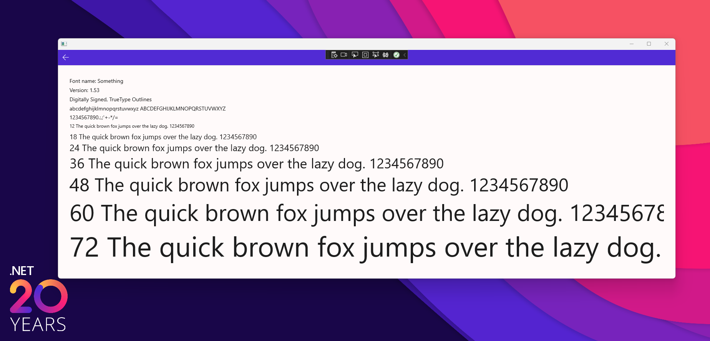
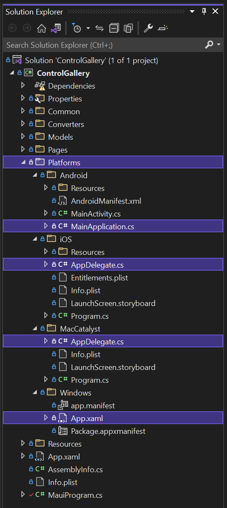

The 13th preview of .NET Multi-platform App UI is now available in Visual Studio 17.2 Preview 1. In addition to some quality improvements, this release includes several implementations such as Label.FormattedText as we close in on feature complete for the upcoming release.



This entire page is a single `Label` control, mimicing the Windows font preview!

```xaml
<Label LineBreakMode="NoWrap" LineHeight="1.4">
    <Label.FormattedText>
        <FormattedString>
            <Span Text="Font name: Default &#10;"/>
            <Span Text="Version: 1.00  &#10;"/>
            <Span Text="Digitally Signed, TrueType Outlines &#10;"/>
            <Span Text="abcdefghijklmnopqrstuvwxyz "/>
            <Span Text="abcdefghijklmnopqrstuvwxyz &#10;" TextTransform="Uppercase"/>
            <Span Text="1234567890.:,;'+-*/=  &#10;"/>
            <Span Text="12 The quick brown fox jumps over the lazy dog. 1234567890 &#10;" FontSize="12"/>
            <Span Text="18 The quick brown fox jumps over the lazy dog. 1234567890 &#10;" FontSize="18"/>
            <Span Text="24 The quick brown fox jumps over the lazy dog. 1234567890 &#10;" FontSize="24"/>
            <Span Text="36 The quick brown fox jumps over the lazy dog. 1234567890 &#10;" FontSize="36"/>
            <Span Text="48 The quick brown fox jumps over the lazy dog. 1234567890 &#10;" FontSize="48"/>
            <Span Text="60 The quick brown fox jumps over the lazy dog. 1234567890 &#10;" FontSize="60"/>
            <Span Text="72 The quick brown fox jumps over the lazy dog. 1234567890 " FontSize="72"/>
        </FormattedString>
    </Label.FormattedText>
</Label>
```

Additional highlights include:  

* [New documentation](https://docs.microsoft.com/dotnet/maui/) for many topics from XAML fundamentals and advanced topics, to bindable and attached properties, and RelativeLayout
* Label.FormattedText ([#3637](https://github.com/dotnet/maui/pull/3637))
* RadioButton ([#3784](https://github.com/dotnet/maui/pull/3784))
* SwipeView ([#3987](https://github.com/dotnet/maui/pull/3987) [#4064](https://github.com/dotnet/maui/pull/4064) [#4026](https://github.com/dotnet/maui/pull/4026))
* WinUI Flyout ([#3735](https://github.com/dotnet/maui/pull/3735))
* WinUI TabbedPage ([#4257](https://github.com/dotnet/maui/pull/4257))
* ListView ([#3916](https://github.com/dotnet/maui/pull/3916) [#3817](https://github.com/dotnet/maui/pull/3817) [#4193](https://github.com/dotnet/maui/pull/4193))
* Remove MS.Extensions.Hosting ([#4505](https://github.com/dotnet/maui/pull/4505))
* WebView: CanGoBack, CanGoForward, Eval, GoBack, GoForward, Reload

Find more details in our [release notes](#tbd).

One of the key .NET alignment inspired design decisions we've made in .NET MAUI is to adopt the Microsoft.Extensions builder pattern for bootstrapping applications.

## Bootstrapping in .NET MAUI: Focus on MauiProgram

Through the course of our previews, we have heard loud and clear that you love the startup pattern in .NET MAUI. We've also made adjustments along the way to improve the developer experience, polish our usage, and collaborate with other .NET app model teams to arrive at the a great solution for .NET MAUI developers. In this release, we've made another adjustment removing Microsoft.Extensions.Hosting in favor of a faster app startup time, specifically for Android. Let's take a closer look at how a .NET MAUI app starts up each platform, and what all you can do to configure your app.

### Platform App Classes

Every platform has its own native application class where you might do platform-specific setup. On Windows this is the `WinUIApplication`. Each of these applications will use "MauiProgram.cs" to create your `MauiApp`.

```csharp
public partial class App : MauiWinUIApplication
{
    public App()
    {
        InitializeComponent();
    }

    protected override MauiApp CreateMauiApp() => MauiProgram.CreateMauiApp();
}
```



Android has `MainApplication`, and iOS and macOS use `AppDelegate`. While you can put code here to do specific things, we recommend instead doing everything in `MauiProgram`. A barebones implementation looks like this:

```csharp
namespace WeatherTwentyOne;

public static class MauiProgram
{
    public static MauiApp CreateMauiApp()
    {
        var builder = MauiApp.CreateBuilder();
        builder
            .UseMauiApp<App>();
 
        return builder.Build();
    }
}
```

The method `UseMauiApp` does the basic setup for your app including 

So what kind of work can you do here in the `CreateMauiApp` method? This is where you will:

* `RegisterBlazorMauiWebView` - to enable this control and related services in your app
* `ConfigureAnimations` - ?
* `ConfigureEffects` - to register [Xamarin.Forms Effects](https://docs.microsoft.com/xamarin/xamarin-forms/app-fundamentals/effects/) in this .NET MAUI handler architecture
* `ConfigureEssentials` - to perform Essentials related setup. See [microsoft/dotnet-podcasts](https://github.com/microsoft/dotnet-podcasts/blob/main/src/Mobile/Services/EssentialsExtensions.cs) for examples
* `ConfigureFonts` - to register fonts with an alias
* `ConfigureImageSources` - to override image sources in order to perform custom work such as filetype conversion
* `ConfigureMauiHandlers` - set a custom handler as your implementation, or a 3rd-party option

Let's say you want to replace the platform-specific implementation of an Entry control with the Fluent Design `Entry` control from the Maui.Graphics.Controls project. After including the NuGet package in your project, you can now configure controls to use an alternate handler implementation.

```csharp
var builder = MauiApp.CreateBuilder();
    builder
        .UseMauiApp<App>()
        .ConfigureMauiHandlers(handlers => {
            handlers.AddHandler(typeof(Entry), typeof(Microsoft.Maui.Graphics.Controls.EntryHandler));
        })
```

To make this even more convenient, library developers can provide custom extensions to do this for you. If I want all of my controls to look in Maui.Graphics.Controls for a Fluent implementation, I can use a convenient extension.

```csharp
var builder = MauiApp.CreateBuilder();
    builder
        .UseMauiApp<App>()
        .ConfigureGraphicsControls(DrawableType.Fluent)
```

### Dependency Injection

The MauiProgram is also where you will configure your DI container. The .NET Podcast app does a clean job of demonstrating this in action with extension methods. MauiProgram.cs looks like this:

```csharp
public static MauiApp CreateMauiApp()
{
    var builder = MauiApp.CreateBuilder();
    builder
        .RegisterBlazorMauiWebView()
        .UseMauiApp<App>()
        .ConfigureEssentials()
        .ConfigureServices()
        .ConfigureViewModels()
        .ConfigureFonts(fonts =>
        {
            fonts.AddFont("Segoe-Ui-Bold.ttf", "SegoeUiBold");
            fonts.AddFont("Segoe-Ui-Regular.ttf", "SegoeUiRegular");
            fonts.AddFont("Segoe-Ui-Semibold.ttf", "SegoeUiSemibold");
            fonts.AddFont("Segoe-Ui-Semilight.ttf", "SegoeUiSemilight");
        });

    Barrel.ApplicationId = "dotnetpodcasts";

    return builder.Build();
}
```

Digging into `ConfigureServices` we see setup the BlazorWebView control, singletons, transients, scoped dependencies, and even the HttpClient implementation. View the [source here](https://github.com/microsoft/dotnet-podcasts/blob/main/src/Mobile/Services/ServicesExtensions.cs).

> Shell and DI - last release we featured the new constructor injection support when using Shell as your application navigation context. Until this issue is resolved, you will need to register your pages in addition to any injectables in order for the DI to succeed.

### Platform Lifecycle Events

When you have need to do custom setup based on platform events, .NET MAUI provides lifecycle events right in your multi-targeted code. WinUI has a property to control if your content should extend into the title bar area or not. To access, you can do this:

```csharp
builder.ConfigureLifecycleEvents(lifecycle => {
#if WINDOWS
    lifecycle
        .AddWindows(windows =>
            windows.OnNativeMessage((app, args) => {
                app.ExtendsContentIntoTitleBar = false;
            }));
#endif
});
```

### Removing Hosting and Disabling Logging

It was identified that Microsoft.Extensions.Hosting was not needed in a .NET MAUI app, and removing it would improve Android app started by approximately 13% on a blank application. As you can see from the examples above, you can still do the most useful things with Hosting removed. Hosting was overhead we didn't need. For more details on this change, Eric Erhardt has provided a [thorough write-up here](https://github.com/dotnet/maui/issues/4393).

Hand in hand with this change, we have also made the change to [disable logging for release builds](https://github.com/dotnet/maui/issues/4394).

## Get Started Today

.NET MAUI Preview 13 is bundled with Visual Studio 17.2 Preview 1 which is also available today with the [latest productivity improvements for .NET MAUI development](link to vs release notes or blog). If you are using Visual Studio 2022 17.1 Preview 2 or newer, you can upgrade to 17.2 Preview 1.

> If you are upgrading from .NET MAUI preview 10 or earlier, or have been using `maui-check` we recommend starting from a clean slate by [uninstalling all .NET 6](https://docs.microsoft.com/dotnet/core/install/remove-runtime-sdk-versions?pivots=os-windows#uninstall-net) previews and [Visual Studio 2022 previews](https://docs.microsoft.com/visualstudio/install/uninstall-visual-studio?view=vs-2022). 

Starting from scratch? Install this [Visual Studio 2022 Preview](https://aka.ms/vs2022preview) (17.2 Preview 1) and confirm .NET MAUI (preview) is checked under the "Mobile Development with .NET workload".

Ready? Open Visual Studio 2022 and create a new project. Search for and select .NET MAUI.

Preview 13 [release notes are on GitHub](https://github.com/dotnet/maui/releases/tag/6.0.200-preview.13). For additional information about getting started with .NET MAUI, refer to our [documentation](https://docs.microsoft.com/dotnet/maui/get-started/installation).

## Feedback Welcome

Please let us know about your experiences using .NET MAUI to create new applications by engaging with us on GitHub at [dotnet/maui](https://github.com/dotnet/maui).

For a look at what is coming in future .NET 6 releases, visit our [product roadmap](https://github.com/dotnet/maui/wiki/roadmap), and for a status of feature completeness visit our [status wiki](https://github.com/dotnet/maui/wiki/status).