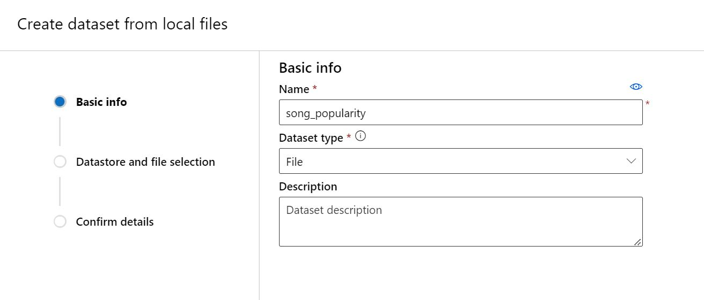
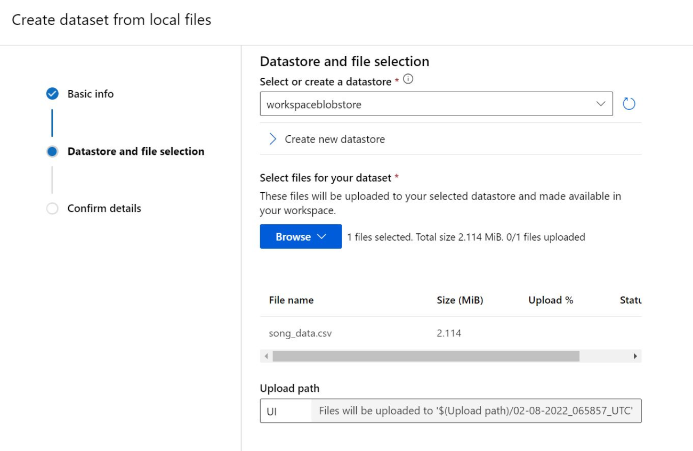
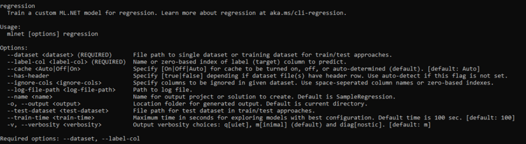

Model Builder makes it easy to get started with Machine Learning and create your first model. As you gather more data over time, you may want to continuously refine or retrain your model. Using a combination of CLI and Azure tooling, you can train a new ML.NET model and integrate the training into a pipeline. This blog post shows an example of a training pipeline that can be easily rerun using Azure. 

We’re going to use [Azure Machine Learning Datasets](https://docs.microsoft.com/azure/machine-learning/concept-azure-machine-learning-architecture#datasets-and-datastores) to track data and an Azure ML Pipeline to train a new model. This retraining pipeline can then be triggered by Azure DevOps. 
In this post, we will cover: 
1.	Creating an Azure Machine Learning Dataset
2.	Training a ML.NET model via the Azure Machine Learning CLI (v2)
3.	Creating a pipeline in Azure DevOps for re-training

## Prerequisites

1. [Azure Machine Learning Workspace](https://docs.microsoft.com/azure/machine-learning/how-to-manage-workspace?tabs=azure-portal#create-a-workspace)
2. [Compute Cluster](https://docs.microsoft.com/azure/machine-learning/how-to-create-attach-compute-cluster) in the workspace

## Creating an Azure Machine Learning Dataset
1.	Open the workspace in the [Microsoft Azure Machine Learning Studio](https://ml.azure.com). 
2.	We need to create a file dataset. Navigate to **Datasets**. Click **+ Create Dataset**. 
3.	Choose the datasource. We will upload a copy of this [song popularity dataset](https://www.kaggle.com/yasserh/song-popularity-dataset) available from Kaggle. It’s a fairly large dataset that I don’t want to maintain locally. 
4.	Give the dataset a unique name and make sure to choose "File” as the Dataset type. 


5.	Upload from a local file to the default *workspaceblobstore*. Take note of the file name. 


6.	When the data upload finishes, create the dataset. 
7.  Click on the completed dataset to view it. Confirm the preview available in the **Explore** tab looks correct. 
8.	Make note of the dataset name, file name, and if you uploaded multiple versions, the version number. We will use these values in the next step. 

## Training a ML.NET model via Azure Machine Learning
Now that we have a dataset uploaded to Azure ML we can create an Azure ML training pipeline, and use Azure CLI v2 to run it. The pipeline below will create a Docker container with a ML.NET CLI instance that will conduct the training.

1.	Create the Dockerfile and save it in a new folder for this experiment. If not familiar with Dockerfiles, these file types don't have an extension. The file should be called "Dockerfile" with no extension, and contain the following: 
```DOCKERFILE
FROM mcr.microsoft.com/dotnet/sdk:6.0
RUN dotnet tool install -g microsoft.mlnet-linux-x64
ENV PATH="$PATH:/root/.dotnet/tools"
```
2.	We will need to figure out our ML.NET CLI command to train our model. If needed, see [installation instructions for the ML.NET CLI](https://docs.microsoft.com/dotnet/machine-learning/how-to-guides/install-ml-net-cli).
 

    We’re doing regression and will specify a dataset and label column. Text classification and recommendation are also supported for tabular files. Check the command information or [ML.NET CLI docs](https://docs.microsoft.com/dotnet/machine-learning/reference/ml-net-cli-reference) for more details on other training scenarios. 
  
    Make sure to include the option ```--verbosity q```, as some of the CLI features can cause problems in the Linux environment. 

    ```mlnet regression --dataset <YOUR_DATA_FILE_NAME> --label-col <YOUR_LABEL> --output outputs --log-file-path outputs/logs --verbosity q```

3.	Create the AzureTrain.yml file in the same folder as the Dockerfile. This is what will be passed to the Azure CLI.  By using input data in the pipeline, Azure ML will download the file dataset to our compute. The training file can then be referenced directly. We just need to specify the path in the command to the ML.NET CLI.  Do the following:
-	Replace <DATASET_NAME> with the unique dataset name, and <VERSION> with the version number (likely 1). Both values are visible in the Dataset tab. In this example the value is ```dataset: azureml:song_popularity:1```. 
-	Replace command with the local ML.NET CLI command. Instead of the local file path, we’ll use {inputs.data} to tell the pipeline to use the download path on the Azure compute. Add the data file name. In this example it is ```--dataset {inputs.data}/song_data.csv```.
-	Replace the compute with our compute name. The available compute clusters in the workspace are visible under **Computes** -> **Compute clusters**. 

For more information see [command job YAML schema documentation](htts://docs.microsoft.com/azure/machine-learning/reference-yaml-job-command). 
```YAML
inputs:
  data:
    dataset: azureml:<DATASET_NAME>:<VERSION>
    mode: download
experiment_name: mldotnet-training
code:
  local_path: .
command: mlnet regression --dataset {inputs.data}/<YOUR_DATA_FILE_NAME> --label-col <YOUR_LABEL_COLUMN> --output outputs --log-file-path outputs/logs --verbosity q
compute: azureml:<YOUR-COMPUTE-NAME>
environment: 
  build:
    local_path: .
    dockerfile_path: Dockerfile
```

### Run manually
To kick off training from a local machine, or just test the functionality of the run, we can [install and setup the Azure CLI (v2) with ML extension](https://docs.microsoft.com/azure/machine-learning/how-to-configure-cli). In these instructions I'm running ml extension version 2.0.7.
1.	Machine learning subcommands require the --workspace/-w and --resource-group/-g parameters. Configure the defaults for the group and workspace of the dataset.  
```az configure –-defaults group=<YOUR_RESOURCE_GROUP> workspace=<YOUR_WORKSPACE>```

2.	Run the retraining pipeline created in the previous step.  
```az ml job create –-file AzureTrain.yml```

3.	Check the results of the run online in the Azure Machine Learning Studio under **Experiments** -> _mldotnet-training_

## Automate training with Azure DevOps Services pipelines
We can run the Azure ML training via Azure DevOps Pipelines. This allows the use of any trigger, including time based or file changes.
 
Below are the steps to get the Azure ML pipeline running. For more details, see [step-by-step instructions for setting up Azure DevOps and Azure ML](https://github.com/MicrosoftDocs/pipelines-azureml/blob/master/docs/getting_started.md).
1.	Check the Dockerfile and AzureTrain.yml into source control. It is best to create a new subfolder to put these files into. Azure CLI will upload the whole containing folder when running the experiment. 
2.	Create a service connection between Azure ML and Azure DevOps. In Azure DevOps:  
    1. Go to **Project settings**. Select **Pipelines** -> **Service connections**
    2. Create a new connection of type Azure Resource Manager
    3. Select Service principal (automatic) and Scope Level Machine Learning Workspace. Configure it to the Resource Group of your Machine Learning workspace. Name it aml-ws.
3.	In Azure DevOps create a new pipeline, using the following file as a template. Replace the variables and trigger (if applicable). The ml-ws-connection is the connection created in step 2. Depending on where the file is checked in, add the AzureTrain.yml file path to the 'Create training job' step. 

```YAML
variables:
  ml-ws-connection: 'aml-ws' # Workspace Service Connection name
  ml-ws: '<YOUR_VALUE>' # AML Workspace name
  ml-rg: '<YOUR_VALUE>' # AML resource Group name

trigger:
  <YOUR_TRIGGER>

pool:
  vmImage: ubuntu-latest

steps:

- task: AzureCLI@2
  displayName: 'Set config functionality'
  inputs:
    azureSubscription: $(ml-ws-connection)
    scriptLocation: inlineScript
    scriptType: 'bash'
    inlineScript: 'az config set extension.use_dynamic_install=yes_without_prompt'
    
- task: AzureCLI@2
  displayName: 'Install AML CLI (azureml-v2-preview)'
  inputs:
    azureSubscription: $(ml-ws-connection)
    scriptLocation: inlineScript
    scriptType: 'bash'
    inlineScript: 'az extension add -n ml'

- task: AzureCLI@2
  displayName: 'Setup default config values'
  inputs:
    azureSubscription: $(ml-ws-connection)
    scriptLocation: inlineScript
    scriptType: 'bash'
    inlineScript: 'az configure --defaults group=$(ml-rg) workspace=$(ml-ws)'

- task: AzureCLI@2
  displayName: 'Create training job'
  inputs:
    azureSubscription: $(ml-ws-connection)
    scriptLocation: inlineScript
    scriptType: 'bash'
    inlineScript: 'az ml job create --file <YOUR_PATH>/AzureTrain.yml'
```

Running the Azure CLI job either locally or from Azure DevOps will create an output model in Azure. To see the model, go to [Microsoft Azure Machine Learning Studio](https://ml.azure.com) and navigate to your ML workspace. Click on **Experiments** -> _mldotnet-training_. Toggle "View only my runs" to see runs started by the Azure Pipelines Service Principal. The completed training run should be visible. The trained model, and example code, is generated in the **Outputs + Logs** section, in the outputs folder.  

In this post, we've created a flexible way to track our data and model via Azure ML.  The Azure ML Dataset can be added to and updated while maintaining historical data. This Azure ML retraining pipeline can be run manually or automatically in Azure DevOps.  Once your model is trained, you can deploy it using [Azure ML custom containers](https://docs.microsoft.com/azure/machine-learning/how-to-deploy-custom-container). 

Set up your own ML.NET retraining pipeline with Azure Machine Learning Datasets and Azure DevOps? Let us know of any issues, feature requests, or general feedback by filing an issue in the [ML.NET Tooling (Model Builder & ML.NET CLI)](https://github.com/dotnet/machinelearning-modelbuilder) GitHub repo.
