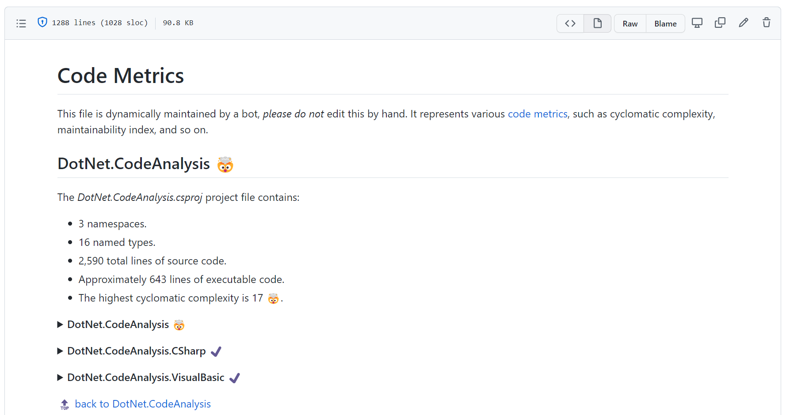
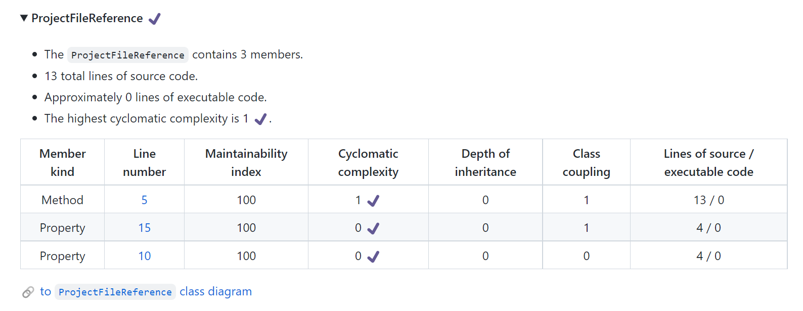
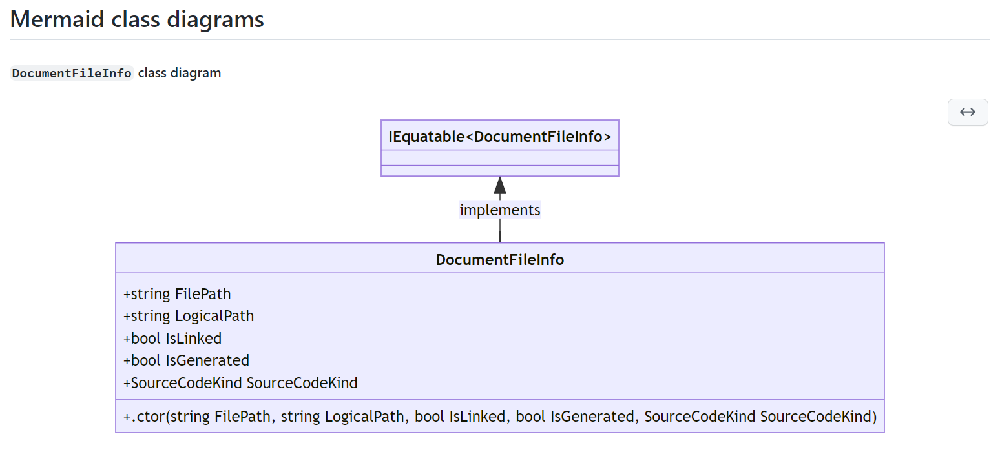

Hi friends, in my previous post &mdash; [.NET 💜 GitHub Actions][first-post], you were introduced to the GitHub Actions platform and the workflow composition syntax. You learned how common .NET CLI commands and actions can be used as building blocks for creating fully automated CI/CD pipelines, directly from your GitHub repositories.

[first-post]: https://devblogs.microsoft.com/dotnet/dotnet-loves-github-actions

This is the second post in the series dedicated to the [GitHub Actions](https://github.com/features/actions) platform and the relevance it has for .NET developers. In this post, I'll summarize an existing GitHub Action written in .NET that can be used to maintain a code metrics markdown file. I'll then explain how you can create your own GitHub Actions with .NET. I'll show you how to define metadata that's used to identify a GitHub repo as an action. Finally, I'll bring it all together with a really cool example: updating an action in the .NET samples repository to include class diagram support using  [GitHub's brand new Mermaid diagram support][mermaid-diagrams], so it will build updated class diagrams on every commit.

## Writing a custom GitHub Action with .NET

Actions support several variations of app development:

| Action type | Metadata specifier | Description |
|--|--|--|
| [Docker][docker-github-action] | `runs.using: 'docker'` | Any app that can run as a Docker container. |
| [JavaScript][javascript-github-action] | `runs.using: 'javascript'` | Any Node.js app (includes the benefit of using [`actions/toolkit`][actions/toolkit]). |
| [Composite][composite-github-action] | `runs.using: 'composite'` | Composes multiple `run` commands and `uses` actions. |

[docker-github-action]: https://docs.github.com/actions/creating-actions/creating-a-docker-container-action?wt.mc_id=dapine
[javascript-github-action]: https://docs.github.com/actions/creating-actions/creating-a-javascript-action?wt.mc_id=dapine
[actions/toolkit]: https://github.com/actions/toolkit
[composite-github-action]: https://docs.github.com/actions/creating-actions/creating-a-composite-action?wt.mc_id=dapine

.NET is capable of running in Docker containers, and when you want a fully functioning .NET app to run as your GitHub Action &mdash; you'll have to containerize your app. For more information on .NET and Docker, see [.NET Docs: Containerize a .NET app][dotnet-containers].

[dotnet-containers]: https://docs.microsoft.com/dotnet/core/docker/build-container?wt.mc_id=dapine

> If you're curious about creating JavaScript GitHub Actions, I wrote about that too, see [Localize .NET applications with machine-translation][localize-dotnet-apps]. In that blog post, I cover a TypeScript action that relies on Azure Cognitive Services to automatically generate pull requests for target translations.

[localize-dotnet-apps]: https://devblogs.microsoft.com/dotnet/localize-net-applications-with-machine-translation

In addition to containerizing a .NET app, you could alternatively create a .NET global tool that could be installed and called upon using the `run` syntax instead of `uses`. This alternative approach is useful for creating a .NET CLI app that can be used as a global tool, but it's out of scope for this post. For more information on .NET global tools, see [.NET Docs: Global tools][dotnet-global-tools].

[dotnet-global-tools]: https://docs.microsoft.com/dotnet/core/tools/global-tools?wt.mc_id=dapine

### Intent of the tutorial

Over on the .NET Docs, there's a tutorial on creating a [GitHub Action with .NET][dotnet-docs-create-gh-action]. It covers exactly how to containerize a .NET app, how to author the _action.yml_ which represents the action's metadata, as well as how to consume it from a workflow. Rather than repeating the entire tutorial, I'll summarize the intent of the action, and then we'll look at how it was updated.

[dotnet-docs-create-gh-action]: https://docs.microsoft.com/dotnet/devops/create-dotnet-github-action?wt.mc_id=dapine

The app in the tutorial performs code metric analysis by:

- Scanning and discovering _\*.csproj_ and _\*.vbproj_ project files in a target repository.
- Analyzing the discovered source code within these projects for:
  - Cyclomatic complexity
  - Maintainability index
  - Depth of inheritance
  - Class coupling
  - Number of lines of source code
  - Approximated lines of executable code
- Creating (or updating) a _CODE_METRICS.md_ file.

As part of the consuming workflow composition, a pull request is conditionally (and automatically) created when the _CODE_METRICS.md_ file changes. In other words, as you `push` changes to your GitHub repository, the workflow `runs` and `uses` the .NET code metrics action &mdash; which updates the markdown representation of the code metrics. The _CODE_METRICS.md_ file itself is navigable with automatic links, and collapsible sections. It uses emoji to highlight code metrics at a glance, for example, when a class has high cyclomatic complexity it bubbles an emoji up to the project level heading the markdown. From there, you can drill down into the class and see the metrics for each method.

The `Microsoft.CodeAnalysis.CodeMetrics` namespace contains the `CodeAnalysisMetricData` type, which exposes the `CyclomaticComplexity` property. This property is a measurement of the structural complexity of the code. It is created by calculating the number of different code paths in the flow of the program. A program that has a complex control flow requires more tests to achieve good code coverage and is less maintainable. When the code is analyzed and the GitHub Action updates the _CODE_METRICS.md_ file, it writes an emoji in the header using the following code:

```csharp
internal static string ToCyclomaticComplexityEmoji(
    this CodeAnalysisMetricData metric) =>
    metric.CyclomaticComplexity switch
    {
        >= 0 and <= 7 => ":heavy_check_mark:",  // ✔️
        8 or 9 => ":warning:",                  // ⚠️
        10 or 11 => ":radioactive:",            // ☢️
        >= 12 and <= 14 => ":x:",               // ❌
        _ => ":exploding_head:"                 // 🤯
    };
```

All of the code for this action is provided in the [.NET samples repository][sample-code] and is also part of the [.NET docs code samples browser experience][code-samples-browser-ux]. As an example of usage, the action is self-consuming (or dogfooding). As the code updates the action runs, and maintains a _CODE_METRICS.md_ file via automated pull requests. Consider the following screen captures showing some of the major parts of the markdown file:

[sample-code]: https://github.com/dotnet/samples/tree/main/github-actions/DotNet.GitHubAction
[code-samples-browser-ux]: https://docs.microsoft.com/samples/dotnet/samples/create-dotnet-github-action?wt.mc_id=dapine

**_CODE_METRICS.md heading_**



**_CODE_METRICS.md `ProjectFileReference` drill-down heading_**



The code metrics markdown file represents the code it analyzes, by providing the following hierarchy:

> Project ➡️ Namespace ➡️ Named Type ➡️ Members table

When you drill down into a named type, there is a link at the bottom of the table for the auto-generated class diagram. This is discussed in the [Adding new functionality](#adding-new-functionality) section. To navigate the example file yourself, see [.NET samples _CODE_METRICS.md_][code-metrics-file].

[code-metrics-file]: https://github.com/dotnet/samples/blob/main/github-actions/DotNet.GitHubAction/CODE_METRICS.md

## Action metadata

For a GitHub repository to be recognized as a GitHub Action, it must define metadata in an _action.yml_ file.

```yml
# Name, description, and branding. All of which are used for
# displaying the action in the GitHub Action marketplace.
name: '.NET code metric analyzer'
description: 'A GitHub action that maintains a CODE_METRICS.md file,
              reporting cyclomatic complexity, maintainability index, etc.'
branding:
  icon: sliders
  color: purple

# Specify inputs, some are required and some are not.
inputs:
  owner:
    description: 'The owner of the repo. Assign from github.repository_owner. Example, "dotnet".'
    required: true
  name:
    description: 'The repository name. Example, "samples".'
    required: true
  branch:
    description: 'The branch name. Assign from github.ref. Example, "refs/heads/main".'
    required: true
  dir:
    description: 'The root directory to work from. Example, "path/to/code".'
    required: true
  workspace:
    description: 'The workspace directory.'
    required: false
    default: '/github/workspace'

# The action outputs the following values.
outputs:
  summary-title:
    description: 'The title of the code metrics action.'
  summary-details:
    description: 'A detailed summary of all the projects that were flagged.'
  updated-metrics:
    description: 'A boolean value, indicating whether or not the CODE_METRICS.md 
                  was updated as a result of running this action.'

# The action runs using docker and accepts the following arguments.
runs:
  using: 'docker'
  image: 'Dockerfile'
  args:
  - '-o'
  - ${{ inputs.owner }}
  - '-n'
  - ${{ inputs.name }}
  - '-b'
  - ${{ inputs.branch }}
  - '-d'
  - ${{ inputs.dir }}
  - '-w'
  - ${{ inputs.workspace }}
```

The metadata for the .NET samples code metrics action is nested within a subdirectory, as such, it is _not_ recognized as an action that can be displayed in the [GitHub Action marketplace][action-marketplace]. However, it can still be used as an action.

[action-marketplace]: https://github.com/marketplace?type=actions

For more information on metadata, see [GitHub Docs: Metadata syntax for GitHub Actions][metadata-syntax].

[metadata-syntax]: https://docs.github.com/actions/creating-actions/metadata-syntax-for-github-actions

## Consuming workflow

To consume the .NET code metrics action, a workflow file must exist in the _.github/workflows_ directory from the root of the GitHub repository. Consider the following workflow file:

```yml
name: '.NET code metrics'

on:
  push:
    branches: [ main ]
    paths-ignore:
    # Ignore CODE_METRICS.md and README.md files
    - '**.md'

jobs:
  build:
    runs-on: ubuntu-latest
    permissions:
        contents: write
        pull-requests: write

    steps:
    - uses: actions/checkout@v2

    # Analyze repositories source metrics:
    # Create (or update) CODE_METRICS.md file.
    - name: .NET code metrics
      id: dotnet-code-metrics
      uses: dotnet/samples/github-actions/DotNet.GitHubAction@main
      with:
        owner: ${{ github.repository_owner }}
        name: ${{ github.repository }}
        branch: ${{ github.ref }}
        dir: ${{ './github-actions/DotNet.GitHubAction' }}

    # Create a pull request if there are changes.
    - name: Create pull request
      uses: peter-evans/create-pull-request@v3.4.1
      if: ${{ steps.dotnet-code-metrics.outputs.updated-metrics }} == 'true'
      with:
        title: '${{ steps.dotnet-code-metrics.outputs.summary-title }}'
        body: '${{ steps.dotnet-code-metrics.outputs.summary-details }}'
        commit-message: '.NET code metrics, automated pull request.'
```

This workflow makes use of `jobs.<job_id>.permissions`, setting `contents` and `pull-requests` to `write`. This is required for the action to update contents in the repo and create a pull request from those changes. For more information on permissions, see [GitHub Docs: Workflow syntax for GitHub Actions - permissions][permissions].

[permissions]: https://docs.github.com/actions/using-workflows/workflow-syntax-for-github-actions#jobsjob_idpermissions

To help visualize how this workflow functions, see the following sequence diagram:


The preceding sequence diagram shows the workflow for the .NET code metrics action:

1. When a developer pushes code to the GitHub repository.
   1. The workflow is triggered and starts to run.

1. The source code is checked out into the `$GITHUB_WORKSPACE`.
1. The .NET code metrics action is invoked.
   1. The source code is analyzed, and the _CODE_METRICS.md_ file is updated.

1. If the .NET code metrics step (`dotnet-code-metrics`) outputs that metrics were updated, the `create-pull-request` action is invoked.
   1. The _CODE_METRICS.md_ file is checked into the repository.
   1. An automated pull request is created. For example pull requests created by the `app/github-actions` bot, see [.NET samples / pull requests][app-github-actions].

[app-github-actions]: https://github.com/dotnet/samples/pulls?q=is%3Apr+author%3Aapp%2Fgithub-actions

## Adding new functionality

GitHub recently announced [diagram support for Markdown powered by Mermaid][mermaid-diagrams]. Since our custom action is capable of analyzing C# as part of its execution, it has a semantic understanding of the classes it's analyzing. This is used to automatically create Mermaid class diagrams in the _CODE_METRICS.md_ file.

[mermaid-diagrams]: https://github.blog/2022-02-14-include-diagrams-markdown-files-mermaid

The .NET code metrics GitHub Action sample code was updated to include Mermaid support.

```csharp
static void AppendMermaidClassDiagrams(
    MarkdownDocument document,
    List<(string Id, string Class, string MermaidCode)> diagrams)
{
    document.AppendHeader("Mermaid class diagrams", 2);

    foreach (var (id, className, code) in diagrams)
    {
        document.AppendParagraph($"<div id=\"{id}\"></div>");
        document.AppendHeader($"`{className}` class diagram", 5);
        document.AppendCode("mermaid", code);
    }
}
```

If you're interested in seeing the code that generates the `diagrams` argument, see the [`ToMermaidClassDiagram`][to-mermaid-class-diagram] extension method.
As an example of what this renders like within the _CODE_METRICS.md_ Markdown file, see the following diagram:

[to-mermaid-class-diagram]: https://github.com/dotnet/samples/blob/b769afaa6bcf9721bceaf74375311a7b6d9d232d/github-actions/DotNet.GitHubAction/DotNet.GitHubAction/Extensions/CodeAnalysisMetricDataExtensions.cs



## Summary

In this post, you learned about the different types of GitHub Actions with an emphasis on Docker and .NET. I explained how the .NET code metrics GitHub Action was updated to include Mermaid class diagram support. You also saw an example _action.yml_ file that serves as the metadata for a GitHub Action. You then saw a visualization of the consuming workflow, and how the code metrics action is consumed. I also covered how to add new functionality to the code metrics action.

What will you build, and how will it help others? I encourage you to create and share your own .NET GitHub Actions. For more information on .NET and custom GitHub Actions, see the following resources:

- [GitHub Docs: Creating custom actions][creating-actions]
- [.NET Docs: GitHub Actions and .NET][actions-and-dotnet]

[creating-actions]: https://docs.github.com/actions/creating-actions/about-custom-actions
[actions-and-dotnet]: https://docs.microsoft.com/dotnet/devops/github-actions-overview?wt.mc_id=dapine
