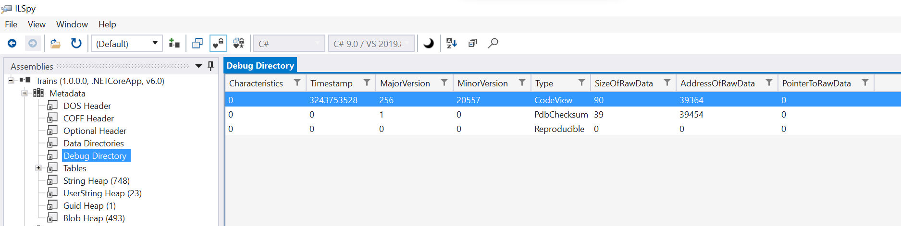
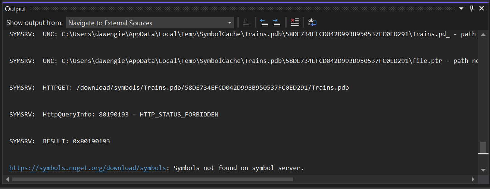
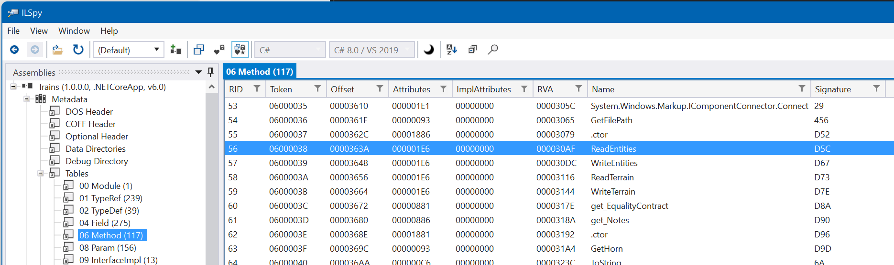
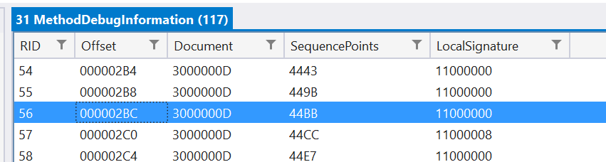
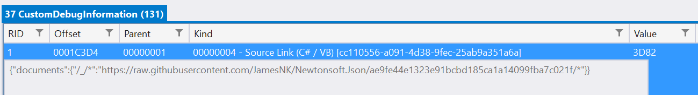
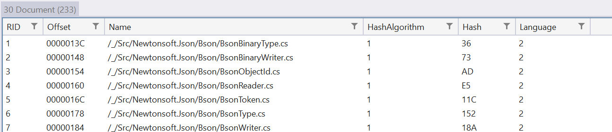

In Visual Studio 17.1 there are a number of enhancements to [Go To
Definition](https://docs.microsoft.com/visualstudio/ide/navigating-code?view=vs-2022#go-to-definition)
(and Go To Implementation, and Go To Base, etc.) allowing you to
navigate to source code that isn't in your current solution. In previous
versions of Visual Studio when invoking Go To Definition on a symbol
Roslyn would check if the symbol is defined in your current project or
any referenced projects, and if a reference was found we would navigate
you to that symbol. If a reference was not found we would use
[ILSpy](https://github.com/icsharpcode/ILSpy) to decompile part of the
referenced DLL and navigate you to the decompiled source of that symbol.

Decompilation is a great way to get a feel for the shape of an API that
you're referencing, but it does have some downsides, the biggest of
which is that a decompilation can only be created from the IL that is in
the referenced DLL. This means things like comments, variable names and
other parts of source code that aren't represented in IL simply can't be
seen. Sometimes even the code you do see is different, due to compiler
lowering. For example, when a simple interpolated string like
\$"{items.Count}" is compiled, the IL is indistinguishable from if you
had written string.Format("{0}", items.Count). These types of
differences don't change behavior, but they might be important to
understanding the code.

In the latest release we've added a few more steps to the process so
that where possible, we will now show you the real source code for the
symbol, matching exactly what the compiler used to create the DLL.

## Finding the PDB file

The first step to locating the real source of something is to find the
PDB file. PDB stands for "Program Database" and it is the file format
used to store extra information about a library to help with debugging
and other scenarios.

The easiest location to find the PDB file, and the first one that is
checked, is right next to the DLL on your disk. Whilst the contents of
the PDB file don't affect anything that happens at runtime, it's very
common for them to exist for debug builds, and not too uncommon for
release builds too.

The next easiest location for the PDB file is embedded within the DLL
itself. For the portable PDB format it is possible to specify
\<DebugType\>embedded\</DebugType\> in your csproj file and instead of
writing the PDB file to disk, the PDB file itself will be embedded in
the DLL. This has the advantage of easy distribution of debug
information, at the cost of a small increase in file size.

Fortunately, on disk and embedded PDBs are relatively easy to find using
the helpful
[TryOpenAssociatedPortablePdb](https://github.com/dotnet/runtime/blob/main/src/libraries/System.Reflection.Metadata/src/System/Reflection/PortableExecutable/PEReader.cs#L700)
method that is part of System.Reflection.Metadata.PEReader in .NET.

If that method fails however, then we have to work a little harder, and
try to find the PDB on a symbol server. A symbol server is a system that
stores and indexes PDBs for later download and use, normally by the
debugger. There are various ways to control a symbol server search and
these can be configured in the Tools \> Options \> Debugger \> Symbols
page in Visual Studio. By default, you should see entries for the
Microsoft Symbol Server and NuGet Symbol Server, but you might need to
enable them. You can also add symbol servers from an Azure DevOps
instance, or any other private symbol server that might be available to
you.

It is important that the right PDB is downloaded for the specific build
of the DLL that is being referenced, and so the search uses various
pieces of information that are pulled out of the DLL. This information
helps the debugger locate the right PDB on the symbol server and
validate that it is the one that matches the DLL.

So how does Roslyn find this information in order to tell the debugger?
For that we need to take a slight diversion into the world of Metadata.

## Metadata

A DLL is, to simplify, made up of two parts; firstly, the executable
code written in IL, and secondly the metadata, which is information
about that IL and the DLL in general, which is needed to help the
runtime understand the IL. The metadata stores, for example, the names
of every field and method in the DLL, which types they are part of, or
return, or take as parameters etc. You can think of the metadata as a
little database in the middle of a DLL, which has some tables in it
describing the code the DLL came from. We can see these tables in ILSpy
(pictured), or you can use an online tool like
[PeNet](https://penet.azureedge.net/) which shows things in a little
more of a "raw" format.

In the above screenshot you can see the Debug Directory table is
highlighted, and the row within that which has a Type of "CodeView".
This is where most of the information we need comes from. Using PeNet
and clicking the "Debug" button on the left will also show you the
CodeView entry itself, however, doesn't decode the Type column, so pick
the tool you prefer to use.

Another useful tool for viewing metadata is mdv which is a console
application you can build from source here:
<https://github.com/dotnet/metadata-tools>

Roslyn [iterates through the debug
directory](https://github.com/dotnet/roslyn/blob/release/dev17.1-vs-deps/src/VisualStudio/Core/Def/PdbSourceDocument/SourceLinkService.cs#L39),
gathering all of the information that the debugger needs from the
CodeView and PdbChecksum entries, passes it to the debugger, and it
works its magic. The debugger implements the symbol server protocol (see
<https://github.com/dotnet/symstore/tree/main/docs/specs>) to retrieve
the PDB from the symbol server. It also uses local caches configured in
debug configuration to speed up the look up next time it\'s asked for
the same PDB. You can see the output of the search either from the
Modules tool window when the debugger is active by right clicking on an
entry and selecting Show Symbol Load Information, or after using Go To
Definition you can find the "Navigate to External Sources" category in
the Output Window and some information will be shown there. Note that
Roslyn only logs in depth symbol search information if the search fails,
whereas the Modules window always has it available.

## Finding the source code

Now that we have the PDB file, we have access to a lot more information
about where this DLL came from, and we can go ahead and try to find the
original source code. As with PDB files themselves, the most
straightforward place the source code can be is either on the local
disk, or embedded, and so those are the two places checked first, and if
neither of those are fruitful then we use another API provided by the
debugger and try to download the source via [Source
Link](https://docs.microsoft.com/dotnet/standard/library-guidance/sourcelink).

Before we can use either of these methods to find the source code though
we need to know which source file we're looking for, and for that we
need to go back to the metadata tables, both from the DLL file but also
from the PDB this time, since we now have that information.

## Finding the Document record

When Roslyn tries to find source for a Go To Definition command it is
essentially saying "Find the source for this [ISymbol](https://github.com/dotnet/roslyn/blob/main/src/Compilers/Core/Portable/Symbols/ISymbol.cs#L24)".
A symbol is the representation of the thing that we're trying to go to,
be it a type, method, property, etc. Each symbol that comes from
metadata holds a
[MetadataToken](https://github.com/dotnet/roslyn/blob/main/src/Compilers/Core/Portable/Symbols/ISymbol.cs#L64)
which you can think of as the key to the database table in the metadata
that holds information about the symbol.

Let's say we're trying to navigate to the definition of a method called
"ReadEntities" which has a MetadataToken of 0x06000038. In order to
conserve space, like a lot of things in metadata, these tokens pack two
pieces of information into a single four byte number: The first byte,
06, means this token is for the Method table, and the remaining three
bytes, 000038, means it is for the 56^th^ row of that table (as 38 in
hexadecimal is 56 is decimal).

Looking in ILSpy we can see the information that is stored for this
method:

This screenshot also reveals another detail of metadata, which is that
it describes runtime concepts rather than language concepts. For
example, C# constructors are a language concept, but to the runtime they
are the same as methods, albeit methods that happen to be called .ctor.
Similarly, you can see get_Notes, which is the property getter for the
Notes property on a type, but again to the runtime it's just another
method.

Now that we have found the method row, we can continue to dig into the
metadata to find the Document row associated, which comes from the PDB
metadata. Exactly how we do this is straightforward, but detailed. You
can [read the
code](https://github.com/dotnet/roslyn/blob/release/dev17.1-vs-deps/src/Features/Core/Portable/PdbSourceDocument/SymbolSourceDocumentFinder.cs#L14)
if you're interested but the general idea is that, again in the
interests of space saving, we only store info for a particular document
once. In the past that meant only for methods that have bodies where
breakpoints can be placed, as there is a pre-existing concept in
portable PDBs to store that info which is already in use. For navigation
though we need a little more info, so we added the ability to store
[document
info](https://github.com/dotnet/roslyn/blob/main/src/Dependencies/CodeAnalysis.Debugging/PortableCustomDebugInfoKinds.cs#L24)
for types that would otherwise have no document info recorded, like
interfaces. What that means in practice is that if we can't find
document info for a method, or we're looking at a field etc. we check
the containing type, and if we can't find document info for a type, we
check for one of the methods it contains (and vice versa!)

For methods we look for the corresponding row in the
MethodDebugInformation table, which links to the Document table:

Unlike a normal relational database, there isn't a field to refer to the
Method that the row is talking about, the table just uses the same ID as
the Method table itself, so row 56 of the MethodDebugInformation is for
row 56 of the Method table. Here we can see a Document field, with the
value 0x3000000D. Once again this is a metadata token pointing to the
Document table (30) row 13 (00000D in decimal), and we have our result.

For types, the same theory is used except we use the
CustomDebugInformation table which is a more general purpose table, so
finding the record means looking up not only the ID it refers to, but
also a record type. It then similarly points to a row in the Document
table, and we have the info we need.

## Reading the Document record

The document record is where we finally find the information needed to
load the original source file, in one of three different formats.
Firstly, and again the simplest case, it could contain the full path to
the source file as it was when the DLL was originally compiled, and the
source code could be on disk at that location. This is probably not very
likely to be helpful, but maybe for very controlled enterprise
environments, or independent developers who reference their own
packages, it might be just enough.

Secondly the document record could contain a relative path to the source
file, with an associated CustomDebugInformation record that stores the
actual source for the file, compressed and embedded in the PDB itself.
In this case Roslyn will [read, decompress and write it to a temp
file](https://github.com/dotnet/roslyn/blob/release/dev17.1-vs-deps/src/Features/Core/Portable/PdbSourceDocument/PdbSourceDocumentLoaderService.cs#L61)
so that it can be navigated to. Enabling source embedding in a project
can be as easy as adding \<EmbedAllSources\>true\</EmbedAllSources\> to
a .csproj, again sacrificing file size for easy of distribution.

Finally, the Document record could contain a path and the
CustomDebugInformation could contain a Source Link map, in JSON format,
which tells the system how to map the path to a URL where it can
download the source file from a source control repository.

## Source Link

Source Link stores a mapping from a relative folder path to an absolute
repository URL. For the venerable NewtonSoft.Json library the Source
Link information can be seen below:

This maps any path starting with "/\_/" to the URL shown. Notice how the
URL contains a commit hash, which ensures that the right source will be
shown for the exact build being referenced. There are a number of Source
Link packages that can be referenced by libraries, with each one
understanding a different repository provider (eg, GitHub, Azure DevOps,
GitLab etc.).

The document info for a document from this PDB contains a normalized
path, where the common directory prefix has been replaced "/\_/" as per
the map above.

Once the relative file path and base URL are known downloading the file
is straight forward, though once again we rely on services provided by
the Visual Studio Debugger to do so. This ensures that any source code
downloaded for the purposes of navigation is automatically available for
debugging, so features like breakpoints etc. will work as you would
expect. This also means authentication and caching is centrally handled.

## Navigation

Now that we know where the symbol comes from, and we have a file on
disk, the navigation can happen. All of the downloading of symbols, and
source files, could take some time so for now there are various timeouts
in place to ensure you're not left hanging when you want to see some
source code. If you see the decompilation for something that you think
should have Source Link support, or you notice a timeout in the output
window, you can always try again later and the download might have
finished in the background!

Of course, all of the PDBs and source files have various checksums,
hashes and other checks to ensure that the source you're seeing is the
actual source that was used to compile the DLL, so there are other
reasons that could prevent this working, but they will be noted in the
output window. At the end of the day we are striving for accuracy so
even a decompilation is better than an incorrect copy of the original
source, even if it does have variable names and comments.

## Give us your feedback

This isn't the end of the improvements to this area, and we already have
ideas for more improvements like:

- [Supporting native PDBs, as well as portable](https://github.com/dotnet/roslyn/issues/55834)
- [Finding the implementation DLL for a reference DLL that doesn't have PDB info](https://github.com/dotnet/roslyn/issues/55834)
- [Being able to switch between Embedded, Source Link or decompiled source at will](https://github.com/dotnet/roslyn/issues/55834)
- [Better support for deep navigation for indirectly referenced DLLs](https://github.com/dotnet/roslyn/issues/55834)

We would love to get your feedback on the new Go To Definition behavior
so please give it a try and let us know what you think! You can share
your feedback with us by creating an issue on Roslyn's open source repo
on [GitHub](https://github.com/dotnet/roslyn). We appreciate your
feedback! Also be sure to let us know if you like this in-depth
technical type of blog post, or if you went cross-eyed halfway through.
