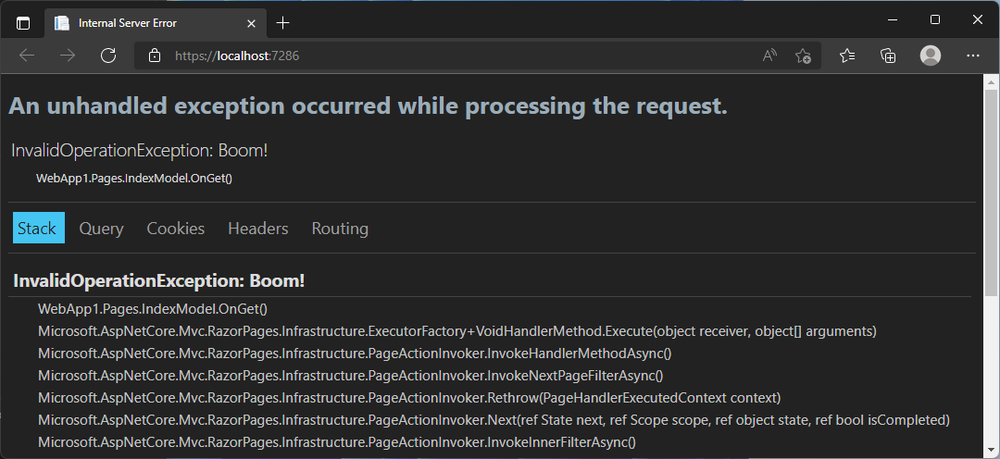

[.NET 7 Preview 3 is now available](https://devblogs.microsoft.com/dotnet/announcing-dotnet-7-preview-3) and includes many great new improvements to ASP.NET Core.

Here's a summary of what's new in this preview release:

- Support for route handler filters in minimal APIs
- Improved unit testability for minimal route handlers
- Bind using `TryParse` in MVC and API controllers
- New `Results.Stream()` overloads
- Improved HTTP/2 performance when using many streams on a connection
- New `ServerReady` EventSource event for measuring startup time
- Developer exception page dark mode

For more details on the ASP.NET Core work planned for .NET 7 see the full [ASP.NET Core roadmap for .NET 7](https://aka.ms/aspnet/roadmap) on GitHub.

## Get started

To get started with ASP.NET Core in .NET 7 Preview 3, [install the .NET 7 SDK](https://dotnet.microsoft.com/download/dotnet/7.0).

If you're on Windows using Visual Studio, we recommend installing the latest [Visual Studio 2022 preview](https://visualstudio.com/preview). Visual Studio for Mac support for .NET 7 previews isn't available yet but is coming soon.

To install the latest .NET WebAssembly build tools, run the following command from an elevated command prompt:

```console
dotnet workload install wasm-tools
```

> Note: Building .NET 6 Blazor projects with the .NET 7 SDK and the .NET 7 WebAssembly build tools is currently not supported. This will be addressed in a future .NET 7 update: [dotnet/runtime#65211](https://github.com/dotnet/runtime/issues/65211).

## Upgrade an existing project

To upgrade an existing ASP.NET Core app from .NET 7 Preview 2 to .NET 7 Preview 3:

- Update all Microsoft.AspNetCore.\* package references to `7.0.0-preview.3.*`.
- Update all Microsoft.Extensions.\* package references to `7.0.0-preview.3.*`.

See also the full list of [breaking changes](https://docs.microsoft.com/dotnet/core/compatibility/7.0#aspnet-core) in ASP.NET Core for .NET 7.

## Support for route handler filters in minimal APIs

In this preview, we introduce support for filters in route handlers in minimal applications. Filters are executed before the core route handler logic and can be used to inspect and modify handler parameters or intercept handler execution.

Filters can be registered onto a handler using a variety of strategies. For example, you can register a filter using a `RouteHandlerFilterDelegate` and the `AddFilter` extension method as follows:

```csharp
app.MapGet("/hello/{name}", (string name) => $"Hello, {name}!")
    .AddFilter((context, next) =>
    {
        var name = (string) context.Parameters[0];
        if (name == "Bob")
        {
            return Result.Problem("No Bob's allowed");
        }
        return next(context);
    });
```

Filters can also be registered via a filter factory strategy that gives access to a `RouteHandlerContext` which gives access to the `MethodInfo` associated with the handler and the metadata registered on the endpoint.

```csharp
app.MapGet("/hello/{name}", (string name) => $"Hello, {name}!")
    .AddFilter((routeHandlerContext, next) =>
    {
        var parameters = routeHandlerContext.GetParameters();
        var hasCorrectSignature = parameters.Length == 1 && parameters[0].GetType() == typeof(string);
        return (context) =>
        {
            if (hasCorrectSignature)
            {
                var name = (string) context.Parameters[0];
                if (name == "Bob")
                {
                    return Result.Problem("No Bob's allowed");
                }
            }
            return next(context);
        }
    });
```

Finally, filters can implement the `IRouteHandlerFilter` interface and be resolved from DI or an instance.

```csharp
app.MapGet("/hello/{name}", (string name) => $"Hello, {name}!")
    .AddFilter<MyFilter>();
``` 

## Improved unit testability for minimal route handlers

`IResult` implementation types are now publicly available in the namespace `Microsoft.AspNetCore.Http` with the suffix `HttpResult` (`OkObjectHttpResult`, `ProblemHttpResult`, etc.). With these types, you can now more easily unit test your minimal route handlers when using named methods instead of lambdas.

```csharp
[Fact]
public async Task GetTodoReturnsTodoFromDatabase()
{
    var todo = new Todo { Id = 42, Name = "Improve Results testability!" };
    var mockDb = new MockTodoDb(new[] { todo });

    var result = (OkObjectHttpResult)await TodoEndpoints.GetTodo(mockDb, todo.Id);

    //Assert
    Assert.Equal(200, result.StatusCode);

    var foundTodo = Assert.IsAssignableFrom<Models.Todo>(result.Value);
    Assert.Equal(id, foundTodo.Id);
}

[Fact]
public void CreateTodoWithValidationProblems()
{
    //Arrange
    var newTodo = default(Todo);
    var mockDb = new MockTodoDb();

    //Act
    var result = TodoEndpoints.CreateTodo(mockDb, newTodo);

    //Assert        
    var problemResult = Assert.IsAssignableFrom<ProblemHttpResult>(result);
    Assert.NotNull(problemResult.ProblemDetails);
    Assert.Equal(400, problemResult.StatusCode);
}
```

## Bind using `TryParse` in MVC and API Controllers

You can now bind controller action parameter values using a `TryParse` method that has one of the following signatures: 

```csharp
public static bool TryParse(string value, T out result);
public static bool TryParse(string value, IFormatProvider provider, T out result);
```

For example, the `Get` action in the following controller binds data from the query string using a `TryParse` method on the parameter type:

```csharp
public class TryParseController : ControllerBase
{
    // GET /tryparse?data=MyName
    [HttpGet]
    public ActionResult Get([FromQuery]CustomTryParseObject data) => Ok();

    public class CustomTryParseObject
    {
        public string? Name { get; set; }

        public static bool TryParse(string s, out CustomTryParseObject result)
        {
            if (s is null) 
            {
                result = default;
                return false;
            }

            result = new CustomTryParseObject { Name = s };
            return true;
        }
    }
}
```

## New `Results.Stream()` overloads

We introduced new `Results.Stream(...)` overloads to accommodate scenarios where you need access to the underlying HTTP response stream without buffering. These overloads also improve cases where your API wants to stream data to the HTTP response stream, like from Azure Blob Storage. The example below demonstrates using `Results.Stream()` when doing image manipulation with [ImageSharp](https://sixlabors.com/products/imagesharp).

```csharp
app.MapGet("/process-image", async (HttpContext http) =>
{
    using var image = await Image.LoadAsync("puppy.jpeg");
    int width = image.Width / 2;
    int height = image.Height / 2;
    image.Mutate(x => x.Resize(width, height));
    http.Response.Headers.CacheControl = $"public,max-age={FromHours(24).TotalSeconds}";
    return Results.Stream(stream => image.SaveAsync(stream, PngFormat.Instance), "image/png");
});
```

## Improved HTTP/2 performance when using many streams on a connection

We made a change in our HTTP/2 frame writing code that improves performance when there are multiple streams trying to write data on a single HTTP/2 connection. We now dispatch TLS work to the thread pool and more quickly release a write lock that other streams can acquire to write their data. The reduction in wait times can yield significant performance improvements in cases where there is contention for this write lock. A gRPC benchmark with 70 streams on a single connection (with TLS) showed a ~15% improvement in requests per second (RPS) with this change.

## New 'ServerReady' event for measuring startup time

If you use `EventSource` for metrics/diagnostics and want to measure the startup time of your ASP.NET Core app, you can now use the new `ServerReady` event in the `Microsoft.AspNetCore.Hosting` EventSource that represents the point where your server is up and running.

## Developer exception page dark mode

The ASP.NET Core developer exception page now supports dark mode:



Thank you [@poke](https://github.com/poke) for contributing this improvement!

## Give feedback

We hope you enjoy this preview release of ASP.NET Core in .NET 7. Let us know what you think about these new improvements by filing issues on [GitHub](https://github.com/dotnet/aspnetcore/issues/new).

Thanks for trying out ASP.NET Core!
