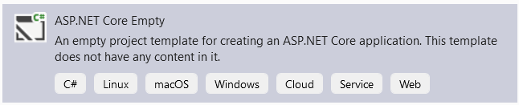
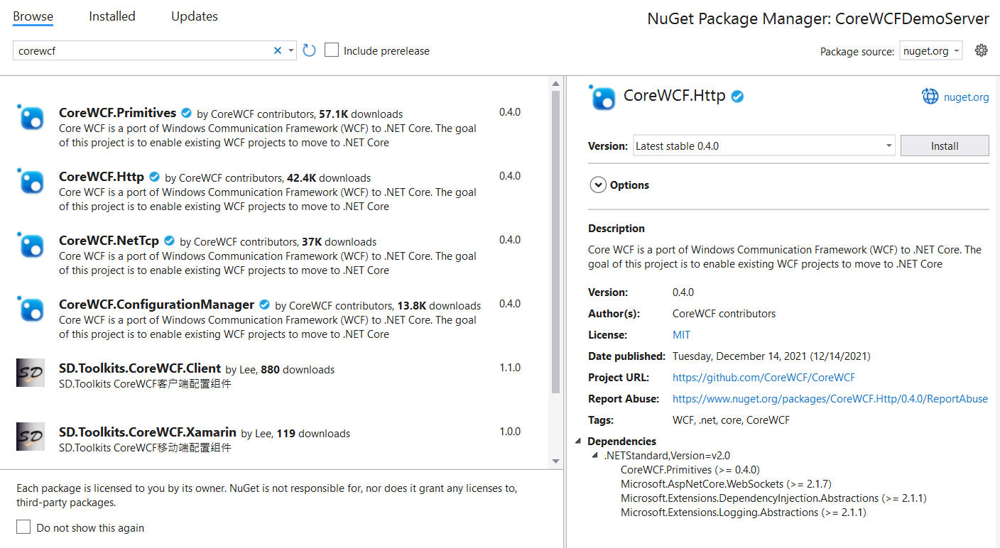
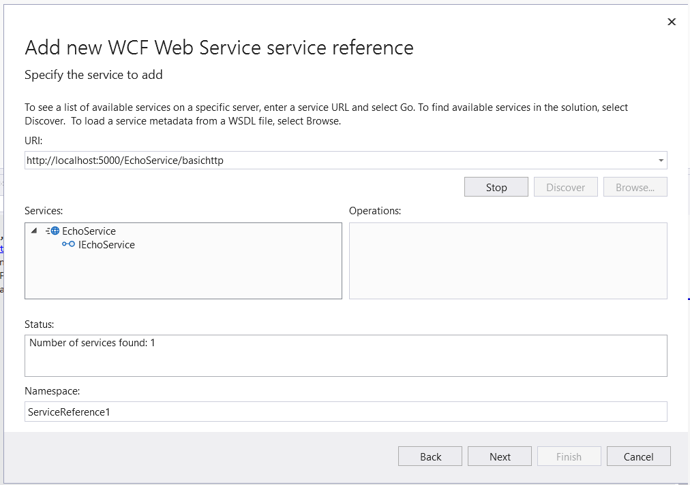

The Core WCF Project team have released the 1.0 version of Core WCF. This is the first major release of the project, and provides WCF functionality for .NET Core, .NET Framework and .NET 5+.

Core WCF is a port of WCF to the .NET core platform, providing a wire compatible implementation of SOAP, NetTCP and WSDL. Usage in code is similar to WCF, but updated to use ASP.NET Core as the service host, and to work with .NET Core.

The 1.0 release of CoreWCF is compatible with .NET Standard 2.0 so that it will work with:

- .NET Framework 4.6.2 (and above)
- .NET Core 3.1
- .NET 5 &amp; 6

The support for .NET Framework is to enable an easier modernization path to .Net Core. Applications with WCF dependencies can be updated to use CoreWCF in-place on .NET framework, which then will work the same when updated to use .NET Core.

The assemblies are available on [Nuget.org](https://www.nuget.org/profiles/corewcf), as described in the [Release Notes](https://github.com/CoreWCF/CoreWCF/releases/latest).

## Community Project

Core WCF was announced as a [community project](https://devblogs.microsoft.com/dotnet/supporting-the-community-with-wf-and-wcf-oss-projects/) in June of 2019, and has had many contributors during the last 3 years. As a community project, Core WCF has had more commits from other contributors than Microsoft employees, and regular contributions from AWS and other organizations.

A special thanks to [all those](https://github.com/CoreWCF/CoreWCF/graphs/contributors) who have contributed code, issues or suggestions. The community support has been critical to getting the project to this point, and we hope it will continue for subsequent versions. I'd be remiss if I didn't make a special callout to [@mconnew](https://github.com/mconnew) who has been the backbone of the project and contributed most of the code.

As a community project, it depends on the voices of the community to guide the direction of the project. For example, the [Feature Roadmap Vote issue](https://github.com/CoreWCF/CoreWCF/issues/234) is highly influential to the planning process for what to work on next. If you are a WCF user, please provide feedback on what you would like to see in subsequent releases.

## Features

Core WCF is a subset of the functionality from WCF, but represents what we believe are the most used features, including:

- Http &amp; NetTCP transports
- Bindings:
  - BasicHttpBinding
  - NetHttpBinding
  - NetTcpBinding - some WS-\* features not supported
  - WebHttpBinding
  - WSHttpBinding - some WS-\* features not supported
- Security:
  - Transport
    - NetTcpBinding supports Certificate and Windows authentication
    - Http bindings require authentication to be configured in ASP.NET Core
  - Transport With Message Credentials
    - Username, Certificate and Windows Authentication are supported
  - WS Federation
- WSDL generation
- Partial configuration support including services &amp; endpoints
- Extensibility (IServiceBehavior and IEndpointBehavior) - most extensibility is available

Major WCF features not yet implemented include:

- Transports other than Http and NetTCP.
- Message security beyond Transport &amp; Transport with Message Credentials
- Distributed transactions
- Message Queueing

## Who should use Core WCF?

Core WCF is intended for customers who have been using WCF on .NET Framework and need WCF support in .NET Core to facilitate modernizing the application. While there is nothing stopping you from adopting Core WCF in greenfield projects, there are more modern alternatives to SOAP such as gRPC that we would recommend you consider instead. The sweet spot for Core WCF is to make it easier to modernize server and clients that have a strong dependency on WCF and SOAP.

## Microsoft Support

We recognize how important support is to enterprise customers, and so we are pleased to announce that Microsoft Product Support will be available for Core WCF customers.

Support for Core WCF 1.x will be governed by support status for the underlying .NET platforms it runs on.

| **Runtime Version** | **Support dependency duration** |
| --- | --- |
| .NET Framework 4.x | The specific version of [.NET Framework](https://dotnet.microsoft.com/platform/support/policy/dotnet-framework), and [ASP.NET Core 2.1.](https://dotnet.microsoft.com/platform/support/policy/aspnet) |
| .NET Core 3.1 | .NET 3.1 LTS - December 3, 2022 |
| .NET 5 | .NET 5 - May 8, 2022 |
| .NET 6 | .NET 6 LTS - November 8, 2024 |

Core WCF will use Major.Minor versioning strategy:

- 1.0 will be the first major release of CoreWCF
- Minor releases will be numbered 1.x, and will have the same underlying platform requirements as 1.0.
- Minor version releases (1.x) will be API compatible with the 1.0 release.
- Support will be primarily for the latest major.minor release of each supported major version.
  - When new major or minor versions are released, then the previous release will be supported for 6 months from the date of the new release, provided the underlying runtime dependency being used is still within support.
- Subsequent major versions, such as 2.0, may reduce the map of runtimes that are supported. In that case 1.x will continue to be supported beyond the 6 months on the runtimes that are not supported by 2.0, and support duration will be limited only by the underlying platform.
  - This will most likely apply to .NET Framework, and means that 1.x will be supported as long as both ASP.NET Core 2.1 and .NET Framework 4.x are under support.

### Other Support

Other organizations/companies may choose to provide support for Core WCF in conjunction with the use of their products and services.

## Getting started

The definition of data and service contracts is the same as WCF. The major difference is in the definition of the host which is now based on ASP.NET Core. The following is based on .NET 6, but the same steps apply to other versions of .NET.

1. Create an ASP.NET Core Empty application, this provides the host for the service.

*Visual Studio:*
 

*Command Line:*

```cli
mkdir CoreWCFDemoServer
dotnet new web -n CoreWCFDemoServer -o CoreWCFDemoServer
```

1. Add references to the CoreWCF Nuget Packages

*Visual Studio:*

Using the package Manager console, add: 

- Primitives
- Http



*Command Line:*
Edit the project file and add:
```xml
<ItemGroup>
  <PackageReference Include="CoreWCF.Http" Version="1.0.0" />
  <PackageReference Include="CoreWCF.Primitives" Version="1.0.0" />
</ItemGroup>
```
1. Create the Service Contract and Data Contract definitions

These are defined the same as with WCF.

**File: IEchoService.cs**
```C#
using System.Diagnostics.CodeAnalysis;
using System.Runtime.Serialization;
using CoreWCF;

namespace CoreWCfDemoServer
{
    [DataContract]
    public class EchoFault
    {
        [AllowNull]
        private string _text;

        [DataMember]
        [AllowNull]
        public string Text
        {
            get { return _text; }
            set { _text = value; }
        }
    }

    [ServiceContract]
    public interface IEchoService
    {
        [OperationContract]
        string Echo(string text);

        [OperationContract]
        string ComplexEcho(EchoMessage text);

        [OperationContract]
        [FaultContract(typeof(EchoFault))]
        string FailEcho(string text);

    }

    [DataContract]
    public class EchoMessage
    {
        [AllowNull]
        [DataMember]
        public string Text { get; set; }
    }
}

```

**File: EchoService.cs**
```c#
using CoreWCF;

namespace CoreWCfDemoServer
{
    public class EchoService : IEchoService
    {
        public string Echo(string text)
        {
            System.Console.WriteLine($"Received {text} from client!");
            return text;
        }

        public string ComplexEcho(EchoMessage text)
        {
            System.Console.WriteLine($"Received {text.Text} from client!");
            return text.Text;
        }

        public string FailEcho(string text)
            => throw new FaultException<EchoFault>(new EchoFault() { Text = "WCF Fault OK" }, new FaultReason("FailReason"));

    }
}
```

1. Update Program.cs to expose the Bindings:
```c#
using CoreWCF;
using CoreWCF.Configuration;
using CoreWCF.Description;
using CoreWCfDemoServer;

var builder = WebApplication.CreateBuilder(args);
builder.WebHost.ConfigureKestrel((context, options) =>
{
    options.AllowSynchronousIO = true;
});

// Add WSDL support
builder.Services.AddServiceModelServices().AddServiceModelMetadata();
builder.Services.AddSingleton<IServiceBehavior, UseRequestHeadersForMetadataAddressBehavior>();

var app = builder.Build();
app.UseServiceModel(builder =>
{
    builder.AddService<EchoService>((serviceOptions) => { })
    // Add a BasicHttpBinding
    .AddServiceEndpoint<EchoService, IEchoService>(new BasicHttpBinding(), "/EchoService/basichttp")
    // Add a WSHttpBinding with Transport Security for TLS
    .AddServiceEndpoint<EchoService, IEchoService>(new WSHttpBinding(SecurityMode.Transport), "/EchoService/WSHttps");
});

var serviceMetadataBehavior = app.Services.GetRequiredService<CoreWCF.Description.ServiceMetadataBehavior>();
serviceMetadataBehavior.HttpGetEnabled = true;

app.Run();
```

1. Update the appsettings.json to specify fixed ports for the service to listen on

Add the following line before the "Logging" line in appsettings.json:

```
"Urls": "http://localhost:5000;https://localhost:5001",
```

1. Run the project so that the services can be called.

To consume the service.

1. Create a console application
2. Add a Service Reference

*Visual Studio*

Use the "Add Service Reference" command, and select "WCF Web Service" as the service type.



Use "[http://localhost:5000/EchoService/basichttp](http://localhost:5000/EchoService/basichttp)" as the URL for WSDL discovery.

*Command line*

From the Command Line, the same code can be generated using svcutil:
```cli
dotnet tool install --global dotnet-svcutil
dotnet-svcutil --roll-forward LatestMajor http://localhost:5000/EchoService/basichttp?wsdl
```

1. Replace the code of the console app with:
```C#
using ServiceReference1;

var client = new EchoServiceClient(EchoServiceClient.EndpointConfiguration.WSHttpBinding_IEchoService, "https://localhost:5001/EchoService/WSHttps");

var simpleResult = await client.EchoAsync("Hello");
Console.WriteLine(simpleResult);

var msg = new EchoMessage() { Text = "Hello2" };
var msgResult = await client.ComplexEchoAsync(msg);
Console.WriteLine(msgResult);
```
The above example uses the WSHttpBinding, and explicitly sets the URL, although it will use the URL from service discovery if none is specified.

### Other Samples

Other samples, including samples for desktop framework are available at [CoreWCF/src/Samples](https://github.com/CoreWCF/CoreWCF/tree/main/src/Samples)

## Summary

We are pleased to see the community investment in the Core WCF project, and congratulate them on this release. The project is ongoing and they welcome your feedback via [issues](https://github.com/CoreWCF/CoreWCF/issues) and [discussions](https://github.com/CoreWCF/CoreWCF/discussions) in GitHub, in particular which features you think should be worked on [next](https://github.com/CoreWCF/CoreWCF/issues/234).
