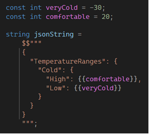

Features for C# 11 are coming along nicely! You can check these features out by downloading [Visual Studio 17.2 Preview 3]( https://visualstudio.microsoft.com/vs/preview) or [.NET 7 Preview 3]( https://dotnet.microsoft.com/download/dotnet/7.0) for other editors. You can find more about C# 11 features that appeared earlier in [What's new in C# 11](https://docs.microsoft.com/dotnet/csharp/whats-new/csharp-11) and [Early peek at C# 11 features](https://devblogs.microsoft.com/dotnet/early-peek-at-csharp-11-features) and you can follow the progress of C# 11 on the [Feature Status page]( https://github.com/dotnet/roslyn/blob/main/docs/Language%20Feature%20Status.md). You can find out about  other [.NET 7 Preview 3 features in this .NET Blog post]( https://devblogs.microsoft.com/dotnet/announcing-dotnet-7-preview-3) and more about [Visual Studio 17.2 in the release notes]( https://docs.microsoft.com/visualstudio/releases/2022/release-notes-preview).

We evolve C# to improve your development productivity, the resiliency of your applications in production, performance and support for new features. The C# team works on both the performance of your application in production, and how the compiler performance affects your development. Features in this post include:

* [Raw string literals](#raw-string-literal) to make you more productive and improve readability by avoiding  escaping content inside strings.
* [UTF-8 String Literals](#utf--8-string-literals) to make it easier and less error prone to create UTF-8 strings for better productivity, resiliency and performance.
* [Checked user-defined operators](#checked-user-defined-operators) to allow user defined operators to respect the current arithmetic overflow check status for better resiliency.
* [Auto-default structs](#auto-default-structs) to initialize struct values for better productivity.
* [Pattern matching with spans](#pattern-matching-with-spans) adds to the set of patterns for better productivity.
* [Use a cached delegate for method group conversion](#use-a-cached-delegate-for-method-group-conversion) for better performance.

This post also explains why we [removed parameter null-checking from C# 11](#remove-parameter-null-checking-from-c-11) and are adding a [warning for lowercase type names](#warning-wave-warnings-on-lowercase-type-names).

## [Raw string literals]( https://github.com/dotnet/csharplang/issues/4304)

If you work with strings literal that contain quotes or embedded language strings like JSON, XML, HTML, SQL, Regex and others, _raw literal strings_ may be your favorite feature of C# 11. Previously if you copied a literal string with quotes into a C# literal, the string ended at the first double quote with compiler errors until you escaped each one. Similarly, if you copied text with curly braces into an interpolated string literal, each curly bracket was interpreted as the beginning of a nested code expression unless you escape it, generally by doubling the curly bracket. 

Raw string literals have no escaping. For example, a backslash is output as a backslash, and `\t` is output as the backslash and a `t`, not as the tab character.

Raw string literals start and end with at least three double quotes (`"""..."""`). Within these double quotes, single `"` are considered content and included in the string. Any number of double quotes less than the number that opened the raw string literal are treated as content. So, in the common case of three double quotes opening the raw string literals, two double quotes appearing together would just be content. If you need to output a sequence of three or more double quotes, just open and close the raw string literal with at least one more quote than that sequence. 

Raw string literals can be interpolated by preceding them with a `$`. The number of `$` that prefixes the string is the number of curly brackets that are required to indicate a nested code expression. This means that a `$` behaves like the existing string interpolation – a single set of curly brackets indicate nested code. If a raw string literal is prefixed with `$$`, a single curly bracket is treated as content and it takes two curly brackets to indicate nested code. Just like with quotes, you can add more `$` to allow more curly brackets to be treated as content. For example:



Raw string literals also have new behavior around automatically determining indentation of the content based on leading whitespace.  To learn more about this and to see more examples on this feature,  check out the [docs article Raw String Literals](https://docs.microsoft.com/dotnet/csharp/whats-new/csharp-11#raw-string-literals). 

This feature will make it much easier to work with literals that contain certain characters. You can now copy code into or from a literal string without being hindered by adding or removing escape sequences. 

## [UTF-8 String Literals](https://github.com/dotnet/csharplang/blob/main/proposals/utf8-string-literals.md)

UTF-8 is used in many scenarios, particularly in web scenarios. Prior to C# 11, programmers had to either translate UTF-8 into hexadecimal – which led to verbose, unreadable, error prone code – or encode string literals at runtime. 

C# 11 allows converting string literals containing only UTF-8 characters to their byte representation. This is done at compile-time, so the bytes are ready to use without additional runtime cost. So you can write code like:

```c#
byte[] array = "hello";             // new byte[] { 0x68, 0x65, 0x6c, 0x6c, 0x6f }
Span<byte> span = "dog";            // new byte[] { 0x64, 0x6f, 0x67 }
ReadOnlySpan<byte> span = "cat";    // new byte[] { 0x63, 0x61, 0x74 }
```

There are ongoing discussions about details such as whether a type suffix is required and what natural type that would imply. If you expect to use UTF-8 string literals, we would really like your feedback and you can see the [UTF-8 String Literal proposal]( https://github.com/dotnet/csharplang/blob/main/proposals/utf8-string-literals.md) and the links contained in it for more information.

This feature brings a welcome simplification to everyone currently building byte arrays to represent UTF-8. If you are doing this, you will probably want to convert your code to use it after C# 11 releases. If you are not using UTF-8 string literals you can ignore this feature. For ASP.NET users, your response is encoding to UTF-8 from strings automatically, so you can ignore this feature.

## [Checked user-defined operators]( https://github.com/dotnet/csharplang/blob/main/proposals/checked-user-defined-operators.md)

One of the major motivations for the [static abstract members in interfaces]( https://docs.microsoft.com/dotnet/csharp/whats-new/tutorials/static-abstract-interface-methods) feature of  C# 11 is the ability to support generic math. .NET developers can write algorithms that rely on interfaces that include static abstract members as the generic constraint. One such interface is `INumber<TSelf>` which provides access to APIs such as `Max`, `Min`, `Parse`, and even operators such as `+`, `-`, `*`, and `/`, as well as user defined conversions.

User-defined operators respect the arithmetic overflow and underflow checking context of the calling code, controlled via the `<CheckForOverflowUnderflow>` project property or the `checked`/`unchecked` regions and operators. Check out the language reference for about [checked and unchecked behavior for arithmetic operators]( https://docs.microsoft.com/dotnet/csharp/language-reference/keywords/checked-and-unchecked). Prior to C# 11, a user-defined operator was unaware of the context in which it was used. 

C# 11 adds the ability to declare certain operators as checked,  identified with the `checked` modifier. Operators that do not have this modifier will be unchecked when paired with a checked operator. The compiler will select the right operator to use based on the context of the calling code. The operators that can support checked versions are the `++`, `--` and `-` unary operators and the `+`, `-`, `*`, and `/` binary operators.

The distinction between checked and unchecked is the context in which they are used. There is no requirement that checked operators _throw_ if the bounds of the type are exceeded or that unchecked operators _not throw_, but this is the behavior users expect. For example, for integer types MAX_VALUE+1 is MIN_VALUE in the unchecked context and throws an exception in the checked context. Some types, such as floating point numbers, do not overflow and therefore do not need separate checked and unchecked operators.

This feature is important to developers creating user-defined operators that operate on types where arithmetic overflow is a valid concept. It will allow new user-defined operators to respect the context in which the operator is used. We anticipate that only a small number of developers will use this feature directly, but the impact of their implementations will make the entire ecosystem more reliable and predictable. 

## [Auto-default structs](https://github.com/dotnet/csharplang/issues/5737)

In C# 10 and earlier, you needed to initialize all fields of a struct by initializing fields and auto-properties or setting them in the constructors. This can be awkward, particularly with the expected introduction of the `field` keyword and semi-auto properties in a later C# 11 preview. If you did not set these values, you received a compiler error. If we have sufficient information to provide the error, perhaps we should just set these values to `default` for you!

Starting with this preview, the compiler does exactly that. It initializes any fields and auto-properties that are not set based on definite assignment rules, and assigns the default value to them. If you do not want this behavior, there is a warning you can turn on. 

This feature simplifies initialization for anyone using structs that include explicit constructors. This is likely to feel like the way structs with initializers always should have worked, and so you may take advantage of this feature without even thinking about it. If you are explicitly initializing fields to their default value in response to the previous compiler errors, you can remove that code.

## [Pattern matching with spans]( https://github.com/dotnet/csharplang/issues/1881)

Starting with this preview, you can pattern match a `Span<char>` or a `ReadonlySpan<char>` with a string literal. This code now works:

```c#
static bool IsABC(Span<char> s)
{
    return s switch { 
        "ABC" => true, 
        _ => false };
}
```

The input type must be statically known to be a `Span<char>` or a `ReadonlySpan<char>`. Also, the compiler reports an error if you match a `Span<char>` or a `ReadonlySpan<char>` to a `null` constant.

This feature will allow `Span<char>` or `ReadonlySpan<char>` to participate as patterns in switch statements and switch expressions for matching string literals. If you are not using `Span<char>` and `ReadonlySpan<char>` you can ignore this feature.

Special thanks to [YairHalberstadt](https://github.com/YairHalberstadt) for implementing this feature.

## [Use a cached delegate for method group conversion](https://github.com/dotnet/roslyn/issues/5835)

This feature will improve runtime performance by caching static method groups, rather than creating fresh delegate instances. This is to improve your application’s performance, particularly for ASP.NET. You will get the benefit of this feature with no effort on your part.

Special thanks to [pawchen](https://github.com/pawchen) for implementing this feature

## [Remove parameter null-checking from C# 11](https://github.com/dotnet/csharplang/blob/main/meetings/2022/LDM-2022-04-13.md)

We previewed [parameter null-checking](https://devblogs.microsoft.com/dotnet/early-peek-at-csharp-11-features/#c-11-preview-parameter-null-checking) as early as possible because we anticipated feedback. This feature allows `!!` on the end of a parameter name to provide parameter null checking before the method begins execution. We included this feature early in C# 11 to maximize feedback, which we gathered from GitHub comments, MVPs, social media, a conference audience, individual conversations with users, and the C# design team’s ongoing reflection. We received a wide range of feedback on this feature, and we appreciate all of it.

The feedback and the wide range of insight we gained from this feedback led us to reconsider this as a C# 11 feature. We do not have sufficient confidence that this is the right feature design for C# and are removing it from C# 11. We may return to this area again at a later date.

While there are several valid ways you can do null check on a single line, if you are using .NET 6 we recommend using `ArgumentNullException.ThrowIfNull` method:

```c#
public static void M(string myString)
{
    ArgumentNullException.ThrowIfNull(myString);
    // method 
}
```

One of the benefits of using the `ThrowIfNull` method is it uses CallerArgumentExpression to include the parameter name in the exception message automatically:

```cs
System.ArgumentNullException: 'Value cannot be null. (Parameter 'myString')'
```

## Warning wave: Warnings on lowercase type names

C# 11 introduces a Warning Wave 7 that includes a warning for any type that is declared with all lowercase ASCII characters. This has been a common stylistic rule in the C# ecosystem for years. We are making it a warning because C# needs to occasionally introduce new keywords in order to evolve. These keywords will be lowercase and may conflict with your type’s name, if it is lowercase.  We introduced this warning so you can avoid a possible future breaking change.

You can find out more about this change at [Warning on lowercase type names in C# 11](https://blog.paranoidcoding.com/2022/04/11/lowercase-type-names.html). [Warning waves](https://docs.microsoft.com/dotnet/csharp/language-reference/compiler-options/errors-warnings#warninglevel) allow new warnings in C# in a manner that allows you to delay adoption if the warning causes issues you cannot currently resolve.

This warning is expected to affect very few people. But if you encounter it, we recommend updating your type name, or prefixing usages of it with `@`, such as `@lower`.

## Closing

Please download [Visual Studio 17.2 Preview 3]( https://visualstudio.microsoft.com/vs/preview) or [.NET 7 Preview 3]( https://dotnet.microsoft.com/download/dotnet/7.0),  try out the new features, and tell us what you think in the Discussions section of the [CSharpLang repo](https://github.com/dotnet/csharplang).
