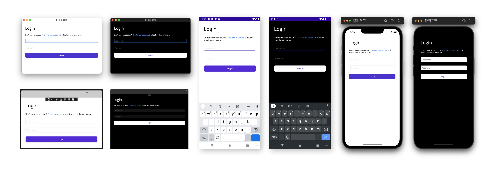
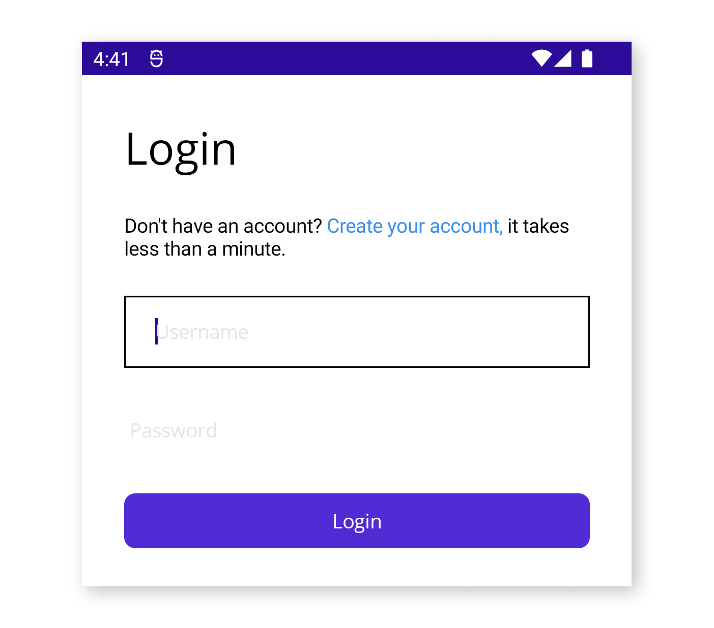

Today we are excited to announce the availability of .NET Multi-platform App UI (.NET MAUI) Release Candidate. The SDK is now API complete, ready for libraries to update and make ready for GA (general availability) compatibility. As with other .NET release candidates, this release is covered by a "go live" support policy, meaning .NET MAUI is supported by Microsoft for your production apps.

## Get Started Today

To acquire .NET MAUI RC1, [install or update Visual Studio 2022 Preview](https://aka.ms/vs2022preview) to version 17.2 Preview 3. In the installer confirm .NET MAUI (preview) is checked under the "Mobile Development with .NET workload".

To use .NET MAUI RC1 on Mac, follow the [command line instructions](https://github.com/dotnet/maui/wiki/macOS-Install) on the wiki. Support for .NET MAUI in Visual Studio 2022 for Mac will ship formally in a future preview.

Release Candidate [release notes are on GitHub](https://github.com/dotnet/maui/releases/tag/6.0.300-rc.1). For additional information about getting started with .NET MAUI, refer to our [documentation](https://docs.microsoft.com/dotnet/maui/get-started/installation), and the [migration tip sheet](https://github.com/dotnet/maui/wiki/Migration-to-Release-Candidate) for a list of changes to adopt when upgrading projects.

> **What about Xamarin support?** The [Xamarin Support Policy](https://dotnet.microsoft.com/platform/support/policy/xamarin) is still in effect which covers those products for 2 years after initial release. The last release was November of 2021, and so support will continue through November 2023.

## What's in the .NET MAUI release candidate?

As a multi-platform app building framework, .NET MAUI leverages platform SDKs for Android, iOS, macOS, and Windows. These foundational pieces are included in this release, and you can use them directly with C# in addition to maximizing your code sharing and productivity with .NET MAUI.



.NET MAUI ships with [40+ layouts and controls](https://docs.microsoft.com/dotnet/maui/user-interface/controls/) optimized for building adaptive UIs across both desktop and mobile platforms. You can also incorporate Blazor components or entire Blazor applications to distribute the same experiences on desktop and mobile as you may today on web.

> **How does this compare to Xamarin.Forms?** You get every UI control that ships with Xamarin.Forms, plus new controls such as BlazorWebView, Border, GraphicsView, MenuBar, Shadow, and Window.

|       |   |  | |
|--------------|-----------|------------|-----|
| **Layouts**      | CarouselView  | Line       | Stepper |
| AbsoluteLayout | Checkbox      | ListView        | SwipeView |
| BindableLayout      | CollectionView  | Path       | Switch |
| FlexLayout      | ContentView  | Picker       | TableView |
| GridLayout      | DatePicker  | Polygon       | TimePicker |
| HorizontalStackLayout      | Editor   | Polyline       | WebView |
| StackLayout      | Ellipse  | ProgressBar       | **Pages** |
| VerticalStackLayout      | Entry  | RadioButton       | ContentPage |
| **Views**      | Frame  | Rectangle       | FlyoutPage |
| ActivityIndicator      | GraphicsView  | RefreshView       | NavigationPage |
| BlazorWebView      | Image  | RoundRectangle       | TabbedPage |
| Border      | ImageButton  | ScrollView       | Shell | |
| BoxView      | IndicatorView  | SearchBar       | |
| Button      | Label  | Slider       | |

These are all [documented](https://docs.microsoft.com/dotnet/maui/user-interface/controls/) in addition to related topics such as:

* [Animation](https://docs.microsoft.com/dotnet/maui/user-interface/animation/basic)
* [Brushes](https://docs.microsoft.com/dotnet/maui/user-interface/brushes/) for solid and gradient colors
* [Displaying Pop-ups](https://docs.microsoft.com/dotnet/maui/user-interface/pop-ups)
* [Graphics](https://docs.microsoft.com/dotnet/maui/user-interface/graphics/) for making the most of `Microsoft.Maui.Graphics` with blend modes, colors, canvas drawing, images, transforms, winding modes, and more
* [Shadows](https://docs.microsoft.com/dotnet/maui/user-interface/shadow)
* Styling with [XAML](https://docs.microsoft.com/dotnet/maui/user-interface/styles/xaml) and [CSS](https://docs.microsoft.com/dotnet/maui/user-interface/styles/css)
* [Theming](https://docs.microsoft.com/dotnet/maui/user-interface/theming) for light and dark modes
* [Visual States](https://docs.microsoft.com/dotnet/maui/user-interface/visual-states)

The new .NET MAUI project template now includes a default stylesheet in "Resources\styles.xaml" with a color palette and styling for all the controls. Take for example the `Entry`. When starting a new application these text inputs will now begin with a shared theme while still being true to the platform on which it runs.

```xaml
<Style TargetType="Entry">
    <Setter Property="TextColor" Value="{AppThemeBinding Light={StaticResource Black}, Dark={StaticResource White}}" />
    <Setter Property="FontFamily" Value="OpenSansRegular"/>
    <Setter Property="FontSize" Value="14" />
    <Setter Property="PlaceholderColor" Value="{AppThemeBinding Light={StaticResource LightGray}, Dark={StaticResource DarkGray}}" />
    <Setter Property="VisualStateManager.VisualStateGroups">
        <VisualStateGroupList>
            <VisualStateGroup x:Name="CommonStates">
                <VisualState x:Name="Normal">
                    <VisualState.Setters>
                        <Setter Property="TextColor" Value="{AppThemeBinding Light={StaticResource Black}, Dark={StaticResource White}}" />
                    </VisualState.Setters>
                </VisualState>
                <VisualState x:Name="Disabled">
                    <VisualState.Setters>
                        <Setter Property="TextColor" Value="{AppThemeBinding Light={StaticResource LightGray}, Dark={StaticResource DarkGray}}" />
                    </VisualState.Setters>
                </VisualState>
            </VisualStateGroup>
        </VisualStateGroupList>
    </Setter>
</Style>
```

For views that support different states we've created a sensible default, and provided light and dark mode color options. For more information check out:

* [Styles](https://docs.microsoft.com/dotnet/maui/user-interface/styles/xaml)
* [Theming](https://docs.microsoft.com/dotnet/maui/user-interface/theming)
* [Visual states](https://docs.microsoft.com/dotnet/maui/user-interface/visual-states)

### Customizing Controls

One of the things .NET MAUI does to improve upon the Xamarin.Forms architecture is adding low-code hooks to modify just about anything. Let's consider the canonical example of removing the distinctive Android underline on an `Entry` field. How might you go about doing this when there is no multi-platform style for "underline" because it only exists on Android?

```csharp
#if ANDROID
Microsoft.Maui.Handlers.EntryHandler.Mapper.ModifyMapping("NoUnderline", (h, v) =>
{
    h.PlatformView.BackgroundTintList = ColorStateList.ValueOf(Colors.Transparent.ToPlatform());
});
#endif
```

That's all the code there is. This code just needs to run somewhere in the start of your application before the handler is called. 

Let's explain what is going on here. Firstly, the `#if ANDROID` is a conditional compilation directive that indicates this code should only run for Android. In other cases where you are modifying the control for ALL platforms, this isn't necessary.

Next, we need need access to the control. The `Entry` you use is a .NET MAUI control. Each property, command, event, etc. of the `Entry` is "mapped" by a "handler" to a platform implementation. To modify a mapping you can tap into it via the handler's map such as `Microsoft.Maui.Handlers.EntryHandler.Mapper`. From the mapper we have 3 methods:

* `PrependToMapping` which runs before the .NET MAUI code
* `ModifyMapping` which runs instead of the .NET MAUI code
* `AppendToMapping` which runs after the .NET MAUI code

For this case it doesn't matter which one we use, as it will be called at least once, and no other implementation on the `Entry` will touch the native properties we need to modify. Here the coded uses `ModifyMapping` and adds an entry called "NoUnderline". Typically the property matches the name of an actual property, however in this case we are introducing a new one.

The `h` in the action is the handler which gives us access to the `PlatformView` which in this case is of Android type `TextView`. At this point the code is working directly with the Android SDK.

With the underline now out of the way, you can implement your own design of, say, a bordering box like old-school Windows Phone.



```xaml
<Border Stroke="{StaticResource Black}"
        StrokeThickness="2"
        StrokeShape="Rectangle">
    <Entry
        Margin="20,4"
        Placeholder="Username" />
</Border>
```

For more examples on how you can easily modify the look and feel of controls at the cross-platform as well as platform specific layers, check out the [documentation for customizing controls](https://docs.microsoft.com/dotnet/maui/user-interface/handlers/customize).

## We need your feedback

Install the latest preview of Visual Studio 2022 for Windows (17.2 Preview 3) following our [simple guide](https://docs.microsoft.com/dotnet/maui/get-started/first-app?pivots=devices-android) and build your first multi-platform application today. 


We'd love to hear from you! As you encounter any issues, file a [report on GitHub at dotnet/maui](https://github.com/dotnet/maui/issues/new/choose).