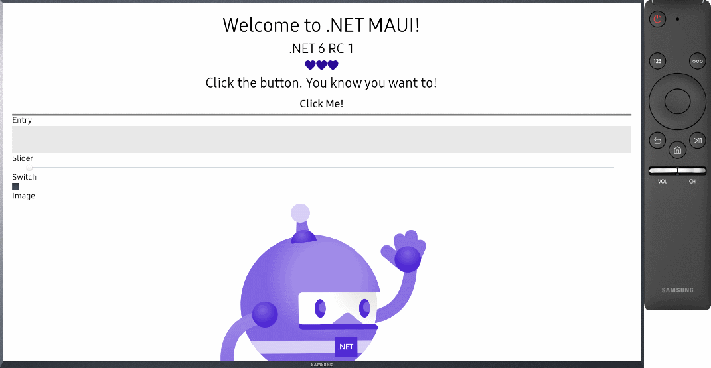
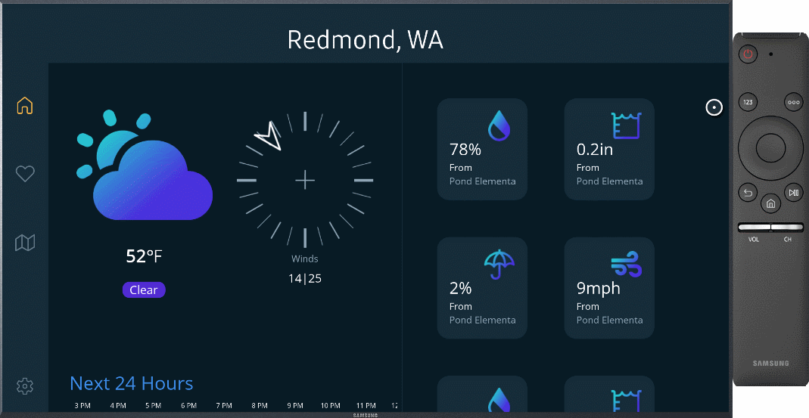
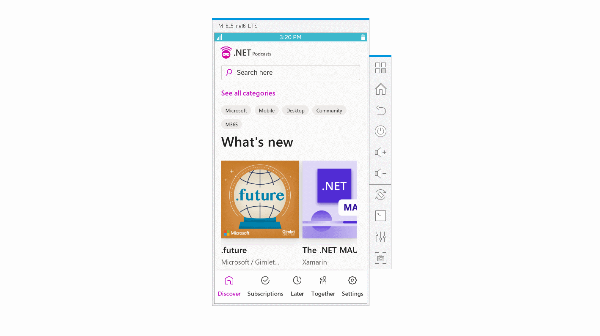
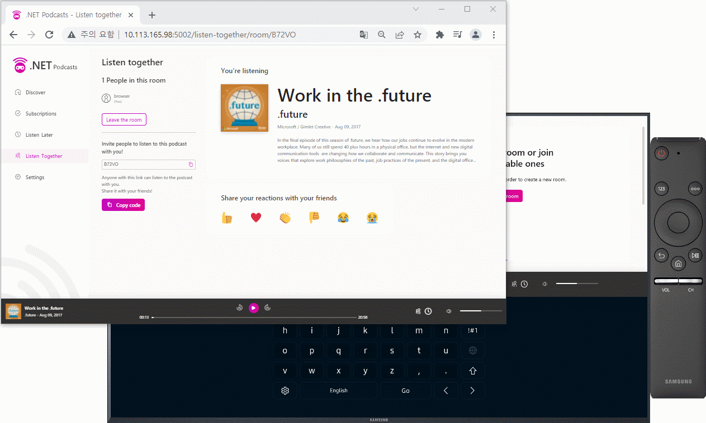
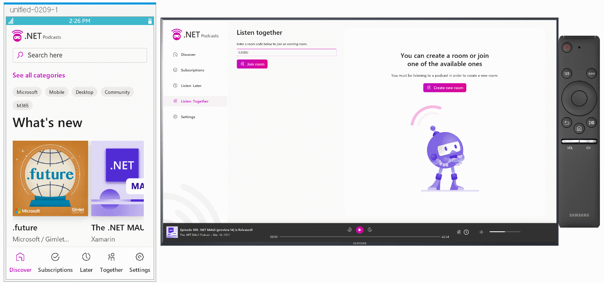
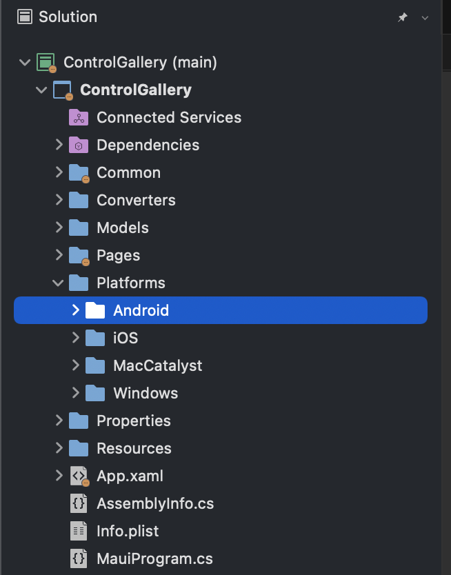
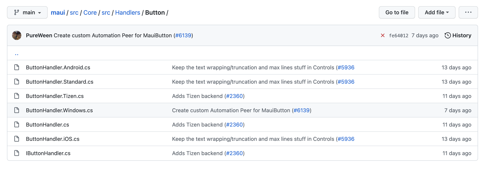

We are excited to release .NET Multi-platform App UI (.NET MAUI) Release Candidate 2. This release is covered by a "go-live" support policy, meaning .NET MAUI is supported by Microsoft for your production apps. The team has been focused on stabilizing the toolkit, resolving the high impact issues you have been helping us to identify through your valuable feedback. Thank you!

## Get Started Today

To acquire .NET MAUI RC2 on Windows, [install or update Visual Studio 2022 Preview](https://aka.ms/vs2022preview) to version 17.2 Preview 5. In the installer, confirm .NET MAUI (preview) is checked under the "Mobile Development with .NET" workload.

To use .NET MAUI RC2 on Mac, follow the [command-line instructions](https://github.com/dotnet/maui/wiki/macOS-Install) on the wiki. Support for .NET MAUI in Visual Studio 2022 for Mac will ship formally in a future preview.

Release Candidate 2 [release notes are on GitHub](https://github.com/dotnet/maui/releases/tag/6.0.300-rc.2). For additional information about getting started with .NET MAUI, refer to our [documentation](https://docs.microsoft.com/dotnet/maui/get-started/installation) and the [migration tip sheet](https://github.com/dotnet/maui/wiki/Migration-to-Release-Candidate) for a list of changes to adopt when upgrading projects.

> **Reminder about Xamarin support** The [Xamarin Support Policy](https://dotnet.microsoft.com/platform/support/policy/xamarin) is still in effect, which covers those products for 2 years after initial release. The last release was in November of 2021, so support will continue through November 2023.

## Adding Tizen Platform

Tizen now joins Android, iOS, macOS, and Windows as one of the target platforms you can reach with .NET MAUI! Visit the [Tizen .NET introduction](https://github.com/Samsung/Tizen.NET) to get started. The Tizen team keeps up to date with all our beautiful sample apps to make sure they run great on Tizen mobile and Tizen TV. Tizen has also been added to .NET MAUI templates.

> The official Tizen Emulator supporting .NET 6 will be released by the Tizen team soon.

### HelloMaui



[Source](https://github.com/Samsung/Tizen.NET/tree/main/samples/HelloMaui)

### WeatherTwentyOne



[Source](https://github.com/Samsung/Tizen.NET/tree/main/samples/WeatherTwentyOne)

### .NET Podcast
  






[Source](https://github.com/Samsung/Tizen.NET/tree/main/samples/dotnet-podcasts)

## Getting the most from platforms

.NET MAUI excels at giving you the same UI and styling for native controls across all supported platforms, while also giving you broad access to native platform features all from a single .NET language. .NET does this by taking full advantage of [multi-targeting](https://docs.microsoft.com/dotnet/standard/library-guidance/cross-platform-targeting#multi-targeting) to organize code and resources that may span several platforms from a single project.

There may also be scenarios in your applications where you'll want to customize how it looks and behaves on a specific platform in order to take full advantage of native features only present on that platform, or to unify an experience to be more consistent with other platforms. There are 3 main ways in which you can do this in .NET MAUI:

### 1. Platform folders

Within the single project structure, we've paved the way for you to put platform-specific code and files into folders by platform. The build tasks for .NET MAUI are pre-configured to know that anything you place there will apply only to that platform.



### 2. Filename convention

The .NET MAUI build tasks will also look at filename conventions to determine what code should run for each platform. The source code is actually setup this way as well. The `Button` handlers suffix the filenames by platform: Android, iOS, Tizen, and Windows.



### 3. Conditional compilation

Multi-targeting also works via conditional compilation arguments. By using `#if`, you can segment code per platform from anywhere in your project. For example, in the [WeatherTwentyOne](https://github.com/davidortinau/WeatherTwentyOne/blob/main/src/WeatherTwentyOne/MauiProgram.cs#L37-L46) app's `MauiProgram.cs`, we configure services for local notifications and the system tray, which are very platform-specific APIs.

```csharp
    var services = builder.Services;
#if WINDOWS
    services.AddSingleton<ITrayService, WinUI.TrayService>();
    services.AddSingleton<INotificationService, WinUI.NotificationService>();
#elif MACCATALYST
    services.AddSingleton<ITrayService, MacCatalyst.TrayService>();
    services.AddSingleton<INotificationService, MacCatalyst.NotificationService>();
#endif
    services.AddSingleton<HomeViewModel>();
    services.AddSingleton<HomePage>();
```

By default, the following options are available to you:
* ANDROID
* IOS
* MACCATALYST
* TIZEN
* WINDOWS

You'll notice IntelliSense will additionally offer you more specific options to target each platform such as "WINDOWS10_0_17763_0_OR_GREATER" in case you need it.

For additional information on writing platform-specific code, check out the .NET MAUI documentation:

* [Configure multi-targeting](https://docs.microsoft.com/dotnet/maui/platform-integration/configure-multi-targeting)
* [Invoke platform code](https://docs.microsoft.com/dotnet/maui/platform-integration/invoke-platform-code)

.NET MAUI provides other helpful strategies for adapting your applications to different platforms, screen sizes, idioms, and more. For example, you can leverage these markup extensions and strategies:

* [OnPlatform](https://docs.microsoft.com/dotnet/maui/xaml/markup-extensions/consume) - `WidthRequest="{OnPlatform 250, iOS=200, Android=300}"`
* [OnIdiom](https://docs.microsoft.com/dotnet/maui/xaml/markup-extensions/consume) - `WidthRequest="{OnIdiom 100, Phone=200, Tablet=300, Desktop=400}"`
* [Triggers](https://docs.microsoft.com/dotnet/maui/fundamentals/triggers) - Property, Data, Event, Multi-triggers, EnterActions, ExitActions, and State

## We need your feedback

Install the latest preview of Visual Studio 2022 for Windows (17.2 Preview 5) following our [simple guide](https://docs.microsoft.com/dotnet/maui/get-started/first-app) and build your first multi-platform application today. 

We'd love to hear from you! As you encounter any issues, file a [report on GitHub at dotnet/maui](https://github.com/dotnet/maui/issues/new/choose).