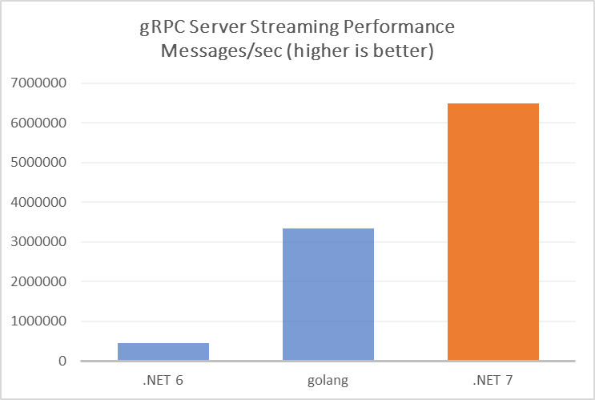
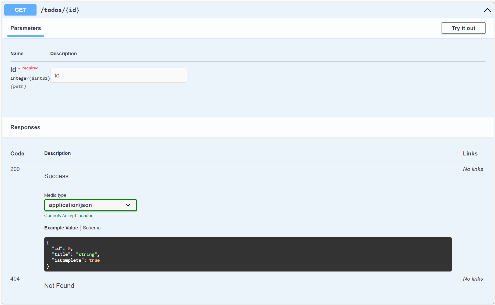
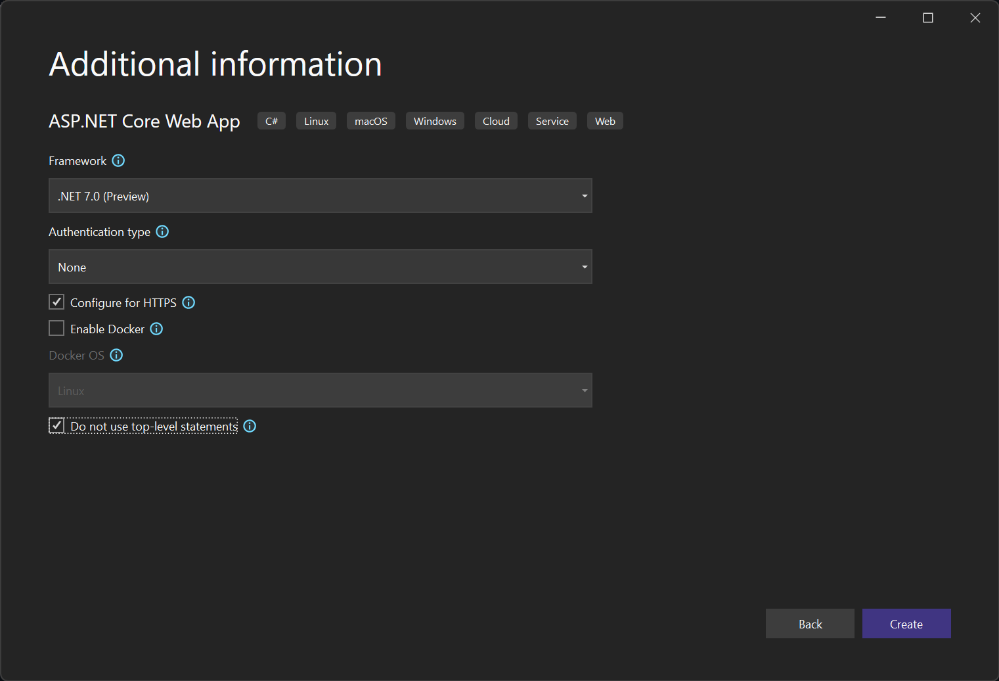

[.NET 7 Preview 4 is now available](https://devblogs.microsoft.com/dotnet/announcing-dotnet-7-preview-3) and includes many great new improvements to ASP.NET Core.

Here's a summary of what's new in this preview release:

- HTTP/2 performance improvements
- Typed results for minimal APIs
- OpenAPI improvements for minimal APIs
- Return multiple results types from minimal APIs
- Route groups
- Client results in SignalR
- gRPC JSON transcoding
- Project template option to use `Program.Main` method instead of top-level statements
- Rate limiting middleware

For more details on the ASP.NET Core work planned for .NET 7 see the full [ASP.NET Core roadmap for .NET 7](https://aka.ms/aspnet/roadmap) on GitHub.

## Get started

To get started with ASP.NET Core in .NET 7 Preview 4, [install the .NET 7 SDK](https://dotnet.microsoft.com/download/dotnet/7.0).

If you're on Windows using Visual Studio, we recommend installing the latest [Visual Studio 2022 preview](https://visualstudio.com/preview). Visual Studio for Mac support for .NET 7 previews isn't available yet but is coming soon.

To install the latest .NET WebAssembly build tools, run the following command from an elevated command prompt:

```console
dotnet workload install wasm-tools
```

> Note: Building .NET 6 Blazor projects with the .NET 7 SDK and the .NET 7 WebAssembly build tools is currently not supported. This will be addressed in a future .NET 7 update: [dotnet/runtime#65211](https://github.com/dotnet/runtime/issues/65211).

## Upgrade an existing project

To upgrade an existing ASP.NET Core app from .NET 7 Preview 2 to .NET 7 Preview 3:

- Update all Microsoft.AspNetCore.\* package references to `7.0.0-preview.4.*`.
- Update all Microsoft.Extensions.\* package references to `7.0.0-preview.4.*`.

See also the full list of [breaking changes](https://docs.microsoft.com/dotnet/core/compatibility/7.0#aspnet-core) in ASP.NET Core for .NET 7.

## HTTP/2 performance improvements

.NET 7 Preview 4 introduces a significant re-architecture of how Kestrel processes HTTP/2 requests. ASP.NET Core apps with busy HTTP/2 connections will experience reduced CPU usage and higher throughput.

HTTP/2 allows up to 100 requests to run on a TCP connection in parallel. This is called multiplexing. It's a powerful feature but makes HTTP/2 complex to implement. Before Preview 4, HTTP/2 multiplexing in Kestrel relied on C#'s `lock` keyword to control which request could write to the TCP connection. While `lock` is a simple solution to writing safe multi-threading code, it's inefficient under high thread contention. Threads fighting over the lock waste CPU resources that could be used for other work.

Kestrel profiling and benchmarking showed:

- High thread contention when a connection is busy.
- CPU cycles are wasted by requests fighting over the write lock.
- Idle CPU cores as requests wait for the write lock.
- Kestrel HTTP/2 benchmarks are lower than other servers in busy connection scenarios.

The solution is to rewrite how HTTP/2 requests in Kestrel access the TCP connection. A [thread-safe queue](https://devblogs.microsoft.com/dotnet/an-introduction-to-system-threading-channels/) replaces the write lock. Instead of fighting over who gets to use the write lock, requests now queue up in an orderly line, and a dedicated consumer processes them. Previously wasted CPU resources are available to the rest of the app.

These improvements are visible in gRPC, a popular RPC framework that uses HTTP/2. Kestrel + gRPC benchmarks show a dramatic improvement:



## Typed results for minimal APIs

In .NET 6 we introduced the `IResult` interface to ASP.NET Core to represent values returned from minimal APIs that don't utilize the implicit support for JSON serializing the returned object to the HTTP response. The static `Results` class is used to create varying `IResult` objects that represent different types of responses, from simply setting the response status code, to redirecting to another URL. The `IResult`-implementing framework types returned from these methods were internal however, making it difficult to verify the specific `IResult`-type being returned from your methods in a unit test.

In .NET 7 the types implementing `IResult` in ASP.NET Core have been made public, allowing for simple type assertions when testing. For example:

**Program.cs**

``` csharp
using Microsoft.EntityFrameworkCore;

var builder = WebApplication.CreateBuilder(args);
builder.Services.AddSqlite<TodoDb>("Filename=:memory:");

var app = builder.Build();

app.MapTodosApi();

app.Run();

public class Todo
{
    public int Id { get; set; }
    public string? Title { get; set; }
    public bool IsComplete { get; set; }
}

public static class TodosApi
{
    public static IEndpointRouteBuilder MapTodosApi(this IEndpointRouteBuilder routes)
    {
        routes.MapGet("/todos", GetAllTodos);
    }
    
    public static async Task<IResult> GetAllTodos(TodoDb db)
    {
        return Results.Ok(await db.Todos.ToListAsync());
    }
}
```

**TodosApiTests.cs** *(In an xUnit test project)*

``` csharp
using Microsoft.AspNetCore.Http.HttpResults;
using Microsoft.Data.Sqlite;
using Microsoft.EntityFrameworkCore;

namespace Tests;

public class TodosApiTests : IDisposable
{
    private SqliteConnection _connection;
    private DbContextOptions<TodoDb> _contextOptions;

    public TodosApiTests()
    {
        _connection = new SqliteConnection("Filename=:memory:");
        _connection.Open();
        _contextOptions = new DbContextOptionsBuilder<TodoDb>()
            .UseSqlite(_connection)
            .Options;

        using var context = CreateDbContext();
        context.Database.EnsureCreated();
    }

    public void Dispose() => _connection.Dispose();

    private TodoDb CreateDbContext() => new TodoDb(_contextOptions);

    [Fact]
    public async Task GetAllTodos_ReturnsOkResultOfIEnumerableTodo()
    {
        // Arrange
        var db = CreateDbContext();

        // Act
        var result = await TodosApi.GetAllTodos(db);

        // Assert: Check the returned result type is correct
        Assert.IsType<Ok<object>>(result);
    }
}
```

Let's take a closer look at the test method:

```csharp
[Fact]
public async Task GetAllTodos_ReturnsOkOfObjectResult()
{
    // Arrange
    var db = CreateDbContext();

    // Act
    var result = await TodosApi.GetAllTodos(db);

    // Assert: Check the returned result type is correct
    Assert.IsType<Ok<object>>(result);
}
```

Note that once the `result` is retrieved from the minimal API method being tested, it's a simple case of asserting that the result's type is `Ok<object>`. The generic argument of the new `Ok<TValue>` result type is still `object` in this case though. Why is that? Wouldn't we want to preserve the actual type of the returned value?

The value type is `object` because the `Results.Ok(object? value = null)` method accepts the value as `object`, not as the original type. It also still returns the result object typed as `IResult`, not as the newly public `Ok<TValue>` type. To solve this issue we've introduced a new factory class for creating "typed" results.

### Microsoft.AspNetCore.Http.TypedResults

The new `Microsoft.AspNetCore.Http.TypedResults` static class is the "typed" equivalent of the existing `Microsoft.AspNetCore.Http.Results` class. You can use `TypedResults` in your minimal APIs to create instances of the in-framework `IResult`-implementing types and **preserve** the concrete type information.

Let's revisit our minimal API from earlier but this time updated to use the `TypedResults` class:

```csharp
public static async Task<IResult> GetAllTodos(TodoDb db)
{
    return TypedResults.Ok(await db.Todos.ToArrayAsync());
}
```

We can update our test now to check for the full concrete type detail:

```csharp
[Fact]
public async Task GetAllTodos_ReturnsOkOfObjectResult()
{
    // Arrange
    var db = CreateDbContext();

    // Act
    var result = await TodosApi.GetAllTodos(db);

    // Assert: Check the returned result type is correct
    Assert.IsType<Ok<Todo[]>>(result);
}
```

## OpenAPI improvements for minimal APIs

### Introducing the Microsoft.AspNetCore.OpenApi package

The [OpenAPI specification](https://swagger.io/specification/) provides a language-agnostic standard for describing RESTful APIs. In .NET 7 Preview 4, we're introducing support for the new `Microsoft.AspNetCore.OpenApi` package to provide APIs for interacting with the OpenAPI specification in minimal APIs. Package references to the new package are included automatically in minimal API-enabled application that are created from a template with `--enable-openapi`. In other cases, the dependency can be added as a package reference.

The package exposes a `WithOpenApi` extension method that generates an `OpenApiOperation` derived from a given endpoint's route handler and metadata.

```csharp
app.MapGet("/todos/{id}", (int id) => ...)
    .WithOpenApi();
```

The `WithOpenApi` extension method above generates an `OpenApiOperation` associated with a `GET` request to the `/todos/{id}` endpoint. A second `WithOpenApi` extension method overload can be used to extend and override the generated operation.

```csharp
app.MapGet("/todos/{id}", (int id) => ...)
    .WithOpenApi(operation => {
        operation.Summary = "Retrieve a Todo given its ID";
        operation.Parameters[0].AllowEmptyValue = false;
    });
```

### Self-describing minimal APIs with `IEndpointMetadataProvider` and `IEndpointParameterMetadataProvider`

One of the features of minimal APIs is the ability for the framework to use the type information declared as part of your application's route handlers (methods, lambdas, delegates, etc.), in addition to the implicit behavior of the framework, to automatically document the details of the APIs for OpenAPI/Swagger.

In cases where those details are not enough to describe your API, you can add endpoint metadata in your code to enhance the description:

```csharp
app.MapGet("/todos", async (TodoDb db)
{
    return Results.Ok(await db.Todos.ToArrayAsync());
})
    // Add metadata about the shape of the data returned for OpenAPI/Swagger
    .Produces<Todo[]>();
```

Wouldn't it be nice if we could preserve the rich type information and use it to more fully describe our APIs automatically, without additional annotations? For example, if my route handler declares that it returns a type that represents an HTTP 200 OK response with a particularly shaped JSON payload, we should be able to use that type information to automatically describe the API.

In .NET 7, we've introduced two new interfaces to ASP.NET Core that allow types used in minimal API route handlers to contribute to endpoint metadata: `IEndpointMetadataProvider` and `IEndpointParameterMetadataProvider`. These interfaces take advantage of a feature, newly out of preview in C# 11, [`static abstract` interface members](https://docs.microsoft.com/dotnet/csharp/whats-new/tutorials/static-abstract-interface-methods), to declare static methods that, if present on route handler return types or parameters, will be called by the framework when the endpoint is built.

The interfaces look like this:

```csharp
namespace Microsoft.AspNetCore.Http.Metadata;

public interface IEndpointMetadataProvider
{
    static abstract void PopulateMetadata(EndpointMetadataContext context);
}

public interface IEndpointParameterMetadataProvider
{
    static abstract void PopulateMetadata(EndpointParameterMetadataContext parameterContext);
}
```

`IEndpointMetadataProvider` can be implemented by types either returned from a route handler, or accepted by a route handler as a parameter. `IEndpointParameterMetadataProvider`, as the name suggests, can only be implemented by types accepted by a route handler as a parameter and will be provided with the `ParameterInfo` for the associated route handler parameter when called.

Updating the example above to use the new `TypedResults` class is all that's needed to have it be able to describe itself to OpenAPI/Swagger, as many of the in-framework `IResult`-implementing types also implement `IEndpointMetadataProvider`:

```csharp
app.MapGet("/todos", async (TodoDb db)
{
    // This lambda now returns Ok<Todo[]>, a type that implements IEndpointMetadataProvider.
    // The framework will call Ok<Todo[]>.PopulateMetadata() when the endpoint is built,
    // which adds the necessary endpoint metadata to describe the HTTP response type.
    return TypedResults.Ok(await db.Todos.ToArrayAsync());
});
```

This pattern works well for simple route handlers that return only one type of result, but what happens once we have an API that can return different result types depending on the conditions, like a **200 OK** when the todo is found and a **404 Not Found** when it isn't? You can, of course, continue to return `IResult` from a route handler that returns different actual types (as long as they all implement `IResult`) by explicitly stating the handler's return type, like this:

```csharp
// Declare that the lambda returns IResult so that multiple concrete types can be returned
app.MapGet("/todos/{id}", async IResult (int id, TodoDb db)
    {
        return await db.Todos.FindAsync(id) is Todo todo
            ? TypedResults.Ok(todo)
            : TypedResults.NotFound();
    });
```

But now the concrete type information is no longer preserved on the handler signature, and thus the framework cannot use it to automatically describe the API. C# does not yet support declaring multiple return types from a single method, so how do we preserve the full type information? We'll cover that next.

## Return multiple result types from minimal APIs

The new `Results<TResult1, TResult2, TResultN>` generic union types, along with the `TypesResults` class, can be used to declare that a route handler returns multiple `IResult`-implementing concrete types, and any of those types implementing `IEndpointMetadataProvider` will contribute to the endpoint's metadata, enabling the framework to automatically describe the various HTTP results for an API in OpenAPI/Swagger:

```csharp
// Declare that the lambda returns multiple IResult types
app.MapGet("/todos/{id}", async Results<Ok<Todo>, NotFound> (int id, TodoDb db)
{
    return await db.Todos.FindAsync(id) is Todo todo
        ? TypedResults.Ok(todo)
        : TypedResults.NotFound();
});
```

The `Results<TResult1, TResultN>` union types implement implicit cast operators so that the compiler can automatically convert the types specified in the generic arguments to an instance of the union type. This has the added benefit of providing compile-time checking that a route handler actually only returns the results that it declares it does. Attempting to return a type that isn't declared as one of the generic arguments to `Results<>` will result in a compilation error.

Below is an image of the Swagger UI for the API in the example above. You can see that the parameter and responses information has been automatically discovered from the route handler signature:



### A self-documenting Todos API

Let's revisit our todos API from earlier. It's now updated to include methods for retrieving a single todo, creating a new todo, and editing an existing todo. It's also now using the new `Results<TResult1, TResultsN>` and `TypedResults` types to preserve the full type information in the route handler signatures, making them easier to verify in tests, and be automatically described in OpenAPI/Swagger:

```csharp
using Microsoft.AspNetCore.Http.HttpResults;
using Microsoft.EntityFrameworkCore;

var builder = WebApplication.CreateBuilder(args);
builder.Services.AddSqlite<TodoDb>("Filename=:memory:");

builder.Services.AddEndpointsApiExplorer();
builder.Services.AddSwaggerGen();

var app = builder.Build();

app.UseSwagger();
app.UseSwaggerUI();
app.MapTodosApi();

app.Run();

public class Todo
{
    public int Id { get; set; }
    public string? Title { get; set; }
    public bool IsComplete { get; set; }
}

public static class TodosApi
{
    public static IEndpointRouteBuilder MapTodosApi(this IEndpointRouteBuilder routes)
    {
        routes.MapGet("/todos", GetAllTodos);
        routes.MapGet("/todos/{id}", GetTodo);
        routes.MapPost("/todos", CreateTodo);
        routes.MapPut("/todos/{id}", UpdateTodo);
        return routes;
    }
    
    public static async Task<Ok<Todo[]>> GetAllTodos(TodoDb db)
    {
        return TypedResults.Ok(await db.Todos.ToListAsync());
    }

    public static async Task<Results<Ok<Todo>, NotFound>> GetTodo(int id, TodoDb db)
    {
        return await db.Todos.FindAsync(id) is Todo todo
            ? TypedResults.Ok(todo)
            : TypedResults.NotFound();
    }

    public static async Task<Created<Todo>> CreateTodo(Todo todo, TodoDb db)
    {
        db.Todos.Add(todo);
        await db.SaveChangesAsync();

        return TypedResults.Created($"/todos/{todo.Id}", todo);
    }

    public static async Task<Results<NoContent, NotFound>> UpdateTodo(int id, Todo todo, TodoDb db)
    {
        var existingTodo = await db.Todos.FindAsync(id);

        if (existingTodo is null)
        {
            return TypedResults.NotFound();
        }

        existingTodo.Title = todo.Title;
        existingTodo.IsComplete = todo.IsComplete;

        await db.SaveChangesAsync();

        return TypedResults.NoContent();
    }
}
```

## Route groups

.NET 7 Preview 4 introduces the `MapGroup()` extension method, which helps organize groups of [endpoints](https://docs.microsoft.com/aspnet/core/fundamentals/routing#endpoints) with a common prefix. It allows for customizing entire groups of endpoints with a singe call to methods like `RequireAuthorization()` and `WithMetadata()`.

We can use `MapGroup()` to add private todo endpoints to our earlier API as follows:

```csharp
// ...
// Was: app.MapTodosApi()
app.MapGroup("/public/todos").MapTodosApi();
// Auth configuration is left as an exercise for the reader. More to come in future previews.
app.MapGroup("/private/todos").MapTodosApi().RequireAuthorization();

app.Run();
// ...
public static class TodosApi
{
    // GroupRouteBuilder is both an IEndpointRouteBuilder and IEndpointConventionBuilder.
    public static GroupRouteBuilder MapTodosApi(this GroupRouteBuilder group)
    {
        group.MapGet("/", GetAllTodos);
        group.MapGet("/{id}", GetTodo);
        group.MapPost("/", CreateTodo);
        group.MapPut("/{id}", UpdateTodo);
        return group;
    }
// ...
    public static async Task<Created<Todo>> CreateTodo(Todo todo, TodoDb db, ClaimsPrincipal user)
    {
        if (user.Identity?.IsAuthenticated ?? false)
        {
            db.PrivateTodos.Add(todo);
        }
        else
        {
            db.Todos.Add(todo);
        }

        await db.SaveChangesAsync();
        // Use relative path for Location header to support multiple group prefixes.
        // Was: TypedResults.Created($"/todos/{todo.Id}", todo)
        return TypedResults.Created($"{todo.Id}", todo);
    }
// ...
```

Instead of using relative addresses for the Location header in the 201 Created result, it's also possible to use `GroupRouteBuilder.GroupPrefix` to construct a root-relative address or use [GetPathByRouteValues or GetUriByRouteValues](https://docs.microsoft.com/dotnet/api/microsoft.aspnetcore.routing.linkgeneratorroutevaluesaddressextensions) with a `routeName` for even more options.

Route groups also support nested groups and complex prefix patterns with route parameters and constraints.

Route groups are still a work in progress. We plan to add support for more extension methods such as [WithTags](https://docs.microsoft.com/dotnet/api/microsoft.aspnetcore.http.openapiroutehandlerbuilderextensions.withtags) and the recently-added [AddFilter](https://devblogs.microsoft.com/dotnet/asp-net-core-updates-in-dotnet-7-preview-3/#support-for-route-handler-filters-in-minimal-apis) method. We're also considering adding support for adding middleware to a route group in addition to endpoints. Take a look at the ["epic" issue for route groups](https://github.com/dotnet/aspnetcore/issues/41433) to follow progress and provide feedback.

## Client results in SignalR

Previously, when using SignalR, the server could invoke a method on a client but didn't have the ability to wait for a response. This scenario is now supported with .NET 7 Preview 4. The server uses `ISingleClientProxy.InvokeAsync()` to invoke a client method, and the client returns a result from its `.On()` handler.

There are two ways to use the API on the server. The first is to call `Single()` on the `Clients` property in a hub method:

```csharp
public class GameHub : Hub
{
    public async Task WaitForResult(string connectionId)
    {
        var randomValue = Random.Shared.Next(0, 10);
        var result = await Clients.Single(connectionId).InvokeAsync<int>(
            "GetResult", "Guess the value between 0 and 10.");
        if (result == randomValue)
        {
            await Clients.Client(connectionId).SendAsync("EndResult", "You guessed correctly!");
        }
        else
        {
            await Clients.Client(connectionId).SendAsync("EndResult", $"You guessed incorrectly, value was {randomValue}");
        }
    }
}
```

Using `InvokeAsync` from a hub method requires setting the `MaximumParallelInvocationsPerClient` option to a value greater than 1.

The second way is to call `Single()` on an instance of `IHubContext<T>`:

```csharp
async Task SomeMethod(IHubContext<MyHub> context)
{
    var randomValue = Random.Shared.Next(0, 10);
    var result = await context.Clients.Single(connectionID).InvokeAsync<int>(
        "GetResult", "Guess the value between 0 and 10.");
    if (result == randomValue)
    {
        await context.Clients.Client(connectionId).SendAsync("EndResult", "You guessed correctly!");
    }
    else
    {
        await context.Client(connectionId).SendAsync("EndResult", $"You guessed incorrectly, value was {randomValue}");
    }
}
```

Strongly-typed hubs can also return values from interface methods:

```csharp
public interface IClient
{
    Task<int> GetResult();
}

public class GameHub : Hub<IClient>
{
    public async Task WaitForMessage(string connectionId)
    {
        int message = await Clients.Single(connectionId).GetResult();
    }
}
```

Clients return results in their `.On()` handlers, as shown below:

**.NET client**

```csharp
hubConnection.On("GetResult", async (string message) =>
{
    Console.WriteLine($"{message} Enter guess:");
    var result = await Console.In.ReadLineAsync();
    return result;
});
```

**TypeScript client**

```typescript
hubConnection.on("GetResult", async (message) => {
    console.log(message);
    let promise = new Promise((resolve, reject) => {
        setTimeout(() => {
            resolve(2);
        }, 100);
    });
    return promise;
});
```

SignalR client results don't work with the Azure SignalR Service yet.

You can refer to https://github.com/dotnet/aspnetcore/issues/5280 for more details and planned future improvements.

## gRPC JSON transcoding

The first preview of gRPC JSON transcoding is now available with .NET 7 Preview 4. gRPC JSON transcoding allows gRPC services to be called as RESTful APIs. This enables apps to support gRPC and REST without duplication.

We'll share more information about JSON transcoding in an upcoming blog post. For more information right now, check out the [documentation](https://docs.microsoft.com/aspnet/core/grpc/httpapi) or try out [a sample app that uses JSON transcoding](https://github.com/grpc/grpc-dotnet/tree/master/examples#transcoder).

## Project template option to use `Program.Main` method instead of top-level statements

In .NET 6, we updated the ASP.NET Core project templates to use modern C# features from C# 8 through to C# 10. One of these features was [top-level statements](https://docs.microsoft.com/dotnet/csharp/fundamentals/program-structure/top-level-statements), a feature from C# 9, which removes the need to explicitly define an application entry-point, typically in the form of a `Main` method declared on a `Program` class (`Program.Main`).

While many people appreciate the reduced boilerplate code this feature results in, others expressed frustration that this change was made in the project templates without an option to continue using the traditional `Program.Main` structure instead.

In this preview, we've added a template option that allows the creation of new projects without using top-level statements. If using the .NET CLI, you can specify the `--use-program-main` option like so:

```console
> dotnet new web --use-program-main
```

If creating projects with Visual Studio, you can select the new "Do not use top-level statements" checkbox during project creation:



## Rate limiting middleware

The new rate limiting middleware in .NET 7 Preview 4 provides a convenient way to limit the rate of incoming HTTP requests.

The following example applies a `ConcurrencyLimiter` globally with a maximum of 1 concurrent lease:

```csharp
var builder = WebApplication.CreateBuilder(args);
var app = builder.Build();

app.UseRateLimiter(new RateLimiterOptions
{
    Limiter = PartitionedRateLimiter.Create<HttpContext, int>(resource =>
    {
        return RateLimitPartition.CreateConcurrencyLimiter(1,
            _ => new ConcurrencyLimiterOptions(1, QueueProcessingOrder.NewestFirst, 1));
    })
});

app.Run();
```

The `int` passed as the first argument to `CreateConcurrencyLimiter` is a key used to distinguish different component limiters in the `PartitionedRateLimiter`.

You can also configure the limiting behavior based on attributes of the resource passed in:

```csharp
var builder = WebApplication.CreateBuilder(args);
var app = builder.Build();

app.UseRateLimiter(new RateLimiterOptions
{
    Limiter = PartitionedRateLimiter.Create<HttpContext, int>(resource =>
    {
        if (resource.Request.Path.StartsWithSegment("/api")
        {
            return RateLimitPartition.CreateConcurrencyLimiter(1,
                _ => new ConcurrencyLimiterOptions(2, QueueProcessingOrder.NewestFirst, 2));
        }
        else
        {
            return RateLimitPartition.CreateConcurrencyLimiter(2,
                _ => new ConcurrencyLimiterOptions(1, QueueProcessingOrder.NewestFirst, 1));
        }
    })
});

app.Run();
```

This example uses a `ConcurrencyLimiter` with a limit of 1 concurrent lease and a queue depth of 1 whenever the request path points to a web API and will use a `ConcurrencyLimiter` with a limit of 2 concurrent leases and a queue depth of 2 in all other cases.

`RateLimitPartition` today contains convenience methods for creating `ConcurrencyLimiter`s, `TokenBucketRateLimiter`s, and `NoopLimiter`s which can easily be swapped in to the examples above.

The implementation of the rate limiting middleware in .NET 7 Preview 4 is minimal and not endpoint aware. In a future preview we plan to make the middleware endpoint aware by default and add additional configuration options. A user could today use the APIs in `System.Threading.RateLimiting` to create a `PartitionedRateLimiter` that applies different rate limits to different endpoints.

## Give feedback

We hope you enjoy this preview release of ASP.NET Core in .NET 7. Let us know what you think about these new improvements by filing issues on [GitHub](https://github.com/dotnet/aspnetcore/issues/new).

Thanks for trying out ASP.NET Core!
