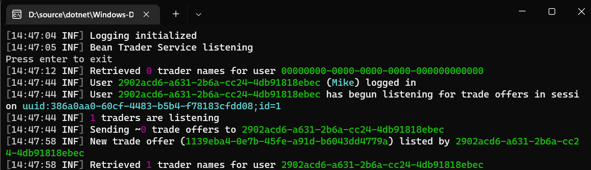
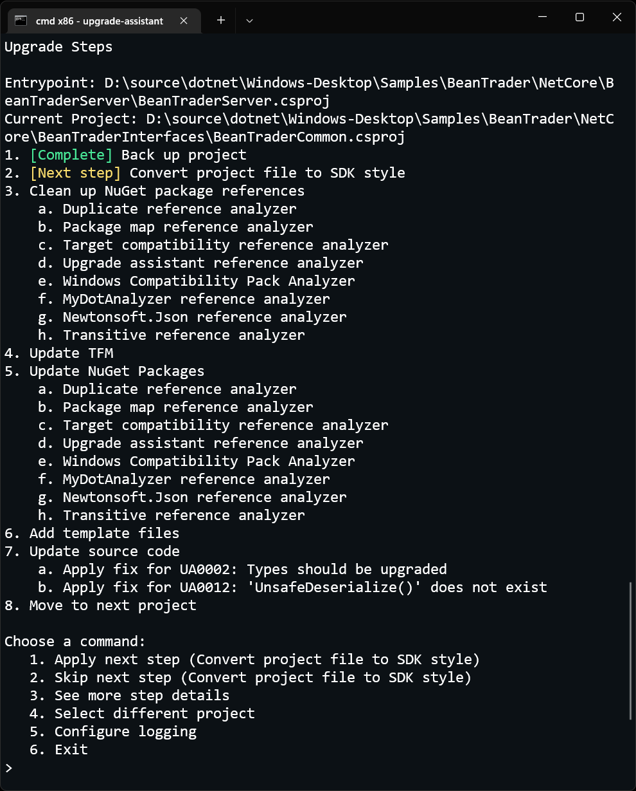
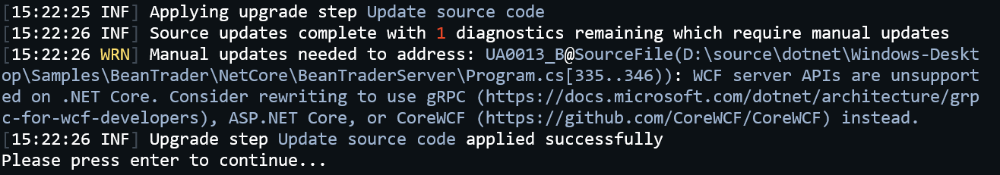
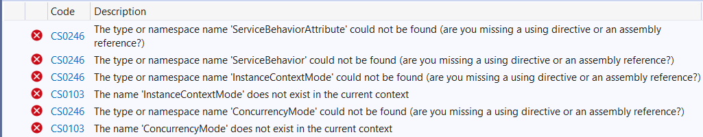
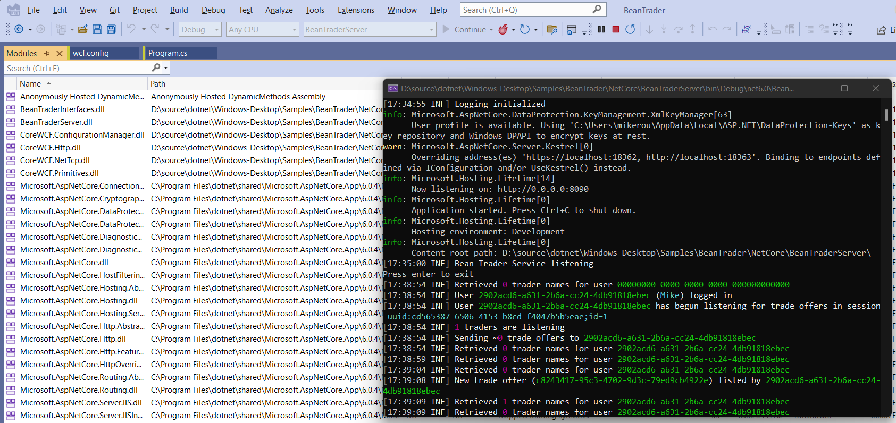

Almost three years ago, I posted a blog walking through the process of [migrating a WPF app to .NET Core 3](https://devblogs.microsoft.com/dotnet/migrating-a-sample-wpf-app-to-net-core-3-part-1/). The app I migrated was a simple commodity trading sample called Bean Trader. At the time, though, I was only able to migrate part of the sample solution. The Bean Trader solution includes both a WPF client and a server-side application that the client communicates with to propose and accept trades. The client and server communicate using WCF. Because .NET Core 3 (and subsequent versions like .NET 5 and 6) supported client-side WCF APIs but not server-side ones, I was able to migrate the Bean Trader client but had to leave the server running on .NET Framework.

With the recent announcement that [CoreWCF](https://github.com/corewcf/corewcf) has reached 1.0, I'm excited to finish upgrading the Bean Trader sample to .NET 6!

## About CoreWCF

CoreWCF is a community-driven .NET Foundation project that makes WCF surface area available on modern versions of .NET. Although CoreWCF is not a Microsoft-owned project, Microsoft has announced that it will provide [product support for CoreWCF](https://devblogs.microsoft.com/dotnet/corewcf-v1-released/). While newer technologies like gRPC and ASP.NET WebAPI are still recommended for new development, CoreWCF is a great option to help projects with existing heavy WCF dependencies move to .NET 6.

Although CoreWCF supports many common WCF scenarios, it does not support all WCF functionality. Your modernization experience may vary depending on the overlap between your WCF usage and the functionality included in CoreWCF. If functionality you depend on is not yet in CoreWCF, please provide feedback in the [Feature Roadmap](https://github.com/CoreWCF/CoreWCF/issues/234) issue so that CoreWCF project maintainers can prioritize work based on community need.

## About the Sample

The Bean Trader app (available [on GitHub](https://github.com/dotnet/windows-desktop/tree/main/Samples/BeanTrader)) is a sample I created several years ago to use when demonstrating how to migrate to .NET Core. Because the sample was originally only intended to show off modernizing the client, the Bean Trader service is quite simple. It consists of a class library with models and interfaces, and a console application that hosts a WCF service (using Net.Tcp transport with certificate authentication) allowing clients to propose or accept trades of different colors of beans. Even though the sample app is small, I think it's still useful to see the process used to migrate it to .NET 6.



## Migration

### Running Upgrade Assistant

To make the migration quicker, I will use the [.NET Upgrade Assistant](https://github.com/dotnet/upgrade-assistant). Upgrade Assistant is a command-line tool that helps users interactively upgrade projects from .NET Framework to .NET Standard and .NET 6. Upgrade Assistant doesn't yet automate migration from WCF to CoreWCF (though it's [on the project's backlog](https://github.com/dotnet/upgrade-assistant/issues/1083)), it is still useful to run the tool so that project files will be migrated, NuGet package references will be updated, and so on. After the tool runs, I will make the changes necessary to migrate from WCF to CoreWCF manually.

To install Upgrade Assistant, I run the follow .NET SDK command:

```dotnetcli
dotnet tool install -g upgrade-assistant
```

With Upgrade Assistant installed, I can begin the migration process by running it on the BeanTrader solution file. By running on the solution file (rather than a specific project), I'm able to upgrade both the class library and server console app with one execution of the tool.

The command to upgrade the solution is:

```dotnetcli
upgrade-assistant upgrade BeanTrader.sln
```

The tool then guides me through a series of upgrade steps (which are all taken care of automatically by Upgrade Assistant) as shown here.



The complete list of steps that I apply via Upgrade Assistant are:

1. Selecting an entry point. This allows me to choose the project that I ultimately want running on .NET 6. Based on the selection, Upgrade Assistant will decide which projects to upgrade and in what order. I choose BeanTraderServer.
1. Selecting a project to upgrade. This transitions the tool to begin upgrading a specific project. It recommends upgrading BeanTraderCommon first and then BeanTraderServer which makes sense, so I will choose that order.
1. Backing up BeanTraderCommon.
1. Converting BeanTraderCommon to an SDK-style project.
1. Updating BeanTraderCommon NuGet packages. This step replaces the assembly reference to System.ServiceModel with NuGet packages like System.ServiceModel.NetTcp, instead.
1. Updating the BeanTraderCommon's target framework (TFM). The tool recommends .NET Standard 2.0 since the project is a class library without any .NET 6-specific dependencies.
1. At this point the upgrade of the helper library is done and Upgrade Assistant switches to upgrading BeanTraderServer.
1. Backing up BeanTraderServer.
1. Converting BeanTraderServer to an SDK-style project.
1. Replacing System.ServiceModel references with equivalent NuGet packages, as was done for the BeanTraderCommon project.
1. Updating BeanTraderServer's target framework. The tool recommends .NET 6 since the project is a console app.
1. Disabling unsupported configuration sections. Upgrade Assistant detected that BeanTraderServer has a system.ServiceModel section in its app.config file which isn't supported on .NET 6 (it will cause runtime errors), so it comments that section out for me. Later, we'll re-use this commented out section in a different file to configure our CoreWCF service.
1. While inspecting C# source for any necessary changes, Upgrade Assistant warns about WCF usage. The warning message alerts me to the fact that BeanTraderServer uses server-side WCF APIs which aren't supported on .NET 6 and which aren't upgraded by the tool. It tells me that I will need to make manual changes and recommends upgrading to CoreWCF, gRPC, or ASP.NET Core instead.
    1. 
1. Upgrade cleanup. At this point, Upgrade Assistant is done so it removes some temporary files and exits.

### CoreWCF Migration

Now that Upgrade Assistant has done the work to start the upgrade process, it's time to upgrade to CoreWCF. Opening up the Bean Trader solution in Visual Studio, I find that the BeanTraderCommon class library builds successfully. That project's upgrade to .NET Standard is done. The BeanTraderServer project has some errors, though, related to not being able to find some WCF types.



To start upgrading to CoreWCF, I add a NuGet package reference to CoreWCF.NetTcp version 1.0. I also replace the `using System.ServiceModel;` import in BeanTrader.cs with `using CoreWCF;`. This addresses all the errors except for one in program.cs about how I'm creating a ServiceHost.

CoreWCF is built on top of ASP.NET Core, so I need to update the project to start an ASP.NET Core host. The BeanTrader sample is a self-hosted service project, so I just need to make a few small changes to set up an ASP.NET Core host to run my service instead of using ServiceHost directly. To do that, I update the project's SDK to `Microsoft.NET.Sdk.Web` (since it uses ASP.NET Core), make the app's Main method async, and replace ServiceHost setup with the code shown below.

There are different kinds of WCF projects (not all will be creating and starting ServiceHost instances directly), but all CoreWCF apps run as ASP.NET Core endpoints. The code shown here uses the new .NET 6 [minimal API](https://docs.microsoft.com/aspnet/core/fundamentals/minimal-apis) syntax to get the ASP.NET Core host up and running with minimal code, but it would also be fine to use other ASP.NET Core syntaxes (having a separate Startup.cs, for example), if you prefer. [CoreWCF samples](https://github.com/CoreWCF/CoreWCF/tree/main/src/Samples) demonstrate both approaches.

Notice that the certificate configuration is copied from the old sample and is **for demo purposes only**. A real-world solution would use a certificate from the machine's certificate stores or from a secure location like Azure Key Vault. Also, this is a good example of how service host properties can be changed when using CoreWCF but the scenario of setting a server certificate is specific to NetTcp scenarios. For HTTPS endpoints, SSL is setup via ASP.NET Core APIs just as it would in other ASP.NET Core apps.

```csharp
var builder = WebApplication.CreateBuilder();

// Add CoreWCF services to the ASP.NET Core app's DI container
builder.Services.AddServiceModelServices();

var app = builder.Build();

// Configure CoreWCF endpoints in the ASP.NET Core host
app.UseServiceModel(serviceBuilder =>
{
    serviceBuilder.ConfigureServiceHostBase<BeanTrader>(beanTraderServiceHost =>
    {
        // This code is copied from the old ServiceHost setup and configures
        // the local cert used for authentication.
        // For demo purposes, this just loads the certificate from disk 
        // so that no one needs to install an untrusted self-signed cert
        // or load from KeyVault (which would complicate the sample)
        var certPath = Path.Combine(Path.GetDirectoryName(typeof(Program).Assembly.Location), "BeanTrader.pfx");
        beanTraderServiceHost.Credentials.ServiceCertificate.Certificate = new X509Certificate2(certPath, "password");
        beanTraderServiceHost.Credentials.ClientCertificate.Authentication.CertificateValidationMode = X509CertificateValidationMode.None;
    });
});

await app.StartAsync();
```

I also replace the `host.Close()` call in the original sample with `await app.StopAsync()`.

At this point, the app builds without error! The only thing left to fix is to make sure that configuration for the service is loaded as expected.

### Configuration Updates

As mentioned previously, .NET 6 doesn't include a system.serviceModel section by default. However a lot of existing WCF applications used app.config and web.config to setup bindings. To enable easy migration, CoreWCF includes APIs that can explicitly load configuration from xml config files.

To make use of the Bean Trader server's WCF configuration, I begin by adding a reference to the CoreWCF.ConfigurationManager package. Then, I move the system.serviceModel section from the app's app.config (it was left commented out by Upgrade Assistant) into a new config file. The file can have any name, but I've called mine 'wcf.config'.

There are some small differences in what's supported in WCF configuration between WCF and CoreWCF, so I need to make the following changes to wcf.config:

1. `IMetadataExchange` isn't supported in CoreWCF yet, so remove the mex endpoint. I can still make the WSDL available for download, though. I'll show how to do that next.
1. The `<host>` element isn't supported in service model configuration. Instead, the port that endpoints listen on is configured in code. So, I need to remove the `<host>` element from wcf.config and add the following line to the app's main method: `builder.WebHost.UseNetTcp(8090);`. This should go before the call to `builder.Build`.

Finally, I update the app's main method to add the configuration to the ASP.NET Core app's dependency injection container: `builder.Services.AddServiceModelConfigurationManagerFile("wcf.config");`.

At this point, the app will work and clients should be able to successfully connect to it. I still want to make the WSDL available, though, so I'm going to make a few more changes to the project. First, I add the following code to the main method to have the ASP.NET Core app listen on port 8080 (since that is the port the WSDL was downloaded from previously):

```CSharp
builder.WebHost.ConfigureKestrel(options =>
{
    options.ListenAnyIP(8080);
});
```

Second, when registering services, I'll add a call to `builder.Services.AddServiceModelMetadata()` to ensure that metadata services are available and then I'll get the `ServiceMetadataBehavior` instance that is registered (as a singleton) and modify it to make WSDL download possible. This code needs to go after building the app but prior to starting it:

```CSharp
// Enable getting metadata/wsdl
var serviceMetadataBehavior = app.Services.GetRequiredService<ServiceMetadataBehavior>();
serviceMetadataBehavior.HttpGetEnabled = true;
serviceMetadataBehavior.HttpGetUrl = new Uri("http://localhost:8080/metadata");
```

With those changes made, the Bean Trader service is now completely migrated to .NET 6! I can launch the app and connect to it with the existing client. And the WSDL is available at localhost:8080/metadata. To see all of the changes discussed in this post in their entirety, you can look at [this pull request](https://github.com/dotnet/windows-desktop/pull/21) which updates the Bean Trader sample so that, finally, the NetCore folder of the sample contains only .NET Core and .NET 6-targeted projects!



## Wrap-up

The Bean Trader sample is only a small app, but hopefully this walk-through demonstrates the sorts of changes needed to get WCF services working on .NET 6 with CoreWCF. The WCF service implementations were unchanged except for referencing some different namespaces and most of the configuration xml was re-used. I had to make some changes to how the service hosts were created (the services are hosted by ASP.NET Core now) but I was still able to reuse code that had previously been used to customize service host behavior.
