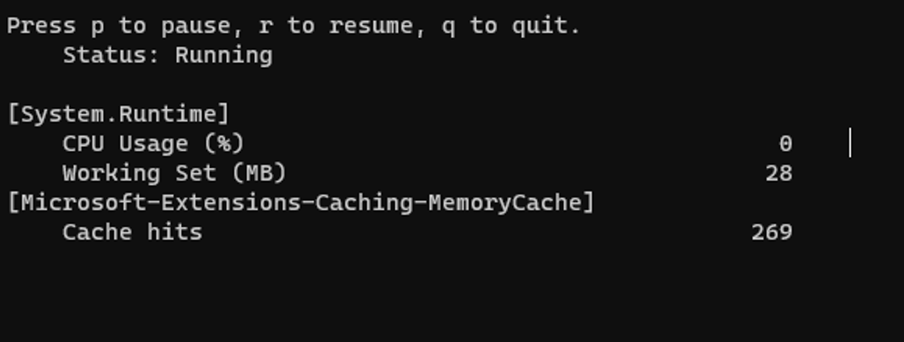
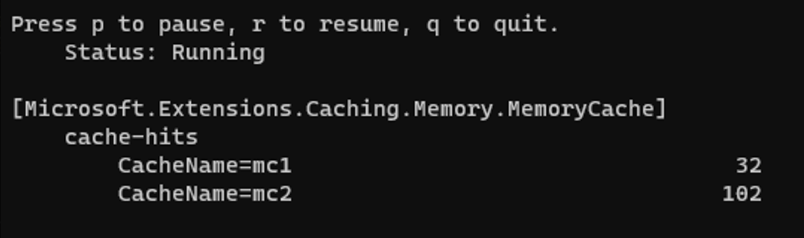
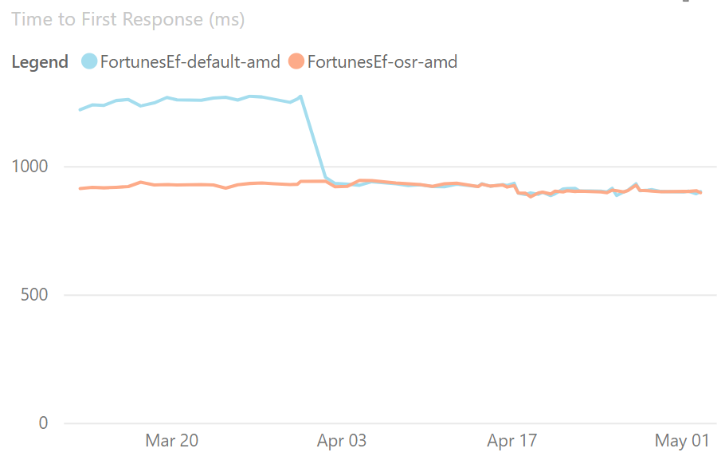
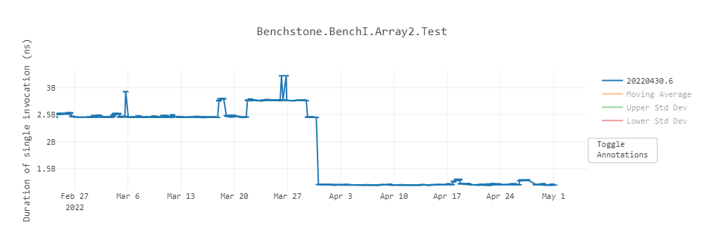

Today we released .NET 7 Preview 4. The fourth preview of .NET 7 includes enhancements to observability in the .NET implementation of OpenTelemetry, the addition of properties to track microseconds and nanonseconds in date and time structures, new metrics for caching extensions, performance-boosting "on stack replacement," APIs to work with `.tar` archives, and additional features as part of an ongoing effort to improve the performance of and add features to regular expressions in .NET 7.

You can [download .NET 7 Preview 4](https://dotnet.microsoft.com/download/dotnet/7.0), for Windows, macOS, and Linux.

* [Installers and binaries](https://dotnet.microsoft.com/download/dotnet/7.0)
* [Container images](https://hub.docker.com/_/microsoft-dotnet)
* [Linux packages](https://github.com/dotnet/core/blob/master/release-notes/7.0/)
* [Release notes](https://github.com/dotnet/core/tree/master/release-notes/7.0)
* [Known issues](https://github.com/dotnet/core/blob/main/release-notes/7.0/known-issues.md)
* [GitHub issue tracker](https://github.com/dotnet/core/issues)

.NET 7 Preview 4 has been tested with Visual Studio 17.3 Preview 1. We recommend you use the [preview channel builds](https://visualstudio.com/preview) if you want to try .NET 7 with Visual Studio family products. Visual Studio for Mac support for .NET 7 previews isn’t available yet but is coming soon. Now, let's get into some of the latest updates in this release.

## .NET Libraries: Nullable annotations for Microsoft.Extensions

[#43605](https://github.com/dotnet/runtime/issues/43605)

We have finished annotating the `Microsoft.Extensions.*` libraries for nullability. In .NET 7 Preview 4, all `Microsoft.Extensions.*` libraries have been fully annotated for nullability.

This work wouldn't have been possible without [@maxkoshevoi](https://github.com/maxkoshevoi)'s multiple-month effort. Starting with the first PR in August 2021, all the way to the final PR in April 2022, this was a lot of work that is greatly appreciated by the .NET community.

> _It’s a really great feeling to know that if you don’t like something about libraries you are using (or even the framework itself), you can go and improve it yourself._ - Maksym

### Contributor spotlight: Maksym Koshovyi

Microsoft's Eric Erhardt reached out to Maksym to thank him for his contributions and learn more about his passion for open source software and .NET. We are grateful for his contributions and would like to highlight his story. In Maksym's own words:


My name is Maksym Koshovyi, and I am from Kharkiv, Ukraine.

I've loved programming since school and been doing it for over 8 years (past 4 even got paid to do it 😄). Learned C# early on and never switched. Such a great language, framework and community! Always loved how easy it is to throw together a WinForms app in a couple of hours, or an API, or even a mobile app (without ever switching to Java or Swift). Also always enjoyed the language itself and the tooling around it that makes it easy to fall into the pit of success.

Ironically, my first contribution ever was a [Roslyn analyzer](https://github.com/dotnet/roslyn-analyzers/pull/2717). I got so used to being warned if I do stupid things, that when it didn't happen I've dedicated a day to fixing it. Since then I've made many small contributions here or there. Two of the biggest ones for now are in `XamarinCommunityToolkit` and runtime. It's a really great feeling to know that if you don't like something about libraries you are using (or even the framework itself), you can go and improve it yourself. Guess it's something similar to driving a car you know how to disassemble and fix yourself.

What's also great about contributing is that you learn so much! All projects are different, and having more perspectives on how things could be done always helps. I always find myself implementing something I've found on github in my pet projects. Another thing is feeling that your contribution will make someone else's life a bit easier. Always feels good thinking about it.

But none of this would be possible without the team that encourages contributions, discusses the issues and helps with PR reviews. Thank you so much for creating such a welcoming and open environment!

_You're very welcome, Maksym! Thank YOU!_ - .NET Team

## Observability

The following enhancements were made as part of the ongoing effort to support observability in .NET 7 via [OpenTelemetry](https://opentelemetry.io/).

### Introducing Activity.Current change event

[#67276](https://github.com/dotnet/runtime/issues/67276)

A typical implementation of distributed tracing uses an `AsyncLocal<T>` to track the "span context" of managed threads. Changes to the span context are tracked by using the `AsyncLocal<T>` constructor that takes the `valueChangedHandler` parameter. However, with [`Activity`](https://docs.microsoft.com/dotnet/api/system.diagnostics.activity) becoming the standard to represent spans, as used by OpenTelemetry, it is impossible to set the value changed handler since the context is tracked `via Activity.Current`. The new change event can be used instead to receive the desired notifications.


```C#
    public partial class Activity : IDisposable
    {
        public static event EventHandler<ActivityChangedEventArgs>? CurrentChanged;
    }
```

#### Usage Example

```C#
    Activity.CurrentChanged += CurrentChanged;

    void CurrentChanged(object? sender, ActivityChangedEventArgs e)
    {
        Console.WriteLine($"Activity.Current value changed from Activity: {e.Previous.OperationName} to Activity: {e.Current.OperationName}");
    }

```

### Expose performant Activity properties enumerator methods 

[#67207](https://github.com/dotnet/runtime/issues/67207)

The exposed methods can be used in the performance-critical scenarios to enumerate the Activity Tags, Links, and Events properties without any extra allocations and with fast items access.

```C#
namespace System.Diagnostics
{
    partial class Activity
    {
        public Enumerator<KeyValuePair<string,object>> EnumerateTagObjects();
        public Enumerator<ActivityLink> EnumerateLinks();
        public Enumerator<ActivityEvent> EnumerateEvents();
    
        public struct Enumerator<T>
        {
            public readonly Enumerator<T> GetEnumerator();
            public readonly ref T Current;
            public bool MoveNext();
        }
    }
}
```

#### Usage Example

```C#
    Activity a = new Activity("Root");

    a.SetTag("key1", "value1");
    a.SetTag("key2", "value2");

    foreach (ref readonly KeyValuePair<string, object?> tag in a.EnumerateTagObjects())
    {
        Console.WriteLine($"{tag.Key}, {tag.Value}");
    }
```
    
## Adding Microseconds and Nanoseconds to TimeStamp, DateTime, DateTimeOffset, and TimeOnly 

[#23799](https://github.com/dotnet/runtime/issues/23799)

Prior to Preview 4, the lowest increment of time available in the various date and time structures was the "tick" available in the [Ticks](https://docs.microsoft.com/dotnet/api/system.datetime.ticks) property. In .NET, a single tick is 100ns. Developers traditionally have had to perform computations on the "tick" value to determine micrososecond and nanosecond values. Preview 4 addresses that by introducing both microseconds and milliseconds to the date and time implementations. Here is the new API surface area:

```C#
namespace System {
    public struct DateTime {
        public DateTime(int year, int month, int day, int hour, int minute, int second, int millisecond, int microsecond);
        public DateTime(int year, int month, int day, int hour, int minute, int second, int millisecond, int microsecond, System.DateTimeKind kind);
        public DateTime(int year, int month, int day, int hour, int minute, int second, int millisecond, int microsecond, System.Globalization.Calendar calendar);
        public int Microsecond { get; }
        public int Nanosecond { get; }
        public DateTime AddMicroseconds(double value);
    }
    public struct DateTimeOffset {
        public DateTimeOffset(int year, int month, int day, int hour, int minute, int second, int millisecond, int microsecond, System.TimeSpan offset);
        public DateTimeOffset(int year, int month, int day, int hour, int minute, int second, int millisecond, int microsecond, System.TimeSpan offset, System.Globalization.Calendar calendar);
        public int Microsecond { get; }
        public int Nanosecond { get; }
        public DateTimeOffset AddMicroseconds(double microseconds);
    }
    public struct TimeSpan {
        public const long TicksPerMicrosecond = 10L;
        public const long NanosecondsPerTick = 100L;
        public TimeSpan(int days, int hours, int minutes, int seconds, int milliseconds, int microseconds);
        public int Microseconds { get; }
        public int Nanoseconds { get; }
        public double TotalMicroseconds { get; }
        public double TotalNanoseconds { get; }
        public static TimeSpan FromMicroseconds(double microseconds);
    }
    public struct TimeOnly {
        public TimeOnly(int day, int hour, int minute, int second, int millisecond, int microsecond);
        public int Microsecond { get; }
        public int Nanosecond { get; }
    }
}
```

Thanks to @ChristopherHaws and @deeprobin helping in the design and implementation.

## More improvements and new APIs for System.Text.RegularExpressions

For preview 4 we are adding the remaining planned APIs in order to add span support into our Regex library. The changes span several issues:

- [Augment Regex extensibility point for better perf and span-based matching](https://github.com/dotnet/runtime/issues/59629)
- [[API Proposal]: Add Regex.Enumerate(ReadOnlySpan<char>) which is allocation free](https://github.com/dotnet/runtime/issues/65011)
- [Overhaul Regex's handling of RegexOptions.IgnoreCase](https://github.com/dotnet/runtime/issues/61048)

These APIs are amortized allocation-free. The main span-based APIs being added for Preview 4 are:

- `Regex.IsMatch(ReadOnlySpan<char> input)`:  Indicates whether the regular expression finds a match in the input span.
- `Regex.Count(ReadOnlySpan<char> input)`: Searches an input string for all occurrences of a regular expression and returns the number of matches.
- `Regex.EnumerateMatches(ReadOnlySpan<char> input)`: Searches an input span for all occurrences of a regular expression and returns a ValueMatchEnumerator to lazily iterate over the matches.

We have also done a lot of work that enhances Regex performance in general, with improvements like:

- Improving the handling of more common Regex sets
- Improving the performance in the logic that finds possible positions where a match could exist.
- Use spans in some of our internal types to avoid allocations where possible which makes the engine go faster.
- Improve the logic for when a loop can be made atomic.

Finally we have also made some improvements on the code that is generated by the Regex source generator in order to make the code more readable and easier to debug, as well as enable projects with multiple source generated regex patterns to share common code between them.

## Added metrics for `Microsoft.Extensions.Caching`

[#50406](https://github.com/dotnet/runtime/issues/50406)

For preview 4 we added metrics support for `IMemoryCache`. The main APIs being added for Preview 4 are:

- `MemoryCacheStatistics` which holds cache hit/miss/estimated size and count for `IMemoryCache`
- `GetCurrentStatistics`:  returns an instance of `MemoryCacheStatistics`, or null when `TrackStatistics` flag is not enabled. The library has a built-in implementation available for `MemoryCache`.

`GetCurrentStatistics()` API allows app developers to use either event counters or metrics APIs to track statistics for one or more memory cache. Note, using these APIs for getting statistics for multiple caches is possible but requires developer to write their own meter.

Issue [#67770](https://github.com/dotnet/runtime/issues/67770) tracks adding built-in meters into the library to help improve developer experience with monitoring caches.

### How to use the APIs

`GetCurrentStatistics()` API (based on [#50406](https://github.com/dotnet/runtime/issues/50406)) allows app developers to use either event counters or metrics APIs to track statistics for one or more memory caches with code snippets. 

With `IMemoryCache.GetCurrentStatistics()`, the user now has support for the following use cases:

- One cache with either event counters or metrics APIs
- Multiple caches with metrics API

### Using `IMemoryCache.GetCurrentStatistics()` for one memory cache

Use the [`AddMemoryCache`](https://apisof.net/catalog/3cb04c03-2845-725f-eebb-1eb7ba5d0515) API to instantiate a single memory cache and via DI get it injected to enable them calling `GetCurrentStatistics`.

#### Sample usage/screenshot for event counter:

```c#
// when using `services.AddMemoryCache(options => options.TrackStatistics = true);` to instantiate

    [EventSource(Name = "Microsoft-Extensions-Caching-Memory")]
    internal sealed class CachingEventSource : EventSource
    {
        public CachingEventSource(IMemoryCache memoryCache) { _memoryCache = memoryCache; }
        protected override void OnEventCommand(EventCommandEventArgs command)
        {
            if (command.Command == EventCommand.Enable)
            {
                if (_cacheHitsCounter == null)
                {
                    _cacheHitsCounter = new PollingCounter("cache-hits", this, () =>
                        _memoryCache.GetCurrentStatistics().CacheHits)
                    {
                        DisplayName = "Cache hits",
                    };
                }
            }
        }
    }
```

Helps them view stats below with `dotnet-counters` tool:



### Using `IMemoryCache.GetCurrentStatistics()` for multiple memory caches

In order to get stats for more than one memory cache in the app, the user may use metrics APIs in their own code, so long as they have a way of distinguishing their caches by name or ID:

#### sample usage/screenshot for multiple caches using metrics APIs

```cs
 Meter s_meter = new Meter("Microsoft.Extensions.Caching.Memory.MemoryCache", "1.0.0");
 var cacheHitsMetrics = s_meter.CreateObservableGauge<int>("cache-hits", GetCacheHits);

// metrics callback for cache hits
static IEnumerable<Measurement<int>> GetCacheHits()
{
    return new Measurement<int>[]
    {
            // or measurements could be looped or read from a real queue somewhere:
            new Measurement<int>(mc1.GetCurrentStatistics().CacheHits, new KeyValuePair<string,object>("CacheName", "mc1")),
            new Measurement<int>(mc2.GetCurrentStatistics().CacheHits, new KeyValuePair<string,object>("CacheName", "mc2")),
            new Measurement<int>(mc3.GetCurrentStatistics().CacheHits, new KeyValuePair<string,object>("CacheName", "mc3")),
    };
}
```

Sample stats with `dotnet-counters` tool:



Each metrics would need to create its own observable gauge (one for hits, then misses, etc.) and each callback function for the gauge iterates through list of caches creating measurements.

## Aded new Tar APIs

[Implement Tar APIs - dotnet/runtime#67883](https://github.com/dotnet/runtime/pull/67883)

For Preview 4, we added the new `System.Formats.Tar` assembly, which contains cross-platform APIs that allow reading, writing, archiving and extracting of Tar archives.

### Usage examples

For the most common usage (extracting and archiving) the following APIs are available:

```csharp
// Generates a tar archive where all the entry names are prefixed by the root directory 'SourceDirectory'
TarFile.CreateFromDirectory(sourceDirectoryName: "/home/dotnet/SourceDirectory/", destinationFileName: "/home/dotnet/destination.tar", includeBaseDirectory: true);

// Extracts the contents of a tar archive into the specified directory, but avoids overwriting anything found inside
TarFile.ExtractToDirectory(sourceFileName: "/home/dotnet/destination.tar", destinationDirectoryName: "/home/dotnet/DestinationDirectory/", overwriteFiles: false);
```

We also offer variants that allow extracting from a stream or archiving into a stream:

```csharp
// Generates a tar archive where all the entry names are prefixed by the root directory 'SourceDirectory'
using MemoryStream archiveStream = new();
TarFile.CreateFromDirectory(sourceDirectoryName: @"D:\SourceDirectory\", destination: archiveStream, includeBaseDirectory: true);

// Extracts the contents of a stream tar archive into the specified directory, and avoids overwriting anything found inside
TarFile.ExtractToDirectory(source: archiveStream, destinationDirectoryName: @"D:\DestinationDirectory\", overwriteFiles: false);
```

Additionally, the entries of an archive can be traversed one-by-one using the reader:

```csharp
// Opens an archive for reading individual entries, and closes the archive stream after the reader disposal
using FileStream archiveStream = File.OpenRead("/home/dotnet/SourceDirectory/source.tar");
using TarReader reader = new(archiveStream, leaveOpen: false);
TarEntry? entry;
while ((entry = reader.GetNextEntry()) != null)
{
    // Extracts an entry to the desired destination, and overwrites if an entry with the same name is found
    string destinationFileName = Path.Join("/home/dotnet/DestinationDirectory", entry.Name);
    entry.ExtractToFile(destinationFileName, overwrite: true);
}
```

And entries can also be written one-by-one into an archive stream using the writer:

```csharp
using FileStream archiveStream = File.OpenWrite(@"D:\DestinationDirectory\destination.tar");
// Create the archive in the PAX format and write individual entries, closing the stream after the writer disposal
using TarWriter writer = new(archiveStream, TarFormat.Pax, leaveOpen: false);

// Add an entry from an existing file
writer.WriteEntry(fileName: @"D:\SourceDirectory\file.txt", entryName: "file.txt");

// Or write an entry from scratch
PaxTarEntry entry = new(entryType: TarEntryType.Directory, entryName: "directory");
writer.WriteEntry(entry);
```

We can also pair these new APIs with stream-based compression methods, like `System.IO.Compression.GZipStream`.

Extracting the contents from a compressed tar archive into the filesystem looks like this:

```cssharp
using FileStream compressedStream = File.OpenRead("/home/dotnet/SourceDirectory/compressed.tar.gz");
using GZipStream decompressor = new(compressedStream, CompressionMode.Decompress);
TarFile.ExtractToDirectory(source: decompressor, destinationDirectoryName: "/home/dotnet/DestinationDirectory/", overwriteFiles: false);
```

Reading individual entries from a compressed tar archive:

```csharp
using FileStream compressedStream = File.OpenRead(@"D:\SourceDirectory\compressed.tar.gz");
using GZipStream decompressor = new(compressedStream, CompressionMode.Decompress);
using TarReader reader = new(decompressor, leaveOpen: true);
TarEntry? entry;

while ((entry = GetNextEntry(copyData: true)) != null)
{
    Console.WriteLine($"Entry type: {entry.EntryType}, entry name: {entry.Name}");
}
```

Writing the contents of a directory into a compressed tar archive:

```csharp
using MemoryStream archiveStream = new();
TarFile.CreateFromDirectory(sourceDirectoryName: "/home/dotnet/SourceDirectory/", destination: archiveStream, includeBaseDirectory: true);
using FileStream compressedStream = File.Create("/home/dotnet/DestinationDirectory/compressed.tar.gz");
using GZipStream compressor = new(compressedStream, CompressionMode.Compress);
archiveStream.Seek(0, SeekOrigin.Begin);
archiveStream.CopyTo(compressor);
```

Writing individual entries into a compressed tar archive:

```csharp
using MemoryStream archiveStream = new();
using (TarWriter writer = new TarWriter(archiveStream, TarFormat.Pax, leaveOpen: true))
{
    // Add an entry from an existing file
    writer.WriteEntry(fileName: @"D:\SourceDirectory\file.txt", entryName: "file.txt");

    // Or write an entry from scratch
    PaxTarEntry entry = new(entryType: TarEntryType.Directory, entryName: "directory");
    writer.WriteEntry(entry);
}

using FileStream compressedStream = File.Create(@"D:\DestinationDirectory\compressed.tar.gz");
using GZipStream compressor = new(compressedStream, CompressionMode.Compress);
archiveStream.Seek(0, SeekOrigin.Begin);
archiveStream.CopyTo(compressor);
```

### Notes

- We are not yet including any async APIs. They will be included in a future preview release.
- In the Ustar, PAX and GNU formats, we do not yet support the `UName`, `GName`, `DevMajor` and `DevMinor` fields.
- In the GNU format, we won't support the rare entry types for writing, like sparse files, multi-volume, renamed or symlinked, tape volume.

## What's new in CodeGen

Many thanks to to the JIT community contributors who submitted these important PRs:
    
@sandreenko: [66983](https://github.com/dotnet/runtime/pull/66983); @SingleAccretion: [66558](https://github.com/dotnet/runtime/pull/66558), [66251](https://github.com/dotnet/runtime/pull/66251), [65803](https://github.com/dotnet/runtime/pull/65803), [64581](https://github.com/dotnet/runtime/pull/64581), [67213](https://github.com/dotnet/runtime/pull/67213), [67208](https://github.com/dotnet/runtime/pull/67208), [67206](https://github.com/dotnet/runtime/pull/67206),[67486](https://github.com/dotnet/runtime/pull/67486), [67400](https://github.com/dotnet/runtime/pull/67400); @SkiFoD: [65072](https://github.com/dotnet/runtime/pull/65072).

Other updates to CodeGen include dynamic PGO: [65922](https://github.com/dotnet/runtime/pull/65922), Arm64: [66621](https://github.com/dotnet/runtime/pull/66621), [66407](https://github.com/dotnet/runtime/pull/66407), [66902](https://github.com/dotnet/runtime/pull/66902), [67490](https://github.com/dotnet/runtime/pull/67490), [67384](https://github.com/dotnet/runtime/pull/67384); loop optimizations: [68105](https://github.com/dotnet/runtime/pull/68105); and general optimizations: [67205](https://github.com/dotnet/runtime/pull/67205), [67395](https://github.com/dotnet/runtime/pull/67395), [68055](https://github.com/dotnet/runtime/pull/68055).

## On Stack Replacement (aka OSR)

On Stack Replacement allows the runtime to change the code executed by currently running methods in the middle of method execution, while those methods are active "on stack." It serves as a complement to tiered compilation.

[#65675](https://github.com/dotnet/runtime/pull/65675) enabled OSR by default on x64 and Arm64, and enabled quick jitting for methods with loops on those same platforms.  

OSR allows long-running methods to switch to more optimized versions mid-execution, so the runtime can jit all methods quickly at first and then transition to more optimized versions when those methods are called frequently (via tiered compilation) or have long-running loops (via OSR).

### Performance Impact

OSR improves startup time. Almost all methods are now initially jitted by the quick jit. We have seen 25% improvement in startup time in jitting-heavy applications like Avalonia “IL” spy, and the various TechEmpower benchmarks we track show 10-30% improvements in time to first request (see chart below: OSR was enabled by default on March 30).



OSR can also improve performance of applications, and in particular, applications using Dynamic PGO, as methods with loops are now better optimized. For example, the `Array2` microbenchmark showed dramatic improvement when OSR was enabled.



### Further technical details

See the [OSR Design Document](https://github.com/dotnet/runtime/blob/main/docs/design/features/OnStackReplacement.md) for details on how OSR works.

See [OSR Next Steps](https://github.com/dotnet/runtime/issues/33658) for details on the work that went into enabling OSR, and possible future enhancements.
    
## Central Package Management
    
Dependency management is a core feature of NuGet. Managing dependencies for a single project can be easy. Managing dependencies for multi-project solutions can prove to be difficult as they start to scale in size and complexity. In situations where you manage common dependencies for many different projects, you can leverage NuGet’s new [central package management features](https://docs.microsoft.com/nuget/consume-packages/Central-Package-Management) to do all of this from the ease of a single location.
    
## Targeting .NET 7

To target .NET 7, you need to use a .NET 7 Target Framework Moniker (TFM) in your project file. For example:

```xml
<TargetFramework>net7.0</TargetFramework>
```

The full set of .NET 7 TFMs, including operating-specific ones follows.

* `net7.0`
* `net7.0-android`
* `net7.0-ios`
* `net7.0-maccatalyst`
* `net7.0-macos`
* `net7.0-tvos`
* `net7.0-windows`

We expect that upgrading from .NET 6 to .NET 7 should be straightforward. Please report any breaking changes that you discover in the process of testing existing apps with .NET 7.

## Support

.NET 7 is a **Current** release, meaning it will receive free support and patches for 18 months from the release date. It's important to note that the quality of all releases is the same. The only difference is the length of support. For more about .NET support policies, see the [.NET and .NET Core official support policy](https://dotnet.microsoft.com/platform/support/policy/dotnet-core).

## Breaking changes

You can find the most recent list of breaking changes in .NET 7 by reading the [Breaking changes in .NET 7](https://docs.microsoft.com/dotnet/core/compatibility/7.0) document. It lists breaking changes by area and release with links to detailed explanations.

To see what breaking changes are proposed but still under review, follow the [Proposed .NET Breaking Changes GitHub issue](https://github.com/dotnet/core/issues/7131).

## Roadmaps

Releases of .NET include products, libraries, runtime, and tooling, and represent a collaboration across multiple teams inside and outside Microsoft. You can learn more about these areas by reading the product roadmaps:

* [ASP.NET Core 7 and Blazor Roadmap](https://github.com/dotnet/aspnetcore/issues/39504)
* [EF 7 Roadmap](https://docs.microsoft.com/ef/core/what-is-new/ef-core-7.0/plan)
* [ML.NET](https://github.com/dotnet/machinelearning/blob/main/ROADMAP.md)
* [.NET MAUI](https://github.com/dotnet/maui/wiki/Roadmap)
* [WinForms](https://github.com/dotnet/winforms/blob/main/docs/roadmap.md)
* [WPF](https://github.com/dotnet/wpf/blob/main/roadmap.md)
* [NuGet](https://github.com/NuGet/Home/issues/11571)
* [Roslyn](https://github.com/dotnet/roslyn/blob/main/docs/Language%20Feature%20Status.md)
* [Runtime](https://github.com/dotnet/core/blob/main/roadmap.md)

## Closing

We appreciate and [thank you](https://dotnet.microsoft.com/thanks) for your all your support and contributions to .NET. Please [give .NET 7 Preview 4 a try](https://dotnet.microsoft.com/download/dotnet/7.0) and tell us what you think!
