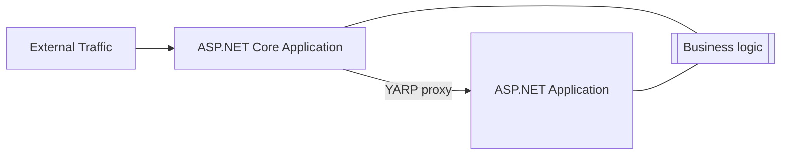
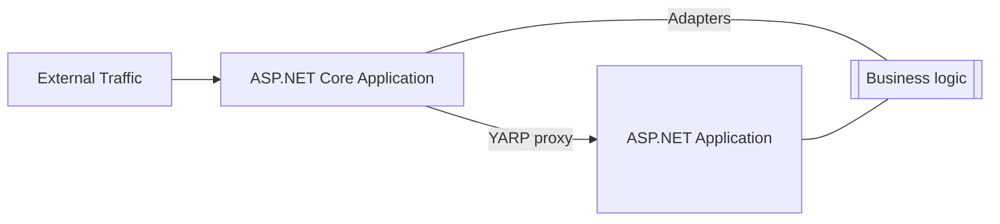
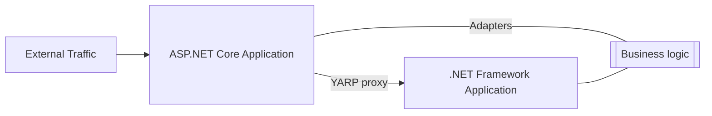
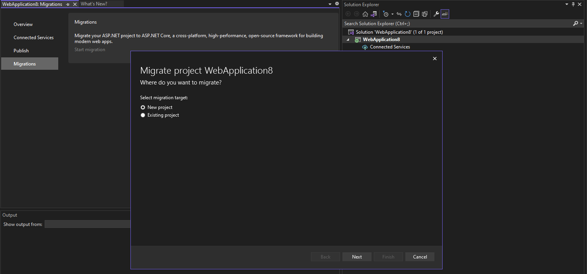
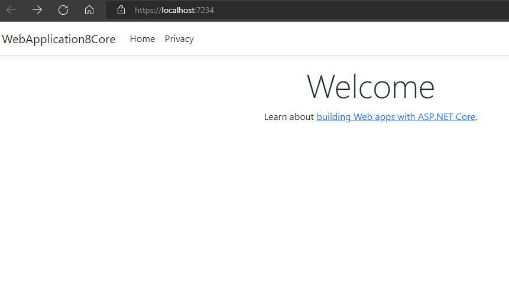
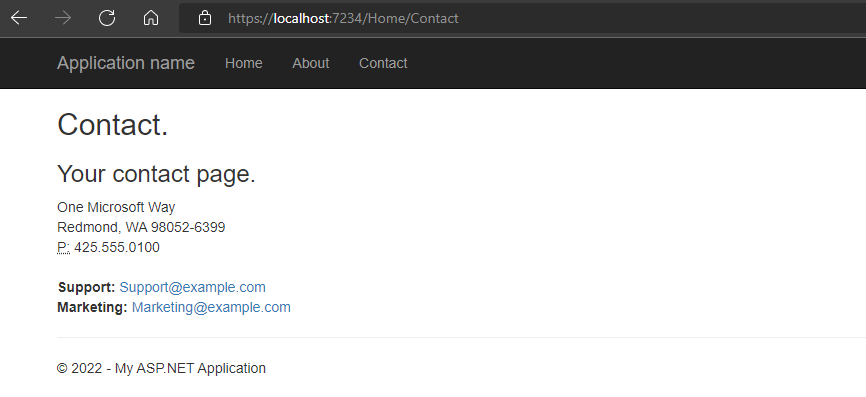

ASP.NET Core is the modern, unified, web framework for .NET that handles all your web dev needs. It is fully open source, cross-platform, and full of innovative features: Blazor, SignalR, gRPC, minimal APIs, etc. Over the past few years, we have seen many customers wanting to move their application from ASP.NET to ASP.NET Core. Customers that have migrated to ASP.NET Core have achieved huge cost savings, including [Azure Cosmos DB](https://devblogs.microsoft.com/dotnet/the-azure-cosmos-db-journey-to-net-6/), [Microsoft Graph](https://devblogs.microsoft.com/dotnet/microsoft-graph-dotnet-6-journey/), and [Azure Active Directory](https://devblogs.microsoft.com/dotnet/azure-active-directorys-gateway-is-on-net-6-0/).

We have also seen many of the challenges that customers face as they go through this journey. This ranges from dependencies that are not available on ASP.NET Core as well as the time required for this migration. We have been on a journey ourselves to help ease this migration for you as customers, including work over the past year on the [.NET Upgrade Assistant](https://dotnet.microsoft.com/platform/upgrade-assistant). Today we are announcing more tools, libraries and patterns that will allow applications to make the move to ASP.NET Core with less effort and in an incremental fashion. This work will be done on [GitHub in a new repo](https://github.com/dotnet/systemweb-adapters) where we are excited to engage with the community to ensure we build the right set of adapters and tooling.

Check out Mike Rousos's BUILD session below to see the new incremental ASP.NET migration experience in action, or read on to learn more.

<iframe width="960" height="540" src="https://www.youtube.com/embed/P96l0pDNVpM" title="Tooling for Incremental ASP.NET Core Migrations" frameborder="0" allow="accelerometer; autoplay; clipboard-write; encrypted-media; gyroscope; picture-in-picture" allowfullscreen></iframe> 

## Current Challenges

There are a number of reasons why this process is slow and difficult, and we have taken a step back to look at the examples of external and internal partners as to what is the most pressing concerns for them. This boiled down to a couple key themes we wanted to address:

- How can a large application incrementally move to ASP.NET Core while still innovating and providing value to its business?
- How can libraries that were written against `System.Web.HttpContext` be modernized without duplication and a full rewrite?

Let me dive into each of these issues to share what we have seen and what work we are doing to help.

### Incremental Migration

Many large applications are being used daily for business-critical applications. These need to continue to function and cannot be put on hold for a potentially long migration to ASP.NET Core. This means that while a migration is occurring, the application needs to still be production ready and new functionality can be added and deployed as usual.

A pattern that has proven to work for this kind of process is the [Strangler Fig Pattern](https://docs.microsoft.com/azure/architecture/patterns/strangler-fig). The Strangler Fig Pattern is used to replace an existing legacy system a piece at a time until the whole system has been updated and the old system can be decommissioned. This pattern is one that is fairly easy to grasp in the abstract, but the question often arises how to actually use this in practice. This is part of the incremental migration journey that we want to provide concrete guidance around.

### System.Web.dll usage in supporting libraries

ASP.NET apps depend on APIs in *System.Web.dll* for accessing things like cookies, headers, session, and other values from the current request. ASP.NET apps often depend on libraries that depends on these APIs, like `HttpContext`, `HttpRequest`, `HttpResponse`, etc. However, these types are not available in ASP.NET Core and refactoring this code in an existing code base is very difficult.

To simplify this part of the migration journey, we are introducing a set of adapters that implement the shape of `System.Web.HttpContext` against `Microsoft.AspNetCore.Http.HttpContext`. These adapters are contained in the new package `Microsoft.AspNetCore.SystemWebAdapters`. This package will allow you to continue using your existing logic and libraries while additionally targeting .NET Standard 2.0, .NET Core 3.1, or .NET 6.0 to support running on ASP.NET Core.

## Example

Let's walk through what an incremental migration might look like for an application.  We'll start with an ASP.NET application that has supporting libraries using System.Web based APIs:


This application is hosted on IIS and has a set of processes around it for deployment and maintenance. The migration process aims to move towards ASP.NET Core without compromising the current deployment.

The first step is to introduce a new application based on ASP.NET Core that will become the entry point. Traffic will enter the ASP.NET Core app and if the app cannot match a route, it will proxy the request to the ASP.NET application via [YARP](https://microsoft.github.io/reverse-proxy/). The majority of code will continue to be in the ASP.NET application, but the ASP.NET Core app is now set up to start migrating routes to.

This new application can be deployed to any place that makes sense. With ASP.NET Core you have multiple options: IIS/Kestrel, Windows/Linux, etc. However, keeping deployment similar to the ASP.NET app will simplify the migration process.



In order to start moving over business logic that relies on `HttpContext`, the libraries need to be built against `Microsoft.AspNetCore.SystemWebAdapters`. This allows libraries using System.Web APIs to target .NET Framework, .NET Core, or .NET Standard 2.0. This will ensure that the libraries are using surface area that is available with both ASP.NET and ASP.NET Core:



Now we can start moving routes over one at a time to the ASP.NET Core app. These could be MVC or Web API controllers (or even a single method from a controller), Web Forms ASPX pages, HTTP handlers, or some other implementation of a route. Once the route is available in the ASP.NET Core app, it will then be matched and served from there.


During this process, additional services and infrastructure will be identified that must be moved to run on .NET Core. Some options include (listed in order of maintainability):

1. Move the code to shared libraries
2. Link the code in the new project
3. Duplicate the code

Over time, the core app will start processing more of the routes served than the .NET Framework Application:



During this process, you may have the route in both the ASP.NET Core and the ASP.NET Framework applications. This could allow you to perform some A/B testing to ensure functionality is as expected.

Once the .NET Framework Application is no longer needed, it may be removed:


At this point, the application as a whole is running on the ASP.NET Core application stack, but it's still using the adapters from this repo. At this point, the goal is to remove the use of the adapters until the application is relying solely on the ASP.NET Core application framework:


By getting your application directly on ASP.NET Core APIs, you can access the performance benefits of ASP.NET Core as well as take advantage of new functionality that may not be available behind the adapters.

## Getting Started

Now that we've laid the groundwork of the Strangler Fig pattern and the System.Web adapters, let's take an application and see what we need to do to apply this.

In order to work through this, we'll make use of a preview [Visual Studio extension](https://marketplace.visualstudio.com/items?itemName=WebToolsTeam.aspnetprojectmigrations) that helps with some of the steps we'll need to do. You'll also need the latest [Visual Studio Preview](https://visualstudio.com/preview) to use this extension.

We're going to take an ASP.NET MVC app and start the migration process. To start, right click on the project and select `Migrate Project`, which opens a tool window with an option to start migration. The Migrations wizard opens:



You can set up your solution with a new project or you can select an existing ASP.NET Core project to use. This will do a few things to the ASP.NET Core project:

- Add `Yarp.ReverseProxy` and add initial configuration for that to access the original framework app (referred to as the `fallback`)
- Add an environment variable to `launchSettings.json` to set the environment variable needed to access the original framework app
- Add `Microsoft.AspNetCore.SystemWebAdapters`, registers the service, and inserts the middleware for it

The startup code for the ASP.NET Core app will now look like this:

```csharp
using Microsoft.AspNetCore.SystemWebAdapters;
var builder = WebApplication.CreateBuilder(args);
builder.Services.AddSystemWebAdapters();
builder.Services.AddReverseProxy().LoadFromConfig(builder.Configuration.GetSection("ReverseProxy"));

// Add services to the container.
builder.Services.AddControllersWithViews();

var app = builder.Build();

// Configure the HTTP request pipeline.
if (!app.Environment.IsDevelopment())
{
    app.UseExceptionHandler("/Home/Error");
    // The default HSTS value is 30 days. You may want to change this for production scenarios, see https://aka.ms/aspnetcore-hsts.
    app.UseHsts();
}

app.UseHttpsRedirection();
app.UseStaticFiles();

app.UseRouting();

app.UseAuthorization();
app.UseSystemWebAdapters();

app.MapControllerRoute(
    name: "default",
    pattern: "{controller=Home}/{action=Index}/{id?}");
app.MapReverseProxy();

app.Run();
```

At this point, you may run the ASP.NET Core app and it will proxy all requests through to the framework app that do not match in the core app. If you use the default template, you'll see the following behavior:

If you go to `/`, it will show you the `/Home/Index` of the ASP.NET Core app:



If you go to a page that doesn't exist on the ASP.NET Core but does exist on the framework app, it will now surface:



Notice that the URL is the same (`https://localhost:7234`) but will proxy to the request to the framework app when needed. You are now set up to start bringing routes over to the core app, including libraries referencing `System.Web.dll`.

### Proxy support

The framework app will now be downstream of a reverse proxy. This means that some values, such as the request URL, will be different as it will not be using the public entry point. To update these values, turn on proxy support for the framework app with the following code in `Global.asax.cs` or `Global.asax.vb`:

```cs
protected void Application_Start()
{
  Application.AddSystemWebAdapters()
      .AddProxySupport(options => options.UseForwardedHeaders = true);
}
```

This change may cause additional impact on your application. Sorting that out will be part of the initial process of getting the Strangler Fig pattern implemented. Please file issues for challenges encountered here that are not already documented.

### Session support

Session works very differently between ASP.NET and ASP.NET Core. In order to provide a bridge between the two, the session support in the adapters is extensible. To have the same session behavior (and shared session state) between ASP.NET Core and ASP.NET, we are providing a way to populate the session state on core with the values from the framework app.

This set up will add a handler into the framework app that will allow querying of session state by the core app. This has potential issues of performance and security that should be taken into account, but it allows for a shared session state between the two apps.

In order to set this up, add the `Microsoft.AspNetCore.SystemWebAdapters.SessionState` package to both applications.

Next, add the services on the ASP.NET Core app:

```cs
builder.Services.AddSystemWebAdapters()
    .AddJsonSessionSerializer(options =>
    {
        // Serialization/deserialization requires each session key to be registered to a type
        options.RegisterKey<int>("test-value");
        options.RegisterKey<SessionDemoModel>("SampleSessionItem");
    })
    .AddRemoteAppSession(options =>
    {
        // Provide the URL for the remote app that has enabled session querying
        options.RemoteApp = new(builder.Configuration["ReverseProxy:Clusters:fallbackCluster:Destinations:fallbackApp:Address"]);

        // Provide a strong API key that will be used to authenticate the request on the remote app for querying the session
        options.ApiKey = "strong-api-key";
    });
```

This will register keys so that the session manager will know how to serialize and deserialize a given key, as well as tell it where the remote app is. Note that this now requires that the object be serializable by `System.Text.Json`, which may require altering some of the objects that are being stored in session.

Identifying keys may be challenging for a code base that has been using session values ad hoc. The first preview requires you to register them but does not help identify them. In a future update, we plan to log helpful messages and optionally throw if keys are found that are not registered.

Finally, add the following code on the framework app in a similar way in `Global.asax`:

```cs
protected void Application_Start()
{
  Application.AddSystemWebAdapters()
      .AddRemoteAppSession(
          options => options.ApiKey = "some-strong-key-value",
          options => options.RegisterKey<int>("some-key"));
}
```

Once this is set up, you'll be able to use `(int)HttpContext.Session["some-key"]` as you'd expect!

## Summary

Today we are introducing some tooling and libraries to help address incremental migration and help you move your ASP.NET applications forward faster and more easily.

There is more to do in this space, and we hope you find this helpful. We are developing this on GitHub at `https://github.com/dotnet/systemweb-adapters` and welcome issues and PRs to move this forward.

## Additional Links

- [GitHub project](https://github.com/dotnet/systemweb-adapters)
- [Sample project](https://github.com/dotnet/systemweb-adapters/tree/main/samples)
- [Build Session](https://mybuild.microsoft.com/sessions/54719170-8e68-4260-a40e-c1771d226ea2)
- [Migrate from ASP.NET to ASP.NET Core docs](https://docs.microsoft.com/aspnet/core/migration/proper-to-2x)