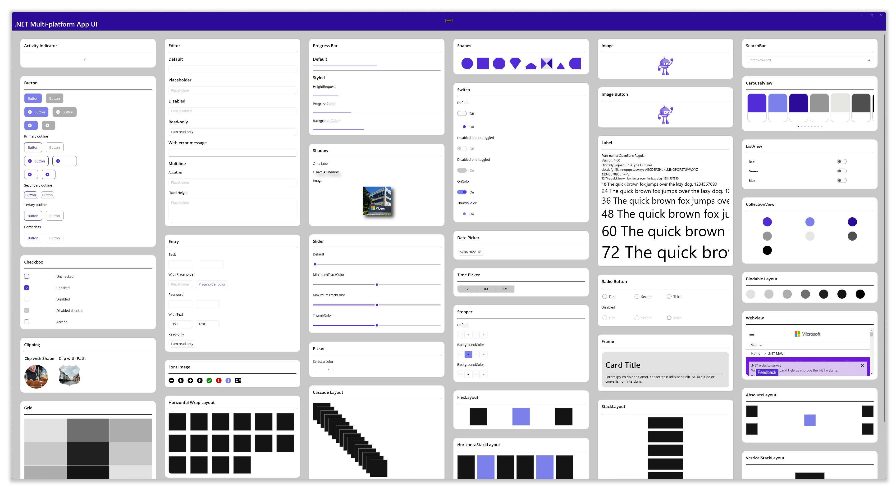
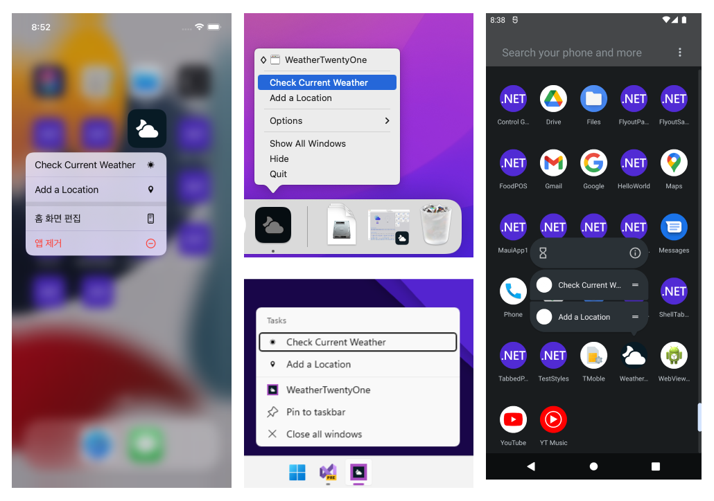
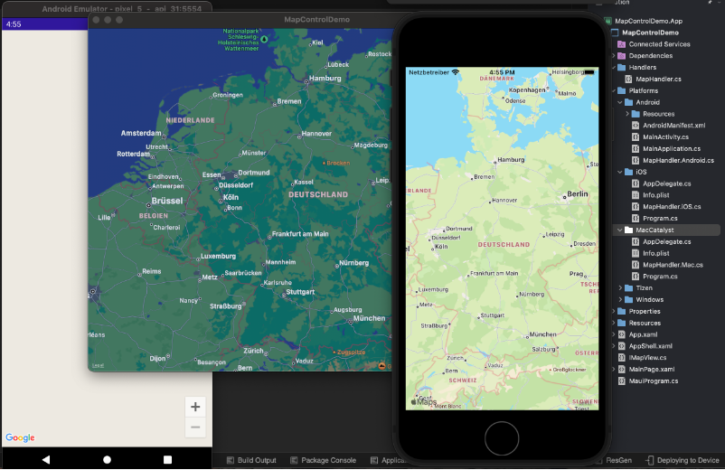
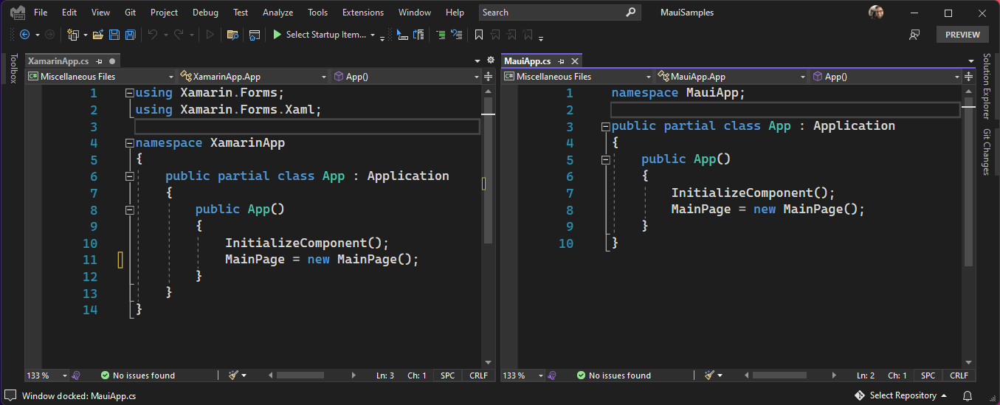
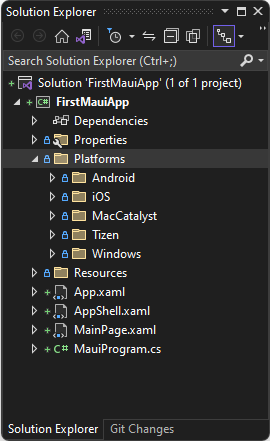
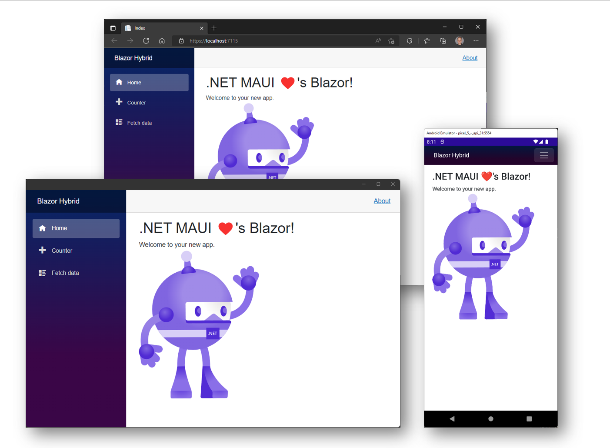
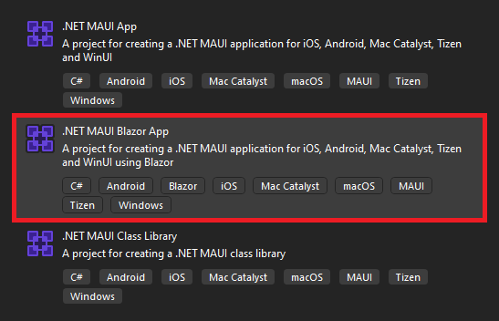
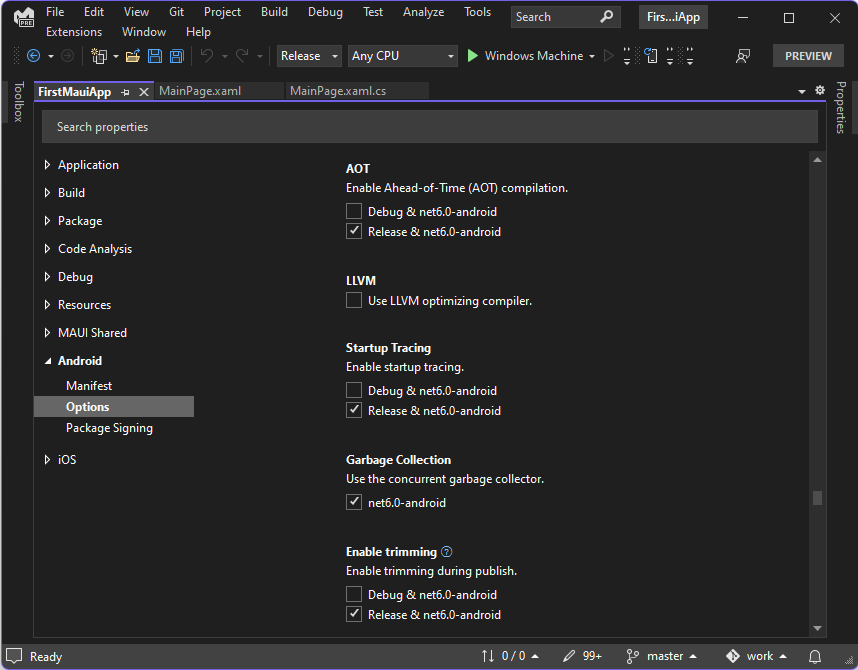
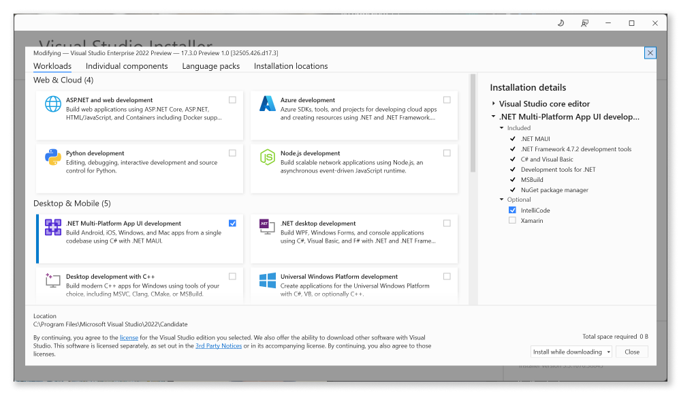

Welcome to [.NET Multi-platform App UI](https://dot.net/maui). This release marks a new milestone in our [multi-year journey](https://devblogs.microsoft.com/dotnet/introducing-net-multi-platform-app-ui/) to unify the .NET platform. Now you and over 5 million other .NET developers have a first-class, cross-platform UI stack targeting Android, iOS, macOS, and Windows to complement the .NET toolchain (SDK) and base class library (BCL). You can build anything with .NET.

> Join us at [Microsoft Build 2022](https://mybuild.microsoft.com/sessions/599c82b6-0c5a-4add-9961-48b85d9ffde0?source=sessions) where we'll give you a tour of all the updates for building native apps for any device with .NET and Visual Studio. &raquo; [Learn more](https://mybuild.microsoft.com/sessions/599c82b6-0c5a-4add-9961-48b85d9ffde0?source=sessions).

This is just the start of a new journey to create a desktop and mobile app experience that delights .NET developers. The foundation is now established for the broader .NET ecosystem to bring plugins, libraries, and services from .NET Framework and the old project system to .NET 6 and SDK style projects. Among those available today are:

- [DevExpress](https://www.devexpress.com/maui/)
- [GrialKit](https://grialkit.com)
- [Syncfusion](https://www.syncfusion.com/maui-controls)
- [Telerik UI for .NET MAUI](https://www.telerik.com/maui-ui)


|                                                                                                                  |                                                                                                  |                                                                            |
| :--------------------------------------------------------------------------------------------------------------- | ------------------------------------------------------------------------------------------------ | -------------------------------------------------------------------------- |
| [AndroidX](https://github.com/xamarin/AndroidX)                                                                  | [FreshMvvm.Maui](https://www.nuget.org/packages/FreshMvvm.Maui)                                  | [Plugin.StoreReview](https://www.nuget.org/packages/Plugin.StoreReview/)   |
| [AlohaKit](https://github.com/jsuarezruiz/AlohaKit)                                                              | [Google APIs for iOS](https://github.com/xamarin/GoogleAPIsForiOSComponents)                    | [Plugin.InAppBilling](https://www.nuget.org/packages/Plugin.InAppBilling/) |
| [CommunityToolkit.MVVM](https://docs.microsoft.com/windows/communitytoolkit/mvvm/introduction)                   | [Google Play Services Client Libraries](https://github.com/xamarin/GooglePlayServicesComponents) | [Shiny](https://shinylib.net)                                              |
| [CommunityToolkit.Maui](https://docs.microsoft.com/dotnet/communitytoolkit/maui/)                                | [MauiAnimation](https://github.com/jsuarezruiz/MauiAnimation)                                    | [SkiaSharp](https://github.com/mono/SkiaSharp)                             |
| [CommunityToolkit MauiCompat](https://www.nuget.org/packages/Xamarin.CommunityToolkit.MauiCompat/)               | [Microsoft.Maui.Graphics](https://docs.microsoft.com/dotnet/maui/user-interface/graphics/)       | [TemplateUI](https://github.com/jsuarezruiz/TemplateUI)                    |
| [CommunityToolkit Markup.MauiCompat](https://www.nuget.org/packages/Xamarin.CommunityToolkit.Markup.MauiCompat/) | [Prism.Maui](https://www.nuget.org/packages/Prism.Maui/)                                         | [User Dialogs](https://github.com/aritchie/userdialogs)                    |
| [Facebook](https://github.com/xamarin/FacebookComponents)                                                        | [Plugin.Fingerprint](https://www.nuget.org/packages/Plugin.Fingerprint/)                         |                                                                            |

The .NET MAUI workload is fully supported under the [Current release schedule](https://dotnet.microsoft.com/platform/support/policy) of 18 months, and will be serviced at the same monthly cadence as .NET. Our ongoing focus for .NET MAUI continues to be quality, resolving [known issues](https://github.com/dotnet/maui/6.0/known-issues.md) and prioritizing issues based on your feedback. This also includes the workloads we ship for building applications that exclusively target Android, Android Wear, CarPlay, iOS, macOS, and tvOS directly using the native toolkits from .NET, and the supporting libraries AndroidX, Facebook, Firebase, Google Play Services, and SkiaSharp.

With .NET MAUI you can achieve no-compromise user experiences while sharing more code than ever before. .NET MAUI uses native UI via the premier app toolkits provided by each platform, modern developer productivity, and our fastest mobile platform yet.

## Native UI, No Compromise

The primary goal of .NET MAUI is to enable you to deliver the best app experience as designed specially by each platform (Android, iOS, macOS, and Windows), while enabling you to craft consistent brand experiences through rich styling and graphics. Out of the box, each platform looks and behaves the way it should without any additional widgets or styling required to mimic. For example, .NET MAUI on Windows is backed by [WinUI 3](https://docs.microsoft.com/windows/apps/winui/winui3) the premier native UI component that ships with the [Windows App SDK](https://docs.microsoft.com/windows/apps/windows-app-sdk).


Use C# and XAML to build your apps from a rich toolkit of more than 40 controls, layouts, and pages. Upon the Xamarin shoulders of mobile controls, .NET MAUI adds support for multi-window desktop applications, menu bars, and new [animation capabilities](https://docs.microsoft.com/dotnet/maui/user-interface/animation/basic), borders, corners, shadows, graphics, and more. Oh, and the new `BlazorWebView` which I'll highlight below.



Read more in the .NET MAUI documentation about [controls: pages, layouts, and views](https://docs.microsoft.com/dotnet/maui/user-interface/controls/).

### Accessibility First

One major advantage of using native UI is the inherited accessibility support that we can build upon with semantic services to make it easier than ever to create highly accessible applications. We have worked closely with customers to redesign how we develop for accessibility. From these conversations we have designed .NET MAUI [semantic services](https://docs.microsoft.com/dotnet/maui/fundamentals/accessibility) for controlling:

- Properties such as description, hint, and heading level
- Focus
- Screen reader
- Automation properties

Read more in the .NET MAUI documentation about [semantic services for accessibility](https://docs.microsoft.com/dotnet/maui/fundamentals/accessibility).

### Beyond UI

.NET MAUI provides simple APIs to access services and features of each platform such as accelerometer, app actions, file system, notifications, and so much more. In this example, we configure "app actions" that add menu options to the app icon on each platform:

```csharp
AppActions.SetAsync(
    new AppAction("current_info", "Check Current Weather", icon: "current_info"),
    new AppAction("add_location", "Add a Location", icon: "add_location")
);
```



Read more in the .NET MAUI documentation about accessing [platform services and features](https://docs.microsoft.com/dotnet/maui/).

### Easily Customized

Whether you're extending the capabilities of .NET MAUI controls or establishing new platform functionality, .NET MAUI is architected for extensibility, so you never hit a wall. Take, for example, the `Entry` control - a canonical example of a control that renders differently on one platform. Android draws an underline below the text field, and developers often want to remove that underline. With .NET MAUI, customizing every `Entry` in your entire project is just a few lines of code:

```csharp
#if ANDROID
Microsoft.Maui.Handlers.EntryHandler.Mapper.ModifyMapping("NoUnderline", (h, v) =>
{
    h.PlatformView.BackgroundTintList = ColorStateList.ValueOf(Colors.Transparent.ToPlatform());
});
#endif
```


Here is a great [recent example](https://www.cayas.de/blog/dotnet-maui-custom-map-handler) of creating a new Map platform control by Cayas Software. The blog post demonstrates creating a handler for the control, implementation for each platform, and then making the control available by registering it in .NET MAUI.

```csharp
.ConfigureMauiHandlers(handlers =>
{
    handlers.AddHandler(typeof(MapHandlerDemo.Maps.Map),typeof(MapHandler));
})
```



Read more in the .NET MAUI documentation about [customizing controls with handlers](https://docs.microsoft.com/dotnet/maui/user-interface/handlers/customize)

## Modern Developer Productivity

More than being a technology that **can** build anything, we want .NET to also accelerate your productivity using common language features, patterns and practices, and tooling.

.NET MAUI uses the new C# 10 features introduced in .NET 6, including global using statements and file scoped namespaces - great for reducing clutter and cruft in your files. And .NET MAUI takes multi-targeting to a new level with "single project" focus.



In new .NET MAUI projects, the platforms are nestled away in a subfolder giving focus to your application where you spend the majority of your effort. Within your project's Resources folder you have a [single place](https://docs.microsoft.com/dotnet/maui/fundamentals/single-project) to manage your app's [fonts](https://docs.microsoft.com/dotnet/maui/user-interface/fonts), [images](https://docs.microsoft.com/dotnet/maui/user-interface/images/images), [app icon](https://docs.microsoft.com/dotnet/maui/user-interface/images/app-icons?tabs=android), [splash screen](https://docs.microsoft.com/dotnet/maui/user-interface/images/splashscreen?tabs=android), raw assets, and styling. .NET MAUI will do the work to optimize them for each platform's unique requirements. 



> **Multi-project vs Single project** Structuring your solution with Individual projects for each platform is still supported, so you can choose when the single project approach is appropriate for your applications.

.NET MAUI uses the builder pattern made popular with Microsoft.Extensions libraries in ASP.NET and Blazor applications as a single place to initialize and configure your app. From here, you can provide .NET MAUI with your fonts, tap into platform specific lifecycle events, configure dependencies, enable specific features, enable vendor control toolkits, and more.

```csharp
public static class MauiProgram
{
    public static MauiApp CreateMauiApp()
    {
        var builder = MauiApp.CreateBuilder();
        builder
            .UseMauiApp<App>()
            .ConfigureServices()
            .ConfigureFonts(fonts =>
            {
                fonts.AddFont("Segoe-Ui-Bold.ttf", "SegoeUiBold");
                fonts.AddFont("Segoe-Ui-Regular.ttf", "SegoeUiRegular");
                fonts.AddFont("Segoe-Ui-Semibold.ttf", "SegoeUiSemibold");
                fonts.AddFont("Segoe-Ui-Semilight.ttf", "SegoeUiSemilight");
            });

        return builder.Build();
    }
}
```

```csharp
public static class ServicesExtensions
{
    public static MauiAppBuilder ConfigureServices(this MauiAppBuilder builder)
    {
        builder.Services.AddMauiBlazorWebView();
        builder.Services.AddSingleton<SubscriptionsService>();
        builder.Services.AddSingleton<ShowsService>();
        builder.Services.AddSingleton<ListenLaterService>();
#if WINDOWS
        builder.Services.TryAddSingleton<SharedMauiLib.INativeAudioService, SharedMauiLib.Platforms.Windows.NativeAudioService>();
#elif ANDROID
        builder.Services.TryAddSingleton<SharedMauiLib.INativeAudioService, SharedMauiLib.Platforms.Android.NativeAudioService>();
#elif MACCATALYST
        builder.Services.TryAddSingleton<SharedMauiLib.INativeAudioService, SharedMauiLib.Platforms.MacCatalyst.NativeAudioService>();
        builder.Services.TryAddSingleton< Platforms.MacCatalyst.ConnectivityService>();
#elif IOS
        builder.Services.TryAddSingleton<SharedMauiLib.INativeAudioService, SharedMauiLib.Platforms.iOS.NativeAudioService>();
#endif

        builder.Services.TryAddTransient<WifiOptionsService>();
        builder.Services.TryAddSingleton<PlayerService>();

        builder.Services.AddScoped<ThemeInterop>();
        builder.Services.AddScoped<ClipboardInterop>();
        builder.Services.AddScoped<ListenTogetherHubClient>(_ =>
            new ListenTogetherHubClient(Config.ListenTogetherUrl));


        return builder;
    }
}
```

Read more in the .NET MAUI documentation about [app startup with MauiProgram](https://docs.microsoft.com/dotnet/maui/fundamentals/app-startup) and [single project](https://docs.microsoft.com/dotnet/maui/fundamentals/single-project).

### Bringing Blazor to Desktop and Mobile

.NET MAUI is also great for web developers looking to get in on the action with native client apps. .NET MAUI integrates with [Blazor](https://blazor.net), so you can reuse existing Blazor web UI components directly in native mobile and desktop apps. With .NET MAUI and Blazor, you can reuse your web development skills to build cross-platform native client apps, and build a single UI that spans mobile, desktop, and web.



.NET MAUI executes your Blazor components natively on the device (no WebAssembly needed) and renders them to an embedded web view control. Because your Blazor components compile and execute in the .NET process, they aren't limited to the web platform and can leverage any native platform feature, like notifications, Bluetooth, geo-location and sensors, filesystem, and so much more. You can even add native UI controls alongside your Blazor web UI. This is an all new kind of hybrid app: Blazor Hybrid! 

Getting started with .NET MAUI and Blazor is easy: just use the included .NET MAUI Blazor App project template. 



This template is all setup so you can start building a .NET MAUI Blazor app using HTML, CSS, and C#. The [Blazor Hybrid tutorial for .NET MAUI](https://docs.microsoft.com/aspnet/core/blazor/hybrid/tutorials/maui) will walk you through building and running your first .NET MAUI Blazor app.

Or [add a `BlazorWebView` control to an existing .NET MAUI app](https://docs.microsoft.com/dotnet/maui/user-interface/controls/blazorwebview#add-a-blazorwebview-to-an-existing-app) wherever you want to start using Blazor components:

```xaml
<BlazorWebView HostPage="wwwroot/index.html">
    <BlazorWebView.RootComponents>
        <RootComponent Selector="#app" ComponentType="{x:Type my:Counter}" />
    </BlazorWebView.RootComponents>
</BlazorWebView>
```

Blazor Hybrid support is also now available for WPF and Windows Forms so you can start modernizing your existing desktop apps to run on the web or to run cross platform with .NET MAUI. The `BlazorWebView` controls for WPF and Windows Forms are available on NuGet. Check out the Blazor Hybrid tutorials for [WPF](https://docs.microsoft.com/aspnet/core/blazor/hybrid/tutorials/wpf) and [Windows Forms](https://docs.microsoft.com/aspnet/core/blazor/hybrid/tutorials/windows-forms) to learn how to get started.

To learn more about Blazor Hybrid support for .NET MAUI, WPF, and Windows forms, check out the [Blazor Hybrid docs](https://docs.microsoft.com/aspnet/core/blazor/hybrid).

## Optimized for Speed

.NET MAUI is designed for performance. You have told us how critical it is for your applications to start as quickly as possible, especially on Android. The UI controls in .NET MAUI implement a thin, decoupled handler-mapper pattern over the native platform controls. This reduces the number of layers in the rendering of UI and simplifies control customization.

The layouts in .NET MAUI have been architected to use a consistent manager pattern that optimizes the measure and arrange loops to more quickly render and update your UI. We have also surfaced layouts pre-optimized for specific scenarios such as `HorizontalStackLayout` and `VerticalStackLayout` in addition to `StackLayout`.

From the very beginning of this journey, we set a goal to improve startup performance and maintain or reduce app size as we transitioned to .NET 6. At the time of GA, we've achieved a 34.9% improvement for .NET MAUI and 39.4% improvement in .NET for Android. Those gains extend to complex apps as well; the [.NET Podcast sample application](https://github.com/microsoft/dotnet-podcasts) began with a startup of 1299ms and at GA measures 814.2ms, a 37.3% improvement since Preview 13.

The settings are enabled by default to provide a release build with these optimizations.



Stay tuned for a deep-dive blog post on what we have done to achieve these results.

## Get Started Today

To get started using .NET MAUI on Windows, [install or update Visual Studio 2022 Preview](https://aka.ms/vs2022preview) to version 17.3 Preview 1.1. In the installer, choose the workload “.NET Multi-platform App UI development”.



To use .NET MAUI on Mac, install the new Visual Studio 2022 preview for Mac (17.3 Preview 1). 

Visual Studio 2022 will GA .NET MAUI tooling support later this year. On Windows today you can accelerate your dev loop with XAML and .NET Hot Reload, and powerful editors for XAML, C#, Razor, and CSS among others. Using the XAML Live Preview and Live Visual Tree, you can preview, align, inspect your UI, and edit it while debugging. .NET MAUI's new single project experience now includes project property pages for a visual editing experience to configure your apps with multi-platform targeting. 

On Mac, you can today load single project and multi-project .NET MAUI solutions to debug with a beautiful, new native Visual Studio 2022 for Mac experience. Other features for enhancing your productivity developing .NET MAUI applications will ship in subsequent previews.

We recommend getting started updating your libraries to .NET MAUI and creating new .NET MAUI projects today. Before diving headlong into converting Xamarin projects to .NET MAUI, review your dependencies, the state of Visual Studio support for .NET MAUI, and the published known issues to identify the right time to transition. Keep in mind that Xamarin will continue to be supported under the [modern lifecycle policy](https://dotnet.microsoft.com/platform/support/policy/xamarin), which states 2 years from the last major release.

### Resources

- [.NET MAUI - Workshop](https://github.com/dotnet-presentations/dotnet-maui-workshop)
- [Building your first .NET MAUI app](https://dotnet.microsoft.com/learn/maui/first-app-tutorial/intro)
- [Documentation](https://docs.microsoft.com/dotnet/maui)
- [Known Issues](https://github.com/dotnet/maui/6.0/known-issues.md)
- [Microsoft Learn Path](https://docs.microsoft.com/learn/paths/build-apps-with-dotnet-maui/)
- [Q&A Forums](https://docs.microsoft.com/answers/topics/dotnet-maui.html)
- [Release Notes](https://github.com/dotnet/maui/releases/tag/6.0.300)
- [Samples](https://github.com/dotnet/maui-samples)
- [Support Policy - .NET MAUI](https://dotnet.microsoft.com/platform/support/policy/maui)
- [Support Policy - Xamarin](https://dotnet.microsoft.com/platform/support/policy/xamarin)

### We need your feedback

We’d love to hear from you! As you encounter any issues, file a report on GitHub at [dotnet/maui](https://github.com/dotnet/maui/issues/new/choose).

## Summary

With .NET MAUI, you can build native applications for Android, iOS, macOS, and Windows from a single codebase using the same productivity patterns practiced all across .NET. The thin and decoupled UI and layout architecture of .NET MAUI together with single project features enable you to stay focused on one application instead of juggling the unique needs of multiple platforms. And with .NET 6, we're shipping performance improvements not only for Android, but all across the breadth of platform targets.

Less platform code, more shared code, consistent standards and patterns, lightweight and performant architecture, mobile and desktop native experiences - this is just the beginning. We look forward to seeing libraries and the broader ecosystem come alongside .NET MAUI in the following months to define a new era of cross-platform application development for .NET developers that empowers you and your organization to achieve more.