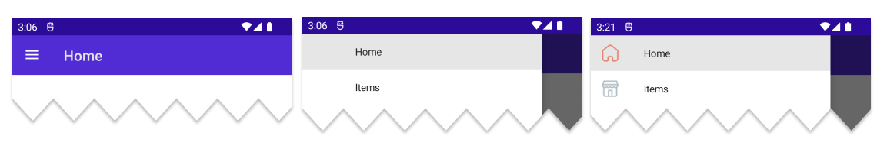
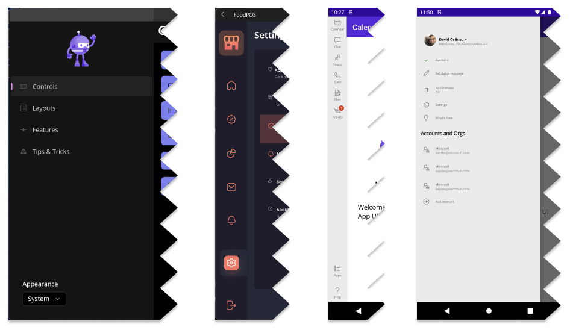

We are excited to release .NET Multi-platform App UI (.NET MAUI) Release Candidate 3 with a new batch of improvements. As with previous release candidates, RC3 is covered by a "go-live" support policy, meaning .NET MAUI is supported by Microsoft for your production apps.


To get started with .NET MAUI, install or upgrade to the latest Visual Studio 2022 preview and select the ".NET Multi-platform App UI development" workload. This will install all the .NET 6 pieces you need, plus enable preview features to make your .NET MAUI development experience more productive.

## Focus on Navigation

.NET MAUI provides you with 2 primary ways to implement navigation in your applications. The easiest yet power option is running your app in `Shell` which provides details optimized for both desktop and mobile patterns. The second option is to use the base navigation page controls directly: [FlyoutPage](https://docs.microsoft.com/dotnet/maui/user-interface/pages/flyoutpage), [TabbedPage](https://docs.microsoft.com/dotnet/maui/user-interface/pages/tabbedpage), and [NavigationPage](https://docs.microsoft.com/dotnet/maui/user-interface/pages/navigationpage).

| | Shell | Base Controls |
|:---:|:-----:|:-------------:|
| Flyout | Yes | Yes |
| Tabs | Yes | Yes |
| Navigation | URI Based | Push/Pop |
| Passing Data | URI Based | View Models |
| Template-able | Yes | No |

What should you use? The .NET MAUI new project template implements `Shell` and provides an optimized experience, so we recommend you start with that one. If in the future you want to swap out for specific controls, you can still reuse all your UI. `Shell` is a UI control that hosts your app pages and offers flyout and tab menus. 

The template project includes an "AppShell.xaml" with a single page, and this is assigned to the `App.MainPage`. To see the flyout come to life, simply add more pages and enable the flyout by changing the `Shell.FlyoutBehavior`.

```xaml
<Shell
    x:Class="MauiApp2.AppShell"
    xmlns="http://schemas.microsoft.com/dotnet/2021/maui"
    xmlns:x="http://schemas.microsoft.com/winfx/2009/xaml"
    xmlns:local="clr-namespace:MauiApp2"
    Shell.FlyoutBehavior="Flyout">

    <ShellContent
        Title="Home"
        ContentTemplate="{DataTemplate local:MainPage}"
        Route="MainPage" />

    <ShellContent
        Title="Items"
        ContentTemplate="{DataTemplate local:MainPage}"
        Route="MainPage" />

</Shell>
```



`ShellContent` enables you to describe the URI routes for navigation, and to use data templates so your pages are loaded on-demand to preserve your startup performance. To be more explicit, you can wrap the `ShellContent` in navigation aliases that instruct Shell clearly how to render your UI.

```xaml
<FlyoutItem Title="Home" FlyoutIcon="home.png">
    <ShellContent ...>
</FlyoutItem>

<FlyoutItem Title="Items" FlyoutIcon="store.png">
    <ShellContent ...>
</FlyoutItem>
```

Shell supports many customizations of the flyout including styling the background, backdrop covering the content, templating the header, footer, entire content, or just the menu items. You can also set the width of the flyout and keep it open or hide it altogether. Here are some examples of just a few different designs:



To display tabs, you can just replace `FlyoutItem` with `Tab`. To group collections of tabs you can wrap them further in a `TabBar`. Mix and match the pages of your app however you need, and `Shell` will do all of the navigation for you.

For more information on customizing flyout and tabs check out the [Shell flyout](https://docs.microsoft.com/dotnet/maui/fundamentals/shell/flyout) and [Shell tabs](https://docs.microsoft.com/dotnet/maui/fundamentals/tabs/) documentation.

When you need to navigate to pages deeper in your application, you can declare custom routes, and navigate by URI -- even pass querystring parameters.

```csharp
// declare a new route
Routing.RegisterRoute(nameof(SettingsPage), typeof(SettingsPage));

// execute a route
await Shell.Current.GoToAsync(nameof(SettingsPage));

// execute a route passing data
await Shell.Current.GoToAsync($"{nameof(SettingsPage)}?setting=appearance");

// receive querystring value
[QueryProperty(nameof(SelectedSubSection), "setting")]
public partial class TipsPage : ContentPage
{
    ...
    public string SelectedSubSection { get;set;}
    ...
}

// execute a route passing full object
var person = new Person { Name="James" };
await Shell.Current.GoToAsync("DetailsPage", new Dictionary<string, object>
{
    { "person", person }
});

// received the object
[QueryProperty(nameof(Person), "person")]
public partial class DetailsPage : ContentPage
{
    Person person;
    public Person Person
    {
        get => person;
        set => person = value;
    }
}
```

> Check out the [.NET MAUI Workshop](https://github.com/dotnet-presentations/dotnet-maui-workshop/tree/main/Part%203%20-%20Navigation) for more examples.

The `QueryProperty` attribute routes the incoming querystring parameter to the public property provided. You can also do this with a view model when implementing the MVVM pattern.

For more information on navigating with Shell check out the [Shell documentation](https://docs.microsoft.com/dotnet/maui/fundamentals/shell/navigation).


## Get Started Today

To acquire .NET MAUI RC3 on Windows, [install or update Visual Studio 2022 Preview](https://aka.ms/vs2022preview) to version 17.3 Preview 1. In the installer, confirm .NET MAUI (preview) is checked under the "Mobile Development with .NET" workload.

To use .NET MAUI RC3 on Mac, follow the [command-line instructions](https://github.com/dotnet/maui/wiki/macOS-Install) on the wiki. Support for .NET MAUI in Visual Studio 2022 for Mac will ship formally in a future preview.

Release Candidate 3 [release notes are on GitHub](https://github.com/dotnet/maui/releases/tag/6.0.300-rc.3). For additional information about getting started with .NET MAUI, refer to our [documentation](https://docs.microsoft.com/dotnet/maui/get-started/installation) and the [migration tip sheet](https://github.com/dotnet/maui/wiki/Migration-to-Release-Candidate) for a list of changes to adopt when upgrading projects.

> **Reminder about Xamarin support** The [Xamarin Support Policy](https://dotnet.microsoft.com/platform/support/policy/xamarin) is still in effect, which covers those products for 2 years after initial release. The last release was in November of 2021, so support will continue through November 2023.

## We need your feedback

Install the latest preview of Visual Studio 2022 for Windows (17.3 Preview 1) following our [simple guide](https://docs.microsoft.com/dotnet/maui/get-started/first-app) and build your first multi-platform application today. 

We'd love to hear from you! As you encounter any issues, file a [report on GitHub at dotnet/maui](https://github.com/dotnet/maui/issues/new/choose).