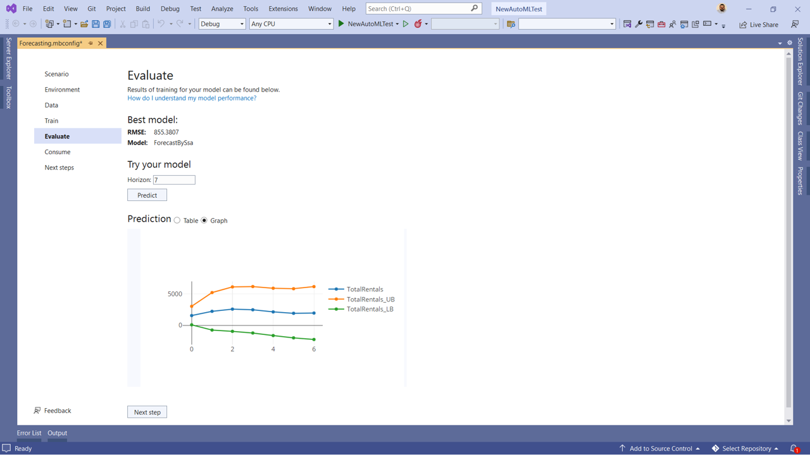

[ML.NET](https://dot.net/ml) is an open-source, cross-platform machine learning framework for .NET developers that enables integration of custom machine learning into .NET apps.

We are excited to update you on what we've been working on over the past few months.

## AutoML Updates

Training machine learning models is a time-consuming and iterative task. Automated Machine Learning (AutoML) automates that process by making it easier to find the best algorithm for your scenario and dataset. AutoML is the backend that powers the training experiences in Model Builder and the ML.NET CLI. Last year we announced updates to the AutoML implementation in our Model Builder and ML.NET CLI tools based [Neural Network Intelligence (NNI)](https://github.com/Microsoft/nni) and [Fast and Lightweight AutoML (FLAML)](https://github.com/Microsoft/flaml) technologies from Microsoft Research. These updates provided a few benefits and improvements over the previous solution which include:

- Increase in the number of models explored.
- Improved time-out error rate.
- Improved performance metrics (for example, accuracy and R-squared).

Until recently, you could only take advantage of these AutoML improvements inside of our tools. 

We're excited to announce that we've integrated the NNI / FLAML implementations of AutoML into the ML.NET framework so you can use them from a code-first experience.

To get started today with the AutoML API install the latest pre-release version of the `Microsoft.ML` and `Microsoft.ML.Auto` NuGet packages using the ML.NET daily feed.

`https://pkgs.dev.azure.com/dnceng/public/_packaging/MachineLearning/nuget/v3/index.json` 

### The Experiment API

An experiment is a collection of training runs or trials. Each trial produces information about itself such as:

- **Evaluation metrics:** The metrics used to assess the predictive capabilities of a model.
- **Pipeline:** The algorithm and hyperparameters used to train a model.

The experiment API provides you with a set of defaults for AutoML making it simpler for you to add to your training pipeline.

```csharp
// Configure AutoML pipeline
var experimentPipeline =    
    dataPrepPipeline
        .Append(mlContext.Auto().Regression(labelColumnName: "fare_amount"));

// Configure experiment
var experiment = mlContext.Auto().CreateExperiment()
                   .SetPipeline(experimentPipeline)
                   .SetTrainingTimeInSeconds(50)
                   .SetDataset(trainTestSplit.TrainSet, validateTestSplit.TrainSet)
                   .SetEvaluateMetric(RegressionMetric.RSquared, "fare_amount", "Score");

// Run experiment
var result = await experiment.Run();
```

In this code snippet, the `dataPrepPipeline` is the series of transforms to get the data into the right format for training. The AutoML components to train a regression model are appended onto that pipeline. The same concept applies for other supported scenarios like classification. 

When you create an experiment with the training pipeline you've defined, among the settings you can customize are how long you train for, training and validation sets, and the evaluation metric you're optimizing for.

Once your pipeline and experiment are defined, call the `Run` method to start training.

### Search Spaces and Sweepable Estimators

If you need more control over the hyperparameter search space, you can define your search space and add it to your training pipeline using a sweepable estimator.

```csharp
// Configure Search Space
var searchSpace = new SearchSpace<LgbmOption>();

// Initialize estimator pipeline 
var sweepingEstimatorPipeline =
    dataPrepPipeline
        .Append(mlContext.Auto().CreateSweepableEstimator((context, param) =>
                 {
                     var option = new LightGbmRegressionTrainer.Options()
                     {
                         NumberOfLeaves = param.NumberOfLeaves,
                         NumberOfIterations = param.NumberOfTrees,
                         MinimumExampleCountPerLeaf = param.MinimumExampleCountPerLeaf,
                         LearningRate = param.LearningRate,
                         LabelColumnName = "fare_amount",
                         FeatureColumnName = "Features",
                         HandleMissingValue = true
                     };

                     return context.Regression.Trainers.LightGbm(option);
                 }, searchSpace));
```

The search space defines a range of hyperparameters to search from.

Sweepable estimators enables you to use the search space inside an ML.NET pipeline just like you would any other estimator.  

To create and run the experiment, you go through the same process of using the `CreateExperiment` and `Run` methods.

## Model Builder and ML.NET CLI Updates

We've made several updates to Model Builder and the ML.NET CLI. Two of the ones I want to highlight are:

- Time Series forecasting scenario in Model Builder
- New version of the .NET CLI

### Time Series Forecasting Scenario (Preview)

Time-series forecasting is the process of identifying patterns in time-dependent observations and making predictions several periods into the future. Examples of real-world use cases are:

- Forecasting product demand
- Forecasting energy consumption

In ML.NET, choosing the trainer for time-series forecasting isn't too difficult because you only have one choice, [ForecastBySsa](https://docs.microsoft.com/dotnet/api/microsoft.ml.timeseriescatalog.forecastbyssa?view=ml-dotnet). The hard part comes when finding the parameters such as the time window to analyze and how far to predict into the future. Finding the right parameters is an experimental process, making it an excellent job for AutoML. Updates to our AutoML implementation make it possible to intelligently search through hyperparamters simplifying the process of training a time-series forecasting model.

As a result of these efforts, we're excited to share that you can now train time-series forecasting models in Model Builder.



[Download or update to the latest version of Model Builder](https://docs.microsoft.com/dotnet/machine-learning/how-to-guides/install-model-builder?tabs=visual-studio-2019) to start training your time-series forecasting models.

### New version of the ML.NET CLI

The ML.NET CLI is our cross-platform .NET global tool which leverages AutoML to train machine learning models on x64 and ARM64 devices running Windows, MacOS, and Linux. A couple of months ago we released a new version of the ML.NET CLI

- .NET 6 support
- Support for ARM64 architectures
- New scenarios
  - Image classification (for x64 architectures)
  - Recommendation
  - Forecasting

[Install the ML.NET CLI](https://docs.microsoft.com/dotnet/machine-learning/how-to-guides/install-ml-net-cli) and get started training models from the command line.

## Keyboard shortcuts in notebooks

Interactive Notebooks are used extensively in data science and machine learning. They are great for data exploration and preparation, experimentation, model explainability, and education.

Last October we announced the release of the [Notebook Editor extension for Visual Studio](https://devblogs.microsoft.com/dotnet/ml-net-and-model-builder-october-updates/#notebook-editor-in-visual-studio) powered by [.NET Interactive](https://github.com/dotnet/interactive). Over the last few months we've been continuously making performance and stability improvements. 

In our latest release, we've made it easier for you to be productive without leaving your keyboard by enabling keyboard shortcuts. If you've worked with notebooks before, many of these shortcuts should feel familiar to you.

| Key  | Command |
|---|---|
| `K` |   Move focus up |
| `J` |  Move focus down |
| `A` |  Insert cell above |
| `B` |  Insert cell below |
| `DD` | Delete cell |
| `Ctrl` + `Z` | Undo |
| `Ctrl` + `S`| Save |
| `Ctrl` + `C`|  Copy cell |
| `Ctrl` + `X`| Cut cell |
| `Ctrl` + `V`| Paste cell |
| `L` |  Toggle line numbers |
| `O` | Toggle outputs|
| `II` | Cancel cell execution |
| `00` | Restart kernel|
| `Ctrl` + `Shift` + `-` | Split cell |
| `Ctrl`+ `Enter` | Execute / run cell|
| `Shift` + `Enter` | Execute / run cell and move focus down|

**The keys in the table are capitalized, but capitalization is not a requirement.**

Install the latest version of the [Notebook Editor](https://marketplace.visualstudio.com/items?itemName=MLNET.notebook) and start creating notebooks in Visual Studio.

## What's next for ML.NET?

We're actively working towards the areas outlined in our [roadmap](https://aka.ms/mlnet-roadmap).

### Deep Learning

A few months ago we shared our [plan for deep learning](https://github.com/dotnet/machinelearning/issues/5918). A significant portion of that plan revolves around improving ONNX experiences for consumption and enabling new scenarios through [TorchSharp](https://github.com/dotnet/TorchSharp), A .NET library that provides access to the library that powers PyTorch.

- Enabled global GPU flags for ONNX inferencing. Prior to this update, when you wanted to use the GPU for inferencing with ONNX models, the `FallbackToCpu` and `GpuDeviceId` flags in the `ApplyOnnxModel` transform were not saved as part of the pipeline. As a result, you had to fit the pipeline every time. We've made these flags accessible as part of the `MLContext` so you can save them as part of your model.
- TorchSharp targets .NET Standard. TorchSharp originally targeted .NET 5. As part of our work in enabling TorchSharp integrations into ML.NET, we've updated TorchSharp to target .NET Standard.

We're excited to share with you the progress we've made integrating TorchSharp with ML.NET in the coming weeks. Stay tuned for the blog post. 

### .NET DataFrame

Clean and representative data contribute to the performance of your model. Therefore, the process of understanding, cleaning, and preparing your data for training is a critical step in the machine learning workflow. A couple of years ago we introduced the DataFrame type to .NET as a preview in the [Microsoft.Data.Analysis](https://www.nuget.org/packages/Microsoft.Data.Analysis/) NuGet package. The DataFrame is still in preview. We understand how important it is for you to have the tools to perform data cleaning and processing tasks and have started to organize and prioritize feedback, so we address existing stability and developer experience pain points. The feedback is being organized as part of a GitHub issue.

We've created this [tracking issue](https://github.com/dotnet/machinelearning/issues/6144) to track and organize feedback. If you have any feedback you'd like to share with us, upvote the individual issues in the description or comment directly in the tracking issue.

### MLOps

Machine Learning Operations (MLOps) is like DevOps for the machine learning lifecycle. This includes things like model deployment & management and data tracking, which help with productionizing machine learning models. We're constantly evaluating ways to improve this experience with ML.NET. 

Recently we published a blog post that guides you through the process of setting up Azure Machine Learning Datasets, training an ML.NET model using the ML.NET CLI and configuring a retraining pipeline with Azure Devops. For more details, check out the post [Train an ML.NET model in Azure ML](https://devblogs.microsoft.com/dotnet/training-a-ml-dotnet-model-with-azure-ml/).

## Get started and resources

Learn more about ML.NET, Model Builder, and the ML.NET CLI in [Microsoft Docs](https://docs.microsoft.com/dotnet/machine-learning/).

If you run into any issues, feature requests, or feedback, please file an issue in the [ML.NET repo](https://github.com/dotnet/machinelearning) or the [ML.NET Tooling (Model Builder & ML.NET CLI) repo](https://github.com/dotnet/machinelearning-modelbuilder) on GitHub.

Join the [ML.NET Community Discord](https://aka.ms/virtual-mlnet-community-discord) or [#machine-learning channel on the .NET Development Discord](https://aka.ms/dotnet-discord)(https://aka.ms/dotnet-discord).

Tune in to the [Machine Learning .NET Community Standup](https://dotnet.microsoft.com/live/community-standup) every other Wednesday at 10am Pacific Time.