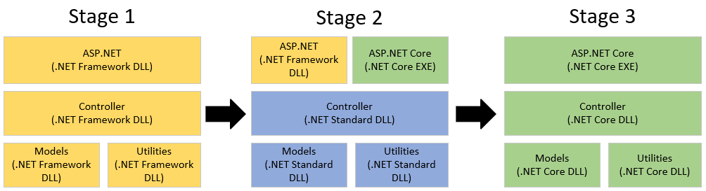

[Microsoft Graph](https://graph.microsoft.com) is an API Gateway that provides unified access to data and intelligence in the Microsoft 365 ecosystem. The service needs to run at very high scale and to make efficient use of Azure computing resources. We've been able to achieve both of those goals, using .NET as our chosen cloud stack. I'll tell you more about our journey of building Microsoft Graph into the service it is today.

## The journey to .NET 6

Four years ago, the service was running on IIS with ASP.NET on .NET Framework 4.6.2. Today, the service runs on HTTP.sys with ASP.NET Core on .NET 6, with interim stops on .NET Core 3.1 and .NET 5. With every upgrade, we observed improvements in CPU utilization, especially with .NET Core 3.1 and recently with .NET 6.
1. From .NET Framework to [.NET Core 3.1](https://devblogs.microsoft.com/dotnet/announcing-net-core-3-1/), we observed a CPU reduction of 30%, for the same traffic volume.
1. From .NET Core 3.1 to [.NET 5](https://devblogs.microsoft.com/dotnet/announcing-net-5-0/), we didn't observe meaningful differences to report.
1. From .NET 5 to [.NET 6](https://devblogs.microsoft.com/dotnet/announcing-net-6/), we observed another CPU reduction of 10%, for the same traffic volume.

Such large reductions in CPU utilization translate to better latency, throughput, and meaningful cost savings in compute capacity, effectively helping us achieving our goals.

The service has a global footprint, currently deployed in 20 regions around the world. Four years ago, the service was serving 1 billion requests per day, with extremely high operational costs. Today, it's serving approximately 70 billion requests per day, representing a **70x increase**, with operational costs reduced by **91%** for every 1 billion requests processed. This puts in perspective the pace of growth and improvements over the last 4 years, where .NET Core migration also played a big role.

### Impact of .NET Core

During the initial migration from .NET Framework 4.6.2 (IIS + ASP.NET) to .NET Core 3.1 (Kestrel + ASP.NET Core; later, HTTP.sys) our benchmarks showed significant improvements in throughput. The following chart compares both stacks and plots the requests per seconds (RPS) and CPU utilization using [Standard_D3_v2](https://docs.microsoft.com/azure/virtual-machines/dv2-dsv2-series) Virtual Machines, with synthetic traffic.


The chart illustrates a major increase in RPS relative to the same CPU utilization when we compare both stacks. At 60% CPU we are at approximately 350 RPS in the old stack (orange) and 850 in the new stack (blue). The new stack is performing significantly better at higher CPU thresholds.

It's important to note this benchmark uses synthetic traffic and that the improvements observed don't necessarily directly translate to higher-scale production environment with real traffic. In production,  we observed a 30% CPU reduction (for the same traffic volume).

### Modernization of build system

One big undertaking to make the migration to .NET Core possible was the modernization of our build system.

Previously, we were using an internal build system with a toolchain incompatible with .NET Core. So the very first step in our case, was to modernize the build system. We migrated to a newer and modern build system, mostly using the Visual Studio toolchain with [MSBuild](https://docs.microsoft.com/visualstudio/msbuild/msbuild) and [dotnet](https://docs.microsoft.com/dotnet/core/tools/dotnet-build) support. The new toolchain supports .NET Framework and .NET Core, and gives us flexibility needed.

Ultimately, the investment of modernizing the build system, while difficult at first, it has increased our productivity dramatically, with faster builds and projects that are easier to create and maintain.

### The big picture

Many improvements occur with every .NET upgrade, even without the Graph team doing any explicit work to improve performance. Each new .NET version improves low-level runtime APIs, common algorithms, and data structures, resulting in a drop in CPU cycles and GC work. For a service that is compute bound like Microsoft Graph, using the new runtime and algorithms that reduce time and space complexity is crucial, and one of the most effective ways to make the service fast and scalable. With the help of our friends on the .NET Team, we've been able to increase throughput, reduce latency overhead and compute operational costs. Thanks!

The other reason to migrate was to modernize the codebase. A modern codebase attracts talent (hiring) and enables our developers to use newer language features and APIs to write better code. Constructs like spans introduced in .NET Core are priceless. One of common ways I use spans is for string manipulation. String manipulation is a common pitfall in old .NET codebases. Old patterns often leading to an explosion of string allocations due to endless concatenations that put pressure on GC and ultimately reflect in higher CPU cost. And developers do not even realize about the real cost and implications of such allocations. [Spans](https://docs.microsoft.com/dotnet/standard/memory-and-spans/) and [string.Create](https://docs.microsoft.com/dotnet/api/system.string.create) introduced in .NET Core gave us a tool to manipulate strings, avoiding the cost of unnecessary string allocations on the heap.

In addition, we rely on observability tools to monitor the cost of the code deployed in dimensions like CPU, memory, and file and network I/O. These tools help us identify regressions and opportunities to improve processing latency, operational costs, and scalability.

We've achieved very significant benefits with new APIs and C# features:
1. Reducing buffer allocations with [array pooling](https://docs.microsoft.com/dotnet/api/system.buffers.arraypool-1).
1. Reducing buffer and string allocations with [memory and span related types](https://docs.microsoft.com/dotnet/standard/memory-and-spans/).
1. Reducing delegate allocations that capture state from enclosing context with [static anonymous functions](https://docs.microsoft.com/dotnet/csharp/language-reference/proposals/csharp-9.0/static-anonymous-functions).
1. Reducing task allocations with [ValueTask](https://docs.microsoft.com/dotnet/api/system.threading.tasks.valuetask-1).
1. Removing redundant null checks throughout the codebase with [nullable](https://docs.microsoft.com/dotnet/csharp/whats-new/csharp-8#nullable-reference-types).
1. Writing succinct code with [null-coalescing assignment](https://docs.microsoft.com/dotnet/csharp/whats-new/csharp-8#null-coalescing-assignment) or [using declarations](https://docs.microsoft.com/dotnet/csharp/whats-new/csharp-8#using-declarations), just to mention two.

There are many other improvements, not captured by this list, that include algorithms and data structures as well as important architectural and infrastructure changes. Ultimately, .NET Core and the language features enable us to be more productive and to write algorithms and data structures that reduce the time and space complexity, which is crucial to achieve our goals in the long haul.

Last but not least, .NET Core makes our service ready to run in Windows and Linux, and enables us to be on the leading edge to innovate at a quick pace, with transport protocols like HTTP/3 and gRPC.

## Migration guidance

This section describes the strategy employed to migrate from ASP.NET to an ASP.NET Core environment and it is meant to serve as high-level guidance.

### Step 1 &mdash; build modernization

The first pre-requisite is a build system that allows you to build .NET Framework and .NET Core assemblies, if that is not already the case.

For the Graph team, modernizing the build system, not only made the migration to .NET Core possible, but it has also increased our productivity dramatically, with faster builds and projects that are easier to create and maintain.

### Step 2 &mdash; architecture readiness

It's important to have a good architecture in place to perform the migration. Let's use a diagram as an illustration of three main stages that we'll go through.



- In **stage 1**, we have the ASP.NET web server assembly and all libraries targeting .NET Framework (yellow).
- In **stage 2**, we have two web server assemblies, each targeting the respective .NET runtime, while the libraries now target .NET Standard (blue). This enables A/B testing.
- In **stage 3**, we have one web server assembly and all libraries targeting .NET Core (green).

If your solution isn't already decomposed in multiple assemblies (stage 1), it's a good opportunity to do it now. The ASP.NET assembly should be a very thin stub for the web server, abstracting out the application from the host. This ASP.NET assembly should be host specific and reference downstream libraries that implement individual components like controllers, models, database access, and so on. It's important to have an architectural pattern in place with separation of concerns, as that helps simplify the dependency chain and the migration work.

In our service this is accomplished with a single HTTP application handler to process incoming requests, which is host specific. The handler converts the incoming ```HttpContext``` to an equivalent object agnostic from the host, which is passed to downstream assemblies that use the object to read the incoming request and write the response. We use interfaces that abstract the incoming ```HttpContext``` used by each host environment, [System.Web.HttpContext](https://docs.microsoft.com/dotnet/api/system.web.httpcontext) and [Microsoft.AspNetCore.Http.HttpContext](https://docs.microsoft.com/dotnet/api/microsoft.aspnetcore.http.httpcontext) respectively. Furthermore, we implement routing rules in downstream assemblies, agnostic from the host which also simplifies the migration. The service does not have UI or a *view* component. If you have a *view* component with MVC and model binding, the solution will necessarily be more complicated.

### Step 3 &mdash; inventory of .NET Framework dependencies

Create an inventory of all dependencies used by the service that are .NET Framework only and identify the owners to engage with them if needed.

Classify each dependency based on relevance and the return of investment. Using and maintaining dependencies comes with some baggage and tax, they better be worth it. Typically, a good dependency adheres to the following principles:
1. It doesn't carry implicit dependencies, other than .NET runtime or extensions.
1. It solves a meaningful problem that can't be easily solved, or the logic is very sensitive that duplication isn't desired.
1. It has good quality, reliability, and performance, especially when present in hot path.
1. It's actively maintained.

If any of these premises is not met, it might be time to find an alternative, either by finding another dependency that does the job or by implementing it.

Most popular libraries already target .NET Standard and many even target .NET Core. For any libraries that exclusively target .NET Framework, often it's already in the owners' radar to build them in .NET Standard. Most of the owners are very receptive in doing such work, if requested. Engage with the owners of the libraries to understand the timeline to have .NET Core compatible version available.

### Step 4 &mdash; get rid of .NET Framework dependencies, from project libraries

Start migrating dependencies one by one, moving to the equivalent in .NET Standard. If there are many projects in the solution, start working on the projects that are at the bottom of dependency chain, following a bottoms-up approach, as typically they have the least number of dependencies and are easier to migrate.

Projects targeting .NET Framework can continue doing so, while migration work is in progress. Once a project no longer references any .NET Framework dependency, make it target .NET Standard.

### Step 5 &mdash; avoid getting blocked

If the service has a legacy or is sizable, likely you will find dependencies buried that are hard to get rid of. Don't give up. 

Consider the following options:
1. Volunteer to help the owners build the dependency as .NET Standard to unblock yourself.
1. Fork the code and build it in your repository to .NET Standard, as a temporary solution, until a compatible version is available.
1. Run the dependency as separate console application or background service that runs with .NET Framework. Now your service can run in ASP.NET Core, while the console application or background service runs in .NET Framework.
1. As a very last resort, try referencing the dependency from a .NET Core project, including your .NET Framework **ProjectReference** or **PackageReference** with ```NoWarn="NU1702"```. The .NET Core runtime uses a compatibility shim that allows you to load and use some .NET Framework assemblies. However, this is not recommended as a permanent measure. This approach must be tested exhaustively (at runtime) as there are no guarantees the assembly is compatible (in all code paths), even if the build succeeds.

In the case of the Microsoft Graph migration, we used all of these options at different times and for different dependencies. Currently we still run one console application as .NET Framework, and load one .NET Framework assembly in the service using compatibility shim.

### Step 6 &mdash; create new webserver project for ASP.NET Core

Create a new project for ASP.NET Core, side-by-side with your current ASP.NET Framework project, with equivalent settings. New ASP.NET Core projects use [Kestrel](https://docs.microsoft.com/aspnet/core/fundamentals/servers/kestrel) by default. It is very good and is where most .NET Team investment goes. It is their cross-platform web server. There are however other choices you can consider, like HTTP.sys, IIS, and even NGINX.

Make sure to enable the newer [performance counters in .NET Core](https://docs.microsoft.com/dotnet/core/diagnostics/available-counters). Take the time to enable them, especially CPU, GC, memory and threadpool related. Also enable the performance counters for the web server chosen (for example, request queuing). These will be important when you start the rollout, to detect any regressions or anomalies.

At this point, you should have completed **stage 2** (in the image I shared above) and are ready to do A/B test and start rollout.

### Step 7 &mdash; A/B testing and rollout plan

Create a rollout plan that allows for A/B testing in some production capacity (for example, deploy the new runtime to one scale set), after passing through all pre-production gates. Testing at scale, with real traffic, is the ultimate gate and the moment of truth.

You can measure application efficiency before and after, measuring differences between A/B bits, using the following heuristic: 

```xml
Efficiency = (Requests per second) / (CPU utilization)
```

During the first rollout, minimize the changes introduced in the payload, to reduce the number of variables that can cause unexpected regressions. If we introduce too many variables in the payload, we are increasing the odds of introducing other bugs that can be unrelated to the new runtime, but still waste engineers' time to identify and root cause them.

Once the initial rollout succeeds in a small scale and it is vetted, plan to enable the new bits using gradual rollout following the safe deployment practices in place. It is important to follow a gradual rollout, that allows you to detect and mitigate issues promptly that may surface with increased volume and scale.

### Step 8 &mdash; target .NET Core in all projects

Once you have the service running in ASP.NET Core, deployed at scale and vetted, it's time to remove the very last fragments of .NET Framework still lingering around. Remove the web server project for ASP.NET and move all project libraries to target .NET Core explicitly, instead of .NET Standard, so you can start using newer APIs and language features that will enable developers to write better code. And with this, you have gone through **stage 3** successfully.

## Upgrade tips

Some of the main learnings and upgrade tips applied.

### Quirks in URI encoding

One core function of the service is to parse the incoming URI. Over the years we ended up having different points throughout the codebase, with hard assumptions on how the incoming request is encoded. A lot of those assumptions were violated when we moved from ASP.NET to ASP.NET Core, resulting in numerous issues and edge cases. After a long time, several fixes and analysis, we consolidated in the following rules, used to convert ASP.NET Core path and query to the old ASP.NET format that different parts of the code require.

- Rejected percent-encoded ASCII characters, by host.

    || ASP.NET Core | ASP.NET |
    |-|-|-|
    | Path | %00 | %00 through %19, and %7F |
    | Query | NONE | NONE |

- Automatically decoded percent-encoded characters, by host.

    || ASP.NET Core | ASP.NET |
    |-|-|-|
    | Path | NONE | NO multi-byte UTF8 character, EVERY non-rejected ASCII character except for: %20, %22, %23, %25, %3C, %3E, %3F, %5B, %5D, %5E, %60, %7B, %7C, %7D |
    | Query | NONE | NONE |

### Enable Dynamic PGO with .NET 6

With .NET 6 we have enabled [Dynamic PGO](https://devblogs.microsoft.com/dotnet/conversation-about-pgo/), one the most exciting features of .NET 6.0. PGO can benefit .NET 6.0 applications by maximizing steady-state performance.

Dynamic PGO is an opt-in feature in .NET 6.0. There are 3 environment variables you need to set to enable dynamic PGO:

- ```set DOTNET_TieredPGO=1```. This setting leverages the initial Tier0 compilation of methods to observe method behavior. When methods are rejitted at Tier1, the information gathered from the Tier0 executions is used to optimize the Tier1 code.
- ```set DOTNET_TC_QuickJitForLoops=1```. This setting enables tiering for methods that contain loops.
- ```set DOTNET_ReadyToRun=0```. The core libraries that ship with .NET come with ReadyToRun enabled by default. ReadyToRun allows for faster startup because there is less to JIT compile, but this also means code in ReadyToRun images doesn’t go through the Tier0 profiling process which enables dynamic PGO. By disabling ReadyToRun, the .NET libraries also participate in the dynamic PGO process.

These settings increased the application efficiency by [13% for Azure AD Gateway](https://devblogs.microsoft.com/dotnet/azure-active-directorys-gateway-is-on-net-6-0/#enabling-dynamic-pgo-profile-guided-optimization).

## Other references

For more learnings, refer to the following blogs posted by our Azure AD gateway sister team:
- [Azure Active Directory’s gateway is on .NET Core 3.1!](https://devblogs.microsoft.com/dotnet/azure-active-directorys-gateway-service-is-on-net-core-3-1/)
- [Azure Active Directory’s gateway is on .NET 6.0!](https://devblogs.microsoft.com/dotnet/azure-active-directorys-gateway-is-on-net-6-0/)

## Summary

Every new release of .NET comes with tremendous productivity and performance improvements that continue helping accomplish our goals to build scalable services, with high availability, security, minimal latency overhead, and optimal routing, while having the lowest operational costs possible.

Be assured, there is no magic wand. In most cases, the migration needs serious commitment and hard work from the team. But in the long haul, that work undoubtedly pays off many dividends.