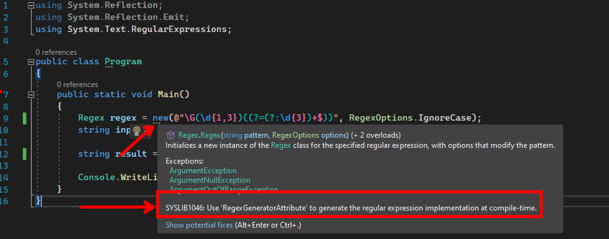
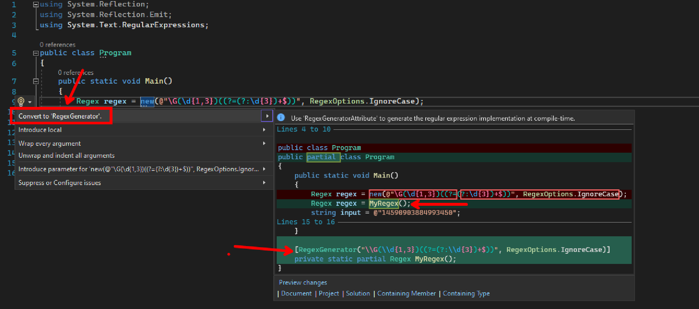
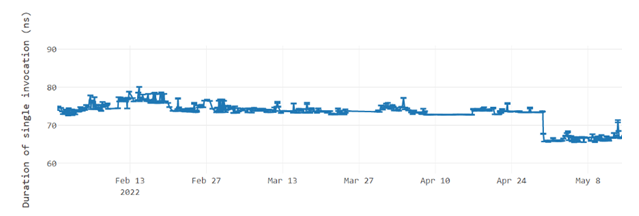

Today we released .NET 7 Preview 5. This preview of .NET 7 includes improvements to [Generic Math](https://devblogs.microsoft.com/dotnet/dotnet-7-generic-math/) which make the lives of API authors easier, a new Text Classification API for ML.NET that adds state-of-the-art deep learning techniques for natural language processing, various improvements to source code generators and a new Roslyn analyzer and fixer for RegexGenerator and multiple performance improvements in the areas of CodeGen, Observability, JSON serialization / deserialization and working with streams.

You can [download .NET 7 Preview 5](https://dotnet.microsoft.com/download/dotnet/7.0), for Windows, macOS, and Linux.

* [Installers and binaries](https://dotnet.microsoft.com/download/dotnet/7.0)
* [Container images](https://mcr.microsoft.com/catalog?search=dotnet/)
* [Linux packages](https://github.com/dotnet/core/blob/master/release-notes/7.0/)
* [Release notes](https://github.com/dotnet/core/tree/master/release-notes/7.0)
* [Known issues](https://github.com/dotnet/core/blob/main/release-notes/7.0/known-issues.md)
* [GitHub issue tracker](https://github.com/dotnet/core/issues)

.NET 7 Preview 5 has been tested with Visual Studio 17.3 Preview 2. We recommend you use the [preview channel builds](https://visualstudio.com/preview) if you want to try .NET 7 with Visual Studio family products. If you're on macOS, we recommend using the latest [Visual Studio 2022 for Mac preview](https://visualstudio.microsoft.com/vs/mac/preview/). Now, let's get into some of the latest updates in this release.

## Observability
The goal of [observability](https://devblogs.microsoft.com/dotnet/opentelemetry-net-reaches-v1-0/) is to help you better understand the state of your application as scale and technical complexity increases.

### Expose performant ActivityEvent and ActivityLink tags enumerator methods 
[#68056](https://github.com/dotnet/runtime/issues/68056)

The exposed methods can be used in performance critical scenarios to enumerate the Tag objects without any extra allocations and with fast items access.

```C#
var tags = new List<KeyValuePair<string, object?>>()
{
    new KeyValuePair<string, object?>("tag1", "value1"),
    new KeyValuePair<string, object?>("tag2", "value2"),
};

ActivityLink link = new ActivityLink(default, new ActivityTagsCollection(tags));

foreach (ref readonly KeyValuePair<string, object?> tag in link.EnumerateTagObjects())
{
    // Consume the link tags without any extra allocations or value copying.
}            

ActivityEvent e = new ActivityEvent("SomeEvent", tags: new ActivityTagsCollection(tags));

foreach (ref readonly KeyValuePair<string, object?> tag in e.EnumerateTagObjects())
{
    // Consume the event's tags without any extra allocations or value copying.
} 
```

## System.Text.Json

### Polymorphism 
[#63747](https://github.com/dotnet/runtime/issues/63747)

System.Text.Json now supports serializing and deserializing polymorphic type hierarchies using attribute annotations:

```C#
[JsonDerivedType(typeof(Derived))]
public class Base
{
    public int X { get; set; }
}

public class Derived : Base
{
    public int Y { get; set; }
}
```
This configuration enables polymorphic serialization for `Base`, specifically when the runtime type is `Derived`:
```C#
Base value = new Derived();
JsonSerializer.Serialize<Base>(value); // { "X" : 0, "Y" : 0 }
```
Note that this does not enable polymorphic _deserialization_ since the payload would be roundtripped as `Base`:
```C#
Base value = JsonSerializer.Deserialize<Base>(@"{ ""X"" : 0, ""Y"" : 0 }");
value is Derived; // false
```

**Using Type Discriminators**

To enable polymorphic _deserialization_, users need to specify a _type discriminator_ for the derived class:
```C#
[JsonDerivedType(typeof(Base), typeDiscriminator: "base")]
[JsonDerivedType(typeof(Derived), typeDiscriminator: "derived")]
public class Base
{
    public int X { get; set; }
}

public class Derived : Base
{
    public int Y { get; set; }
}
```
Which will now emit JSON along with type discriminator metadata:
```C#
Base value = new Derived();
JsonSerializer.Serialize<Base>(value); // { "$type" : "derived", "X" : 0, "Y" : 0 }
```
which can be used to deserialize the value polymorphically:
```C#
Base value = JsonSerializer.Deserialize<Base>(@"{ ""$type"" : ""derived"", ""X"" : 0, ""Y"" : 0 }");
value is Derived; // true
```
Type discriminator identifiers can also be integers, so the following form is valid:
```C#
[JsonDerivedType(typeof(Derived1), 0)]
[JsonDerivedType(typeof(Derived2), 1)]
[JsonDerivedType(typeof(Derived3), 2)]
public class Base { }

JsonSerializer.Serialize<Base>(new Derived2()); // { "$type" : 1, ... }
```

### Utf8JsonReader.CopyString
[#54410](https://github.com/dotnet/runtime/issues/54410)

Until today, [`Utf8JsonReader.GetString()`](https://docs.microsoft.com/dotnet/api/system.text.json.utf8jsonreader.getstring?view=net-6.0) has been the only way users could consume decoded JSON strings. This will always allocate a new string, which might be unsuitable for certain performance-sensitive applications. The newly included `CopyString` methods allow copying the unescaped UTF-8 or UTF-16 strings to a buffer owned by the user:
```C#
int valueLength = reader.HasReadOnlySequence ? checked((int)ValueSequence.Length) : ValueSpan.Length;
char[] buffer = ArrayPool<char>.Shared.Rent(valueLength);
int charsRead = reader.CopyString(buffer);
ReadOnlySpan<char> source = buffer.Slice(0, charsRead);

ParseUnescapedString(source); // handle the unescaped JSON string
ArrayPool<char>.Shared.Return(buffer);
```
Or if handling UTF-8 is preferable:
```C#
ReadOnlySpan<byte> source = stackalloc byte[0];
if (!reader.HasReadOnlySequence && !reader.ValueIsEscaped)
{
    source = reader.ValueSpan; // No need to copy to an intermediate buffer if value is span without escape sequences
}
else
{
    int valueLength = reader.HasReadOnlySequence ? checked((int)ValueSequence.Length) : ValueSpan.Length;
    Span<byte> buffer = valueLength <= 256 ? stackalloc byte[256] : new byte[valueLength];
    int bytesRead = reader.CopyString(buffer);
    source = buffer.Slice(0, bytesRead);
}

ParseUnescapedBytes(source);
```

### Source Generation improvements

Added source generation support for `IAsyncEnumerable<T>` ([#59268](https://github.com/dotnet/runtime/issues/59268)), `JsonDocument`([#59954](https://github.com/dotnet/runtime/issues/59954)) and `DateOnly`/`TimeOnly`([#53539](https://github.com/dotnet/runtime/issues/53539)) types.

For example:

```C#
[JsonSerializable(typeof(typeof(MyPoco))]
public class MyContext : JsonSerializerContext {}

public class MyPoco
{
    // Use of IAsyncEnumerable that previously resulted 
    // in JsonSerializer.Serialize() throwing NotSupportedException 
    public IAsyncEnumerable<int> Data { get; set; } 
}

// It now works and no longer throws NotSupportedException
JsonSerializer.Serialize(new MyPoco { Data = ... }, MyContext.MyPoco); 
```

## System.IO.Stream

### ReadExactly and ReadAtLeast 
[#16598](https://github.com/dotnet/runtime/issues/16598)

One of the most common mistakes when using `Stream.Read()` is that `Read()` may return less data than what is available in the `Stream` and less data than the buffer being passed in. And even for programmers who are aware of this, having to write the same loop every single time they want to read from a `Stream` is annoying.

To help this situation, we have added new methods to the base `System.IO.Stream` class:

```C#
namespace System.IO;

public partial class Stream
{
    public void ReadExactly(Span<byte> buffer);
    public void ReadExactly(byte[] buffer, int offset, int count);

    public ValueTask ReadExactlyAsync(Memory<byte> buffer, CancellationToken cancellationToken = default);
    public ValueTask ReadExactlyAsync(byte[] buffer, int offset, int count, CancellationToken cancellationToken = default);

    public int ReadAtLeast(Span<byte> buffer, int minimumBytes, bool throwOnEndOfStream = true);
    public ValueTask<int> ReadAtLeastAsync(Memory<byte> buffer, int minimumBytes, bool throwOnEndOfStream = true, CancellationToken cancellationToken = default);
}
```

The new `ReadExactly` methods are guaranteed to read exactly the number of bytes requested. If the Stream ends before the requested bytes have been read, an `EndOfStreamException` is thrown.

```C#
using FileStream f = File.Open("readme.md");
byte[] buffer = new byte[100];

f.ReadExactly(buffer); // guaranteed to read 100 bytes from the file
```

The new `ReadAtLeast` methods will read at least the number of bytes requested. It can read more if more data is readily available, up to the size of the buffer. If the Stream ends before the requested bytes have been read an `EndOfStreamException` is thrown (in advanced cases when you want the benefits of `ReadAtLest` but you also want to handle the end-of-stream scenario yourself, you can opt out of throwing the exception).

```C#
using FileStream f = File.Open("readme.md");
byte[] buffer = new byte[100];

int bytesRead = f.ReadAtLeast(buffer, 10);
// 10 <= bytesRead <= 100
```

## New Roslyn analyzer and fixer for RegexGenerator
[#69872](https://github.com/dotnet/runtime/pull/69872)

In [Regular Expression Improvements in .NET 7](https://devblogs.microsoft.com/dotnet/regular-expression-improvements-in-dotnet-7/#source-generation) [Stephen Toub](https://github.com/stephentoub) describes the new RegexGenerator source generator, which allows you to statically generate regular expressions at compile time resulting in better performance. To take advantage of this, first you have to find places in your code where it could be used and then make each code change. This sounds like the perfect job for a Roslyn analyzer and fixer, so we added one in Preview 5.

### Analyzer

The new analyzer is included in .NET 7, and will search for uses of `Regex` that could be converted to use the RegexGenerator source generator instead. The analyzer will detect uses of the `Regex` constructors, as well as uses of the `Regex` static methods that meet the following criteria:
- Parameters supplied have a known value at compile time. The source generator's output depends on these values, so they must be known at compile time.
- They are part of an app that targets .NET 7. The new analyzer ships inside the .NET 7 targeting pack and only apps targeting .NET 7 are eligible for this analyzer.
- The `LangVersion` ([learn more](https://docs.microsoft.com/dotnet/csharp/language-reference/configure-language-version)) is higher than `10`. For the time being the regex source generator requires `LangVersion` to be set to `preview`.

Here is the new analyzer in action in Visual Studio:



### Code fixer

The code fixer is also included in .NET 7 and it does two things. First, it suggests a RegexGenerator source generator method and gives you the option to override the default name. Then it replaces the original code with a call to the new method.

Here is the new code fixer in action in Visual Studio:



## Generic Math

In .NET 6 we previewed a feature called [Generic Math](https://devblogs.microsoft.com/dotnet/preview-features-in-net-6-generic-math/) which allows .NET developers to take advantage of static APIs, including operators, from within generic code. This feature will directly benefit API authors who can simplify their codebase. Other developers will benefit indirectly as the APIs they consume will start supporting more types without the requirement for each and every numeric type to get explicit support.

In .NET 7 we have made improvements to the implementation and responded to feedback from the community. For more information on the changes and available APIs please see our [Generic Math specific announcement](https://devblogs.microsoft.com/dotnet/dotnet-7-generic-math/).

## System.Reflection performance improvements when invoking members
[#67917](https://github.com/dotnet/runtime/pull/67917)

The overhead of using reflection to invoke a member (whether a method, constructor or a property getter\setter) has been substantially reduced when the invoke is done several times on the same member. Typical gains are 3-4x faster.

Using the `BenchmarkDotNet` package:
```C#
using BenchmarkDotNet.Attributes;
using BenchmarkDotNet.Running;
using System.Reflection;

namespace ReflectionBenchmarks
{
    internal class Program
    {
        static void Main(string[] args)
        {
            BenchmarkRunner.Run<InvokeTest>();
        }
    }

    public class InvokeTest
    {
        private MethodInfo? _method;
        private object[] _args = new object[1] { 42 };

        [GlobalSetup]
        public void Setup()
        {
            _method = typeof(InvokeTest).GetMethod(nameof(InvokeMe), BindingFlags.Public | BindingFlags.Static)!;
        }

        [Benchmark]
        // *** This went from ~116ns to ~39ns or 3x (66%) faster.***
        public void InvokeSimpleMethod() => _method!.Invoke(obj: null, new object[] { 42 });

        [Benchmark]
        // *** This went from ~106ns to ~26ns or 4x (75%) faster. ***
        public void InvokeSimpleMethodWithCachedArgs() => _method!.Invoke(obj: null, _args);

        public static int InvokeMe(int i) => i;
    }
}
```

## ML.NET Text Classification API
[#835](https://github.com/microsoft/dotnet-blog/pull/835)

Text classification is the process of applying labels or categories to text.

Common use cases include:

- Categorizing e-mail as spam or not spam
- Analyzing sentiment as positive or negative from customer reviews
- Applying labels to support tickets

Text classification is a subset of classification, so today you could solve text classification problems with the existing classification algorithms in ML.NET. However, those algorithms don't address common challenges with text classification as well as modern deep learning techniques.

We are excited to introduce the ML.NET Text Classification API, an API that makes it easier for you to train custom text classification models and brings the latest state-of-the-art deep learning techniques for natural language processing to ML.NET.

For more details please see our [ML.NET specific announcement](https://aka.ms/text-classification-api)

## CodeGen

Many thanks to the community contributors.

[@singleaccretion](https://github.com/singleaccretion) made [23 PR contributions ](https://github.com/dotnet/runtime/pulls?q=is%3Apr+is%3Aclosed+label%3Aarea-CodeGen-coreclr+closed%3A2022-04-18..2022-05-24+author%3Asingleaccretion+) during Preview 5 with the highlights being:
- Improve the redundant branch optimization to handle more side effects [#68447](https://github.com/dotnet/runtime/pull/68447)
- PUTARG_STK/x86: mark push [mem] candidates reg optional [#68641](https://github.com/dotnet/runtime/pull/68641)
- Copy propagate on LCL_FLDs [#68592](https://github.com/dotnet/runtime/pull/68592)

[@Sandreenko](https://github.com/Sandreenko) completed allowing StoreLclVar src to be IND/FLD [#59315](https://github.com/dotnet/runtime/pull/59315). [@hez2010](https://github.com/hez2010) fixed CircleInConvex test in [#68475](https://github.com/dotnet/runtime/pull/68475).

More contributions from [@anthonycanino](https://github.com/anthonycanino), [@aromaa](https://github.com/aromaa) and [@ta264](https://github.com/ta264) are included in the sections to follow.

### Arm64

[#68363](https://github.com/dotnet/runtime/pull/68363) consolidated 'msub' (multiplies two register values, subtracts the product from a third register value) and 'madd' (multiplies two register values, adds a third register value) logic.

[Arm64: Have CpBlkUnroll and InitBlkUnroll use SIMD registers](https://github.com/dotnet/runtime/pull/68085)  for initialization of copying a block of memory smaller than 128 bytes (see [perf improvement details](https://pvscmdupload.blob.core.windows.net/autofilereport/autofilereports/04_28_2022/refs/heads/main_arm64_Windows%2010.0.19041_Improvement/System.Numerics.Tests.Perf_Matrix4x4.html)).


### Loop Optimization
[#67930 Handle more scenarios for loop cloning](https://github.com/dotnet/runtime/pull/67930) now supports loops that go backwards or forwards with the increment of > 1 (see [perf improvement details](https://pvscmdupload.blob.core.windows.net/autofilereport/autofilereports/05_03_2022/refs/heads/main_x64_Windows%2010.0.18362_Improvement/System.Collections.ContainsTrue(String).html)).


[#68588 Hoist the nullchecks for 'this' object](https://github.com/dotnet/runtime/pull/68588) moves the nullchecks on an object outside the loop (see [perf improvement details](https://pvscmdupload.blob.core.windows.net/autofilereport/autofilereports/05_03_2022/refs/heads/main_x64_Windows%2010.0.18362_Improvement/System.Text.Encodings.Web.Tests.Perf_Encoders.html)).



### x86/x64 Optimizations

- [#67182 Emit shlx, sarx, shrx on x64](https://github.com/dotnet/runtime/pull/67182)  optimized mov+shl, sar or shr to shlx, sarx or shrx on x64. 
- [#68091](https://github.com/dotnet/runtime/pull/68091) enabled UMOD optimization for x64.
- [@anthonycanino](https://github.com/anthonycanino) added X86Serialize hardware intrinsic in [#68677](https://github.com/dotnet/runtime/pull/68677 ).
- [@aromaa](https://github.com/aromaa) optimized bswap+mov to movbe in [#66965](https://github.com/dotnet/runtime/pull/66965). 
- [@ta264](https://github.com/ta264) fixed linux-x86 compilation for clr.alljits subset in [#68046](https://github.com/dotnet/runtime/pull/68046).

### General Optimizations
- [PR#68105](https://github.com/dotnet/runtime/pull/68105) enabled multiple nested "no GC" region requests.
- [PR#69034](https://github.com/dotnet/runtime/pull/69034) removed "promoted parameter" tailcall limitation.

### Modernize JIT
As the community has ramped up its contributions to the JIT code base, it has become important to restructure and modernize our codebase to enable our contributors to easily ramp up and rapidly develop code.  

In Preview 5 we did a lot of work on the internals, cleaned up the JIT’s intermediate representation and removed limitations imposed by past design decisions. In many cases this work resulted in **less memory usage** and **higher throughput** of the JIT itself, while in other cases it resulted in **better code quality**. Here are some highlights:

- Delete CLS_VAR [#68524](https://github.com/dotnet/runtime/pull/68524)
- Delete GT_ARGPLACE [#68140](https://github.com/dotnet/runtime/pull/68140)
- Delete GT_PUTARG_TYPE [#68748](https://github.com/dotnet/runtime/pull/68748)
 
The above allowed us to **remove an old limitation in the JIT’s inliner** when inlining functions with parameters of byte/sbyte/short/ushort type, resulting in better code quality (allow the inliner to substitute for small arguments [#69068](https://github.com/dotnet/runtime/pull/69068))

One area that needed improvement was better understanding of **unsafe code involving reads and writes of structs and struct fields**. **[@SingleAccretion](https://github.com/SingleAccretion)** contributed great changes in this area by switching the JIT’s internal model to a more general “physical” model. This paves the way for the JIT to **better reason about unsafe code using features like struct reinterpretation**:

- Physical value numbering [#68712](https://github.com/dotnet/runtime/pull/68712)
- Implement constant-folding for VNF_BitCast [#68979](https://github.com/dotnet/runtime/pull/68979)

Other minor cleanups were also made to **simplify the JIT IR**:
- Remove GTF_LATE_ARG [#68617](https://github.com/dotnet/runtime/pull/68617)
- Substitute GT_RET_EXPR in inline candidate arguments [#69117](https://github.com/dotnet/runtime/pull/69117)
- Remove stores as operands of calls in LIR [#68460](https://github.com/dotnet/runtime/pull/68460)

## Contributor spotlight: Steve Dunn

Steve documented the [beginning of his contributions to .NET](https://dunnhq.com/posts/2021/contributing-to-dotnet/) and we are grateful for all of them. We want to take the opportunity to specifically call out Steve's work on Microsoft.Extensions.Configuration. He's taken on high-impact issues that require significant technical knowledge and domain expertise and a good example of this is [support immutable types with configuration binding](https://github.com/dotnet/runtime/pull/67258).

Not only is Steve up to the technical challenge, but he is also understanding, patient and thoughtful. In his most recent PR Steve received 123 comments from six reviews, and involved 41 commits. Steve welcomed the feedback and took initiative to achieve a resolution that everybody was happy with. Steve is a perfect example of a high-quality community contributor.


In Steve's own words:

I currently write services in .NET for corporate clients. In the past I've published packaged products, including Arabian Themes, which was an Arabic conversion of "Windows 95 Plus!"

I started writing software in the mid 80's, beginning with BBC Basic and then Commodore 64 games, including [Better dead than alien](https://dunnhq.com/about/#better-dead-than-alien), [Call me psycho](https://dunnhq.com/about/#call-me-psycho), [Space relief](https://dunnhq.com/about/#space-relief), [Galaxia 7](https://dunnhq.com/about/#galaxia-7), [Thunder Hawk](https://dunnhq.com/about/#thunder-hawk) and [Zone Z](https://dunnhq.com/about/#zone-z)

I regularly write articles on https://dunnhq.com and I’m currently working on curing Primitive Obsession with [Vogen](https://github.com/SteveDunn/Vogen).

## Contributor spotlight: Anthony Canino

Anthony recently added [X86Serialize hardware intrinsic](https://github.com/dotnet/runtime/pull/68677) based on an [API proposal that exposes xarch serialize instruction](https://github.com/dotnet/runtime/issues/66467) referencing a couple of chapters of [Intel 64 and IA-32 Architectures Software Developer’s Manual, Volume 3A](https://www.intel.com/content/www/us/en/architecture-and-technology/64-ia-32-architectures-software-developer-vol-3a-part-1-manual.html) and [Intel Architecture Instruction Set Extensions and Future Features](https://www.intel.com/content/dam/develop/external/us/en/documents/architecture-instruction-set-extensions-programming-reference.pdf). 

This allows a developer to issue `X86Serialize.Serialize()` before a conditional such as:

```C#
X86Serialize.Serialize();
if (someCondition)
{
  // ...
}
```

Thank you Anthony for your multiple contributions to .NET!


In Anthony's own words:

My name is Anthony Canino and I am a Software Engineer at Intel, based in Seattle Washington, with a passion for compiler development and language design. As a newly located PNW resident, I enjoy taking advantage of all the wonderful hiking and beautiful nature the area has to offer with my two Siberian huskies.
 
Our team at Intel believes in developer-experience first, and we support the .NET ecosystem and wish to continue to see the platform thrive and serve as the developer-focused centerpiece that it is today. Some of my first contributions to .NET were some peephole optimizations in the xarch code emitter that really helped me to understand some of the lower-level details of code generation. Specifically to .NET’s RyuJIT, I've found the quality of the code and the documentation significantly reduce the barrier of entry toward making contributions in a challenging space.

What I love about contributing to .NET is the dedication that Microsoft has put forth to enable open source developers to participate in the project with production-level resources --- documentation and testing infrastructure and pipeline --- and professional developer community support and planning. This kind of treatment really allows external contributors to feel part of the overall direction of the project and encourages further contributions to the ecosystem.

## Targeting .NET 7

To target .NET 7, you need to use a .NET 7 Target Framework Moniker (TFM) in your project file. For example:

```xml
<TargetFramework>net7.0</TargetFramework>
```

The full set of .NET 7 TFMs, including operating-specific ones follows.

* `net7.0`
* `net7.0-android`
* `net7.0-ios`
* `net7.0-maccatalyst`
* `net7.0-macos`
* `net7.0-tvos`
* `net7.0-windows`

We expect that upgrading from .NET 6 to .NET 7 should be straightforward. Please report any breaking changes that you discover in the process of testing existing apps with .NET 7.

## Support

.NET 7 is a **Short Term Support (STS)** release, meaning it will receive free support and patches for 18 months from the release date. It's important to note that the quality of all releases is the same. The only difference is the length of support. For more about .NET support policies, see the [.NET and .NET Core official support policy](https://dotnet.microsoft.com/platform/support/policy/dotnet-core).

We recently recently changed the "Current" name to "Short Term Support (STS)". We're in the [process of rolling out that change](https://github.com/dotnet/core/pull/7517).

## Breaking changes

You can find the most recent list of breaking changes in .NET 7 by reading the [Breaking changes in .NET 7](https://docs.microsoft.com/dotnet/core/compatibility/7.0) document. It lists breaking changes by area and release with links to detailed explanations.

To see what breaking changes are proposed but still under review, follow the [Proposed .NET Breaking Changes GitHub issue](https://github.com/dotnet/core/issues/7131).

## Roadmaps

Releases of .NET include products, libraries, runtime, and tooling, and represent a collaboration across multiple teams inside and outside Microsoft. You can learn more about these areas by reading the product roadmaps:

* [ASP.NET Core 7 and Blazor Roadmap](https://github.com/dotnet/aspnetcore/issues/39504)
* [EF 7 Roadmap](https://docs.microsoft.com/ef/core/what-is-new/ef-core-7.0/plan)
* [ML.NET](https://github.com/dotnet/machinelearning/blob/main/ROADMAP.md)
* [.NET MAUI](https://github.com/dotnet/maui/wiki/Roadmap)
* [WinForms](https://github.com/dotnet/winforms/blob/main/docs/roadmap.md)
* [WPF](https://github.com/dotnet/wpf/blob/main/roadmap.md)
* [NuGet](https://github.com/NuGet/Home/issues/11571)
* [Roslyn](https://github.com/dotnet/roslyn/blob/main/docs/Language%20Feature%20Status.md)
* [Runtime](https://github.com/dotnet/core/blob/main/roadmap.md)

## Closing

We appreciate and [thank you](https://dotnet.microsoft.com/thanks) for your all your support and contributions to .NET. Please [give .NET 7 Preview 5 a try](https://dotnet.microsoft.com/download/dotnet/7.0) and tell us what you think!
