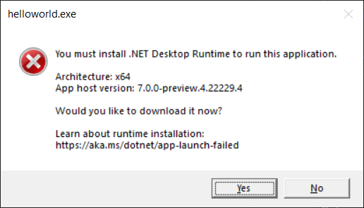
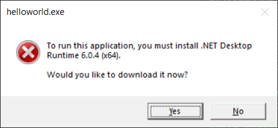
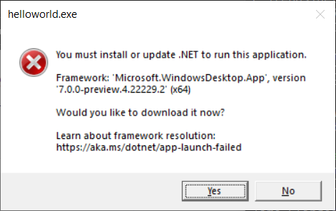
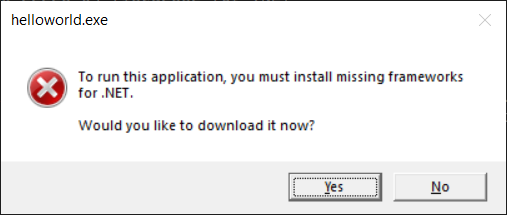

Have you ever tried to launch a .NET app and seen an error message telling you that you are missing a runtime, like the following? Have you ever been frustrated by an error message that you are missing an SDK but are not sure why? As part of .NET 7, we've updated several error messages and commands like `dotnet --info` to provide more helpful information.



As the .NET Team, we get asked for help a lot. Supportability is important to us since it helps save everyone time and quickly gets developers, operations folks, and end users to a resolution for a problem. We intend errors to be informative enough that many users can self-diagnose their own issues, even non-technical users. We also want to make it straightforward for Independent Software Vendors (ISVs) to support their users. A big part of that is making error messages more informative without being complicated. Let's take a look at what we've done to improve .NET 7.

## Context

.NET is a hosted-runtime platform. That means that every .NET app is launched by a native host, which needs to find and load a compatible .NET runtime to execute app code. Sometimes a runtime cannot be found, and the host needs to provide an error message with the details of the error and instructions on what to do.

Much of this post is only relevant for [framework-dependent apps](https://docs.microsoft.com/dotnet/core/deploying/). That's the default build and publish option. Framework-dependent apps (unlike self-contained apps) don't include a runtime but need to load one (typically) from the global install location. That's what leads to this whole topic. There are a lot of benefits to framework-dependent apps, which is why that model is popular.

Some of the error messages include a link to various download pages on the [.NET website](https://dotnet.microsoft.com/). These links get a lot of traffic, around the clock. That tells us that it is an important experience and one we should invest in more. We are. We have a similar experience for .NET Framework that has been in place for a long time.

## Missing Runtime

The experience when a required .NET runtime cannot be found is an important scenario for both end users and developers. In the errors, we tried to strike a balance between simplicity for end users and details for developers. To better enable end users to solve their own issues, we focused on making sure error messages were both understandable and actionable. We updated formatting for improved readability, removed unnecessary information, and added download and documentation links. To better enable developers to support their end users, we added more information to error messages, such as architecture and the .NET location being used.

We have updated our error messages to have the general structure:

```console
Statement about required user action

Relevant information about the scenario

Documentation link

Download link
```

Not finding a required .NET runtime can mean that .NET is not installed at all, a framework (such as ASP.NET Core or Windows Desktop) version is not installed, the required architecture is not installed, or it is not at the expected location. We'll look at the experience for each of these.

We have also backported these updates to .NET 6.0.7. The experience around a missing runtime is important and we felt it would be helpful for end users and developers alike to have these improvements in our [latest LTS release](https://devblogs.microsoft.com/dotnet/announcing-net-6/).

### .NET installation not found

End users running a .NET application for the first time may not have any version of .NET installed. In this case, we want to tell the user that they need to install .NET and direct them to the appropriate download page.

When .NET is not installed at all, running a .NET 7 application will show:

```console
You must install .NET to run this application.

App: C:\apps\helloworld\helloworld.exe
Architecture: x64
App host version: 7.0.0-preview.4.22229.4
.NET location: Not found

Learn about runtime installation:
https://aka.ms/dotnet/app-launch-failed

Download the .NET runtime:
https://aka.ms/dotnet-core-applaunch?missing_runtime=true&arch=x64&rid=win10-x64&apphost_version=7.0.0-preview.4.22229.4
```

The message above states that a .NET installation is required and has a separate section to highlight important information like the architecture and app host version. It also includes a link to documentation with more details and provides a download link that the user can follow to resolve the problem. While we expect most users can fix their issue using the download link, the additional information allows for better support if the user requires more help.

For Windows GUI applications, we made similar changes to the error shown to include a documentation link and more clearly lay out relevant information:


These changes are an improvement on previous behavior:

```console
A fatal error occurred. The required library hostfxr.dll could not be found.
If this is a self-contained application, that library should exist in [C:\apps\helloworld\].
If this is a framework-dependent application, install the runtime in the global location [C:\Program Files\dotnet\] or use the DOTNET_ROOT environment variable to specify the runtime location or register the runtime location in [HKLM\SOFTWARE\dotnet\Setup\InstalledVersions\x64\InstallLocation].

The .NET runtime can be found at:
  - https://aka.ms/dotnet-core-applaunch?missing_runtime=true&arch=x64&rid=win10-x64&apphost_version=6.0.4
```



### Required framework not found

Another common end-user scenario is running an application that requires a framework that is not installed or the required version of that framework is not installed. In this case, we want to tell the user that they need to install a specific framework for .NET and direct them to the appropriate download page.

Running the application will show:

```console
You must install or update .NET to run this application.

App: C:\apps\helloworld\helloworld.exe
Architecture: x64
Framework: 'Microsoft.AspNetCore.App', version '7.0.0-preview.4.22251.1' (x64)
.NET location: C:\Program Files\dotnet\

The following frameworks were found:
  5.0.17 at [C:\Program Files\dotnet\shared\Microsoft.AspNetCore.App]

Learn about framework resolution:
https://aka.ms/dotnet/app-launch-failed

To install missing framework, download:
https://aka.ms/dotnet-core-applaunch?framework=Microsoft.AspNetCore.App&framework_version=7.0.0-preview.4.22251.1&arch=x64&rid=win10-x64
```

The message has a distinct section for important information such as the name (Microsoft.AspNetCore.App), version (7.0.0-preview.4.22251.1), and architecture (x64) of the missing framework and the location at which it is expected to be installed. Similar to the error when .NET is not installed at all, it has a documentation link and a download link for the user to resolve the problem. We again intend for most users to be able to fix the problem via the download link, but include more detailed information for supportability.

For Windows GUI applications, we again made similar changes to the error shown:



Just as in the scenario where .NET is not installed at all, a documentation link is included and relevant information is clearly laid out.

These changes are an improvement on previous behavior:

```console
It was not possible to find any compatible framework version
The framework 'Microsoft.AspNetCore.App', version '7.0.0-preview.4.22251.1' (x64) was not found.
  - The following frameworks were found:
      5.0.17 at [C:\Program Files\dotnet\shared\Microsoft.AspNetCore.App]

You can resolve the problem by installing the specified framework and/or SDK.

The specified framework can be found at:
  - https://aka.ms/dotnet-core-applaunch?framework=Microsoft.AspNetCore.App&framework_version=7.0.0-preview.4.22251.1&arch=x64&rid=win10-x64
```



### Architecture

You may also hit issues running an application if a .NET runtime of the corresponding architecture is not installed. For example, we often see this with running an x64 application on a macOS or Windows Arm64 machine where the Arm64 .NET runtime is installed, but not the x64 one or running an x86 application on a Windows x64 machine where the x64 .NET runtime is installed, but not the x86 one.

This manifests as either [no .NET installation](#net-installation-not-found) or a [missing required framework](#required-framework-not-found) depending on whether there is any install of the corresponding architecture. To help with issues around different architectures, the message now shows the architecture - for example:

```console
Architecture: x64
```

In general, we ensured all the error messages about a missing runtime point out the relevant architecture, such that it is clearer to everyone - end user, developer, or developer supporting an end user - which architecture is necessary.

We made a [breaking change](https://github.com/dotnet/runtime/issues/70039) to the way that .NET uses the `PATH` for operating systems that support emulated architectures (on .NET Core 3.1, .NET 6, and .NET 7). .NET installs will only update the `PATH` environment variable for the native architecture of the operating system. For example, x86 (32-bit) installs will not update the `PATH` when installed on a 64-bit machine. The previous behavior (of updating the `PATH` for both emulated- and native-architecture .NET installations) has caused significant customer confusion and product breakage. The challenge is that the behavior of the old scheme was not always predictable. The new scheme is 100% predictable and reliable. We made the same change in [.NET for x64 on Arm64 operating systems](https://github.com/dotnet/sdk/issues/21686).

### .NET location

The native host for a .NET application [looks for a .NET runtime](https://github.com/dotnet/designs/blob/main/accepted/2020/install-locations.md) based on environment variables, configuration files (on Unix) or registry keys (on Windows), and well-known default locations. You may actually have the required .NET runtime installed, but not at the location found by the application. To facilitate determining when you may be in this situation, we added the .NET location being used by the host to error messages. For example, the [missing required framework](#required-framework-not-found) message shows something like:

```console
.NET location: C:\Program Files\dotnet
```

This lets you know exactly where the required framework would need to be installed in order to launch the application successfully. It also allows you to verify that the .NET location that was found matches your expectations. If you want to use a different location, you can use the environment variables or registration described in [install location search](https://github.com/dotnet/designs/blob/main/accepted/2020/install-locations.md) to change the .NET location.

In .NET 7, we also [disabled the Windows-only multi-level lookup behavior](https://docs.microsoft.com/dotnet/core/compatibility/deployment/7.0/multilevel-lookup) (see the [breaking change notice](https://github.com/dotnet/docs/issues/28836)). This means that the .NET application host no longer searches for frameworks in multiple locations. For example, if you have the required framework installed to a globally registered location, but the `DOTNET_ROOT` environment variable is set to point at an install without that framework, the install corresponding to the `DOTNET_ROOT` value will be considered the .NET location and you will get an error message indicating that a required framework was not found at that location.

## Missing SDK

For .NET developers, running [.NET SDK commands](https://docs.microsoft.com/dotnet/core/tools/) is the entry point for any development. By default, the latest SDK installed is used, but a specific version can be configured through a [global.json](https://docs.microsoft.com/dotnet/core/tools/global-json) file. With .NET 7, if you try to run an SDK command, but don't have the version specified by your global.json file installed, you will see an error similar to:

```console
The command could not be loaded, possibly because:
  * You intended to execute a .NET application:
      The application 'build' does not exist.
  * You intended to execute a .NET SDK command:
      A compatible .NET SDK was not found.

Requested SDK version: 7.0.100-preview.4.22252.9
global.json file: C:\apps\global.json

Installed SDKs:
5.0.408 [C:\Program Files\dotnet\sdk]

Install the [7.0.100-preview.4.22252.9] .NET SDK or update [C:\apps\global.json] to match an installed SDK.

Learn about SDK resolution:
https://aka.ms/dotnet/sdk-not-found
```

In this case, the host cannot determine whether you are trying to run an application or an SDK command, so it offers both possibilities before including details about the failure to find a compatible SDK and instruction for how the failure could be addressed. It also includes a link to more information about how the SDK version is selected.

We think the phrasing and layout makes it easier to see relevant details than in the previous behavior:

```console
Could not execute because the application was not found or a compatible .NET SDK is not installed.
Possible reasons for this include:
  * You intended to execute a .NET program:
      The application 'build' does not exist.
  * You intended to execute a .NET SDK command:
      A compatible installed .NET SDK for global.json version [7.0.100-preview.4.22252.9] from [C:\apps\global.json] was not found.
      Install the [7.0.100-preview.4.22252.9] .NET SDK or update [C:\apps\global.json] with an installed .NET SDK:
        5.0.408 [C:\Program Files\dotnet\sdk]
```

This update to the experience around a missing SDK was also backported to .NET 6.0.7. We hope the new experience makes it easier to unblock yourself during development.

The native host also provides an API for SDK resolution which is used for [MSBuild SDK resolution](https://docs.microsoft.com/visualstudio/msbuild/how-to-use-project-sdk#how-project-sdks-are-resolved). In .NET 7, we updated that API to provide more information, such as the requested SDK version. We plan to use that information to [provide a better error message](https://github.com/dotnet/sdk/issues/24480) when failing to resolve an SDK in those scenarios.

## `dotnet --info`

The [`dotnet --info`](https://docs.microsoft.com/dotnet/core/tools/dotnet#options-for-dotnet-by-itself) command prints out information about the .NET installation and the environment on which it is running. It is useful for self-diagnosing issues and for providing information when requesting support.

In .NET 7, we have updated the output to look like:

```console
.NET SDK:
  Version:   7.0.100-preview.6.22315.18
  Commit:    2b75d9ffff

Runtime Environment:
  OS Name:     Windows
  OS Version:  10.0.22000
  OS Platform: Windows
  RID:         win10-x64
  Base Path:   C:\Program Files\dotnet\sdk\7.0.100-preview.6.22315.18\

Host:
  Version:      7.0.0-preview.6.22316.1
  Architecture: x64
  Commit:       3fc61ebb56

.NET SDKs installed:
  7.0.100-preview.6.22315.18 [C:\Program Files\dotnet\sdk]

.NET runtimes installed:
  Microsoft.AspNetCore.App 7.0.0-preview.6.22316.2 [C:\Program Files\dotnet\shared\Microsoft.AspNetCore.App]
  Microsoft.NETCore.App 7.0.0-preview.6.22316.1 [C:\Program Files\dotnet\shared\Microsoft.NETCore.App]
  Microsoft.WindowsDesktop.App 7.0.0-preview.6.22314.4 [C:\Program Files\dotnet\shared\Microsoft.WindowsDesktop.App]

Other architectures found:
  x86   [C:\Program Files (x86)\dotnet]
    registered at [HKLM\SOFTWARE\dotnet\Setup\InstalledVersions\x86\InstallLocation]

Environment variables:
  Not set

global.json file:
  Not found

Learn more:
  https://aka.ms/dotnet/info

Download .NET:
  https://aka.ms/dotnet/download
```

In line with the error messages updates, we cleaned up the layout, removed unnecessary text, and added documentation links. We also included the host architecture and any global.json that was used for SDK resolution.

As mentioned earlier, we have seen confusion due to a different [architectures](#architecture) or [.NET locations](#net-location) being used. To help with understanding such issues, we have updated `dotnet --info` to list installations of other architectures - including their locations, and, if applicable, how they were registered - and any `DOTNET_ROOT` environment variables that affect how the native host looks for a .NET runtime.

This was the previous output:

```console
.NET SDK (reflecting any global.json):
 Version:   6.0.300
 Commit:    8473146e7d

Runtime Environment:
 OS Name:     Windows
 OS Version:  10.0.19044
 OS Platform: Windows
 RID:         win10-x64
 Base Path:   C:\Program Files\dotnet\sdk\6.0.300\

Host (useful for support):
  Version: 6.0.5
  Commit:  70ae3df4a6

.NET SDKs installed:
  6.0.300 [C:\Program Files\dotnet\sdk]

.NET runtimes installed:
  Microsoft.AspNetCore.App 6.0.5 [C:\Program Files\dotnet\shared\Microsoft.AspNetCore.App]
  Microsoft.NETCore.App 6.0.5 [C:\Program Files\dotnet\shared\Microsoft.NETCore.App]
  Microsoft.WindowsDesktop.App 6.0.5 [C:\Program Files\dotnet\shared\Microsoft.WindowsDesktop.App]

To install additional .NET runtimes or SDKs:
  https://aka.ms/dotnet-download
```

## SDK error messages

We identified some SDK error messages that make reference to `global.json` but do not specify its location. That can be be [super frustrating](https://github.com/dotnet/sdk/issues/24429). We're hoping to [improve that experience](https://github.com/dotnet/sdk/issues/25823) in a later Preview.

## dotnet icon

In response to a [great suggestion](https://github.com/dotnet/runtime/issues/69372) from the community, we also added an icon to the `dotnet` executable on Windows. Rather than the default Windows application icon, you will now see:


## Website

The [.NET website](https://dot.net) is the target for the download links. The links include little bits of information, like which architecture and .NET version are needed. At present, the website takes the user to a version-specific page, like for .NET 7. However, the user needs to pick between multiple downloads.

Going forward, we plan to update the website so that a single download is offered from these links. It should match the operating system, architecture, and .NET version of the request. That way, all users (technical or non-technical) have a simple click-and-go experience without needing any special knowledge.

## Summary

We've made a significant effort to improve the usability and supportability of all these error and info "screens". We have to support our product on a regular basis, and we believe that the extra information will be very helpful for us. We hope that it is helpful to you, whether you are a developer, operations professional, or end user.

At the end of the day, you just want to get .NET installed so that you can run an app or do some development. We hope that we've made that process just a bit quicker and easier.
