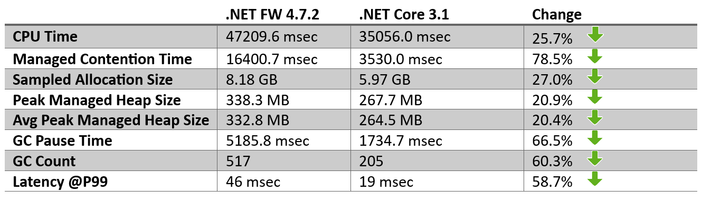
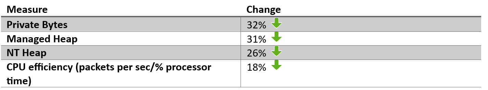

Microsoft 365 (M365) is a broad set of productivity services that enable teamwork, communication, and related experiences. Much of the codebase is written in C#. I'd like to tell you about the journey to .NET Core for the "M365 Substrate" services. Substrate is a set of services, which you can think of as being descended from Microsoft Exchange. In fact, Exchange was the first service at Microsoft to adopt .NET and to deploy as 64-bit.

Substrate is a well-established and very sizable product. We were motivated to move to .NET Core for three reasons. The first was that we were very much in need of performance and cost-efficiency improvements. Any cloud-based vendor knows that every inefficiency costs real money. The second was that, knowing that the .NET Framework was no longer actively developed, we wanted to move to a modern framework that was blazing a trail to the future. The third, and likely more important is that it is cool and shiny and new.

While we have many git repositories for auxiliary services, the core of Substrate is contained in the “Substrate” git repository. This repo houses roughly 3400 C# projects for product code, another 3400 for test code and over 1000 C++ projects. Our production service runs over 100 different processes and app pools on a mixture of 200,000+ machines, and it has over 1000 contributing developers.

## Methodology

The conversion effort started with a single team and focused on a single protocol as a proof-of-concept migration – the POP3 protocol. The POP3 protocol has less usage than other protocols and a smaller network of dependent assemblies that needed conversion; therefore, it was a good fit for a first migration. Even so, there were ~140 assemblies and NuGet packages that needed to be migrated to .NET Core.
Given that a .NET Core assembly should only use other .NET Core (or Standard ) assemblies, we needed to determine the order in which we would migrate these assemblies. We built a dependency graph tool based on our daily builds that showed us a given protocol’s assembly dependencies (directly and indirectly), showed us which of those assemblies were .NET Core compatible (using the .NET Portability Analyzer) and showed us how migrating those assemblies to .NET Core would accrue to other processes/app pools within the Substrate.
While we initially targeted .NET Standard 2.0 for many of our common assemblies, we eventually moved away from .NET Standard and opted for multi-targeting until all of our projects have been migrated at which point we will generate .NET Core only assemblies. This allows us to use the new goodness available in .NET Core instead of having to stick to the functionality that was common between .NET Framework and .NET Core.

## Conversion Progress
At the time of this writing, we have successfully migrated 1061 of the assemblies within the Substrate repo. These conversions have allowed us to run the following services on .NET Core:
- POP3 service
- IMAP4 service
- Mapi-Http app pool
- MSExchangeTransportLogSearch service
- MSExchangeTransportStreamingOptics service
- In Progress – EAS on http.sys
- Our Test and validation system

One significant challenge in migrating to .NET Core was that we reference a significant number of NuGet packages (both internal and external to MSFT). The owners of these packages had to be hunted down in some cases when the package in question didn’t have .NET Standard 2.0 or .NET Core offerings in them. This showed us the importance of keeping up-to-date mappings of package ownership.

## Process Migrations
It should be noted that we have many new .NET Core apps that we have built, but given that those are not migrations, we don’t have before/after numbers to compare. Below we dig into the migrations that we have completed and their results.

### Pop3
POP3 is a Windows service that implements the POP3 protocol for mailbox data retrieval. The table below shows the improvements that we encountered for this process for several metrics.

Of interest, these performance benefits did not include moving to the more modern .NET concepts such as Span and Memory. Once we do, we expect even further savings.

### Imap4
Our IMAP4 process was migrated in a way that was slightly different from POP3, so it was tough to get a good .NET Framework to .NET Core comparison, but recently we just bumped IMAP4 from .NET 5 to .NET 6 and noticed increased performance as a result of that upgrade as shown in the table below:

Both CPU and memory usage are lower after using .NET 6. While there were a few other changes in the IMAP4 code that may contribute to higher performance, it is likely that .NET 6 is the major contributor.

### Mapi Http
MapiHttp is an IIS-based app pool that was migrated to a Kestrel-based application. For MapiHttp, we measured the following improvements:

### CSO
CSO is a .NET Core 6, Kestrel-based gRPC service on top of the Exchange store. It is intended to expose a fast-access protocol to other nodes within the datacenter (as opposed to RPC which is quite chatty for off-box communication). Given that CSO was initially created as a .NET Core app, we cannot show any comparisons with a .NET Framework version. However, one CSO scenario that shows significant improvement is for Item Query where we fetch paged views from mailbox databases. We compared our existing Item Query functionality in the REST API (ASP.NET, NET Framework RESTful service) with our CSO, kestrel-based, gRPC solution. The results impressed us including the following:

It is worth noting that this is not an apples-to-apples comparison. This is a different service, it uses gRPC, and it was written using newer constructs and with efficiency in mind. Still, many of the features that have made this service perform so much better than its predecessor can be attributed to .NET Core and associated offerings (gRPC, Kestrel, etc.).

### Moving Forward
Given the impressive performance benefits of moving to .NET Core, our North Star goal is to migrate all Substrate processes to .NET Core and to move all internal microservices to use gRPC for communication. In addition, the infrastructure changes that our build team has achieved will allow this large-scale product to stay on the cutting edge of .NET versions as they become available to ensure that we are operating at an optimal level and providing the greatest performance benefits to our customers.