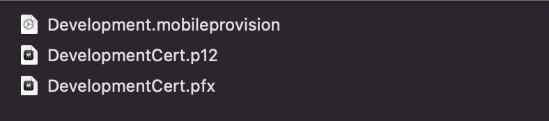
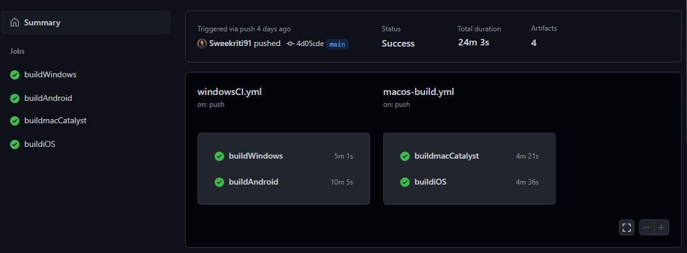
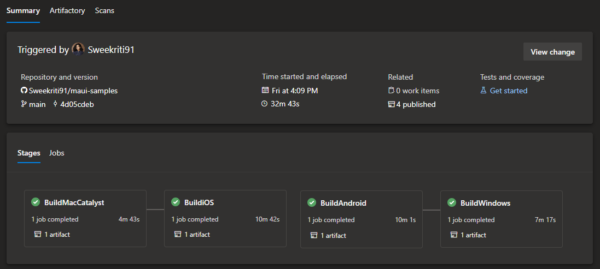

[.NET Multi-platform App UI (.NET MAUI)](https://dot.net/maui) unifies Android, iOS, macOS, and Windows UI frameworks into a single framework so you can write one app that runs natively on many platforms. In this post, we will look at how easy it is to implement basic DevOps pipelines for .NET MAUI apps using GitHub Actions and Azure DevOps.

## Getting Started

Before setting up the pipelines, we need to make sure we have a few files ready.

- For `iOS`, you need a signing certificate and a provisioning profile. This [guide](https://docs.microsoft.com/azure/devops/pipelines/apps/mobile/app-signing?view=azure-devops&tabs=apple-install-during-build#apple) walks you through how to obtain these files.
- (Optional for this post) For `Android`, you need keystore file and value of keystore password and keystore alias. This [guide](https://docs.microsoft.com/azure/devops/pipelines/apps/mobile/app-signing?view=azure-devops&tabs=apple-install-during-build#sign-your-android-app) walks you through how to obtain the files.
- For `Windows`, you need to create and export a certificate for package signing. You can follow this [guide](https://docs.microsoft.com/windows/msix/package/create-certificate-package-signing) for the steps.



We are now ready to start creating the pipelines for the .NET MAUI app. We will be looking at the sample pipelines added to the [dotnet/maui-samples](https://github.com/dotnet/maui-samples) repo as part of the Weather21 app, under the folder [devops](https://github.com/dotnet/maui-samples/tree/main/6.0/Apps/WeatherTwentyOne/devops).

### Pipeline Source Files

> **NOTE** _These are starter pipelines for a basic test and build, great to use for PR-checks. The steps do not cover publish to store or signing for distribution. That would be out of scope for this post, and will be covered in a future post._

#### GitHub Actions Samples

- MacOS Hosted Agent : [macos-build.yml](https://github.com/dotnet/maui-samples/blob/main/6.0/Apps/WeatherTwentyOne/devops/GitHubActions/macos-build.yml)
- Windows Hosted Agent: [windowsCI.yml](https://github.com/dotnet/maui-samples/blob/main/6.0/Apps/WeatherTwentyOne/devops/GitHubActions/windowsCI.yml)

#### Azure DevOps Samples

- MacOS Hosted Agent : [azdo_mac.yml](https://github.com/dotnet/maui-samples/blob/main/6.0/Apps/WeatherTwentyOne/devops/AzureDevOps/azdo_mac.yml)
- Windows Hosted Agent: [azdo_windows.yml](https://github.com/dotnet/maui-samples/blob/main/6.0/Apps/WeatherTwentyOne/devops/AzureDevOps/azdo_windows.yml)

### Pipeline Overview

We have 2 pipeline files for both GitHub Actions and Azure DevOps, one runs on the `macos-12` VM building the `iOS` and `MacCatalyst` targets. The other runs on `windows-2022` VM and builds the `Android` and `Windows` targets.

Each Pipeline is broken down into the follow sub-steps:

1. Set .NET Version
1. Install .NET MAUI Workloads
1. Install Signing Files (as needed)
1. Build/Publish App for TargetFramework
1. Run Unit Tests (if required)
1. Upload Artifacts

This simplified DevOps flow is all thanks to `dotnet` command line tool which we have access to now. We are able to `dotnet build` and `dotnet publish` for all TargetFramework types. No need for complex and convoluted scripts to manage `msbuild` and `VS preview` installations. Thank you to all the contributors for making this happen!

Let's break down the tasks in each Pipeline.

## Pipeline Tasks

> **Quick Tip** Check available GitHub hosted VM images and installed software by checking this [table](https://github.com/actions/virtual-environments#available-environments).



> **Quick Tip** Check available Azure DevOps hosted VM images and installed software by checking this [table](https://docs.microsoft.com/azure/devops/pipelines/agents/hosted?view=azure-devops&tabs=yaml#software).



The common tasks for both pipelines are `Setup .NET SDK Version` and `Install .NET MAUI`.

This is how it looks like in `GitHub Actions`:

```yml

      - name: Setup .NET SDK ${{env.DOTNETVERSION}}
        uses: actions/setup-dotnet@v1
        with:
          dotnet-version:  '${{env.DOTNETVERSION}}'

      - name: Install .NET MAUI
        shell: bash
        run: |
          dotnet nuget locals all --clear 
          dotnet workload install maui --source https://aka.ms/dotnet6/nuget/index.json --source https://api.nuget.org/v3/index.json
          dotnet workload install android ios maccatalyst tvos macos maui wasm-tools --source https://aka.ms/dotnet6/nuget/index.json --source https://api.nuget.org/v3/index.json

```

The first task uses the GitHub Action [Setup .NET Core SDK](https://github.com/marketplace/actions/setup-net-core-sdk) and the creating a pipeline variable makes it easier to change versions in the future.

This is how it looks like in `Azure DevOps` :

```yml

    - task: UseDotNet@2
      displayName: .NET Version
      inputs:
        packageType: 'sdk'
        version: '$(DotNetVersion)'
    
    - task: Bash@3
      displayName: Install MAUI
      inputs:
        targetType: 'inline'
        script: |
          dotnet nuget locals all --clear 
          dotnet workload install maui --source https://aka.ms/dotnet6/nuget/index.json --source https://api.nuget.org/v3/index.json
          dotnet workload install android ios maccatalyst tvos macos maui wasm-tools --source https://aka.ms/dotnet6/nuget/index.json --source https://api.nuget.org/v3/index.json


```

The first task uses the Azure Devops [Use .NET Core task](https://docs.microsoft.com/azure/devops/pipelines/tasks/tool/dotnet-core-tool-installer?view=azure-devops) and the creating a pipeline variable makes it easier to change versions in the future.

The next task is `Install .NET MAUI workloads` via inline script. You can adjust the `--source` to target specific versions of .NET MAUI workloads, and you can learn more about changing sources in the [.NET MAUI Wiki](https://github.com/dotnet/maui/wiki/macOS-Install#install-net-6-with-net-maui).

### Mac Build Agent Pipeline

The build/publish task is explained in the .NET MAUI Documentation:

- [Publish MacCatalyst App](https://docs.microsoft.com/dotnet/maui/macos/deployment/overview)
- [Publish iOS App](https://docs.microsoft.com/dotnet/maui/ios/deployment/overview)

For example, the Publish MacCatalyst task in `GitHub Actions` :

```yml

 - name : Publish MacCatalyst App
        shell: bash
        run: |
          cd 6.0/Apps/WeatherTwentyOne/src
          dotnet publish -f net6.0-maccatalyst -c Release -p:BuildIpa=True -o ./artifacts

```

and the same task in `Azure DevOps` :

```yml

    - task: Bash@3
      displayName: Build MacCatalyst App
      inputs:
        targetType: 'inline'
        script: |
          cd 6.0/Apps/WeatherTwentyOne/src
          dotnet publish -f net6.0-maccatalyst -c Release -p:BuildIpa=True -o ./artifacts


```

To make it easier for `dotnet publish`, the first line navigates to the folder where the `WeatherTwentyOne.sln` exists. In a simpler repository structure, you would not require this first line.

Let's look at the `dotnet publish` command:

 **`dotnet publish -f <target_framework> -c Release -p:BuildIpa=True -o <path_to_output_folder>`**  

|      |  |
| ----------- | ----------- |
| `<target_framework>`      | is set to `net6.0-maccatalyst` or `net6.0-ios` based on what you build       |
| `-o <folder_path>`   | allows you to redirect the publish folder from  default _bin/../.._ , instead to the folder path you specify. This is really useful for DevOps pipelines so it is easier to find the artifacts to publish.        |

Last task is to publish artifacts to the GitHub Pipeline,which uses the GitHub Action [Upload a Build Artifact](https://github.com/marketplace/actions/upload-a-build-artifact).

In Azure DevOps, this is a two step process, fist the [Copy Files Task](https://docs.microsoft.com/azure/devops/pipelines/tasks/utility/copy-files?view=azure-devops&tabs=yaml) copies the files to the ` $(Build.ArtifactStagingDirectory)` and then the [Publish Build Artifacts](https://docs.microsoft.com/azure/devops/pipelines/tasks/utility/publish-build-artifacts?view=azure-devops) task publishes the artifact.

There is one extra step for `iOS`, where we install the Signing Certificate and Provisioning Profile.

This [GitHub Documentation](https://docs.github.com/actions/deployment/deploying-xcode-applications/installing-an-apple-certificate-on-macos-runners-for-xcode-development) explains how to install these files as part of the pipeline for `GitHub Actions`. Following the instructions, this is the task:

```yml

- name: Install the Apple certificate and provisioning profile
        env:
          BUILD_CERTIFICATE_BASE64: ${{ secrets.BUILD_CERTIFICATE_BASE64 }}
          P12_PASSWORD: ${{ secrets.P12_PASSWORD }}
          BUILD_PROVISION_PROFILE_BASE64: ${{ secrets.BUILD_PROVISION_PROFILE_BASE64 }}
          KEYCHAIN_PASSWORD: ${{ secrets.KEYCHAIN_PASSWORD }}
        run: |
          # create variables
          CERTIFICATE_PATH=$RUNNER_TEMP/build_certificate.p12
          PP_PATH=$RUNNER_TEMP/build_pp.mobileprovision
          KEYCHAIN_PATH=$RUNNER_TEMP/app-signing.keychain-db

          # import certificate and provisioning profile from secrets
          echo -n "$BUILD_CERTIFICATE_BASE64" | base64 --decode --output $CERTIFICATE_PATH
          echo -n "$BUILD_PROVISION_PROFILE_BASE64" | base64 --decode --output $PP_PATH

          # create temporary keychain
          security create-keychain -p "$KEYCHAIN_PASSWORD" $KEYCHAIN_PATH
          security set-keychain-settings -lut 21600 $KEYCHAIN_PATH
          security unlock-keychain -p "$KEYCHAIN_PASSWORD" $KEYCHAIN_PATH

          # import certificate to keychain
          security import $CERTIFICATE_PATH -P "$P12_PASSWORD" -A -t cert -f pkcs12 -k $KEYCHAIN_PATH
          security list-keychain -d user -s $KEYCHAIN_PATH

          # apply provisioning profile
          mkdir -p ~/Library/MobileDevice/Provisioning\ Profiles
          cp $PP_PATH ~/Library/MobileDevice/Provisioning\ Profiles

```

On `Azure DevOps`, [Azure DevOps Sign your Apple App](https://docs.microsoft.com/azure/devops/pipelines/apps/mobile/app-signing?view=azure-devops&tabs=apple-install-during-build#sign-your-apple-ios-macos-tvos-or-watchos-app) guides you through the process of adding the Certificate and Provisioning Profile file to [Secure Files Library](https://docs.microsoft.com/azure/devops/pipelines/library/secure-files?view=azure-devops). Once uploaded there, the [Install Apple Certificate task](https://docs.microsoft.com/azure/devops/pipelines/tasks/utility/install-apple-certificate?view=azure-devops) and [Install Apple Provisioning Profile task](https://docs.microsoft.com/azure/devops/pipelines/tasks/utility/install-apple-provisioning-profile?view=azure-devops) will install it as part of your pipeline task. The is what the pipeline would look like :

```yml

 - task: InstallAppleCertificate@2
      inputs:
        certSecureFile: 'DevelopmentCert.p12'
        certPwd: '$(iOSCertPassword)'
        keychain: 'temp'

    - task: InstallAppleProvisioningProfile@1
      inputs:
        provisioningProfileLocation: 'secureFiles'
        provProfileSecureFile: 'Development.mobileprovision'

```

### Windows Build Agent Pipeline

The build/publish task is explained in the .NET MAUI documentation:

- [Publish Windows App](https://docs.microsoft.com/dotnet/maui/windows/deployment/overview)
- [Publish Android App](https://docs.microsoft.com/dotnet/maui/android/deployment/overview)

For example the Android Publish task in `GitHub Actions` :

```yml

- name : Build Android App
          shell: bash
          run: |
            cd 6.0/Apps/WeatherTwentyOne/src
            dotnet publish -f:net6.0-android -c:Release

```

and the same task in `Azure DevOps` :

```yml

    - task: Bash@3
      displayName: Build Android App
      inputs:
        targetType: 'inline'
        script: |
          cd 6.0/Apps/WeatherTwentyOne/src
          dotnet publish -f net6.0-android -c Release

```

The first step navigates to the folder with the `WeatherTwentyOne.sln` and run the `dotnet publish` task. Let's look at the `dotnet publish` command:

 **`dotnet publish -f <target_framework> -c Release -p:BuildIpa=True -o ./artifacts`**
|      |  |
| ----------- | ----------- |
| `<target_framework>`      |  is set to `net6.0-android` or `net6.0-windows10.0.19041.0` based on what you build       |

For `Github Actions`, Publish artifact step remains the same, the GitHub Action [Upload a Build Artifact](https://github.com/marketplace/actions/upload-a-build-artifact) works on both `Mac` and `Windows` agents.

For `Azure Devops`,  [Copy Files Task](https://docs.microsoft.com/azure/devops/pipelines/tasks/utility/copy-files?view=azure-devops&tabs=yaml) and the [Publish Build Artifacts](https://docs.microsoft.com/azure/devops/pipelines/tasks/utility/publish-build-artifacts?view=azure-devops) task works both on `Mac` and `Windows` agents.

For `Windows`, there are two additional tasks. The first is to store and decode the Signing Certificate file.

In `GitHub Actions`, the process for it is as following:

1. The Signing Certificate file created needs to be encoded into Base64. This can be done using `certutil` on `Windows`, follow the [documentation](https://docs.microsoft.com/windows-server/administration/windows-commands/certutil). On `Mac`, you can run `base64 -i <cert_file>.pfx | pbcopy`.
1. The Base64 encoded string needs to be stored in GitHub Actions Secrets by following the [GitHub Actions Encrypted Secrets Documentation](https://docs.github.com/actions/security-guides/encrypted-secrets#creating-encrypted-secrets-for-a-repository).
1. Decode the secret in the Pipeline task:

```yml

- name: Create signing pfx file from secrets
        shell: pwsh
        id: secret-file
        env:
          SIGN_CERT: ${{ secrets.WIN_SIGN_CERT }}
        run: |
          $secretFile = "WinSignCert.pfx"; 
          $encodedBytes = [System.Convert]::FromBase64String($env:SIGN_CERT); 
          Set-Content $secretFile -Value $encodedBytes -AsByteStream;
          Write-Output "::set-output name=SECRET_FILE::$secretFile";

```

In `Azure DevOps`, follow the [CI/CD Pipeline Overview](https://docs.microsoft.com/windows/msix/desktop/cicd-overview) guide and upload the file to [Secure Files Library](https://docs.microsoft.com/azure/devops/pipelines/library/secure-files?view=azure-devops). Then download and install the file using the [Download Secure File task](https://docs.microsoft.com/azure/devops/pipelines/tasks/utility/download-secure-file?view=azure-devops):

```yml

    - task: DownloadSecureFile@1
      inputs:
        secureFile: 'DevelopmentCert.pfx'

```

The second task is to use this Certificate file to sign the MSIX generated from `dotnet publish`. Following this [Azure DevOps Guide](https://docs.microsoft.com/windows/msix/desktop/azure-dev-ops), we get the following task in `GitHub Actions`:

```yml

- name: Sign Windows App
        shell: pwsh
        env:
          CERT_PASSWORD: ${{ secrets.WIN_CERT_PASSWORD }}
        run: |
          '"C:\Program Files (x86)\Windows Kits\10\App Certification Kit\SignTool" sign /a /fd SHA256 /f WinSignCert.pfx /p ($env:CERT_PASSWORD) 6.0\Apps\WeatherTwentyOne\src\WeatherTwentyOne\bin\Release\net6.0-windows10.0.19041.0\win10-x64\AppPackages\WeatherTwentyOne_1.0.0.0_TestWeatherTwentyOne_1.0.0.0_x64.msix'


```

and the same task in `Azure DevOps`, directly using the code snippet provided in the guide:

```yml

    - script: '"C:\Program Files (x86)\Windows Kits\10\App Certification Kit\SignTool" sign /fd SHA256 /f $(Agent.TempDirectory)/XamCATFidCert.pfx /p $(WindowsCertSecret) $(Build.ArtifactStagingDirectory)\6.0\Apps\WeatherTwentyOne\src\WeatherTwentyOne\bin\Release\net6.0-windows10.0.19041.0\win10-x64\AppPackages\WeatherTwentyOne_1.0.0.0_Test\WeatherTwentyOne_1.0.0.0_x64.msix'
      displayName: 'Sign MSIX Package'

```

In `GitHub Actions` for `Android Signing`, the sample pipelines contains the tasks, uncomment and follow the links as needed. Similar to `Windows`, first encode in Base64 and decode the Keystore file. The next task is to sign the generated `apk` file using `jarsigner`.

In `Azure DevOps` for `Android Signing`, this guide shows step by step how to [Sign your Android App](https://docs.microsoft.com/azure/devops/pipelines/apps/mobile/app-signing?view=azure-devops&tabs=apple-install-during-build#sign-your-android-app). It shows how to upload the signing files securely and then how to configure the `Azure DevOps` task for [Android Signing](https://docs.microsoft.com/azure/devops/pipelines/tasks/build/android-signing?view=azure-devops).

## Summary

I hope this helps you get started with setting up DevOps for .NET MAUI apps using `GitHub Actions` and `Azure DevOps`. The sample `yaml` files:

- GitHub Actions Samples

  - MacOS Hosted Agent : [macos-build.yml](https://github.com/dotnet/maui-samples/blob/main/6.0/Apps/WeatherTwentyOne/devops/GitHubActions/macos-build.yml)
  - Windows Hosted Agent: [windowsCI.yml](https://github.com/dotnet/maui-samples/blob/main/6.0/Apps/WeatherTwentyOne/devops/GitHubActions/windowsCI.yml)

- Azure DevOps Samples

  - MacOS Hosted Agent : [azdo_mac.yml](https://github.com/dotnet/maui-samples/blob/main/6.0/Apps/WeatherTwentyOne/devops/AzureDevOps/azdo_mac.yml)
  - Windows Hosted Agent: [azdo_windows.yml](https://github.com/dotnet/maui-samples/blob/main/6.0/Apps/WeatherTwentyOne/devops/AzureDevOps/azdo_windows.yml)

Check out the more samples at [dotnet/maui-samples](https://github.com/dotnet/maui-samples). Please try out .NET MAUI, file issues, or learn more at [dot.net/maui](https://dot.net/maui)!