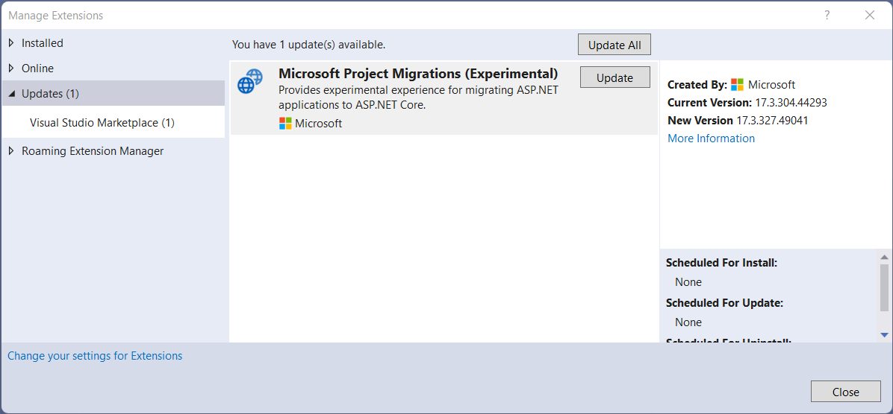
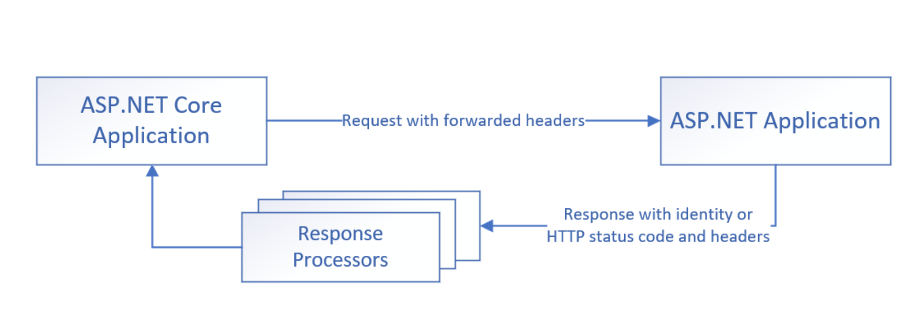
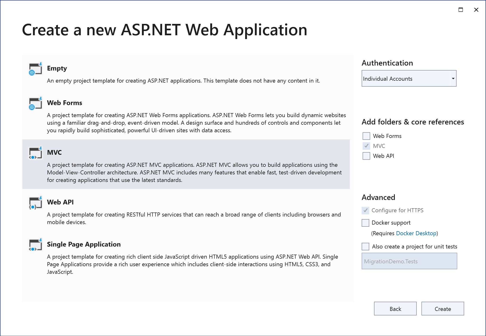
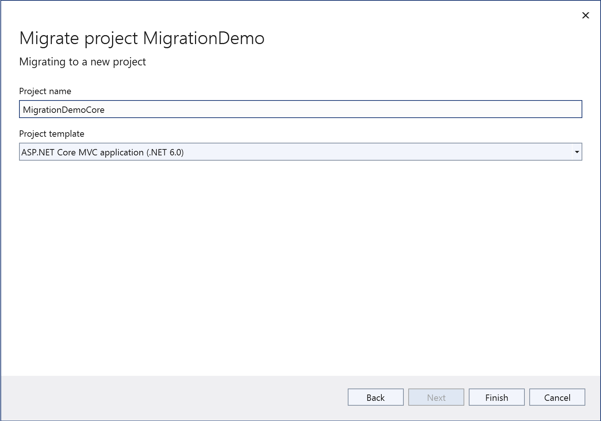
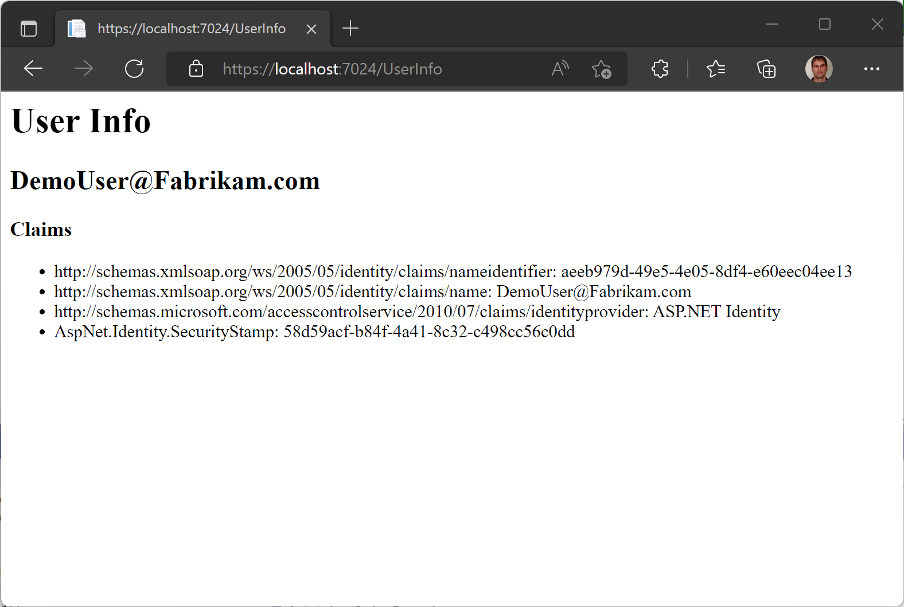

Last month, we introduced [preview tooling to incrementally migrate ASP.NET apps to ASP.NET Core](https://devblogs.microsoft.com/dotnet/incremental-asp-net-to-asp-net-core-migration/). The tooling comprised two components - a Visual Studio extension that created a new ASP.NET Core app alongside an existing ASP.NET app such that endpoints could be gradually moved from one app to the other, and a library of System.Web adapter APIs allowing code to reference common System.Web APIs while targeting .NET Standard 2.0 and being usable in both ASP.NET and ASP.NET Core contexts.

We recently released preview 2 of this ASP.NET migration tooling. The updated tooling includes improvements to the code generated by the Visual Studio extension, additional System.Web surface area in the adapter library, and the ability to share authentication between the ASP.NET and ASP.NET Core apps so that users only have to log in once even if their browsing experience involves endpoints served by both the old and new apps.

As a reminder, development for the System.Web adapters is happening [on GitHub](https://github.com/dotnet/systemweb-adapters). In that repository, you can find [documentation](https://github.com/dotnet/systemweb-adapters/tree/main/docs), browse the latest source code, or contribute by creating issues or pull requests.

## Getting started

If this is your first time testing out the incremental ASP.NET migration tooling, you'll need to install the [Microsoft Project Migrations](https://marketplace.visualstudio.com/items?itemName=WebToolsTeam.aspnetprojectmigrations) Visual Studio extension.

When you use that extension to migrate an ASP.NET project, it will automatically add references to preview 2 versions of the System.Web adapters. But if you need to reference the System.Web adapters directly (to use them in a class library, for example), they can be installed [from NuGet](https://www.nuget.org/packages/Microsoft.AspNetCore.SystemWebAdapters/1.0.0-preview.2.22316.1): `<PackageReference Include="Microsoft.AspNetCore.SystemWebAdapters" Version="1.0.0-preview.2.22316.1" />`.

### Upgrading migration tools

If you previously tested out preview 1 of the incremental ASP.NET migration tooling, you can update the Microsoft Project Migrations Visual Studio extension directly from within Visual Studio. Just click the 'Manage Extensions' command in the Extensions menu. From there, go to the Updates tab and look for "Microsoft Project Migrations" and click the update button.



To update existing references to the System.Web adapters, just update to the preview 2 version of the NuGet package: `1.0.0-preview.2.22316.1`.

## Sharing authentication

The [previous blog post](https://devblogs.microsoft.com/dotnet/incremental-asp-net-to-asp-net-core-migration/#incremental-migration) explained how incremental migration and System.Web adapters work, in general. In preview 2, we've added the ability for apps that are migrating to ASP.NET Core to share authentication between the old and new projects. This works by deferring authentication decisions to the original ASP.NET app. When an app opts into shared authentication, an authentication handler is registered with the ASP.NET Core app which authenticates the user by making an HTTP request to the ASP.NET app including auth-relevant headers (`Authorization` and `Cookie` headers, by default, but this is configurable). A custom HTTP handler in the ASP.NET app will serve the request and return a serialized claims principal for the user who was authenticated based on the headers in the request.

If the ASP.NET app isn't able to authenticate a user (perhaps no one is signed in yet), no claims principal will be returned. Instead, the ASP.NET app will return the HTTP status code and auth-related response headers (`Location`, `Set-Cookie`, and `WWW-Authenticate`, by default) that it would have returned if a user had directly tried to access endpoints in the ASP.NET app requiring authorization. These values are stored in the ASP.NET Core app and, if authentication is challenged (because the user is accessing a protected endpoint, for example), they are used to return an HTTP response to the user that would be similar to the challenge response received directly from the ASP.NET app.

Because the response from the ASP.NET app in case of a challenge may not exactly match what would make sense from the ASP.NET Core app (redirect locations would need fixed up to refer to the right host and original path referenced, for example), some processing happens to the response from the ASP.NET app before passing it along to the end user. The System.Web adapters already fixup known issues related to host and redirect path but if your specific authentication scenario requires any additional modification of responses from the ASP.NET app, you can implement the `Microsoft.AspNetCore.SystemWebAdapters.Authentication.IRemoteAppAuthenticationResultProcessor` interface and register the implementation in your ASP.NET Core app's dependency injection container.



### Known limitations

Remote app authentication works with bearer token and cookie-based authentication schemes. It does not currently work with Windows authentication and there are known to be [some issues](https://github.com/dotnet/systemweb-adapters/issues/72) with WS-Federation authentication that are being investigated.

Note, also, that logging out from the ASP.NET Core app in ASP.NET Identity scenarios does not work because logout in those scenarios is done with a POST request to the ASP.NET app which is currently disallowed due to anti-forgery token verification that does not work between the two apps. As a temporary workaround, apps can have logout actions redirect users to a page hosted by the ASP.NET app and have the user log out from there.

## Walk-through

Let's walk through an example of how to get started with sharing authentication in incremental ASP.NET migration scenarios.

### Creating the initial app

To start, create a new ASP.NET MVC app and choose 'Individual Accounts' for authentication. This will give us a starting point to migrate from that includes ASP.NET Identity authentication.



Launch the app to make sure it works and register a user.

### Creating the migration project

Now, right click on the project in Visual Studio's solution explorer and choose 'Migrate Project' to use the Project Migrations extension to setup a new ASP.NET Core app that will run and deploy alongside this one and allow us to gradually migrate endpoints over. Be sure to choose an MVC template since the initial app is MVC.



The new project will already have a reference to `Microsoft.AspNetCore.SystemWebAdapters`, but we will need to add a reference to that package to the original ASP.NET app so that it can configure the remote app endpoint on the ASP.NET side. Right-click the original app's references folder, choose 'Manage NuGet Packages' and add a reference to the `Microsoft.AspNetCore.SystemWebAdapters` package.

### Configuring remote app authentication

At this point, we have our new ASP.NET Core app created and proxying requests it can't serve to the original ASP.NET app. We now need to configure remote app authentication so that user identity is shared between the two apps.

In the ASP.NET Core app's *Program.cs* file add a call to `AddRemoteAppAuthentication` after the existing `AddSystemWebAdapters` call as shown here.

```CSharp
builder.Services.AddSystemWebAdapters()
    .AddRemoteAppAuthentication(true, options =>
     {
         options.RemoteServiceOptions.RemoteAppUrl = 
            new(builder.Configuration["ReverseProxy:Clusters:fallbackCluster:Destinations:fallbackApp:Address"]);
         options.RemoteServiceOptions.ApiKey = "test-key";
     });
```

This will register the remote app authentication handler.

The first parameter passed to `AddRemoteAppAuthentication` is a boolean indicating whether remote app authentication should be the default authentication scheme for this app. If you pass true, then the remote app will be queried by default for the user's identity for requests to any endpoint that doesn't specify a different authentication scheme. This is the simplest way to enable remote app authentication globally, but has the downside of making an extra HTTP request for every endpoint whether you need to use the user's identity or not. If you pass false for this parameter, then the remote app authentication handler will be registered but will only be used for endpoints that specifically request the remote app authentication scheme (by specifying the scheme in an authorize attribute, for example: `[Authorize(AuthenticationSchemes = RemoteAppAuthenticationDefaults.AuthenticationScheme)]`).

The second parameter passed to `AddRemoteAppAuthentication` is a method for configuring `RemoteAppAuthenticationOptions`. The two properties that must be set on this options object are the `RemoteAppUrl` which is the base URL authentication requests should be sent to (we can retrieve this from the YARP configuration already set up by the incremental migration tooling, as shown in the sample above) and an `ApiKey` string which is used to authenticate the ASP.NET Core app as a caller that is allowed to authenticate users with the remote app. The `ApiKey` string can be any string that is securely shared between the ASP.NET and ASP.NET Core apps. In this walk-through, we're using a hard-coded string but in real-world scenarios this should be securely loaded from the applications' environments or, even better, a secure store like Azure Key Vault.

We also need to enable authentication middleware for the ASP.NET Core application, so add a call to `app.UseAuthentication()` after the existing call to `UseRouting` but before the call to `UseAuthorization`.

Now that the ASP.NET Core app is setup to query the ASP.NET app for authentication, we need to configure the ASP.NET app to be able to respond to those requests. Navigate to the ASP.NET app's *global.asax.cs* file and add the following call to the end of the `Application_Start` method:

```CSharp
Application.AddSystemWebAdapters()
    .AddRemoteAppAuthentication(options =>
        options.RemoteServiceOptions.ApiKey = "test-key");
```

You will also need to add an import statement `using Microsoft.AspNetCore.SystemWebAdapters;` to the top of global.asax.cs. This code should look familiar. Similar to the code that registered the authentication handler in the ASP.NET Core app, this call is configuring an HTTP handler in the ASP.NET app to handle requests for authentication. The only required option here is the `ApiKey` property which must, of course, match the API key used in the ASP.NET Core app.

### Adding a test page

At this point, remote app authentication is configured so that the ASP.NET Core app will see the identity of users logged in to the ASP.NET app and if the ASP.NET Core app challenges authentication, it should redirect to the login page of the ASP.NET app. To test that out, though, we'll need an ASP.NET Core endpoint that makes use of the user's identity.

First, replace the call to `app.MapControllers();` in the ASP.NET Core app's *Program.cs* with a call to `MapDefaultControllerRoute` instead so that we can easily route to ASP.NET Core controllers:

```CSharp
app.MapDefaultControllerRoute();
```

Next, add a *Controllers* folder to the ASP.NET Core app and create a simple controller called `UserInfoController` with a single Index action method:

```CSharp
using Microsoft.AspNetCore.Mvc;

namespace MigrationDemoCore.Controllers;

public class UserInfoController : Controller
{
    [Authorize]
    public IActionResult Index()
    {
        return View();
    }
}
```

And finally create a view for the controller's Index endpoint that exercises `User.Identity`. Create a folder called *Views* in the project. Inside of that, create a folder called *UserInfo*. And finally create a view called *Index.cshtml* with contents similar to this:

```razor
<h1>User Info</h1>
<h2>@(User.Identity?.Name??"Anonymous user")</h2>
<h3>Claims</h3>
<ul>
@foreach(var c in User.Claims)
{
    <li>@c.Type: @c.Value</li>
}
</ul>
```

With that, we can launch the sample application and see it all working end-to-end. Most of the endpoints of the app are still served by the original ASP.NET app. But if you navigate to the `/UserInfo` route, that endpoint is served by the ASP.NET Core app. Because the endpoint is protected with an `[Authorize]` attribute, unauthenticated users will be redirected to the app's login page when they try to access the endpoint. For authenticated users, despite `/UserInfo` being served by the ASP.NET Core app, you can see that the user's identity (provided by the ASP.NET app) is available!



Note that even if you remove the `[Authorize]` attribute from `/UserInfo`, the endpoint will still have access to the user's identity if a user is logged in. If there is no authenticated user, `User.Identity` will be null.

## Summary

With this second preview release of incremental ASP.NET migration tooling, a number of new features have been added - most notably the ability to share authentication between the ASP.NET and ASP.NET Core apps in incremental upgrade scenarios. Using this feature, developers should be able to gradually move endpoints from an existing ASP.NET app into a new ASP.NET Core app even when those endpoints require authenticating the user.

The current shared authentication solution is a general-purpose one that should work for most types of authentication, but we are continuing to investigate additional remote authentication options that may be more effective or efficient for specific types of authentication. We are also exploring shared authentication that works by centralizing all authentication decisions with the ASP.NET *Core* app (rather than the ASP.NET app). Combining that functionality with what is already available in Preview 2 would allow developers to start moving endpoints to ASP.NET Core immediately but then shift authentication responsibilities to the ASP.NET Core app at some point during the migration process.

In addition to the shared authentication work, we are also continuing to expand the System.Web adapters surface area to include more of the most-used APIs from System.Web.

If you have any feedback on the tooling - whether that's bug reports or feature suggestions - you can contribute to the project on [GitHub](https://github.com/dotnet/systemweb-adapters) by creating issues or pull requests.
