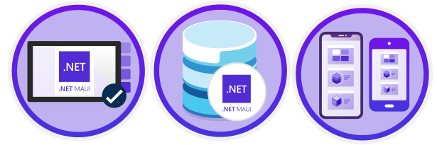

On May 23, 2022 the .NET Multi-platform App UI, or .NET MAUI, was [released to general availability](https://devblogs.microsoft.com/dotnet/introducing-dotnet-maui-one-codebase-many-platforms/?WT.mc_id=dotnet-68837-masoucou). .NET MAUI gives you a first-class, cross-platform UI stack targeting Android, iOS, macOS, and Windows. And we're excited to announce several different ways to learn .NET MAUI. Whether you already have vast experience building cross-platform apps from the Xamarin days or are a brand-new cross-platform developer, there's something here for you.

## Let's Learn .NET MAUI

We have several different resources to teach you .NET MAUI. We have workshops, Learn modules, videos and podcasts. Each vary on how in-depth they go and which aspects of .NET MAUI development they cover. Pick and choose what you need or use them all - you'll learn a lot either way.

- [Build mobile and desktop apps with .NET MAUI](https://docs.microsoft.com/learn/paths/build-apps-with-dotnet-maui/?WT.mc_id=dotnet-68837-masoucou) this Microsoft Learn path consists of 7 modules ranging from an [introduction to .NET MAUI](https://docs.microsoft.com/learn/dotnet-maui/build-mobile-and-desktop-apps/?WT.mc_id=dotnet-68837-masoucou), to [creating a UI with XAML](https://docs.microsoft.com/learn/dotnet-maui/create-user-interface-xaml/?WT.mc_id=dotnet-68837-masoucou), all the way to [storing local data with SQLite](https://docs.microsoft.com/learn/dotnet-maui/store-local-data/?WT.mc_id=dotnet-68837-masoucou), and more. Everything you need to know to get a jump-start on your .NET MAUI app. Microsoft Learn is a free hands-on, self-paced training that teaches you how to develop what you want on your time.
- [The official .NET MAUI docs!](https://docs.microsoft.com/dotnet/maui/?WT.mc_id=dotnet-68837-masoucou) Take you .NET MAUI apps to the next level with the official Microsoft documentation.
- [.NET MAUI Learning Challenge](https://docs.microsoft.com/learn/challenges?id=3331c025-dfb3-43c4-917a-9c6e49fd29d0&WT.mc_id=dotnet-68837-masoucou) compete against your friends to see who can finish the most .NET MAUI Learn modules! Challenge open until June 23, 2022!
- [.NET MAUI for Beginners](https://www.youtube.com/playlist?list=PLdo4fOcmZ0oUBAdL2NwBpDs32zwGqb9DY) video series. Follow along with 8 short videos that will teach you how to get started with .NET MAUI and Visual Studio to build your very first cross-platform desktop and mobile app.
- [.NET MAUI Workshop](https://github.com/dotnet-presentations/dotnet-maui-workshop) follow along with a workshop that takes you from building the business logic of a backend that pulls down json-encoded data from a RESTful endpoint to creating a .NET MAUI app that displays that data in many different ways and fully theme the application.
- [Let's Learn .NET MAUI episode](https://docs.microsoft.com/events/learntv/lets-learn-dotnet-maui-june-2022/?WT.mc_id=dotnet-68837-masoucou). Every month we feature a new episode on learning an aspect of .NET and in June 2022 it's .NET MAUI. Get a full introduction to build native, cross-platform desktop and mobile apps with .NET.
- [Awesome .NET MAUI](https://github.com/jsuarezruiz/awesome-dotnet-maui) is a curated list of samples, tools, and libraries that will make your .NET MAUI development life easier. Curated by Javier Suarez Ruiz, an engineer for .NET MAUI.
- [.NET MAUI Podcast](https://www.dotnetmauipodcast.com/) join hosts David Ortinau, James Montemagno, and Matt Soucoup as they give you a behind-the-scenes glimpse of building .NET MAUI itself... and a ton of other news for .NET MAUI developers from the world of .NET MAUI, Visual Studio, and Azure.

<iframe src="https://player.fireside.fm/v2/ce4Mj65y+5oHsvIIH?theme=dark" width="740" height="200" frameborder="0" scrolling="no"></iframe>

## Summary

We wish you luck on your .NET MAUI learning journey. Do you want more learning topics? Different topics? Let us know in the comments!