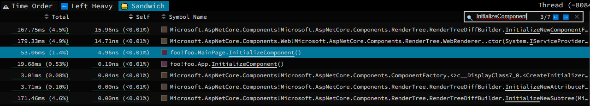
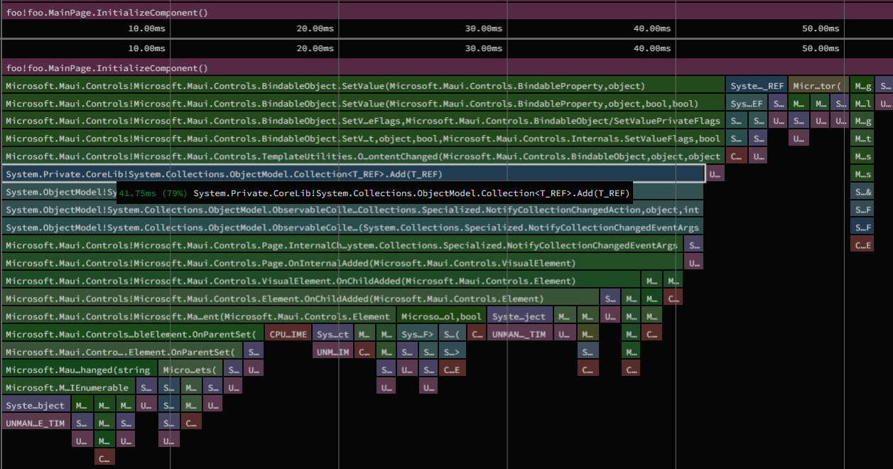
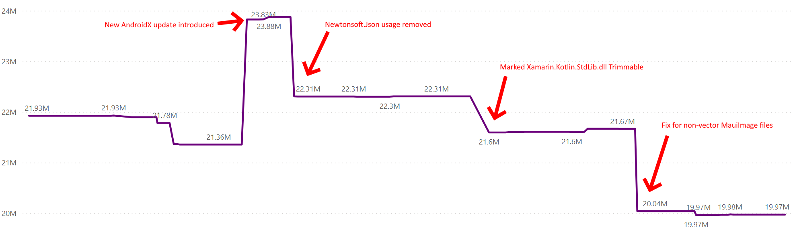

.NET MAUI unifies Android, iOS, macOS, and Windows APIs into a single
API that allows a write-once run-anywhere developer experience. We are
focused in this transition on improving both your daily productivity
as well as performance of your applications. Gains in developer
productivity, we believe, should not be at the cost of application
performance.

The same could be said about application size -- what overhead is
present in a blank .NET MAUI application? When we began optimizing
.NET MAUI, it was clear that iOS had some work needed to improve
application size, while Android was lacking in startup performance.

iOS application size of a `dotnet new maui` project was originally
around 18MB. Likewise .NET MAUI startup times on Android in earlier
previews were not looking too good:

| Application           | Framework | Startup Time(ms) |
|---------------------- |-----------| ----------------:|
| Xamarin.Android       |   Xamarin |            306.5 |
| Xamarin.Forms         |   Xamarin |            498.6 |
| Xamarin.Forms (Shell) |   Xamarin |            817.7 |
| dotnet new android    |    .NET 6 |            210.5 |
| dotnet new maui       |    .NET 6 |            683.9 |
| [.NET Podcast][0]     |    .NET 6 |           1299.9 |

This is an average of ten runs on a Pixel 5 device. See our
[maui-profiling][23] repo for details on how these numbers were
obtained.

Our goal was for .NET MAUI to be *faster* than its predecessor,
Xamarin.Forms, and it was clear that we had some work to do in .NET
MAUI itself. The `dotnet new android` template was already shaping up
to launch faster than Xamarin.Android, mostly due to the new BCL and
Mono runtime in .NET 6.

The `dotnet new maui` template was not yet using the [Shell][22]
navigation pattern, but plans were in the works for it to be the
default navigation pattern in .NET MAUI. We knew there would be a
performance-hit in the template when we adopted this change.

To arrive at where we are today, it was a collaboration of several
different teams. We improved areas like Microsoft.Extensions and
DependencyInjection usage, AOT compilation, Java interop, XAML, code
in .NET MAUI in general, and many more.

After the dust settled, we arrived at a much better place:

| Application        |        Framework | Startup Time(ms) |
|------------------- |------------------| ----------------:|
| dotnet new android | .NET 6 / MAUI GA |            182.8 |
| dotnet new maui    | .NET 6 / MAUI GA |            568.1 |
| dotnet new maui**  | .NET 6 / MAUI GA |            464.2 |
| [.NET Podcast][0]  | .NET 6 / MAUI GA |            814.2 |

`**` - this is the original `dotnet new maui` template that is not using [Shell][22].

Details below, enjoy!

## Table Of Contents

Startup Performance Improvements

* [Profiling on Mobile](#profiling-on-mobile)
* [Measuring Over Time](#measuring-over-time)
* [Profiled AOT](#profiled-aot)
* [Single-file Assembly Stores](#single-file-assembly-stores)
* [Spanify RegisterNativeMembers](#spanify-registernativemembers)
* [System.Reflection.Emit and Constructors](#systemreflectionemit-and-constructors)
* [System.Reflection.Emit and Methods](#systemreflectionemit-and-methods)
* [Newer Java.Interop APIs](#newer-javainterop-apis)
* [Multi-dimensional Java Arrays](#multi-dimensional-java-arrays)
* [Use Glide for Android Images](#use-glide-for-android-images)
* [Reduce Java Interop Calls](#reduce-java-interop-calls)
* [Port Android XML to Java](#port-android-xml-to-java)
* [Remove Microsoft.Extensions.Hosting](#remove-microsoftextensionshosting)
* [Less Shell Initialization on Startup](#less-shell-initialization-on-startup)
* [Fonts Should Not Use Temporary Files](#fonts-should-not-use-temporary-files)
* [Compute OnPlatform at Compile-time](#compute-onplatform-at-compile-time)
* [Use Compiled Converters in XAML](#use-compiled-converters-in-xaml)
* [Optimize Color Parsing](#optimize-color-parsing)
* [Don't Use Culture-aware String Comparisons](#dont-use-culture-aware-string-comparisons)
* [Create Loggers Lazily](#create-loggers-lazily)
* [Use Factory Methods for Dependency Injection](#use-factory-methods-for-dependency-injection)
* [Load ConfigurationManager Lazily](#load-configurationmanager-lazily)
* [Default VerifyDependencyInjectionOpenGenericServiceTrimmability](#default-verifydependencyinjectionopengenericservicetrimmability)
* [Improve the Built-in AOT Profile](#improve-the-built-in-aot-profile)
* [Enable Lazy-loading of AOT Images](#enable-lazy-loading-of-aot-images)
* [Remove Unused Encoding Object in System.Uri](#remove-unused-encoding-object-in-systemuri)

App Size Improvements

* [Fix defaults for MauiImage Sizes](#fix-defaults-for-mauiimage-sizes)
* [Remove Application.Properties and DataContractSerializer](#remove-applicationproperties-and-datacontractserializer)
* [Trim Unused HTTP Implementations](#trim-unused-http-implementations)

Improvements in the [.NET Podcast][0] Sample

* [Remove Microsoft.Extensions.Http Usage](#remove-microsoftextensionshttp-usage)
* [Remove Newtonsoft.Json Usage](#remove-newtonsoftjson-usage)
* [Run First Network Request in Background](#run-first-network-request-in-background)

Experimental or Advanced Options

* [Trimming Resource.designer.cs](#trimming-resourcedesignercs)
* [R8 Java Code Shrinker](#r8-java-code-shrinker)
* [AOT Everything](#aot-everything)
* [AOT and LLVM](#aot-and-llvm)
* [Record a Custom AOT Profile](#record-a-custom-aot-profile)

## Startup Performance Improvements

### Profiling on Mobile

I have to mention the .NET diagnostic tooling available for mobile
platforms, as it was our step number 0 for making .NET MAUI faster.

Profiling .NET 6 Android applications requires usage of a tool called
[`dotnet-dsrouter`][1]. This tool enables `dotnet trace` to connect to
a running mobile application on Android, iOS, etc. This was probably
the most impactful tool we used for profiling .NET MAUI.

To get started with `dotnet trace` and `dsrouter`, begin by
configuring some settings via `adb` and launching `dsrouter`:

```dotnetcli
adb reverse tcp:9000 tcp:9001
adb shell setprop debug.mono.profile '127.0.0.1:9000,suspend'
dotnet-dsrouter client-server -tcps 127.0.0.1:9001 -ipcc /tmp/maui-app --verbose debug
```

Next launch `dotnet trace`, such as:

```dotnetcli
dotnet-trace collect --diagnostic-port /tmp/maui-app --format speedscope
```

After launching an Android app built with `-c Release` and
`-p:AndroidEnableProfiler=true`, you'll notice the connection when
`dotnet trace` outputs:

```dotnetcli
Press <Enter> or <Ctrl+C> to exit...812  (KB)
```

Simply press enter after your application is fully launched to get a
`*.speedscope` saved in the current directory. You can open this file
at https://speedscope.app, for an in-depth look into the time each
method takes during application startup:





See [our documentation][2] for further details using `dotnet trace` in
Android applications. I would recommend profiling `Release` builds on
a physical Android device to get the best picture of the real-world
performance of your app.

### Measuring Over Time

Our friends in the .NET fundamentals team setup a pipeline to track
.NET MAUI performance scenarios, such as:

* Package size
* On disk size (uncompressed)
* Individual file breakdown
* Application startup

This allowed us to see the impact of improvements or regressions over
time, seeing numbers for each commit of the dotnet/maui repo. We could
also determine if the difference was caused by changes in
xamarin-android, xamarin-macios, or dotnet/runtime.

So for example, a graph of startup time (in milliseconds) of the
`dotnet new maui` template, running on a physical Pixel 4a device:


_Note that the Pixel 4a is considerably slower than the Pixel 5._

We could pinpoint the commit in dotnet/maui where regressions and
improvements occurred. It can't be understated how useful this was for
tracking our goals.

Likewise, we could see our progress in the [.NET Podcast][0] app over
time on the same Pixel 4a device(s):


This graph was our true focus, as it was a "real application" close to
what developers would see in their own mobile apps.

As for application size, it is a much more stable number -- making it
very easy to zero in when things got worse or better:



See [dotnet-podcasts#58][58], [AndroidX#520][520], and
[dotnet/maui#6419][6419] for details on these improvements.

### Profiled AOT

During our initial performance tests of .NET MAUI, we saw how JIT
(just in time) vs AOT (ahead of time) compiled code can perform:

| Application        | JIT Time(ms) | AOT Time(ms) |
|------------------- |-------------:| ------------:|
| dotnet new maui    |     1078.0ms |      683.9ms |

JIT-ing happens the first time each C# method is called, which
implicitly impacts startup performance in mobile applications.

Also problematic is the app size increase caused by AOT. An Android
native library is added to the final app for every .NET assembly. To
give the best of both worlds, [startup tracing or Profiled AOT][3] is
a current feature of Xamarin.Android. This is a mechanism for AOT'ing
the startup path of applications, which improves launch times
significantly with only a modest app size increase.

It made complete sense for this to be the default option for `Release`
builds in .NET 6. In the past, the Android NDK was required (a
multiple gigabyte download) for doing AOT of any kind with
Xamarin.Android. We did the legwork for building AOT'd applications
without an Android NDK installed, making it possible to be the default
going forward.

We recorded built-in profiles for `dotnet new android`, `maui`, and
`maui-blazor` templates that benefit most applications. If you would
like to record a custom profile in .NET 6, you can try our
experimental [Mono.Profiler.Android][4] package. We are working on
full support for recording custom profiles in a future .NET release.

See [xamarin-android#6547][6547] and [dotnet/maui#4859][4859] for
details about this improvement.

### Single-file Assembly Stores

Previously, if you reviewed a `Release` Android `.apk` contents in
your favorite zip-file utility, you can see .NET assemblies located at:

```dotnetcli
assemblies\Java.Interop.dll
assemblies\Mono.Android.dll
assemblies\System.Runtime.dll
assemblies\arm64-v8a\System.Private.CoreLib.dll
assemblies\armeabi-v7a\System.Private.CoreLib.dll
assemblies\x86\System.Private.CoreLib.dll
assemblies\x86_64\System.Private.CoreLib.dll
```

These files were loaded individually with the [`mmap` system
call][15], which was a cost per .NET assembly inside the app. This is
implemented in C/C++ in the Android workload, using a callback that
the Mono runtime provides for assembly loading. MAUI applications have
a lot of assemblies, so we introduced a new
`$(AndroidUseAssemblyStore)` feature that is enabled by default for
`Release` builds.

After this change, you end up with:

```dotnetcli
assemblies\assemblies.manifest
assemblies\assemblies.blob
assemblies\assemblies.arm64_v8a.blob
assemblies\assemblies.armeabi_v7a.blob
assemblies\assemblies.x86.blob
assemblies\assemblies.x86_64.blob
```

Now Android startup only has to call [`mmap`][15] twice: once for
`assemblies.blob`, and a second time for the architecture-specific
blob. This had a noticeable impact on applications with many .NET
assemblies.

If you need to inspect the IL, of these assemblies from a compiled
Android application, we created an [assembly-store-reader][16] tool
for "unpacking" these files.

Another option is to build your application with these settings
disabled:

```dotnetcli
donut build -c Release -p:AndroidUseAssemblyStore=false -p:AndroidEnableAssemblyCompression=false
```

This allows you to be able to unzip the resulting `.apk` with your
favorite zip utility and inspect the .NET assemblies with a tool like
[ILSpy][17]. This is a good way to diagnose trimmer/linker issues.

See [xamarin-android#6311][6311] for details about this improvement.

### Spanify RegisterNativeMembers

When a C# object is created from Java, a small Java wrapper is
invoked, such as:

```java
public class MainActivity extends android.app.Activity
{
    public static final String methods;
    static {
        methods = "n_onCreate:(Landroid/os/Bundle;)V:GetOnCreate_Landroid_os_Bundle_Handler\n";
        mono.android.Runtime.register ("foo.MainActivity, foo", MainActivity.class, methods);
    }
```

The list of `methods` is a `\n` and `:`-delimited list of [Java Native
Interface (JNI)][5] signatures that are overridden in managed C# code.
You get one of these for each Java method that is overridden in C#.

When the actual Java `onCreate()` method is called for an Android
`Activity`:

```java
public void onCreate (android.os.Bundle p0)
{
    n_onCreate (p0);
}

private native void n_onCreate (android.os.Bundle p0);
```

Through various magic and hand waving, `n_onCreate` calls into the
Mono runtime and invokes our `OnCreate()` method in C#.

The code splitting the `\n` and `:`-delimited list of methods was
written in the early days of Xamarin using `string.Split()`. Suffice
to say [`Span<T>`][6] didn't exist back then, but we can use it now!
This improves the cost of any C# class that subclasses a Java class,
so it is a wider reaching improvement than just .NET MAUI.

You might ask, "why use strings at all?" Using Java arrays appears to
have a worse performance impact than delimited strings. In our testing
calling into JNI to get Java array elements, performs worse than
`string.Split` *and* our new usage of `Span`. We have some ideas on
how we can re-architect this in future .NET releases.

In addition to .NET 6, this change shipped in the latest version of
Xamarin.Android for current customers.

See [xamarin-android#6708][6708] for details about this improvement.

### System.Reflection.Emit and Constructors

Since the early days of Xamarin, we had a somewhat complicated method
for invoking C# constructors from Java.

First, we had some reflection calls that happen once on startup:

```csharp
static MethodInfo newobject = typeof (System.Runtime.CompilerServices.RuntimeHelpers).GetMethod ("GetUninitializedObject", BindingFlags.Public | BindingFlags.Static)!;
static MethodInfo gettype = typeof (System.Type).GetMethod ("GetTypeFromHandle", BindingFlags.Public | BindingFlags.Static)!;
static FieldInfo handle = typeof (Java.Lang.Object).GetField ("handle", BindingFlags.NonPublic | BindingFlags.Instance)!;
```

This appears to be leftover from very early versions of Mono and has
just persisted to this day. `RuntimeHelpers.GetUninitializedObject()`,
for example can be called directly.

Followed by some complex System.Reflection.Emit usage with a passed in
`System.Reflection.ConstructorInfo cinfo` instance:

```csharp
DynamicMethod method = new DynamicMethod (DynamicMethodNameCounter.GetUniqueName (), typeof (void), new Type [] {typeof (IntPtr), typeof (object []) }, typeof (DynamicMethodNameCounter), true);
ILGenerator il = method.GetILGenerator ();

il.DeclareLocal (typeof (object));

il.Emit (OpCodes.Ldtoken, type);
il.Emit (OpCodes.Call, gettype);
il.Emit (OpCodes.Call, newobject);
il.Emit (OpCodes.Stloc_0);
il.Emit (OpCodes.Ldloc_0);
il.Emit (OpCodes.Ldarg_0);
il.Emit (OpCodes.Stfld, handle);

il.Emit (OpCodes.Ldloc_0);

var len = cinfo.GetParameters ().Length;
for (int i = 0; i < len; i++) {
    il.Emit (OpCodes.Ldarg, 1);
    il.Emit (OpCodes.Ldc_I4, i);
    il.Emit (OpCodes.Ldelem_Ref);
}
il.Emit (OpCodes.Call, cinfo);

il.Emit (OpCodes.Ret);

return (Action<IntPtr, object?[]?>) method.CreateDelegate (typeof (Action <IntPtr, object []>));
```

We call the delegate returned, such that the `IntPtr` is the `Handle`
of the `Java.Lang.Object` subclass and the `object[]` are any
parameters for that particular C# constructor. System.Reflection.Emit
has a significant cost for both the first use of it on startup, as
well as each future call.

After some careful review, we could make the `handle` field
`internal`, and simplify this code to:

```csharp
var newobj = RuntimeHelpers.GetUninitializedObject (cinfo.DeclaringType);
if (newobj is Java.Lang.Object o) {
    o.handle = jobject;
} else if (newobj is Java.Lang.Throwable throwable) {
    throwable.handle = jobject;
} else {
    throw new InvalidOperationException ($"Unsupported type: '{newobj}'");
}
cinfo.Invoke (newobj, parms);
```

What this code does is create an object *without calling the
constructor* (ok weird?), set the `handle` field, and then invoke the
constructor. This is done so that the `Handle` is valid on any
`Java.Lang.Object` when the C# constructor begins. The `Handle` would
be needed for any Java interop inside the constructor (like calling
other Java methods on the class) as well as calling any base Java
constructors.

The new code significantly improved any C# constructor called from
Java, so this particular change improves more than just .NET MAUI. In
addition to .NET 6, this change shipped in the latest version of
Xamarin.Android for current customers.

See [xamarin-android#6766][6766] for details about this improvement.

### System.Reflection.Emit and Methods

When you override a Java method in C#, such as:

```csharp
public class MainActivity : Activity
{
    protected override void OnCreate(Bundle savedInstanceState)
    {
         base.OnCreate(savedInstanceState);
         //...
    }
}
```

In the transition from Java to C#, we have to wrap the C# method to
handle exceptions such as:

```csharp
try
{
    // Call the actual C# method here
}
catch (Exception e) when (_unhandled_exception (e))
{
    AndroidEnvironment.UnhandledException (e);
    if (Debugger.IsAttached || !JNIEnv.PropagateExceptions)
        throw;
}
```

If a managed exception is unhandled in `OnCreate()`, for example, then
you actually end up with a native crash (and no managed C# stack
trace). We need to make sure the debugger can break on the exception
if it is attached, and log the C# stack trace otherwise.

Since the beginning of Xamarin, the above code was generated via
System.Reflection.Emit:

```csharp
var dynamic = new DynamicMethod (DynamicMethodNameCounter.GetUniqueName (), ret_type, param_types, typeof (DynamicMethodNameCounter), true);
var ig = dynamic.GetILGenerator ();

LocalBuilder? retval = null;
if (ret_type != typeof (void))
    retval = ig.DeclareLocal (ret_type);

ig.Emit (OpCodes.Call, wait_for_bridge_processing_method!);

var label = ig.BeginExceptionBlock ();

for (int i = 0; i < param_types.Length; i++)
    ig.Emit (OpCodes.Ldarg, i);
ig.Emit (OpCodes.Call, dlg.Method);

if (retval != null)
    ig.Emit (OpCodes.Stloc, retval);

ig.Emit (OpCodes.Leave, label);

bool  filter = Debugger.IsAttached || !JNIEnv.PropagateExceptions;
if (filter && JNIEnv.mono_unhandled_exception_method != null) {
    ig.BeginExceptFilterBlock ();

    ig.Emit (OpCodes.Call, JNIEnv.mono_unhandled_exception_method);
    ig.Emit (OpCodes.Ldc_I4_1);
    ig.BeginCatchBlock (null!);
} else {
    ig.BeginCatchBlock (typeof (Exception));
}

ig.Emit (OpCodes.Dup);
ig.Emit (OpCodes.Call, exception_handler_method!);

if (filter)
    ig.Emit (OpCodes.Throw);

ig.EndExceptionBlock ();

if (retval != null)
    ig.Emit (OpCodes.Ldloc, retval);

ig.Emit (OpCodes.Ret);
```

This code is called twice for a `dotnet new android` app, but ~58
times for a `dotnet new maui` app!

Instead using System.Reflection.Emit, we realized we could actually
write a strongly-typed "fast path" for each common delegate type.
There is a generated `delegate` that matches each signature:

```csharp
void OnCreate(Bundle savedInstanceState);

// Maps to *JNIEnv, JavaClass, Bundle
// Internal to each assembly
internal delegate void _JniMarshal_PPL_V(IntPtr, IntPtr, IntPtr);
```

So we could list every signature used by `dotnet maui` apps, such as:

```csharp
class JNINativeWrapper
{
    static Delegate? CreateBuiltInDelegate (Delegate dlg, Type delegateType)
    {
        switch (delegateType.Name)
        {
            // Unsafe.As<T>() is used, because _JniMarshal_PPL_V is generated internal in each assembly
            case nameof (_JniMarshal_PPL_V):
                return new _JniMarshal_PPL_V (Unsafe.As<_JniMarshal_PPL_V> (dlg).Wrap_JniMarshal_PPL_V);
            // etc.
        }
        return null;
    }

    // Static extension method is generated to avoid capturing variables in anonymous methods
    internal static void Wrap_JniMarshal_PPL_V (this _JniMarshal_PPL_V callback, IntPtr jnienv, IntPtr klazz, IntPtr p0)
    {
        // ...
    }
}
```

The drawback to this approach is that we have to list more cases when
a new signature is used. We don't want to exhaustively list every
combination, as this will cause IL-size to grow. We are investigating
how to improve this in future .NET releases.

See [xamarin-android#6657][6657] and [xamarin-android#6707][6707] for
details about this improvement.

### Newer Java.Interop APIs

The original Xamarin APIs in `Java.Interop.dll`, are APIs such as:

* `JNIEnv.CallStaticObjectMethod`

Where the "new way" to call into Java makes fewer memory allocations
per call:

* `JniEnvironment.StaticMethods.CallStaticObjectMethod`

When C# bindings are generated for Java methods at build time, the
newer/faster methods are used by default -- and have been for some
time in Xamarin.Android. Previously, Java binding projects could set
[`$(AndroidCodegenTarget)`][7] to `XAJavaInterop1`, which caches and
reuses `jmethodID` instances on each call. See the [java.interop][8]
repo for the history on this feature.

The remaining places that this is an issue, are anywhere we have
"manual" bindings. These tend to also be frequently used methods, so
it was worthwhile to fix these!

Some examples of improving this situation:

* `JNIEnv.FindClass()` in [xamarin-android#6805][6805]
* `JavaList` and `JavaList<T>` in [xamarin-android#6812][6812]

### Multi-dimensional Java Arrays

When passing C# arrays back and forth to Java, an intermediate step
has to copy the array so the appropriate runtime can access it. This
is really a developer experience situation, as C# developers expect to
write something like:

```csharp
var array = new int[] { 1, 2, 3, 4};
MyJavaMethod (array);
```

Where inside `MyJavaMethod` would do:

```csharp
IntPtr native_items = JNIEnv.NewArray (items);
try
{
    // p/invoke here, actually calls into Java
}
finally
{
    if (items != null)
    {
        JNIEnv.CopyArray (native_items, items); // If the calling method mutates the array
        JNIEnv.DeleteLocalRef (native_items); // Delete our Java local reference
    }
}
```

`JNIEnv.NewArray()` accesses a "type map" to know which Java class needs
to be used for the elements of the array.

A particular Android API used by `dotnet new maui` projects was problematic:

```csharp
public ColorStateList (int[][]? states, int[]? colors)
```

A multi-dimensional `int[][]` array was found to access the "type map"
for each element. We could see this when enabling additional logging,
many instances of:

```dotnetcli
monodroid: typemap: failed to map managed type to Java type: System.Int32, System.Private.CoreLib, Version=6.0.0.0, Culture=neutral, PublicKeyToken=7cec85d7bea7798e (Module ID: 8e4cd939-3275-41c4-968d-d5a4376b35f5; Type token: 33554653)
monodroid-assembly: typemap: called from
monodroid-assembly: at Android.Runtime.JNIEnv.TypemapManagedToJava(Type )
monodroid-assembly: at Android.Runtime.JNIEnv.GetJniName(Type )
monodroid-assembly: at Android.Runtime.JNIEnv.FindClass(Type )
monodroid-assembly: at Android.Runtime.JNIEnv.NewArray(Array , Type )
monodroid-assembly: at Android.Runtime.JNIEnv.NewArray[Int32[]](Int32[][] )
monodroid-assembly: at Android.Content.Res.ColorStateList..ctor(Int32[][] , Int32[] )
monodroid-assembly: at Microsoft.Maui.Platform.ColorStateListExtensions.CreateButton(Int32 enabled, Int32 disabled, Int32 off, Int32 pressed)
```

For this case, we should be able to call `JNIEnv.FindClass()` once and
reuse this value for each item in the array!

We are investigating how to improve this further in future .NET
releases. One such example would be [dotnet/maui#5654][5654], where we
are simply looking into creating the arrays completely in Java instead.

See [xamarin-android#6870][6870] for details about this improvement.

### Use Glide for Android Images

[`Glide`](https://github.com/bumptech/glide) is the recommended
image-loading library for modern Android applications. Google
documentation even recommends using it, because the built-in Android
`Bitmap` class can be painfully difficult to use correctly.
[`glidex.forms`](https://github.com/jonathanpeppers/glidex) was a
prototype for using Glide in Xamarin.Forms, but we promoted Glide to
be "the way" to load images in .NET MAUI going forward.

To reduce the overhead of JNI interop, .NET MAUI's Glide
implementation is mostly written in Java, such as:

```java
import com.bumptech.glide.Glide;
//...
public static void loadImageFromUri(ImageView imageView, String uri, Boolean cachingEnabled, ImageLoaderCallback callback) {
    //...
    RequestBuilder<Drawable> builder = Glide
        .with(imageView)
        .load(androidUri);
    loadInto(builder, imageView, cachingEnabled, callback);
}
```

Where `ImageLoaderCallback` is subclassed in C# to handle completion
in managed code. The result is that the performance of images from the
web should be significantly improved from what you got previously in
Xamarin.Forms.

See [dotnet/maui#759][759] and [dotnet/maui#5198][5198] for details
about this improvement.

### Reduce Java Interop Calls

Let's say you have the following Java APIs:

```java
public void setFoo(int foo);
public void setBar(int bar);
```

The interop for these methods look something like:

```csharp
public unsafe static void SetFoo(int foo)
{
    JniArgumentValue* __args = stackalloc JniArgumentValue[1];
    __args[0] = new JniArgumentValue(foo);
    return _members.StaticMethods.InvokeInt32Method("setFoo.(I)V", __args);
}

public unsafe static void SetBar(int bar)
{
    JniArgumentValue* __args = stackalloc JniArgumentValue[1];
    __args[0] = new JniArgumentValue(bar);
    return _members.StaticMethods.InvokeInt32Method("setBar.(I)V", __args);
}
```

So calling both of these methods would `stackalloc` twice and p/invoke
twice. It would be more performant to create a small Java wrapper,
such as:

```java
public void setFooAndBar(int foo, int bar)
{
    setFoo(foo);
    setBar(bar);
}
```

Which translates to:

```csharp
public unsafe static void SetFooAndBar(int foo, int bar)
{
    JniArgumentValue* __args = stackalloc JniArgumentValue[2];
    __args[0] = new JniArgumentValue(foo);
    __args[1] = new JniArgumentValue(bar);
    return _members.StaticMethods.InvokeInt32Method("setFooAndBar.(II)V", __args);
}
```

.NET MAUI views are essentially C# objects with lots of properties
that need to be set in Java in this exact same way. If we apply this
concept to every Android `View` in .NET MAUI, we can create an ~18
argument method to be used on `View` creation. Subsequent property
changes can can call the standard Android APIs directly.

This had a dramatic increase in performance, for even very simple .NET
MAUI controls:

|               Method |       Mean |    Error |   StdDev |  Gen 0 | Allocated |
|--------------------- |-----------:|---------:|---------:|-------:|----------:|
| Border (before)      |   323.2 µs |  0.82 µs |  0.68 µs | 0.9766 |      5 KB |
| Border (after)       |   242.3 µs |  1.34 µs |  1.25 µs | 0.9766 |      5 KB |
| ContentView (before) |   354.6 µs |  2.61 µs |  2.31 µs | 1.4648 |      6 KB |
| ContentView (after)  |   258.3 µs |  0.49 µs |  0.43 µs | 1.4648 |      6 KB |

See [dotnet/maui#3372][3372] for details about this improvement.

### Port Android XML to Java

Reviewing `dotnet trace` output on Android, we can see a reasonable
amount of time spent in:

```dotnetcli
20.32.ms mono.android!Android.Views.LayoutInflater.Inflate
```

Reviewing the stack trace, the time is actually spent in Android/Java
to inflate the layout, and no work is happening on the .NET side.

If you look at a compiled Android `.apk` and
`res/layouts/bottomtablayout.axml` in Android Studio, the XML is just
plain XML. Only a few identifiers are transformed to integers. This
means Android has to parse this XML and create Java objects through
Java's reflection APIs -- it seemed like we could get faster
performance by *not* using XML?

Testing a standard BenchmarkDotNet comparison, we found that the use
of Android layouts performed worse even than C# when interop is
involved:

| Method |     Mean |   Error |  StdDev | Allocated |
|------- |---------:| -------:| -------:| ---------:|
|   Java | 338.4 µs | 4.21 µs | 3.52 µs |     744 B |
| CSharp | 410.2 µs | 7.92 µs | 6.61 µs |   1,336 B |
|    XML | 490.0 µs | 7.77 µs | 7.27 µs |   2,321 B |

Next, we configured BenchmarkDotNet to do a single run, to better
simulate what would happen on startup:

| Method |      Mean |
|------- |----------:|
|   Java |  4.619 ms |
| CSharp | 37.337 ms |
|    XML | 39.364 ms |

We looked at one of the simpler layouts in .NET MAUI, bottom tab
navigation:

```xml
<?xml version="1.0" encoding="utf-8"?>
<LinearLayout
  xmlns:android="http://schemas.android.com/apk/res/android"
  android:orientation="vertical"
  android:layout_width="match_parent"
  android:layout_height="match_parent">
  <FrameLayout
    android:id="@+id/bottomtab.navarea"
    android:layout_width="match_parent"
    android:layout_height="0dp"
    android:layout_gravity="fill"
    android:layout_weight="1" />
  <com.google.android.material.bottomnavigation.BottomNavigationView
    android:id="@+id/bottomtab.tabbar"
    android:theme="@style/Widget.Design.BottomNavigationView"
    android:layout_width="match_parent"
    android:layout_height="wrap_content" />
</LinearLayout>
```

We could port this to four Java methods, such as:

```java
@NonNull
public static List<View> createBottomTabLayout(Context context, int navigationStyle);
@NonNull
public static LinearLayout createLinearLayout(Context context);
@NonNull
public static FrameLayout createFrameLayout(Context context, LinearLayout layout);
@NonNull
public static BottomNavigationView createNavigationBar(Context context, int navigationStyle, FrameLayout bottom)
```

This allows us to only cross from C# into Java four times when
creating bottom tab navigation on Android. It also allows the Android
OS to skip loading and parsing an `.xml` to "inflate" Java objects. We
carried this idea throughout dotnet/maui removing all
`LayoutInflater.Inflate()` calls on startup.

See [dotnet/maui#5424][5424], [dotnet/maui#5493][5493], and
[dotnet/maui#5528][5528] for details about these improvements.

### Remove Microsoft.Extensions.Hosting

`Microsoft.Extensions.Hosting` provides a [.NET Generic Host][14] for
managing dependency injection, logging, configuration, and application
lifecycle within a .NET application. This has an impact to startup
times that did not seem appropriate for mobile applications.

It made sense to remove `Microsoft.Extensions.Hosting` usage from .NET
MAUI. Instead of trying to interoperate with the "Generic Host" to
build the DI container, .NET MAUI has its own simple implementation
that is optimized for mobile startup. Additionally, .NET MAUI no
longer adds logging providers by default.

With this change, we saw reduction in startup time of a `dotnet new
maui` Android app between 5-10%. And it reduces the size of the same
app on iOS from `19.2 MB` => `18.0 MB`. 

See [dotnet/maui#4505][4505] and [dotnet/maui#4545][4545] for details
about this improvement.

### Less Shell Initialization on Startup

[Xamarin.Forms Shell][22] is a pattern for navigation in
cross-platform applications. This pattern was brought forward to .NET
MAUI, where it is recommended as the default way for building
applications.

As we discovered the cost of using Shell in startup (for both
Xamarin.Forms and .NET MAUI), we found a couple places to optimize:

* Don't parse routes on startup -- wait until a navigation occurs that
  would need them.

* If no query strings have been supplied for navigation then just skip
  the code that processes query strings. This removes a code path that
  uses System.Reflection heavily.

* If the page doesn't have a visible `BottomNavigationView`, then
  don't setup the menu items or any of the appearance elements.

See [dotnet/maui#5262][5262] for details about this improvement.

### Fonts Should Not Use Temporary Files

A significant amount of time was spend in .NET MAUI apps loading fonts:

```dotnetcli
32.19ms Microsoft.Maui!Microsoft.Maui.FontManager.CreateTypeface(System.ValueTuple`3<string, Microsoft.Maui.FontWeight, bool>)
```

Reviewing the code, it was doing more work than needed:

1. Saving `AndroidAsset` files to a temp folder.

2. Use the Android API, `Typeface.CreateFromFile()` to load the file.

We can actually use the `Typeface.CreateFromAsset()` Android API
directly and not use a temporary file at all.

See [dotnet/maui#4933][4933] for details about this improvement.

## Compute OnPlatform at Compile-time

Usage of the `{OnPlatform}` markup extension:

```xml
<Label Text="Platform: " />
<Label Text="{OnPlatform Default=Unknown, Android=Android, iOS=iOS" />
```

...can actually be computed at compile-time, where the
`net6.0-android` and `net6.0-ios` get the appropriate value. In a
future .NET release, we will look into the same optimization for the
`<OnPlatform/>` XML element.

See [dotnet/maui#4829][4829] and [dotnet/maui#5611][5611] for details
about this improvement.

## Use Compiled Converters in XAML

The following types are now converted at XAML compile time, instead of
at runtime:

* `Color`: [dotnet/maui#4687][4687]
* `CornerRadius`: [dotnet/maui#5192][5192]
* `FontSize`: [dotnet/maui#5338][5338]
* `GridLength`, `RowDefinition`, `ColumnDefinition`: [dotnet/maui#5489][5489]

This results in better/faster generated IL from `.xaml` files.

### Optimize Color Parsing

The original code for `Microsoft.Maui.Graphics.Color.Parse()` could be
rewritten to make better use of `Span<T>` and avoid string allocations.

|         Method |     Mean |    Error |   StdDev |  Gen 0 | Allocated |
|--------------- |---------:|---------:|---------:|-------:|----------:|
| Parse (before) | 99.13 ns | 0.281 ns | 0.235 ns | 0.0267 |     168 B |
| Parse (after)  | 52.54 ns | 0.292 ns | 0.259 ns | 0.0051 |      32 B |

Being able to use a `switch`-statement on `ReadonlySpan<char>`
[dotnet/csharplang#1881][9] will improve this case even further in a
future .NET release.

See [dotnet/Microsoft.Maui.Graphics#343][343] and
[dotnet/Microsoft.Maui.Graphics#345][345] for details about this
improvement.

### Don't Use Culture-aware String Comparisons

Reviewing `dotnet trace` output of a `dotnet new maui` project showed
the real cost of the *first* culture-aware string comparison on
Android:

```dotnetcli
6.32ms Microsoft.Maui.Controls!Microsoft.Maui.Controls.ShellNavigationManager.GetNavigationState
3.82ms Microsoft.Maui.Controls!Microsoft.Maui.Controls.ShellUriHandler.FormatUri
3.82ms System.Private.CoreLib!System.String.StartsWith
2.57ms System.Private.CoreLib!System.Globalization.CultureInfo.get_CurrentCulture
```

Really, we did not even *want* to use a culture-aware comparison in
this case -- it was simply code brought over from Xamarin.Forms.

So for example if you have:

```csharp
if (text.StartsWith("f"))
{
    // do something
}
```

In this case you can simply do this instead:

```csharp
if (text.StartsWith("f", StringComparision.Ordinal))
{
    // do something
}
```

If done across an entire application,
`System.Globalization.CultureInfo.CurrentCulture` can avoid being
called, as well as improving the overall speed of this `if`-statement
by a small amount.

To fix this situation across the entire dotnet/maui repo, we
introduced code analysis rules to catch these:

```yaml
dotnet_diagnostic.CA1307.severity = error
dotnet_diagnostic.CA1309.severity = error
```

See [dotnet/maui#4988][4988] for details about this improvement.

### Create Loggers Lazily

The `ConfigureFonts()` API was spending a bit of time on startup doing
work that could be deferred until later. We could also improve the
general usage of the logging infrastructure in Microsoft.Extensions.

Some improvements we made were:

* Defer creating "logger" classes until they are needed.

* The built-in logging infrastructure is disabled by default, and has
  to be enabled explicitly.

* Delay calling `Path.GetTempPath()` in Android's `EmbeddedFontLoader`
  until it is needed.

* Don't use `ILoggerFactory` to create a generic logger. Instead get
  the `ILogger` service directly, so it is cached.

See [dotnet/maui#5103][5103] for details about this improvement.

### Use Factory Methods for Dependency Injection

When using `Microsoft.Extensions.DependencyInjection`, registering
services such as:

```csharp
IServiceCollection services /* ... */;
services.TryAddSingleton<IFooService, FooService>();
```

Microsoft.Extensions has to do a bit of System.Reflection to create
the first instance of `FooService`. This was noticeable in `dotnet
trace` output on Android.

Instead if you do:

```csharp
// If FooService has no dependencies
services.TryAddSingleton<IFooService>(sp => new FooService());
// Or if you need to retrieve some dependencies
services.TryAddSingleton<IFooService>(sp => new FooService(sp.GetService<IBar>()));
```

In this case, Microsoft.Extensions can simply call your
lamdba/anonymous method and no System.Reflection is involved.

We made this improvement across all of dotnet/maui, as well as making
use of [`BannedApiAnalyzers`][10], so that no one would accidentally
use the slower overload of `TryAddSingleton()` going forward.

See [dotnet/maui#5290][5290] for details about this improvement.

### Default VerifyDependencyInjectionOpenGenericServiceTrimmability

The [.NET Podcast][0] sample was spending 4-7ms worth of time in:

```csharp
Microsoft.Extensions.DependencyInjection.ServiceLookup.CallsiteFactory.ValidateTrimmingAnnotations()
```

The `$(VerifyDependencyInjectionOpenGenericServiceTrimmability)`
MSBuild property triggers this method to run. This feature switch
ensures that `DynamicallyAccessedMembers` are applied correctly to
open generic types used in Dependency Injection.

In the base .NET SDK, this switch is enabled when
`PublishTrimmed=true`. However, Android apps don't set
`PublishTrimmed=true` in `Debug` builds, so developers are missing out
on this validation.

Conversely, in published apps, we don't want to pay the cost of doing
this validation. So this feature switch should be *off* in `Release`
builds.

See [xamarin-android#6727][6727] and [xamarin-macios#14130][14130] for
details about this improvement.

### Load ConfigurationManager Lazily

`System.Configuration.ConfigurationManager` isn't used by many mobile
applications, and it turns out to be quite expensive to create one!
(~7.59ms on Android, for example)

One `ConfigurationManager` was being created by default at startup in
.NET MAUI, we can defer its creation using `Lazy<T>`, so it will not
be created unless requested.

See [dotnet/maui#5348][5348] for details about this improvement.

### Improve the Built-in AOT Profile

The Mono runtime has a report (see [our documentation][11]) for the
JIT times of each method, such as:

```dotnetcli
Total(ms) | Self(ms) | Method
     3.51 |     3.51 | Microsoft.Maui.Layouts.GridLayoutManager/GridStructure:.ctor (Microsoft.Maui.IGridLayout,double,double)
     1.88 |     1.88 | Microsoft.Maui.Controls.Xaml.AppThemeBindingExtension/<>c__DisplayClass20_0:<Microsoft.Maui.Controls.Xaml.IMarkupExtension<Microsoft.Maui.Controls.BindingBase>.ProvideValue>g__minforetriever|0 ()
     1.66 |     1.66 | Microsoft.Maui.Controls.Xaml.OnIdiomExtension/<>c__DisplayClass32_0:<ProvideValue>g__minforetriever|0 ()
     1.54 |     1.54 | Microsoft.Maui.Converters.ThicknessTypeConverter:ConvertFrom (System.ComponentModel.ITypeDescriptorContext,System.Globalization.CultureInfo,object)
```

This was a selection of the top JIT-times in the [.NET Podcast][0]
sample in a `Release` build using Profiled AOT. These seemed like
commonly used APIs that developers would want to use in .NET MAUI
applications.

To make sure these methods are in the AOT profile, we used these APIs
in the "recorded app" we use in dotnet/maui:

```csharp
 _ = new Microsoft.Maui.Layouts.GridLayoutManager(new Grid()).Measure(100, 100);
```

```xml
<SolidColorBrush x:Key="ProfiledAot_AppThemeBinding_Color" Color="{AppThemeBinding Default=Black}"/>
<CollectionView x:Key="ProfiledAot_CollectionView_OnIdiom_Thickness" Margin="{OnIdiom Default=1,1,1,1}" />
```

Calling these methods within this test application ensured they would
be in the built-in .NET MAUI AOT profile.

After this change, we looked at an updated JIT report:

```dotnetcli
Total (ms) |  Self (ms) | Method
      2.61 |       2.61 | string:SplitInternal (string,string[],int,System.StringSplitOptions)
      1.57 |       1.57 | System.Number:NumberToString (System.Text.ValueStringBuilder&,System.Number/NumberBuffer&,char,int,System.Globalization.NumberFormatInfo)
      1.52 |       1.52 | System.Number:TryParseInt32IntegerStyle (System.ReadOnlySpan`1<char>,System.Globalization.NumberStyles,System.Globalization.NumberFormatInfo,int&)
```

Which led to further additions to the profile:

```csharp
var split = "foo;bar".Split(';');
var x = int.Parse("999");
x.ToString();
```

We did similar changes for `Color.Parse()`,
`Connectivity.NetworkAccess`, `DeviceInfo.Idiom`, and
`AppInfo.RequestedTheme` that should be commonly used in .NET MAUI
applications.

See [dotnet/maui#5559][5559], [dotnet/maui#5682][5682], and
[dotnet/maui#6834][6834] for details about these improvements.

If you would like to record a custom AOT profile in .NET 6, you can try
our experimental [Mono.Profiler.Android][4] package. We are working on
full support for recording custom profiles in a future .NET release.

### Enable Lazy-loading of AOT Images

Previously, the Mono runtime would load all AOT images at startup to
verify the MVID of the managed .NET assembly (such as `Foo.dll`)
matches the AOT image (`libFoo.dll.so`). In most .NET applications,
some AOT images may not need to be loaded until later.

A new `--aot-lazy-assembly-load` or `mono_opt_aot_lazy_assembly_load`
setting was introduced in Mono that the Android workload could opt
into. We found this improved the startup of a `dotnet new maui`
project on a Pixel 6 Pro by around 25ms.

This is enabled by default, but if desired you can disable this
setting in your `.csproj` via:

```xml
<AndroidAotEnableLazyLoad>false</AndroidAotEnableLazyLoad>
```

See [dotnet/runtime#67024][67024] and [xamarin-android#6940][6940] for
details about these improvements.

### Remove Unused Encoding Object in System.Uri

`dotnet trace` output of a MAUI app, showed that around 7ms were spent
loading UTF32 and Latin1 encodings the first time `System.Uri` APIs
are used:

```csharp
namespace System
{
    internal static class UriHelper
    {
        internal static readonly Encoding s_noFallbackCharUTF8 = Encoding.GetEncoding(
            Encoding.UTF8.CodePage, new EncoderReplacementFallback(""), new DecoderReplacementFallback(""));
```

This field was left in place accidentally. Simply removing the
`s_noFallbackCharUTF8` field, improved startup for any .NET
application using `System.Uri` or related APIs.

See [dotnet/runtime#65326][65326] for details about this improvement.

## App Size Improvements

### Fix defaults for MauiImage Sizes

The `dotnet new maui` template displays a friendly ".NET bot" image.
This is implemented by using an `.svg` file as a `MauiImage` with the
contents:

```xml
<svg width="419" height="519" viewBox="0 0 419 519" fill="none" xmlns="http://www.w3.org/2000/svg">
<!-- everything else -->
```

By default, `MauiImage` uses the `width` and `height` values in the
`.svg` as the "base size" of the image. Reviewing the build output
showed these images are scaled to:

```dotnetcli
obj\Release\net6.0-android\resizetizer\r\mipmap-xxxhdpi\
    appiconfg.png = 1824x1824
    dotnet_bot.png = 1676x2076
```

This seemed to be a bit oversized for Android devices? We can simply
specify `%(BaseSize)` in the template, which also gives an example on
how to choose an appropriate size for these images:

```xml
<!-- Splash Screen -->
<MauiSplashScreen Include="Resources\appiconfg.svg" Color="#512BD4" BaseSize="128,128" />

<!-- Images -->
<MauiImage Include="Resources\Images\*" />
<MauiImage Update="Resources\Images\dotnet_bot.svg" BaseSize="168,208" />
```

Which results in more appropriate sizes:

```dotnetcli
obj\Release\net6.0-android\resizetizer\r\mipmap-xxxhdpi\
    appiconfg.png = 512x512
    dotnet_bot.png = 672x832
```

We also could have modified the `.svg` contents, but that may not be
desirable depending on how a graphics designer would use this image in
other design tools.

In another example, a 3008x5340 `.jpg` image:

```xml
<MauiImage Include="Resources\Images\large.jpg" />
```

...was being upscaled to 21360x12032! Setting `Resize="false"` would
prevent the image from being resized, but we made this the default
option for non-vector images. Going forward, developers should be able
to rely on the default value or specify `%(BaseSize)` and `%(Resize)`
as needed.

These changes improved startup performance as well as app size. See
[dotnet/maui#4759][4759] and [dotnet/maui#6419][6419] for details
about these improvements.

### Remove Application.Properties and DataContractSerializer

Xamarin.Forms had an API for persisting key-value pairs through a
`Application.Properties` dictionary. This used
`DataContractSerializer` internally, which is not the best choice for
mobile applications that are self-contained & trimmed. Parts of
`System.Xml` from the BCL can be quite large, and we don't want to pay
for this cost in every .NET MAUI application.

Simply removing this API and all usage of `DataContractSerializer`
resulted in a ~855KB improvement on Android and a ~1MB improvement on
iOS.

See [dotnet/maui#4976][4976] for details about this improvement.

### Trim Unused HTTP Implementations

The linker switch, `System.Net.Http.UseNativeHttpHandler` was not
appropriately trimming away the underlying managed HTTP handler
(`SocketsHttpHandler`). By default, `AndroidMessageHandler` and
`NSUrlSessionHandler` are used to leverage the underlying Android and
iOS networking stacks.

By fixing this, more IL code is able to be trimmed away in any .NET
MAUI application. In one example, an Android application using HTTP
was able to completely trim away several assemblies:

* `Microsoft.Win32.Primitives.dll`
* `System.Formats.Asn1.dll`
* `System.IO.Compression.Brotli.dll`
* `System.Net.NameResolution.dll`
* `System.Net.NetworkInformation.dll`
* `System.Net.Quic.dll`
* `System.Net.Security.dll`
* `System.Net.Sockets.dll`
* `System.Runtime.InteropServices.RuntimeInformation.dll`
* `System.Runtime.Numerics.dll`
* `System.Security.Cryptography.Encoding.dll`
* `System.Security.Cryptography.X509Certificates.dll`
* `System.Threading.Channels.dll`

See [dotnet/runtime#64852][64852], [xamarin-android#6749][6749], and
[xamarin-macios#14297][14297] for details about this improvement.

## Improvements in the [.NET Podcast][0] Sample

We made a few adjustments to the sample itself where the change was
considered "best practice".

### Remove Microsoft.Extensions.Http Usage

Using Microsoft.Extensions.Http is too heavy-weight for mobile applications,
and doesn't provide any real value in this situation.

So instead of using DI for `HttpClient`:

```csharp
builder.Services.AddHttpClient<ShowsService>(client => 
{
    client.BaseAddress = new Uri(Config.APIUrl);
});

// Then in the service ctor
public ShowsService(HttpClient httpClient, ListenLaterService listenLaterService)
{
    this.httpClient = httpClient;
    // ...
}
```

We simply create an `HttpClient` to be used within the service:

```csharp
public ShowsService(ListenLaterService listenLaterService)
{
    this.httpClient = new HttpClient() { BaseAddress = new Uri(Config.APIUrl) };
    // ...
}
```

We would recommend using a single `HttpClient` instance per web
service your application needs to interact with.

See [dotnet/runtime#66863][12] and [dotnet-podcasts#44][44] for
details about this improvement.

### Remove Newtonsoft.Json Usage

The [.NET Podcast][0] Sample was using a library called
[`MonkeyCache`][13] that depends on Newtonsoft.Json. This is not a
problem in itself, except that .NET MAUI + Blazor applications depend
on a few ASP.NET Core libraries which in turn depend on
System.Text.Json. The application was effectively "paying twice" for
JSON parsing libraries, which had an impact on app size.

We ported `MonkeyCache` 2.0 to use System.Text.Json, eliminating the
need for `Newtonsoft.Json` in the app. This reduced the app size on
iOS from 29.3MB to 26.1MB!

See [monkey-cache#109][109] and [dotnet-podcasts#58][58] for details
about this improvement.

### Run First Network Request in Background

Reviewing `dotnet trace` output, the initial request in `ShowsService`
was blocking the UI thread initializing `Connectivity.NetworkAccess`,
`Barrel.Current.Get`, and `HttpClient`. This work could be done in a
background thread -- resulting in a faster startup time in this case.
Wrapping the first call in `Task.Run()` improves startup of this
sample by a reasonable amount.

An average of 10 runs on a Pixel 5a device:

```dotnetcli
Before
Average(ms): 843.7
Average(ms): 847.8
After
Average(ms): 817.2
Average(ms): 812.8
```

This type of change, it is always recommended to base the decision off
of `dotnet trace` or other profiling results and measure the changes
before and after.

See [dotnet-podcasts#57][57] for details about this improvement.

## Experimental or Advanced Options

If you would like to optimize your .NET MAUI application even further
on Android, there are a couple features that are either advanced or
experimental, and not enabled by default.

### Trimming Resource.designer.cs

Since the beginning of Xamarin, Android applications include a
generated `Properties/Resource.designer.cs` file for accessing integer
identifiers for `AndroidResource` files. This is a C#/managed version
of the `R.java` class, to allow usage of these identifiers as plain C#
fields (and sometimes `const`) without any interop into Java.

In an Android Studio "library" project, when you include a file like
`res/drawable/foo.png`, you get a field like:

```java
package com.yourlibrary;

public class R
{
    public class drawable
    {
        // The actual integer here maps to a table inside the final .apk file
        public final int foo = 1234;
    }
}
```

You can use this value, for example, to display this image in an `ImageView`:

```java
ImageView imageView = new ImageView(this);
imageView.setImageResource(R.drawable.foo);
```

When you build `com.yourlibrary.aar`, the Android gradle plugin
doesn't actually put this class inside the package. Instead, the
consuming Android application is what actually *knows* what the
integer will be. So the `R` class is generated when the Android
application builds, generating an `R` class for every Android library
consumed.

Xamarin.Android took a different approach, to do this integer fixup at
runtime. There wasn't really a great precedence of doing something
like this with C# and MSBuild? So for example, a C# Android library
might have:

```csharp
public class Resource
{
    public class Drawable
    {
        // The actual integer here is *not* final
        public int foo = -1;
    }
}
```

Then the main application would have code like:

```csharp
public class Resource
{
    public class Drawable
    {
        public Drawable()
        {
            // Copy the value at runtime
            global::MyLibrary.Resource.Drawable.foo = foo;
        }

        // The actual integer here *is* final
        public const int foo = 1234;
    }
}
```

This situation has been working well for quite some time, but
unfortunately the number of resources in Google's libraries like
AndroidX, Material, Google Play Services, etc. have really started to
compound. In [dotnet/maui#2606][2606], for example, 21,497 fields were
set at startup! We created a way to workaround this at the time, but
we also have a new custom trimmer step to perform fixups at build time
(during trimming) instead of at runtime.

To opt into the feature:

```xml
<AndroidLinkResources>true</AndroidLinkResources>
```

This will make your `Release` builds replace cases like:

```csharp
ImageView imageView = new(this);
imageView.SetImageResource(Resource.Drawable.foo);
```

To instead, inline the integer directly:

```csharp
ImageView imageView = new(this);
imageView.SetImageResource(1234); // The actual integer here *is* final
```

The one known issue with this feature are `Styleable` values like:

```csharp
public partial class Styleable
{
    public static int[] ActionBarLayout = new int[] { 16842931 };
}
```

Replacing `int[]` values is not currently supported, which made it not
something we can enable by default. Some apps will be able to turn on
this feature, the `dotnet new maui` template and perhaps many .NET
MAUI Android applications would not run into this limitation.

In a future .NET release, we may be able to enable
`$(AndroidLinkResources)` by default, or perhaps redesign things
entirely.

See [xamarin-android#5317][5317], [xamarin-android#6696][6696], and
[dotnet/maui#4912][4912] for details about this feature.

### R8 Java Code Shrinker

[R8](https://r8.googlesource.com/r8/) is whole-program optimization,
shrinking and minification tool that converts java byte code to
optimized dex code. `R8` uses the `Proguard` keep rule format for
specifying the entry points for an application. As you might expect,
many applications require additional `Proguard` rules to keep things
working. `R8` can be too aggressive, and remove something that is
called by Java reflection, etc. We don't yet have a good approach for
making this the default across all .NET Android applications.

To opt into using `R8` for `Release` builds, add the following to your
`.csproj`:

```xml
<!-- NOTE: not recommended for Debug builds! -->
<AndroidLinkTool Condition="'$(Configuration)' == 'Release'">r8</AndroidLinkTool>
```

If launching a `Release` build of your application crashes after
enabling this, review [`adb logcat`][19] output to see what went wrong.

If you see a `java.lang.ClassNotFoundException` or
`java.lang.MethodNotFoundException`, you may need to add a
`ProguardConfiguration` file to your project such as:

```xml
<ItemGroup>
  <ProguardConfiguration Include="proguard.cfg" />
</ItemGroup>
```

```groovy
-keep class com.thepackage.TheClassYouWantToPreserve { *; <init>(...); }
```

We are investigating options to enable `R8` by default in a future
.NET release.

See our [documentation on D8/R8][18] for details.

## AOT Everything

Profiled AOT is the default, because it gives the best tradeoff
between app size and startup performance. If app size is not a concern
for your application, you might consider using AOT for all .NET
assemblies.

To opt into this, add the following to your `.csproj` for `Release`
configurations:

```xml
<PropertyGroup Condition="'$(Configuration)' == 'Release'">
  <RunAOTCompilation>true</RunAOTCompilation>
  <AndroidEnableProfiledAot>false</AndroidEnableProfiledAot>
</PropertyGroup>
```

This will reduce the amount of JIT compilation that happens during
startup in your application, as well as navigation to later screens,
etc.

### AOT and LLVM

[LLVM](https://llvm.org/) provides a modern source- and
target-independent optimizer that can be combined with Mono AOT
Compiler output. The result is a slightly larger app size and longer
`Release` build times, with better runtime performance.

To opt into using LLVM for `Release` builds, add the following to your
`.csproj`:

```xml
<PropertyGroup Condition="'$(Configuration)' == 'Release'">
  <RunAOTCompilation>true</RunAOTCompilation>
  <EnableLLVM>true</EnableLLVM>
</PropertyGroup>
```

This feature can be used in combination with Profiled AOT (or AOT-ing
everything). Compare your application before & after to know what
impact `EnableLLVM` has on your application size and startup
performance.

Currently, an Android NDK is required to be installed to use this
feature. If we can solve this requirement, `EnableLLVM` could become
the default in a future .NET Release.

See our [documentation on `EnableLLVM`][20] for details.

### Record a Custom AOT Profile

Profiled AOT by default uses "built-in" profiles that we ship in .NET
MAUI and Android workloads to be useful for most applications. To get
the optimal startup performance, you ideally would record a profile
specific to your application. We have an experimental
[Mono.Profiler.Android][4] package for this scenario.

To record a profile:

```dotnetcli
dotnet add package Mono.AotProfiler.Android --prerelease
dotnet build -t:BuildAndStartAotProfiling
# Wait until app launches, or you navigate to a screen
dotnet build -t:FinishAotProfiling
```

This will produce a `custom.aprof` in your project directory. To use
it for future builds:

```xml
<ItemGroup>
  <AndroidAotProfile Include="custom.aprof" />
</ItemGroup>
```

We are working on full support for recording custom profiles in a
future .NET release.

## Conclusion

I hope you've enjoyed our .NET MAUI performance manifesto. You should
certainly pat yourself on the back if you made it this far.

Please try out .NET MAUI, file issues, or learn more at
[http://dot.net/maui](https://dot.net/maui)!

[0]: https://github.com/microsoft/dotnet-podcasts
[1]: https://docs.microsoft.com/dotnet/core/diagnostics/dotnet-dsrouter
[2]: https://github.com/xamarin/xamarin-android/blob/main/Documentation/guides/tracing.md
[3]: https://devblogs.microsoft.com/xamarin/faster-startup-times-with-startup-tracing-on-android/
[4]: https://github.com/jonathanpeppers/Mono.Profiler.Android
[5]: https://en.wikipedia.org/wiki/Java_Native_Interface
[6]: https://docs.microsoft.com/archive/msdn-magazine/2018/january/csharp-all-about-span-exploring-a-new-net-mainstay
[7]: https://docs.microsoft.com/xamarin/android/deploy-test/building-apps/build-properties#androidcodegentarget
[8]: https://github.com/xamarin/Java.Interop/commit/d9b43b52a2904e00b74b96c82a7c62c6a0c214ca
[9]: https://github.com/dotnet/csharplang/issues/1881
[10]: https://github.com/dotnet/roslyn-analyzers/blob/main/src/Microsoft.CodeAnalysis.BannedApiAnalyzers/BannedApiAnalyzers.Help.md
[11]: https://github.com/xamarin/xamarin-android/blob/main/Documentation/guides/profiling.md#profiling-the-jit-compiler
[12]: https://github.com/dotnet/runtime/issues/66863
[13]: https://github.com/jamesmontemagno/monkey-cache
[14]: https://docs.microsoft.com/dotnet/core/extensions/generic-host
[15]: https://man7.org/linux/man-pages/man2/mmap.2.html
[16]: https://github.com/xamarin/xamarin-android/tree/main/tools/assembly-store-reader
[17]: https://github.com/icsharpcode/ILSpy
[18]: https://github.com/xamarin/xamarin-android/blob/main/Documentation/guides/D8andR8.md
[19]: https://docs.microsoft.com/xamarin/android/deploy-test/debugging/android-debug-log
[20]: https://docs.microsoft.com/xamarin/android/deploy-test/building-apps/build-properties#enablellvm
[21]: https://docs.microsoft.com/dotnet/core/extensions/globalization-icu
[22]: https://docs.microsoft.com/xamarin/xamarin-forms/app-fundamentals/shell/
[23]: https://github.com/jonathanpeppers/maui-profiling

[520]: https://github.com/xamarin/AndroidX/pull/520

[5317]: https://github.com/xamarin/xamarin-android/pull/5317
[6311]: https://github.com/xamarin/xamarin-android/pull/6311
[6547]: https://github.com/xamarin/xamarin-android/pull/6547
[6657]: https://github.com/xamarin/xamarin-android/pull/6657
[6696]: https://github.com/xamarin/xamarin-android/pull/6696
[6707]: https://github.com/xamarin/xamarin-android/pull/6707
[6708]: https://github.com/xamarin/xamarin-android/pull/6708
[6727]: https://github.com/xamarin/xamarin-android/pull/6727
[6749]: https://github.com/xamarin/xamarin-android/pull/6749
[6766]: https://github.com/xamarin/xamarin-android/pull/6766
[6805]: https://github.com/xamarin/xamarin-android/pull/6805
[6812]: https://github.com/xamarin/xamarin-android/pull/6812
[6870]: https://github.com/xamarin/xamarin-android/pull/6870

[759]: https://github.com/dotnet/maui/pull/759
[2606]: https://github.com/dotnet/maui/pull/2606
[3372]: https://github.com/dotnet/maui/pull/3372
[4505]: https://github.com/dotnet/maui/pull/4505
[4545]: https://github.com/dotnet/maui/pull/4545
[4687]: https://github.com/dotnet/maui/pull/4687
[4759]: https://github.com/dotnet/maui/pull/4759
[4829]: https://github.com/dotnet/maui/pull/4829
[4859]: https://github.com/dotnet/maui/pull/4859
[4912]: https://github.com/dotnet/maui/pull/4912
[4933]: https://github.com/dotnet/maui/pull/4933
[4976]: https://github.com/dotnet/maui/pull/4976
[4988]: https://github.com/dotnet/maui/pull/4988
[5103]: https://github.com/dotnet/maui/pull/5103
[5192]: https://github.com/dotnet/maui/pull/5192
[5198]: https://github.com/dotnet/maui/pull/5198
[5262]: https://github.com/dotnet/maui/pull/5262
[5290]: https://github.com/dotnet/maui/pull/5290
[5338]: https://github.com/dotnet/maui/pull/5338
[5348]: https://github.com/dotnet/maui/pull/5348
[5424]: https://github.com/dotnet/maui/pull/5424
[5489]: https://github.com/dotnet/maui/pull/5489
[5493]: https://github.com/dotnet/maui/pull/5493
[5528]: https://github.com/dotnet/maui/pull/5528
[5559]: https://github.com/dotnet/maui/pull/5559
[5611]: https://github.com/dotnet/maui/pull/5611
[5654]: https://github.com/dotnet/maui/pull/5654
[5682]: https://github.com/dotnet/maui/pull/5682
[6419]: https://github.com/dotnet/maui/pull/6419
[6834]: https://github.com/dotnet/maui/pull/6834
[6940]: https://github.com/dotnet/maui/pull/6940

[64818]: https://github.com/dotnet/runtime/pull/64818
[64852]: https://github.com/dotnet/runtime/pull/64852
[65326]: https://github.com/dotnet/runtime/pull/65326
[67024]: https://github.com/dotnet/runtime/pull/67024

[14130]: https://github.com/xamarin/xamarin-macios/pull/14130
[14297]: https://github.com/xamarin/xamarin-macios/pull/14297

[343]: https://github.com/dotnet/Microsoft.Maui.Graphics/pull/343
[345]: https://github.com/dotnet/Microsoft.Maui.Graphics/pull/345

[44]: https://github.com/microsoft/dotnet-podcasts/pull/44
[57]: https://github.com/microsoft/dotnet-podcasts/pull/57
[58]: https://github.com/microsoft/dotnet-podcasts/pull/58
[109]: https://github.com/jamesmontemagno/monkey-cache/pull/109
