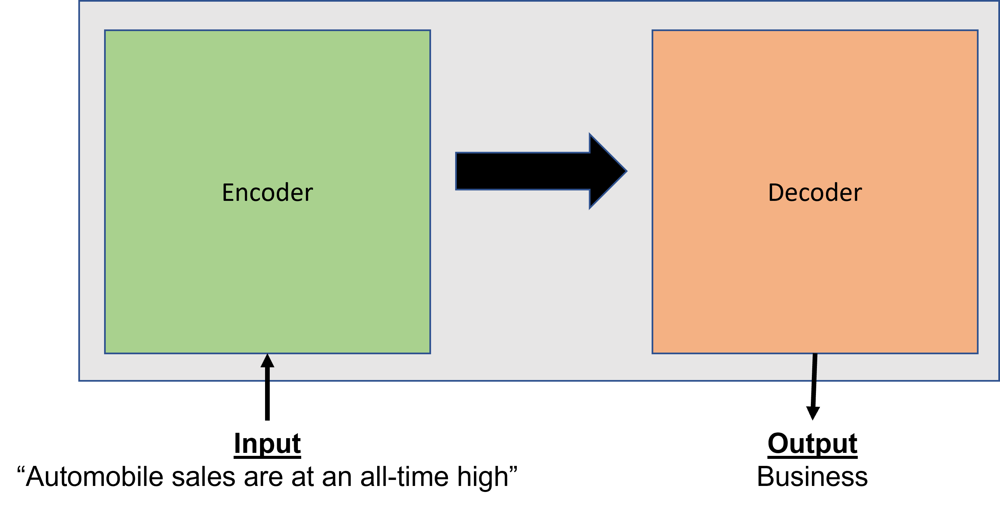
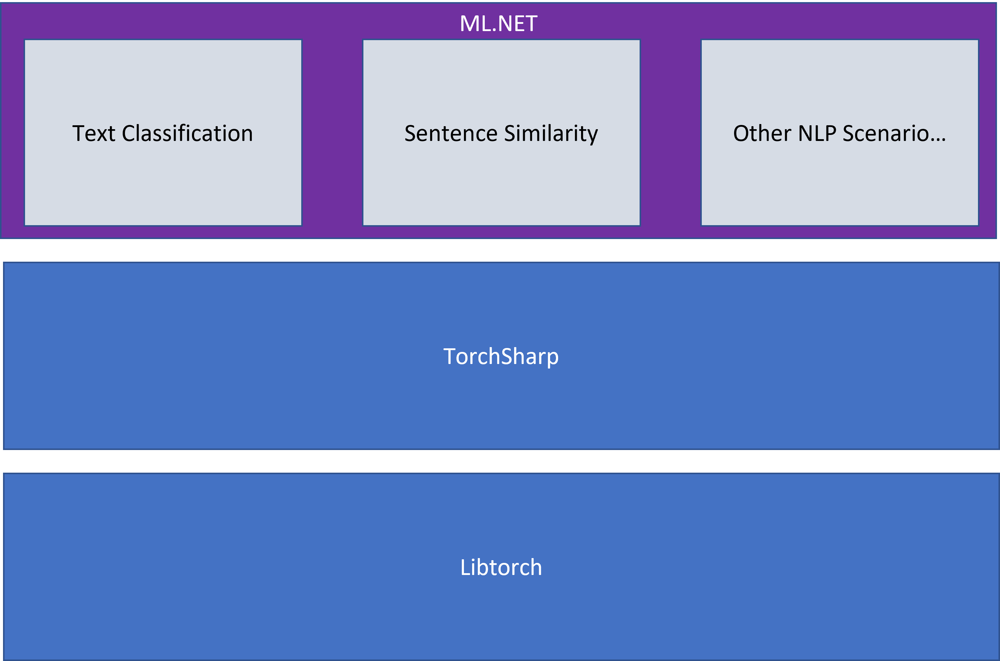

[ML.NET](https://dot.net/ml) is an open-source, cross-platform machine learning framework for .NET developers that enables integration of custom machine learning models into .NET apps.

A few weeks ago we shared a [blog post](https://devblogs.microsoft.com/dotnet/whats-new-with-mldotnet-automl/) with updates of what we've been working on in ML.NET across the framework and tooling. Some of those updates included components of our [deep-learning plan](https://github.com/dotnet/machinelearning/issues/5918). An important part of that plan includes the introduction of scenario focused APIs in ML.NET.

After months of work and collaborations with TorchSharp and Microsoft Research, today we're excited to announce the Text Classification API.

The Text Classification API is an API that makes it easier for you to train custom text classification models in ML.NET using the latest state-of-the-art deep learning techniques.

## What is text classification?

Text classification as the name implies is the process of applying labels or categories to text.

Common use cases include:

- Categorizing e-mail as spam or not spam
- Analyzing sentiment as positive or negative from customer reviews
- Applying labels to support tickets

## Solving text classification with machine learning

Classification is a common problem in machine learning. There are a variety of algorithms you can use to train a classification model. Text classification is a subcategory of classification which deals specifically with raw text. Text poses interesting challenges because you have to account for the context and semantics in which the text occurs. As such, encoding meaning and context can be difficult. In recent years, deep learning models have emerged as a promising technique to solve natural language problems. More specifically, a type of neural network known as transformers has become the predominant way of solving natural language problems like text classification, translation, summarization, and question answering.

Transformers were introduced in the paper [Attention is all you need](https://arxiv.org/abs/1706.03762).  Some popular transformer architectures for natural language tasks include:

- Bidirectional Encoder Representations from Transformers (BERT)
- Robustly Optimized BERT Pretraining Approach (RoBERTa)
- Generative Pre-trained Transformer 2 (GPT-2)
- Generative Pre-trained Transformer 3 (GPT-3)

At a high level, transformers are a model architecture consisting of encoding and decoding layers. The encoder takes raw text as input and maps the input to a numerical representation (including context) to produce features. The decoder uses information from the encoder to produce output such as a category or label in the case of text classification. What makes these layers so special is the concept of attention. Attention is the idea of focusing on specific parts of an input based on the importance of their context in relation to other inputs in a sequence. For example, let's say I'm categorizing news articles based on the headline. Not all words in the headline are relevant. In a headline like "Auto sales are at an all-time high", a word like "sales" might get more attention and lead to labeling the article as business or finance.  



Like most neural networks, training transformers from scratch can be expensive because they require large amounts of data and compute. However, you don't always have to train from scratch. Using a technique known as fine-tuning you can take a pre-trained model and retrain the layers specific to your domain or problem using your own data. This gives you the benefit of having a model that's more tailored to solve your problem without having to go through the process of training the entire model from scratch.  

## The Text Classification API (preview)

Now that you have a general overview of how text classification problems can be solved using deep learning, let's take a look at how we've incorporated many of these techniques into the Text Classification API.



The Text Classification API is powered by [TorchSharp](https://github.com/dotnet/TorchSharp). TorchSharp is a .NET library that provides access to libtorch, the library that powers PyTorch. TorchSharp contains the building blocks for training neural networks from scratch in .NET. The TorchSharp components however are low-level and building neural networks from scratch has a steep learning curve. In ML.NET, we've abstracted some of that complexity to the scenario level.

In direct collaboration with Microsoft Research, we've taken a TorchSharp implementation of [NAS-BERT](https://arxiv.org/abs/2105.14444), a variant of BERT obtained with neural architecture search, and added it to ML.NET. Using a pre-trained version of this model, the Text Classification API uses your data to fine-tune the model.

## Get started with the Text Classification API

For a complete code sample of the Text Classification API, see the [Text Classification API notebook](https://aka.ms/text-classification-notebook).

The Text Classification API is part of the latest 2.0.0 and 0.20.0 preview versions of ML.NET.

To use it, you'll have to install the following packages in addition to [`Microsoft.ML`](https://www.nuget.org/packages/Microsoft.ML/):

- [`Microsoft.ML.TorchSharp`](https://www.nuget.org/packages/Microsoft.ML.TorchSharp/)
- [`TorchSharp-cpu`](https://www.nuget.org/packages/TorchSharp-cpu/) if using the CPU or [`TorchSharp-cuda-windows`](https://www.nuget.org/packages/TorchSharp-cuda-windows/) / [`TorchSharp-cuda-linux`](https://www.nuget.org/packages/TorchSharp-cuda-linux/) if using a GPU.

Use the NuGet package manager in Visual Studio or the dotnet CLI to install the packages

```dotnetcli
dotnet add package Microsoft.ML --prerelease
dotnet add package Microsoft.ML.TorchSharp --prerelease 

// If using CPU
dotnet add package TorchSharp-cpu

// If using GPU
// dotnet add package TorchSharp-cuda-windows
// dotnet add package TorchSharp-cuda-linux   
```

Then, reference the packages and use the Text Classification API in your pipeline.

```csharp
//Reference packages
using Microsoft.ML;
using Microsoft.ML.TorchSharp;

// Initialize MLContext
var mlContext = new MLContext();

// Load your data
var reviews = new[]
{
    new {Text = "This is a bad steak", Sentiment = "Negative"},
    new {Text = "I really like this restaurant", Sentiment = "Positive"}
};

var reviewsDV = mlContext.Data.LoadFromEnumerable(reviews);

//Define your training pipeline
var pipeline =
        mlContext.Transforms.Conversion.MapValueToKey("Label", "Sentiment")
            .Append(mlContext.MulticlassClassification.Trainers.TextClassification(numberOfClasses: 2, sentence1ColumnName: "Text"))
            .Append(mlContext.Transforms.Conversion.MapKeyToValue("PredictedLabel"));

// Train the model
var model = pipeline.Fit(reviewsDV);
```

For this sample, since there are only two classes ("Positive" and "Negative"), the `numberOfClasses` parameter is set to `2`. The API supports up to two sentences as input each limited to 512 tokens. Typically one token maps to one word in a sentence. If the sentence is longer than 512 tokens, it's automatically truncated for you. In this case, since there's only one sentence, only the `sentence1ColumnName` is set.  

The training produces an ML.NET model that you can use for inferencing using either the `Transform` method or `PredictionEngine`.

For more information on the Text Classification API, see the [ML.NET API documentation](https://docs.microsoft.com/dotnet/api/?view=ml-dotnet).

## What's next?

This is one of the first steps towards enabling natural language scenarios in ML.NET. There are still a few limitations when using the Text Classification API such as not being able to use the `Evaluate` method to calculate evaluation metrics. Based on your feedback, we plan to:

- Make improvements to the Text Classification API
- Introduce other scenario-based APIs

We want to hear from you. Help us prioritize and make these experiences the best they can be by providing feedback and raising issues in the [dotnet/machinelearning](https://github.com/dotnet/machinelearning) GitHub repo.

## Get started and resources

Learn more about ML.NET, Model Builder, and the ML.NET CLI in [Microsoft Docs](https://docs.microsoft.com/dotnet/machine-learning/).

If you run into any issues, feature requests, or feedback, please file an issue in the [ML.NET repo](https://github.com/dotnet/machinelearning).

Join the [ML.NET Community Discord](https://aka.ms/virtual-mlnet-community-discord) or [#machine-learning channel on the .NET Development Discord](https://aka.ms/dotnet-discord).

Tune in to the [Machine Learning .NET Community Standup](https://dotnet.microsoft.com/live/community-standup) every other Wednesday at 10am Pacific Time.