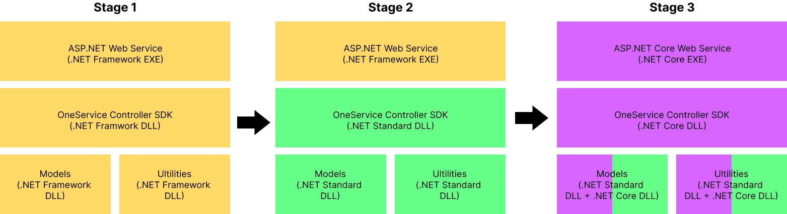
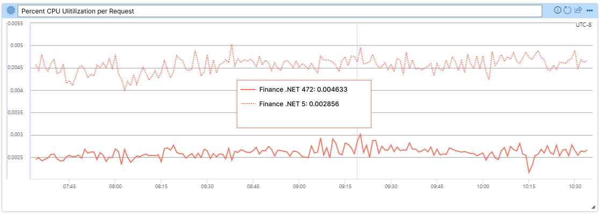
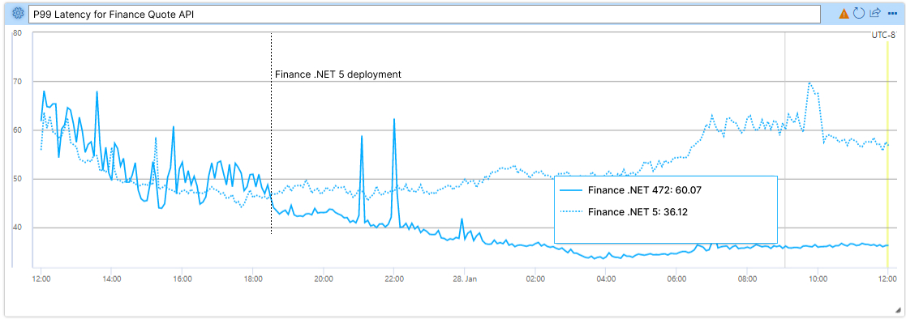

OneService is a Microsoft service that powers various content experiences in [MSN](https://www.msn.com/feed), Microsoft Edge, and Microsoft Windows, for example news and sports results. It is composed of 30+ services maintained by multiple Microsoft teams. Over two years, we converted a large number of .NET Framework 4.7.2 app, library, and test projects to .NET 6, validated functional and performance equivalence (or better), and are now almost entirely running on .NET 6 in production. This project was a major success, delivering cost savings and better user experiences.

Highlights:

* 29% estimated improvements in infrastructure costs.
* 30% CPU improvement (on average) for migrated services.
* 8-27% improvement in P95 latency for primary Feed APIs.
* Reduced technical debt, and are now able to cheaply upgrade to annual .NET releases.
* Happier and more productive team.

Performance charts come a little later in the post.

The project scope was large and we had various challenges along the way. Fortunately, [several other Microsoft teams](https://devblogs.microsoft.com/dotnet/category/developer-stories/) made this jump earlier and we were able to replicate much of the approach that they’ve used. Our service is architecturally leaps ahead of where it was and we have much greater flexibility for evolution going forward. In this post, I’ll tell you about our journey to .NET 6.

## OneService

OneService is a set of content-oriented microservices maintained by multiple teams hosted on a common platform. The OneService team is responsible for developing shared libraries for other teams to build and run their services and operating the infrastructure on which they run. The OneService team also owns the foundational Feed, Segments, and Auth microservices that run on the OneService platform. Some experiences that OneService powers are Windows widgets, and [start.com](https://start.com).

Our mission is to delight and engage users daily with high-quality and personalized content. We bring together premium publishers and the best of the web into a personalized, intelligent AI feed that connects people with the content they care about. Our APIs enable various Microsoft products to expose this content to their users and for users to get consistent content across those products.

The common frameworks and service-specific code are published as (Microsoft-internal) NuGet packages and imported into the service projects. These service projects are ASP.NET applications. At the start of this project, all our libraries targeted .NET Framework 4.7.2 and our services ran on ASP.NET.

We’ve heard a lot of success stories at Microsoft about .NET Core. They prove the benefit of .NET 6 with cost savings, performance wins, and much better developer workflows. We were certain we could achieve the same results for OneService. Just like you, we see the awesome pace of innovation on the .NET blog. We were excited about all the progress the .NET Team has achieved in about half-a-decade. We really wanted to move to the new .NET.

## Migration Stages

- In stage 1, we have the ASP.NET web server and all of our libraries in .NET Framework (yellow). This is the baseline state.
- In stage 2, we migrated all of our libraries to .NET Standard (green) and web server to ASP.NET Core 2.1 but still stay in .NET Framework
- In stage 3, we migrated modern libraries to .NET Core (purple) and kept our legacy libraries  in .NET Standard. Our controller SDK and web service was also migrated to .NET Core.

Note: All libraries and our OneService controller SDK was multi-targeted during the migration to allow us to perform A/B testing and slowly roll out these changes to other web services.

## Initial Migration Attempt

We initially decided to migrate straight from .NET Framework 4.7.2 to .NET 5 (with .NET Standard 2.0 libraries). Our impression was that any in-between migration steps would lead to more work overall and increase the time to complete the project. We also believed that the project would take only a few months.

We quickly found that the migration would be more difficult than expected and that a big-bang approach wasn’t feasible. The OneService teams owns over 20 libraries, in addition to various service-specific libraries owned by other teams. While some of these projects were trivial to migrate to .NET Standard 2.0, others proved to be extremely difficult. One of the most difficult challenges we faced were hard dependencies on System.Web APIs, which don’t exist in ASP.NET Core. 

We also chose to multi-target our test projects to .NET Framework 4.7.2 and .NET 5. Our rational was that it would be safer to follow a test-driven approach. However, we ran up against technical debt in our testing pipelines. This included needing to port test projects to the new `.csproj` project style. We decided to pause this effort until later in the project and instead focus on just getting our apps working (without test coverage). We needed to do that to prove to our management team that we were capable of making positive forward-progress.

## Migrate to ASP.NET Core 2.1 on .NET Framework

We realized that the [.NET Team still supported ASP.NET Core 2.1 on .NET Framework](https://dotnet.microsoft.com/platform/support/policy/aspnetcore-2.1). That seemed like it could help us a lot as a mid-point state in our migration effort. We were able to quickly port our primary services to ASP.NET Core 2.1 without needing to address .NET Framework dependencies in the apps or libraries.

This approach allowed us to begin flighting our changes faster and validate our extensive refactoring. Since we were not running on .NET 6, we didn’t expect to see any performance improvements at this step. The goal was to not introduce any regressions and catch bugs without the complexity of a framework upgrade in the mix. 

We deployed our primary Feed service into production in this configuration. While we had to rollback once, almost all the bugs and errors were caught while flighting (more on our flighting strategy later). The Feed service acted as a proof of concept, validating that our service would continue to perform as expected on ASP.NET Core (at least on .NET Framework).

## Migrate to .NET 6

Once we were on ASP.NET Core 2.1, we then set our attention towards resolving the blockers to get from .NET Framework to .NET 6. This involved refactoring dozens of components across multiple services, and getting them to target .NET Standard 2.0. For some apps, we decided to migrate to .NET 5 as a mid-step to limit our exposure to .NET 6 changes. We were more focused on predictable forward-progress than completing the project quickly.

In some cases, we could get other teams to migrate their components, particularly if it was easy. In other cases, the OneService team needed to take on the cost of migrating the component. In the most problematic cases, we created new service boundaries so that we could delay dealing with hard migration problems until later, while maintaining the overall velocity of the effort.

Once we finished flighting the Feed service, we shipped it into production on .NET 5. Simultaneously, we began flighting the same service on .NET 6. That allowed us to collect a lot of information at once and collapse the schedule a bit. We also upgraded other services to .NET 5 at the same time.

We decided to quickly migrate services from .NET 5 to .NET 6 since we already had confidence that our system worked with .NET 5. We didn’t see much difference between the two versions. Unsurprisingly, most of the performance improvements we saw were from .NET Framework 4.7.2 to .NET 5 rather than from .NET 5 to .NET 6. Other Microsoft teams have seen significant wins from moving from .NET 5 to .NET 6. It depends on the app. In any case, we're quite happy, and we're in a good position now to adopt .NET 7.

## Performance Improvements

We saw improvements in various critical service and product metrics. On the service side, we saw an average of 30% improvement in CPU utilization across all of migrated services. This was an extremely high impact improvement to the service. It allowed us to scale down most of our clusters by 30% as well as serve more traffic on a single node.

The Finance service migration has been one of the most successful as CPU utilization per request and P99 latency were improved by nearly 40%, as demonstrated by the following images (lower is better; .NET Framework 4.7.2 is the dotted line and .NET 5 is the solid line).

Note: The service is now running on .NET 6, but this data was collected when it was running on .NET 5.

We were pleasantly surprised to see latency improvements translate into increased user engagement. OneService powers the content in the Microsoft Edge Browser new tab experience. We measured a 4.5% improvement in the “time to visually ready” metric for the content in new tabs. Our data shows that this improvement led to impressive improvements in user engagement. This outcome demonstrates the potential for backend performance improvements to greatly improve the user experience without implementing any new functionality. Performance is indeed a feature.

## Cost Savings

Reducing the operational cost of our infrastructure is one of the highlights of the project. Sadly, it has been the most difficult metrics to track. The 30% average CPU utilization improvements led to massive cost savings since CPU utilization is our primary cost driver. We estimate that we were able to reduce the cost of our service 1% for every 1% drop in CPU use.
In part, the difficulty of measuring cost savings was a result of the service load not staying constant. During the period of our migration (in production) to .NET 5/6 -- December 2021 through March 2022  -- we saw a ~45% increase in network requests served by OneService. Some of this traffic is due to further decoupling our services, but most of it came from new user traffic. We were very happy that our costs remained largely flat while traffic rose dramatically. 

Our costs would have otherwise certainly risen steeply with the increase in traffic. This is a clear win. However, it is difficult to estimate how much money we otherwise would be paying if we never made this upgrade. Counterfactuals are hard. We did some analysis of our traffic (before and after) and estimate we’d be paying around 29% more in our monthly infrastructure costs with our previous .NET Framework architecture.

## Other Benefits

Another advantage of .NET Core migration is the ability to run our service in smaller containers. We host OneService on Windows, and were able to switch to using the Nano Server [container images that the .NET Team provides](https://mcr.microsoft.com/catalog?search=dotnet). Nano Server is a lightweight window container offering and is 64-bit only (no 32-bit emulation).

[Nano Server images](https://mcr.microsoft.com/catalog?search=nanoserver) are about ~200MB compared to the 5 GB [Server Core images](https://mcr.microsoft.com/catalog?search=servercore) that we were using. The size improvement can boost service build and load time. From early data, our pipeline builds time and service load time have decreased by 30%.

## Flighting and Testing in Production

Now that you understand our general approach and the benefits we achieved, I’d like to tell you a bit more about our methodology. It's likely obvious, but the migration needed to result in zero down-time. We relied heavily on flighting and testing in production to enable that.

OneService relies on rolling out risky changes using a “feature flight” technique. We typically have a configuration set up via Azure App Config to enable a feature if the HTTP requests contain a specific flight ID. The feature’s code path is typically wrapped in C# code with a conditional statement that checks if the feature is enabled. This approach works well for new code changes but is woefully inadequate for the type of experimentation we need to perform. 

We were not modifying a single code path but rather the underlying framework on which the API was hosted. It was either all or nothing. To account for the severity of the risks and lack of precedent for such types of flighting on our team, we relied on dedicated Azure Service Fabric clusters, which we referred to as “experimentation clusters”.

We observed a myriad of bugs caused by APIs and components that did not have sufficient test coverage. Many bugs were caused by subtle changes in the underlying implementation of framework-level libraries as opposed to code changes in OneService. We probably always had insufficient test coverage, but this migration pushed well beyond what our coverage could address.

We found that unit and integration tests were less helpful than E2E tests. We couldn't guarantee that the set of NuGet packages present in the test project for a particular component would be a 1:1 reflection of the production configuration. Drift in package versions sometimes leads to unexpected behavior. E2E tests were helpful here since they were the closest to the "source of truth" of how a component will perform in production.

## Mirroring production

We started with a single dedicated “canary” cluster that served as a 1% mirror of production traffic. This cluster was served the same traffic as production but did not return responses to users. As a result, we were able to estimate how the services would perform in production without any of the associated risks.

The results were not great initially. We struggled to match the availability of production and saw serious latency regressions. We resolved these issues by identifying bugs and fixing logic. Once the .NET 5/6 build was at parity (or better) with the .NET Framework variant, we determined that the builds were ready to graduate to serving a small fraction of live traffic and return responses to end-users.

## Deploying to production

We used four dedicated clusters spanning West US, East US, North Europe, and South-East Asia. We then configured Azure Front Door to only route traffic to these experimentation clusters when the request contained a specific flight ID. We then configured Control Tower, the Microsoft internal experimental service, to append the flight ID to a small percentage of requests across our Windows and browser clients. 

We started with 1% of traffic and gradually ramped up to 25%. This was a very safe and effective process for catching previously undetected regressions. Suppose a particular metric, say clicks on sports content, had experienced a statistically significant regression in the treatment group of users served by the experiment clusters compared to the control group being served by the .NET Framework clusters. In that case, we could look closer at that logic to determine if there was a bug.

However, the tradeoff was that the approach was extremely slow (in calendar time). By the time we reached this stage, we had caught most of the low-hanging bugs that manifested in drops in availability or regressions in latency. The bugs caught while flighting were non-obvious and often took days to investigate.

Hosting the dedicated Azure infrastructure was also expensive from a cost and maintenance perspective. We spent months in this state of slow feedback loops and non-obvious bugs. This stage was especially difficult from a morale perspective.

We gated moving forward based on data from the ASP.NET Core clusters. Each time new data arrived, we hoped it would tell us that we could confidently ship the upgrade that we had already invested nearly a year into creating. Many morning meetings were spent with dashed hopes and ambiguous results. Even worse, some bugs compelled us to halt the experiment altogether since we could no longer safely serve production traffic.

We’re glad we followed this approach. It was much better to be safe than sorry with such a risky migration. While time-consuming, we likely saved much more time and energy this way rather than shipping prematurely and attempting to debug in production without the ability to cut off production traffic at a moment’s notice. Having good metrics also helped us quantify the gains we reaped in user engagement due to the improved performance.

To put this in perspective, we were making a pervasive change to a major Microsoft service. It’s hard. As I said earlier, we didn’t have the test coverage we needed to lead us through this migration more confidently. It wasn’t ideal. Still, we went about it in the best way we could.

## Migrating from ASP.NET to ASP.NET Core

Migrating from ASP.NET to ASP.NET Core exposed several testing gaps in our current infrastructure. While flighting was extremely useful for detecting feature regressions, latency gaps, or component level failures (e.g., user location variations), it was not able to detect framework level failures. 

ASP.NET Core is built around the concept of “middleware” and this paradigm shift led to gaps when migrating our unit tests. These gaps could have been caught with end-to-end tests on our service, but it taught us that the migration of tests is as important as the feature migration. 

One example of this testing gap was in our response compression. After the initial migration, we were no longer compressing the response using GZip or Brotli. The effects of this change were not caught until we saw a significant increase in cost for Azure Front Door/Akamai from the response size increase. 

If our end-to-end tests also included framework level checks (e.g., response compression header contains gzip), this issue could have been caught before production. In hindsight, we believe the best way to do perform this migration in the future would be to replay production requests against the migrated service and current service and check that the responses are **identical**. Clearly some information (e.g., activity ids, timestamps, etc.) will be non-deterministic, but these should be explicitly allow-listed, and the rest of the response should be identical.

## API Challenges

We had two significant categories of API challenges that I'll cover.

### OData

OneService takes a hard dependency on OData in multiple parts of the system. OData versioning proved a challenge since .NET 5 only supports OData V7, and .NET 6 only supports OData V8. There are breaking changes in some OData versions, and we needed to ensure we were not affected by them. Since we already had many dependencies on OData V7 in our codebase and to reduce risk, we decided to migrate first to .NET 5 and then to .NET 6.

### ServicePointManager Deprecation

In .NET framework, global, and individual, API connections can be configured via the `ServicePointManager`. This static class allows us to set limits on connections within the framework, and we spent many months to fine tune this value to avoid a single component overconsuming resource. In .NET core, `ServicePointManager` has been deprecated. To be exact, the API still exists, but it has no effect on connection management. The new pattern in .NET core is to set the available connections when creating the `HttpClient` via the `SocketsHttpManager`.

Fortunately, many of our external connections were handled through a single RestClient library that our team owned. This gave us a global point to update the majority of our `HttpClient`s with the connection limit we had previously set for `ServicePointManager`. We then identified our most critical dependencies and updated these clients with the new connection limit. We added TCP level monitoring for our total connections and confirmed that no single IP was exhausting its connection pool, allowing us to confidently say that we had correctly updated the necessary `HttpClient`s with the new .NET core implementation.

## Conclusion

Almost all of the major services running on OneService are now targeting .NET 6. Getting to this point has been a monumental effort spanning 1.5 years of dev work, one intern project, two months of flighting, hundreds of commits, and dozens of new E2E tests. This work could not have been done without close collaboration across multiple teams.

While difficult, many of these challenges made our team better. Greater knowledge of .NET fundamentals, testing, and flighting infrastructure changes have been applied to other projects. We also now have a precedent for pulling off long-term migrations and have a clear appreciation for the impact of performance work. We’ve gained valuable experience in weighing when to pivot or persevere. These lessons have guided our roadmaps and influenced how we tackle many other problems.
