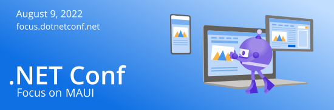

Now that .NET MAUI is released, it's time to get started building your first cross-platform applications! We've got a lot of exciting things planned for the next few months to help you get started, including a full day [.NET Conf Focus](https://focus.dotnetconf.net/?utm_campaign=savedate&utm_medium=blog&utm_source=dotnet) event, worldwide Reactor events, and local community event opportunities.

## Join us for .NET Conf: Focus on MAUI on August 9th

[.NET Conf: Focus on MAUI](https://focus.dotnetconf.net/?utm_campaign=savedate&utm_medium=blog&utm_source=dotnet) is a free, one-day livestream event on August 9 starting at 9 AM Pacific time featuring speakers from the community and Microsoft teams working on and using .NET Multi-platform App UI. Learn how to build native apps for Android, iOS, macOS and Windows with a single codebase using .NET MAUI. Hear from the team building the .NET MAUI framework and tools as well as experts building .NET MAUI apps, libraries, components and controls.

[cta-button align='center' text='Save the date!' url='https://focus.dotnetconf.net/?utm_campaign=savedate&utm_medium=blog&utm_source=dotnet'  color='#D83B01']

## Join us for our tour of virtual and in-person events

We have some great opportunities coming up for you to get involved around the world!

* [Microsoft Reactor Redmond](https://www.meetup.com/Microsoft-Reactor-Redmond/) (James Montemagno) - August 22
* [Microsoft Reactor San Francisco](https://www.meetup.com/Microsoft-Reactor-San-Francisco/) (Sweeky Satpathy and Brandon Minnick) - August 25
* [Microsoft Reactor Bengaluru - Welcome to .NET MAUI](https://www.meetup.com/microsoft-reactor-bengaluru/events/287157997) (James Montemagno, Nish Anil, Vivek Sridhar) - August 26
* [Microsoft Reactor Bengaluru - Hands-on-workshop](https://www.meetup.com/microsoft-reactor-bengaluru/events/287180634) (Nish Anil, Vivek Sridhar) - August 27

The Microsoft Reactor Bengaluru events are being planned with watch parties and follow-on workshops in 100 communities in India! You can watch them online by registering [here](https://www.meetup.com/microsoft-reactor-bengaluru/events/287157997/) or join a local watch party and workshop in-person (more details coming soon!)

## Host your own virtual and in-person events

If you'd like to host a .NET MAUI watch party or event at your local user group or Meetup, we'd love to help! We'll provide technical and creative content from the .NET Conf: Focus on MAUI event, and if you give us your mailing address, we'll send some fancy new .NET MAUI stickers for your event! [Fill out this form](https://forms.office.com/r/EiBSNNf0Cv) to let us know about your event details.

## Host a watch party in India

Are you interested in hosting a .NET MAUI watch party in your city in India? We are looking for volunteers. Host a watch party in your city by filling [out this form.](https://forms.office.com/Pages/ResponsePage.aspx?id=v4j5cvGGr0GRqy180BHbR3bE3_2YAtlFqed_s0S7G5BURVM5OE5MVlFRQUE3UTlaUFhCSTk0RjNHSC4u)

We've got more being planned, to be announced at .NET Conf: Focus on MAUI.
