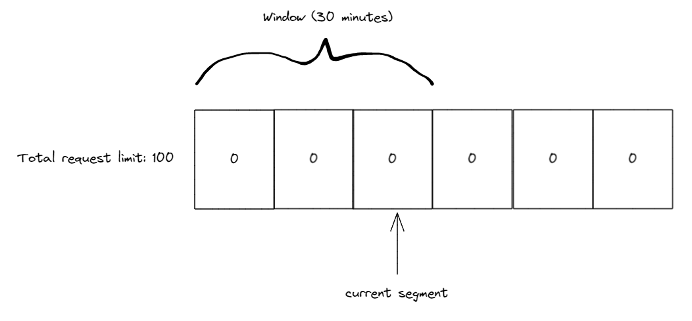
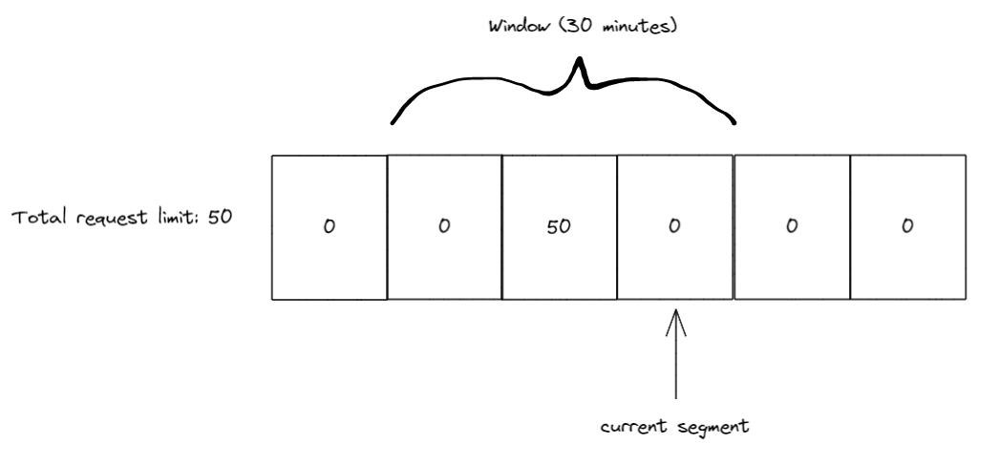
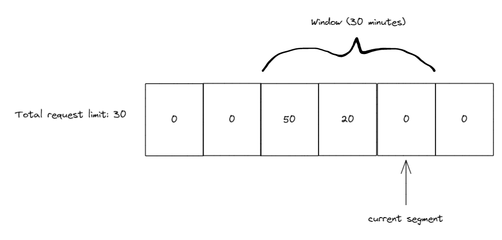
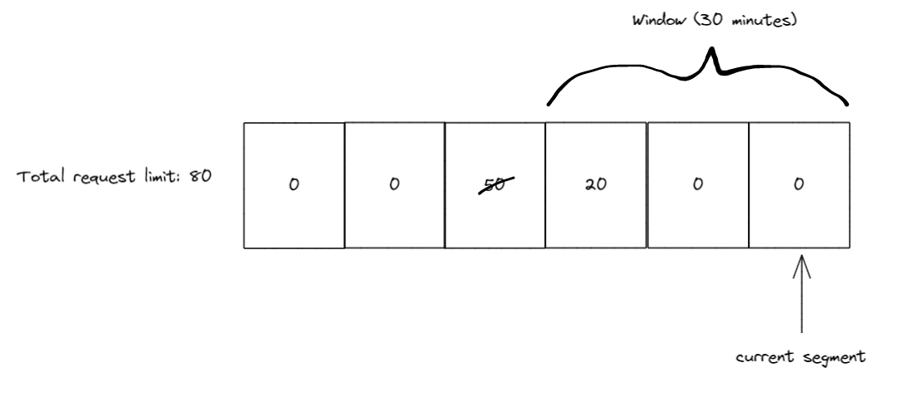

We're excited to announce built-in Rate Limiting support as part of .NET 7. Rate limiting provides a way to protect a resource in order to avoid overwhelming your app and keep traffic at a safe level.

## What is rate limiting?

Rate limiting is the concept of limiting how much a resource can be accessed. For example, you know that a database your application accesses can handle 1000 requests per minute safely, but are not confident that it can handle much more than that. You can put a rate limiter in your application that allows 1000 requests every minute and rejects any more requests before they can access the database. Thus, rate limiting your database and allowing your application to handle a safe number of requests without potentially having bad failures from your database.

There are multiple different rate limiting algorithms to control the flow of requests. We'll go over 4 of them that will be provided in .NET 7.

### Concurrency limit

Concurrency limiter limits how many concurrent requests can access a resource. If your limit is 10, then 10 requests can access a resource at once and the 11th request will not be allowed. Once a request completes, the number of allowed requests increases to 1, when a second request completes, the number increases to 2, etc. This is done by disposing a [RateLimitLease](#ratelimiter-apis) which we'll talk about later.

### Token bucket limit

Token bucket is an algorithm that derives its name from describing how it works. Imagine there is a bucket filled to the brim with tokens. When a request comes in, it takes a token and keeps it forever. After some consistent period of time, someone adds a pre-determined number of tokens back to the bucket, never adding more than the bucket can hold. If the bucket is empty, when a request comes in, the request is denied access to the resource.

To give a more concrete example, let's say the bucket can hold 10 tokens and every minute 2 tokens are added to the bucket. When a request comes in it takes a token so we're left with 9, 3 more requests come in and each take a token leaving us with 6 tokens, after a minute has passed we get 2 new tokens which puts us at 8. 8 requests come in and take the remaining tokens leaving us with 0. If another request comes in it is not allowed to access the resource until we gain more tokens, which happens every minute. After 5 minutes of no requests the bucket will have all 10 tokens again and won't add any more in the subsequent minutes unless requests take more tokens.

### Fixed window limit

The fixed window algorithm uses the concept of a window which will be used in the next algorithm as well. The window is an amount of time that our limit is applied before we move on to the next window. In the fixed window case moving to the next window means resetting the limit back to its starting point. Let's imagine there is a movie theater with a single room that can seat 100 people, and the movie playing is 2 hours long. When the movie starts we let people start lining up for the next showing which will be in 2 hours, up to 100 people are allowed to line up before we start telling them to come back some other time. Once the 2 hour movie is finished the line of 0 to 100 people can move into the movie theater and we restart the line. This is the same as moving the window in the fixed window algorithm.

### Sliding window limit

The sliding window algorithm is similar to the fixed window algorithm but with the addition of segments. A segment is part of a window, if we take the previous 2 hour window and split it into 4 segments, we now have 4 30 minute segments. There is also a current segment index which will always point to the newest segment in a window. Requests during a 30 minute period go into the current segment and every 30 minutes the window slides by one segment. If there were any requests during the segment the window slides past, these are now refreshed and our limit increases by that amount. If there weren't any requests our limit stays the same.

For example, let's use the sliding window algorithm with 3 10 minute segments and a 100 request limit. Our initial state is 3 segments all with 0 counts and our current segment index is pointing to the 3rd segment.



During the first 10 minutes we receive 50 requests all of which are tracked in the 3rd segment (our current segment index). Once the 10 minutes have passed we slide the window by 1 segment also moving our current segment index to the 4th segment. Any used requests in the 1st segment are now added back to our limit. Since there were none our limit is at 50 (as 50 are already used in the 3rd segment).



During the next 10 minutes we recieve 20 more requests, so we have 50 in the 3rd segment and 20 in the 4th segment now. Again, we slide the window after 10 minutes passes, so our current segment index is pointing to 5 and we add any requests from segment 2 to our limit.



10 minutes later we slide the window again, this time when the window slides the current segment index is at 6 and segment 3 (the one with 50 requests) is now outside of the window. So we get the 50 requests back and add them to our limit, which will now be 80, as there are still 20 in use by segment 4.



## RateLimiter APIs

Introducing the new, in .NET 7, nuget package [System.Threading.RateLimiting](https://www.nuget.org/packages/System.Threading.RateLimiting)!

This package provides the primitives for writing rate limiters as well as providing a few commonly used algorithms built-in. The main type is the abstract base class `RateLimiter`.

```csharp
public abstract class RateLimiter : IAsyncDisposable, IDisposable
{
    public abstract int GetAvailablePermits();
    public abstract TimeSpan? IdleDuration { get; }

    public RateLimitLease Acquire(int permitCount = 1);
    public ValueTask<RateLimitLease> WaitAsync(int permitCount = 1, CancellationToken cancellationToken = default);

    public void Dispose();
    public ValueTask DisposeAsync();
}
```

`RateLimiter` contains `Acquire` and `WaitAsync` as the core methods for trying to gain permits for a resource that is being protected. Depending on the application the protected resource may need to acquire more than 1 permits, so `Acquire` and `WaitAsync` both accept an optional `permitCount` parameter. `Acquire` is a synchronous method that will check if enough permits are available or not and return a `RateLimitLease` which contains information about whether you successfully acquired the permits or not. `WaitAsync` is similar to `Acquire` except that it can support queuing permit requests which can be de-queued at some point in the future when the permits become available, which is why it's asynchronous and accepts an optional `CancellationToken` to allow canceling the queued request.

`RateLimitLease` has an `IsAcquired` property which is used to see if the permits were acquired. Additionally, the `RateLimitLease` may contain metadata such as a suggested retry-after period if the lease failed (will show this in a later example). Finally, the `RateLimitLease` is disposable and should be disposed when the code is done using the protected resource. The disposal will let the `RateLimiter` know to update its limits based on how many permits were acquired. Below is an example of using a `RateLimiter` to try to acquire a resource with 1 permit.

```csharp
RateLimiter limiter = GetLimiter();
using RateLimitLease lease = limiter.Acquire(permitCount: 1);
if (lease.IsAcquired)
{
    // Do action that is protected by limiter
}
else
{
    // Error handling or add retry logic
}
```

In the example above we attempt to acquire 1 permit using the synchronous `Acquire` method. We also use `using` to make sure we dispose the lease once we are done with the resource. The lease is then checked to see if the permit we requested was acquired, if it was we can then use the protected resource, otherwise we may want to have some logging or error handling to inform the user or app that the resource wasn't used due to hitting a rate limit.

The other method for trying to acquire permits is `WaitAsync`. This method allows queuing permits and waiting for the permits to become available if they aren't. Let's show another example to explain the queuing concept.

```csharp
RateLimiter limiter = new ConcurrencyLimiter(
    new ConcurrencyLimiterOptions(permitLimit: 2, queueProcessingOrder: QueueProcessingOrder.OldestFirst, queueLimit: 2));

// thread 1:
using RateLimitLease lease = limiter.Acquire(permitCount: 2);
if (lease.IsAcquired) { }

// thread 2:
using RateLimitLease lease = await limiter.WaitAsync(permitCount: 2);
if (lease.IsAcquired) { }
```

Here we show our first example of using one of the built-in rate limiting implementations, `ConcurrencyLimiter`. We create the limiter with a maximum permit limit of 2 and a queue limit of 2. This means that a maximum of 2 permits can be acquired at any time and we allow queuing `WaitAsync` calls with up to 2 total permit requests.

The `queueProcessingOrder` parameter determines the order that items in the queue are processed, it can be the value of `QueueProcessingOrder.OldestFirst` ([FIFO](https://wikipedia.org/wiki/FIFO_(computing_and_electronics))) or `QueueProcessingOrder.NewestFirst` ([LIFO](https://wikipedia.org/wiki/Stack_(abstract_data_type))). One interesting behavior to note is that using `QueueProcessingOrder.NewestFirst` when the queue is full will complete the oldest queued `WaitAsync` calls with a failed `RateLimitLease` until there is space in the queue for the newest queue item.

In this example there are 2 threads trying to acquire permits. If thread 1 runs first it will acquire the 2 permits successfully and the `WaitAsync` in thread 2 will be queued waiting for the `RateLimitLease` in thread 1 to be disposed. Additionally, if another thread tries to acquire permits using either `Acquire` or `WaitAsync` it will immediately receive a `RateLimitLease` with an `IsAcquired` property equal to false, because the `permitLimit` and `queueLimit` are already used up.

If thread 2 runs first it will immediately get a `RateLimitLease` with `IsAcquired` equal to true, and when thread 1 runs next (assuming the lease in thread 2 hasn't been disposed yet) it will synchronously get a `RateLimitLease` with an `IsAcquired` property equal to false, because `Acquire` does not queue and the `permitLimit` is used up by the `WaitAsync` call.

So far we've seen the `ConcurrencyLimiter`, there are 3 other limiters we provide in-box. `TokenBucketRateLimiter`, `FixedWindowRateLimiter`, and `SlidingWindowRateLimiter` all of which implement the abstract class `ReplenishingRateLimiter` which itself implements `RateLimiter`. `ReplenishingRateLimiter` introduces the `TryReplenish` method as well as a couple properties for observing common settings on the limiter. `TryReplenish` will be explained after showing some examples of these rate limiters.

```csharp
RateLimiter limiter = new TokenBucketRateLimiter(new TokenBucketRateLimiterOptions(tokenLimit: 5, queueProcessingOrder: QueueProcessingOrder.OldestFirst,
    queueLimit: 1, replenishmentPeriod: TimeSpan.FromSeconds(5), tokensPerPeriod: 1, autoReplenishment: true));

using RateLimitLease lease = await limiter.WaitAsync(5);

// will complete after ~5 seconds
using RateLimitLease lease2 = await limiter.WaitAsync();
```

Here we show the `TokenBucketRateLimiter`, it has a few more options than the `ConcurrencyLimiter`. The `replenishmentPeriod` is how often new tokens (same concept as permits, just a better name in the context of token bucket) are added back to the limit. In this example `tokensPerPeriod` is 1 and the `replenishmentPeriod` is 5 seconds, so every 5 seconds 1 token is added back to the `tokenLimit` up to the max of 5. And lastly, `autoReplenishment` is set to true which means the limiter will create a `Timer` internally to handle the replenishment of tokens every 5 seconds.

If `autoReplenishment` is set to false then it is up to the developer to call `TryReplenish` on the limiter. This is useful when managing multiple `ReplenishingRateLimiter` instances and wanting to lower the overhead by creating a single `Timer` instance and managing the replenish calls yourself, instead of having each limiter create a `Timer`.

```csharp
ReplenishingRateLimiter[] limiters = GetLimiters();
Timer rateLimitTimer = new Timer(static state =>
{
    var replenishingLimiters = (ReplenishingRateLimiter[])state;
    foreach (var limiter in replenishingLimiters)
    {
        limiter.TryReplenish();
    }
}, limiters, TimeSpan.FromSeconds(1), TimeSpan.FromSeconds(1));
```

`FixedWindowRateLimiter` has a `window` option which defines how long it takes for the window to update.
```csharp
new FixedWindowRateLimiter(new FixedWindowRateLimiterOptions(permitLimit: 2,
    queueProcessingOrder: QueueProcessingOrder.OldestFirst, queueLimit: 1, window: TimeSpan.FromSeconds(10), autoReplenishment: true));
```

And `SlidingWindowRateLimiter` has a `segmentsPerWindow` option in addition to `window` which specifies how many segments there and how often the window will slide.
```csharp
new SlidingWindowRateLimiter(new SlidingWindowRateLimiterOptions(permitLimit: 2,
    queueProcessingOrder: QueueProcessingOrder.OldestFirst, queueLimit: 1, window: TimeSpan.FromSeconds(10), segmentsPerWindow: 5, autoReplenishment: true));
```

Going back to the mention of metadata earlier, let's show an example of where metadata might be useful.

```csharp
class RateLimitedHandler : DelegatingHandler
{
    private readonly RateLimiter _rateLimiter;

    public RateLimitedHandler(RateLimiter limiter) : base(new HttpClientHandler())
    {
        _rateLimiter = limiter;
    }

    protected override async Task<HttpResponseMessage> SendAsync(HttpRequestMessage request, CancellationToken cancellationToken)
    {
        using RateLimitLease lease = await _rateLimiter.WaitAsync(1, cancellationToken);
        if (lease.IsAcquired)
        {
            return await base.SendAsync(request, cancellationToken);
        }
        var response = new HttpResponseMessage(System.Net.HttpStatusCode.TooManyRequests);
        if (lease.TryGetMetadata(MetadataName.RetryAfter, out var retryAfter))
        {
            response.Headers.Add(HeaderNames.RetryAfter, ((int)retryAfter.TotalSeconds).ToString(NumberFormatInfo.InvariantInfo));
        }
        return response;
    }
}

RateLimiter limiter = new TokenBucketRateLimiter(new TokenBucketRateLimiterOptions(tokenLimit: 5, queueProcessingOrder: QueueProcessingOrder.OldestFirst,
    queueLimit: 1, replenishmentPeriod: TimeSpan.FromSeconds(5), tokensPerPeriod: 1, autoReplenishment: true));;
HttpClient client = new HttpClient(new RateLimitedHandler(limiter));
await client.GetAsync("https://example.com");
```

In this example we are making a rate limited `HttpClient` and if we fail to acquire the requested permit we want to return a failed http request with a 429 status code (Too Many Requests) instead of making an HTTP request to our downstream resource. Additionally, 429 responses can contain a "Retry-After" header that let's the consumer know when a retry might be successful. We accomplish this by looking for metadata on the `RateLimitLease` using `TryGetMetadata` and `MetadataName.RetryAfter`. We also use the `TokenBucketRateLimiter` because it is able to calculate an estimate of when the number of requested tokens will be available as it knows how often it replenishes tokens. Whereas the `ConcurrencyLimiter` would have no way of knowing when permits would become available, so it wouldn't provide any `RetryAfter` metadata.

`MetadataName` is a static class that provides a couple pre-created `MetadataName<T>` instances, the `MetadataName.RetryAfter` that we just saw, which is typed as `MetadataName<TimeSpan>`, and `MetadataName.ReasonPhrase`, which is typed as `MetadataName<string>`. There is also a static `MetadataName.Create<T>(string name)` method for creating your own strongly-typed named metadata keys. `RateLimitLease.TryGetMetadata` has 2 overloads, one for the strongly-typed `MetadataName<T>` which has an `out T` parameter, and the other accepts a string for the metadata name and has an `out object` parameter.

Let's now look at another API being introduced to help with more complicated scenarios, the `PartitionedRateLimiter`!

## PartitionedRateLimiter

Also contained in the [System.Threading.RateLimiting](https://www.nuget.org/packages/System.Threading.RateLimiting) nuget package is `PartitionedRateLimiter<TResource>`. This is an abstraction that is very similar to the `RateLimiter` class except that it accepts a `TResource` instance as an argument to methods on it. For example `Acquire` is now: `Acquire(TResource resourceID, int permitCount = 1)`. This is useful for scenarios where you might want to change rate limiting behavior depending on the `TResource` that is passed in. This can be something such as independent concurrency limits for different `TResource`s or more complicated scenarios like grouping X and Y under the same concurrency limit, but having W and Z under a token bucket limit.

To assist with common usages, we have included a way to construct a `PartitionedRateLimiter<TResource>` via `PartitionedRateLimiter.Create<TResource, TPartitionKey>(...)`.

```csharp
enum MyPolicyEnum
{
    One,
    Two,
    Admin,
    Default
}

PartitionedRateLimiter<string> limiter = PartitionedRateLimiter.Create<string, MyPolicyEnum>(resource =>
{
    if (resource == "Policy1")
    {
        return RateLimitPartition.Create(MyPolicyEnum.One, key => new MyCustomLimiter());
    }
    else if (resource == "Policy2")
    {
        return RateLimitPartition.CreateConcurrencyLimiter(MyPolicyEnum.Two, key =>
            new ConcurrencyLimiterOptions(permitLimit: 2, queueProcessingOrder: QueueProcessingOrder.OldestFirst, queueLimit: 2));
    }
    else if (resource == "Admin")
    {
        return RateLimitPartition.CreateNoLimiter(MyPolicyEnum.Admin);
    }
    else
    {
        return RateLimitPartition.CreateTokenBucketLimiter(MyPolicyEnum.Default, key =>
            new TokenBucketRateLimiterOptions(tokenLimit: 5, queueProcessingOrder: QueueProcessingOrder.OldestFirst,
                queueLimit: 1, replenishmentPeriod: TimeSpan.FromSeconds(5), tokensPerPeriod: 1, autoReplenishment: true));
    }
});
RateLimitLease lease = limiter.Acquire(resourceID: "Policy1", permitCount: 1);

// ...

RateLimitLease lease = limiter.Acquire(resourceID: "Policy2", permitCount: 1);

// ...

RateLimitLease lease = limiter.Acquire(resourceID: "Admin", permitCount: 12345678);

// ...

RateLimitLease lease = limiter.Acquire(resourceID: "other value", permitCount: 1);
```

`PartitionedRateLimiter.Create` has 2 generic type parameters, the first one represents the resource type which will also be the `TResource` in the returned `PartitionedRateLimiter<TResource>`. The second generic type is the partition key type, in the above example we use `int` as our key type. The key is used to differentiate a group of `TResource` instances with the same limiter, which is what we are calling a partition. `PartitionedRateLimiter.Create` accepts a `Func<TResource, RateLimitPartition<TPartitionKey>>` which we call the partitioner. This function is called every time the `PartitionedRateLimiter` is interacted with via `Acquire` or `WaitAsync` and a `RateLimitPartition<TKey>` is returned from the function. `RateLimitPartition<TKey>` contains a `Create` method which is how the user specifies what identifier the partition will have and what limiter will be associated with that identifier.

In our first block of code above, we are checking the resource for equality with "Policy1", if they match we create a partition with the key `MyPolicyEnum.One` and return a factory for creating a custom `RateLimiter`. The factory is called once and then the rate limiter is cached so future accesses for the key `MyPolicyEnum.One` will use the same rate limiter instance.

Looking at the first `else if` condition we similarly create a partition when the resource equals "Policy2", this time we use the convenience method `CreateConcurrencyLimiter` to create a `ConcurrencyLimiter`. We use a new partition key of `MyPolicyEnum.Two` for this partition and specify the options for the `ConcurrencyLimiter` that will be generated. Now every `Acquire` or `WaitAsync` for "Policy2" will use the same instance of `ConcurrencyLimiter`.

Our third condition is for our "Admin" resource, we don't want to limit our admin(s) so we use `CreateNoLimiter` which will have no limits applied. We also assign the partition key `MyPolicyEnum.Admin` for this partition.

Finally, we have a fallback for all other resources to use a `TokenBucketLimiter` instance and we assign the key of `MyPolicyEnum.Default` to this partition. Any request to a resource not covered by our `if` conditions will use this `TokenBucketLimiter`. It's generally a good practice to have a non-noop fallback limiter in case you didn't cover all conditions or add new behavior to your application in the future.

In the next example, let's combine the `PartitionedRateLimiter` with our customized `HttpClient` from earlier. We'll use `HttpRequestMessage` as our resource type for the `PartitionedRateLimiter`, which is the type we get in the `SendAsync` method of `DelegatingHandler`. And a `string` for our partition key as we are going to be partitioning based on url paths.

```csharp
PartitionedRateLimiter<HttpRequestMessage> limiter = PartitionedRateLimiter.Create<HttpRequestMessage, string>(resource =>
{
    if (resource.RequestUri?.IsLoopback)
    {
        return RateLimitPartition.CreateNoLimiter("loopback");
    }
    
    string[]? segments = resource.RequestUri?.Segments;
    if (segments?.Length >= 2 && segments[1] == "api/")
    {
        // segments will be [] { "/", "api/", "next_path_segment", etc.. }
        return RateLimitPartition.CreateConcurrencyLimiter(segments[2].Trim('/'), key =>
            new ConcurrencyLimiterOptions(permitLimit: 2, queueProcessingOrder: QueueProcessingOrder.OldestFirst, queueLimit: 2));
    }

    return RateLimitPartition.Create("default", key => new MyCustomLimiter());
});

class RateLimitedHandler : DelegatingHandler
{
    private readonly PartitionedRateLimiter<HttpRequestMessage> _rateLimiter;

    public RateLimitedHandler(PartitionedRateLimiter<HttpRequestMessage> limiter) : base(new HttpClientHandler())
    {
        _rateLimiter = limiter;
    }

    protected override async Task<HttpResponseMessage> SendAsync(HttpRequestMessage request, CancellationToken cancellationToken)
    {
        using RateLimitLease lease = await _rateLimiter.WaitAsync(request, 1, cancellationToken);
        if (lease.IsAcquired)
        {
            return await base.SendAsync(request, cancellationToken);
        }
        var response = new HttpResponseMessage(System.Net.HttpStatusCode.TooManyRequests);
        if (lease.TryGetMetadata(MetadataName.RetryAfter, out var retryAfter))
        {
            response.Headers.Add(HeaderNames.RetryAfter, ((int)retryAfter.TotalSeconds).ToString(NumberFormatInfo.InvariantInfo));
        }
        return response;
    }
}
```

Looking closely at the `PartitionedRateLimiter` in the above example, our first check is for localhost, we've decided that if the user is doing things locally we don't want to limit them, they won't be using the upstream resource that we are trying to protect. The next check is more interesting, we are looking at the url path and finding any requests to an `/api/<something>` endpoint. If the request matches we grab the `<something>` part of the path and create a partition for that specific path. What this means is that any requests to `/api/apple/*` will use one instance of our `ConcurrencyLimiter` while any requests to `/api/orange/*` will use a different instance of our `ConcurrencyLimiter`. This is because we use a different partition key for those requests and so our limiter factory generates a new limiter for the different partitions. And finally, we have a fallback limit for any requests that aren't for localhost or an `/api/*` endpoint.

Also shown, is the updated `RateLimitedHandler` which now accepts a `PartitionedRateLimiter<HttpRequestMessage>` instead of a `RateLimiter` and passes in `request` to the `WaitAsync` call, otherwise the rest of the code remains the same.

There are a few things worth pointing out in this example. We may potentially create many partitions if lots of unique `/api/*` requests are made, this would result in memory usage growing in our `PartitionedRateLimiter`. The `PartitionedRateLimiter` returned from `PartitionedRateLimiter.Create` does have some logic to remove limiters once they haven't been used for a while to help mitigate this, but application developers should also be aware of creating unbounded partitions and try to avoid that when possible. Additionally, we have `segments[2].Trim('/')` for our partition key, the `Trim` call is to avoid using a different limiter in the cases of `/api/apple` and `/api/apple/` as those produce different segments when using `Uri.Segments`.

Custom `PartitionedRateLimiter<T>` implementations can also be written without using the `PartitionedRateLimiter.Create` method. Below is an example of a custom implementation using a concurrency limit for each `int` resource. So resource `1` has its own limit, `2` has its own limit, etc. This has the advantage of being more flexible and potentially more efficient at the cost of higher maintenance.

```csharp
public sealed class PartitionedConcurrencyLimiter : PartitionedRateLimiter<int>
{
    private ConcurrentDictionary<int, int> _keyLimits = new();
    private int _permitLimit;

    private static readonly RateLimitLease FailedLease = new Lease(null, 0, 0);

    public PartitionedConcurrencyLimiter(int permitLimit)
    {
        _permitLimit = permitLimit;
    }

    public override int GetAvailablePermits(int resourceID)
    {
        if (_keyLimits.TryGetValue(resourceID, out int value))
        {
            return value;
        }
        return 0;
    }

    protected override RateLimitLease AcquireCore(int resourceID, int permitCount)
    {
        if (_permitLimit < permitCount)
        {
            return FailedLease;
        }

        bool wasUpdated = false;
        _keyLimits.AddOrUpdate(resourceID, (key) =>
        {
            wasUpdated = true;
            return _permitLimit - permitCount;
        }, (key, currentValue) =>
        {
            if (currentValue >= permitCount)
            {
                wasUpdated = true;
                currentValue -= permitCount;
            }
            return currentValue;
        });

        if (wasUpdated)
        {
            return new Lease(this, resourceID, permitCount);
        }
        return FailedLease;
    }

    protected override ValueTask<RateLimitLease> WaitAsyncCore(int resourceID, int permitCount, CancellationToken cancellationToken)
    {
        return new ValueTask<RateLimitLease>(AcquireCore(resourceID, permitCount));
    }

    private void Release(int resourceID, int permitCount)
    {
        _keyLimits.AddOrUpdate(resourceID, _permitLimit, (key, currentValue) =>
        {
            currentValue += permitCount;
            return currentValue;
        });
    }

    private sealed class Lease : RateLimitLease
    {
        private readonly int _permitCount;
        private readonly int _resourceId;
        private PartitionedConcurrencyLimiter? _limiter;

        public Lease(PartitionedConcurrencyLimiter? limiter, int resourceId, int permitCount)
        {
            _limiter = limiter;
            _resourceId = resourceId;
            _permitCount = permitCount;
        }

        public override bool IsAcquired => _limiter is not null;

        public override IEnumerable<string> MetadataNames => throw new NotImplementedException();

        public override bool TryGetMetadata(string metadataName, out object? metadata)
        {
            throw new NotImplementedException();
        }

        protected override void Dispose(bool disposing)
        {
            if (_limiter is null)
            {
                return;
            }

            _limiter.Release(_resourceId, _permitCount);
            _limiter = null;
        }
    }
}

PartitionedRateLimiter<int> limiter = new PartitionedConcurrencyLimiter(permitLimit: 10);
// both will be successful acquisitions as they use different resource IDs
RateLimitLease lease = limiter.Acquire(resourceID: 1, permitCount: 10);
RateLimitLease lease2 = limiter.Acquire(resourceID: 2, permitCount: 7);
```

This implementation does have some issues such as never removing entries in the dictionary, not supporting queuing, and throwing when accessing metadata, so please use it as inspiration for implementing a custom `PartitionedRateLimiter<T>` and don't copy without modifications into your code.

Now that we've gone over the main APIs, let's take a look at the RateLimiting middleware in ASP.NET Core that makes use of these primitives.

## RateLimiting middleware

This middleware is provided via the [Microsoft.AspNetCore.RateLimiting](https://www.nuget.org/packages/Microsoft.AspNetCore.RateLimiting) NuGet package. The main usage pattern is to configure some rate limiting policies and then attach those policies to your endpoints. A policy is a named `Func<HttpContext, RateLimitPartition<TPartitionKey>>`, which is the same as what the `PartitionedRateLimiter.Create` method took, where `TResource` is now `HttpContext` and `TPartitionKey` is still a user defined key. There are also extension methods for the 4 built-in rate limiters when you want to configure a single limiter for a policy without needing different partitions.

```csharp
var app = WebApplication.Create(args);

app.UseRateLimiter(new RateLimiterOptions()
    .AddConcurrencyLimiter(policyName: "get", new ConcurrencyLimiterOptions(permitLimit: 2, queueProcessingOrder: QueueProcessingOrder.OldestFirst, queueLimit: 2))
    .AddNoLimiter(policyName: "admin")
    .AddPolicy(policyName: "post", partitioner: httpContext =>
    {
        if (!StringValues.IsNullOrEmpty(httpContext.Headers["token"]))
        {
            return RateLimitPartition.CreateTokenBucketLimiter("token", key =>
                new TokenBucketRateLimiterOptions(tokenLimit: 5, queueProcessingOrder: QueueProcessingOrder.OldestFirst,
                    queueLimit: 1, replenishmentPeriod: TimeSpan.FromSeconds(5), tokensPerPeriod: 1, autoReplenishment: true));
        }
        else
        {
            return RateLimitPartition.Create("default", key => new MyCustomLimiter());
        }
    }));

app.MapGet("/get", context => context.Response.WriteAsync("get")).RequireRateLimiting("get");

app.MapGet("/admin", context => context.Response.WriteAsync("admin")).RequireRateLimiting("admin").RequireAuthorization("admin");

app.MapPost("/post", context => context.Response.WriteAsync("post")).RequireRateLimiting("post");

app.Run();
```

This example shows how to add the middleware, configure some policies, and apply the different policies to different endpoints. Starting at the top, we add the middleware to our middleware pipeline using `UseRateLimiter`. Next we add some policies to our options using the convenience methods `AddConcurrencyLimiter` and `AddNoLimiter` for 2 of the policies, named `"get"` and `"admin"` respectively. Then we use the `AddPolicy` method that allows configuring different partitions based on the resource passed in (`HttpContext` for the middleware). Finally, we use the `RequireRateLimiting` method on our various endpoints to let the Rate Limiting middleware know what policy to run on what endpoint. (Note the `RequireAuthorization` usage on the `/admin` endpoint doesn't do anything in this minimal sample, imagine that authentication and authorization are configured)

The `AddPolicy` method also has 2 more overloads that use `IRateLimiterPolicy<TPartitionKey>`. This interface exposes an `OnRejected` callback, the same as `RateLimiterOptions` which I'll describe below, and a `GetPartition` method that takes the `HttpContext` as an argument and returns a `RateLimitPartition<TPartitionKey>`. The first overload of `AddPolicy` takes an instance of `IRateLimiterPolicy` and the second takes an implementation of `IRateLimiterPolicy` as a generic argument. The generic argument one will use dependency injection to call the constructor and instantiate the `IRateLimiterPolicy` for you.

```csharp
public class CustomRateLimiterPolicy<string> : IRateLimiterPolicy<string>
{
    private readonly ILogger _logger;
    
    public CustomRateLimiterPolicy(ILogger<CustomRateLimiterPolicy<string>> logger)
    {
        _logger = logger;
    }

    public Func<OnRejectedContext, CancellationToken, ValueTask>? OnRejected
    {
        get => (context, lease) =>
        {
            context.HttpContext.Response.StatusCode = 429;
            _logger.LogDebug("Request rejected");
            return new ValueTask();
        };
    }

    public RateLimitPartition<string> GetPartition(HttpContext context)
    {
        if (!StringValues.IsNullOrEmpty(httpContext.Headers["token"]))
        {
            return RateLimitPartition.CreateTokenBucketLimiter("token", key =>
                new TokenBucketRateLimiterOptions(tokenLimit: 5, queueProcessingOrder: QueueProcessingOrder.OldestFirst,
                    queueLimit: 1, replenishmentPeriod: TimeSpan.FromSeconds(5), tokensPerPeriod: 1, autoReplenishment: true));
        }
        else
        {
            return RateLimitPartition.Create("default", key => new MyCustomLimiter());
        }
    }
}

var app = WebApplication.Create(args);
var logger = app.Services.GetRequiredService<ILogger<CustomRateLimiterPolicy<string>>>();

app.UseRateLimiter(new RateLimitOptions()
    .AddPolicy("a", new CustomRateLimiterPolicy<string>(logger))
    .AddPolicy<CustomRateLimiterPolicy<string>>("b"));
```

Other configuration on `RateLimiterOptions` include `RejectionStatusCode` which is the status code that will be returned if a lease fails to be acquired, by default a 503 is returned. For more advanced usages there is also the `OnRejected` function which will be called after `RejectionStatusCode` is used and receives `OnRejectedContext` as an argument.

```csharp
new RateLimiterOptions()
{
    OnRejected = (context, cancellationToken) =>
    {
        context.HttpContext.StatusCode = StatusCodes.Status429TooManyRequests;
        return new ValueTask();
    }
};
```

And last but not least, `RateLimiterOptions` allows configuring a global `PartitionedRateLimiter<HttpContext>` via `RateLimiterOptions.GlobalLimiter`. If a `GlobalLimiter` is provided it will run before any policy specified on an endpoint. For example, if you wanted to limit your application to handle 1000 concurrent requests no matter what endpoint policies were specified you could configure a `PartitionedRateLimiter` with those settings and set the `GlobalLimiter` property.

## Summary

Please try Rate Limiting out and let us know what you think! For the RateLimiting APIs in the System.Threading.RateLimiting namespace use the nuget package [System.Threading.RateLimiting](https://www.nuget.org/packages/System.Threading.RateLimiting) and provide feedback in the [Runtime](https://github.com/dotnet/runtime) GitHub repo. For the RateLimiting middleware use the nuget package [Microsoft.AspNetCore.RateLimiting](https://www.nuget.org/packages/Microsoft.AspNetCore.RateLimiting) and provide feedback in the [AspNetCore](https://github.com/dotnet/aspnetcore/) GitHub repo.