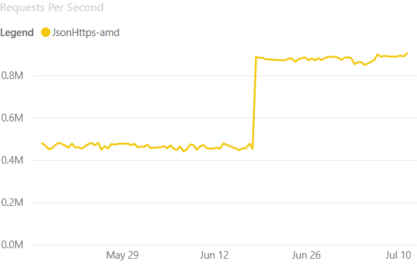
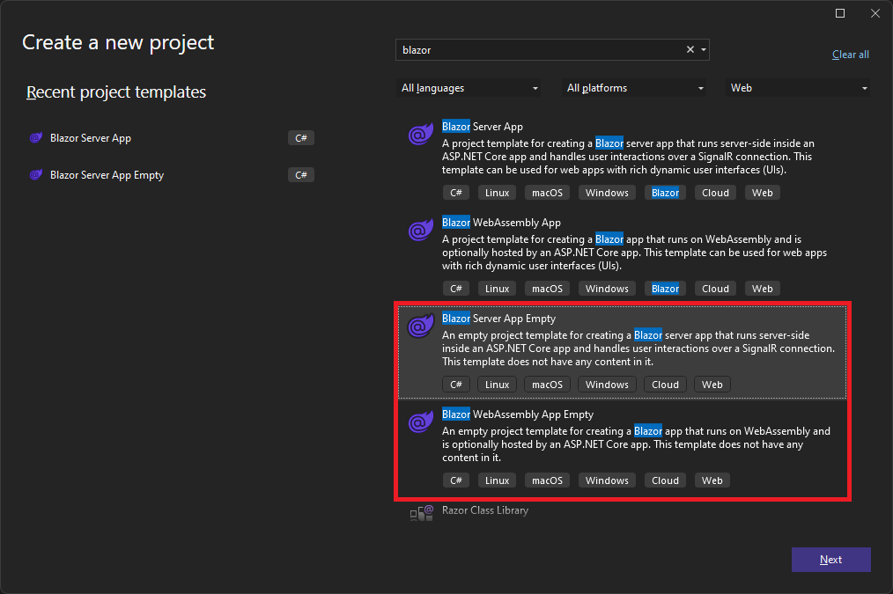

[.NET 7 Preview 6 is now available](https://devblogs.microsoft.com/dotnet/announcing-dotnet-7-preview-6) and includes many great new improvements to ASP.NET Core.

Here's a summary of what's new in this preview release:

- Request decompression middleware
- Output caching middleware
- Updates to rate limiting middleware
- Kestrel support for WebSockets over HTTP/2
- Kestrel performance improvements on high core machines
- Support for logging additional request headers in W3CLogger
- Empty Blazor project templates
- System.Security.Cryptography support on WebAssembly
- Blazor custom elements no longer experimental
- Experimental `QuickGrid` component for Blazor
- gRPC JSON transcoding multi-segment parameters
- `MapGroup` support for more extension methods

For more details on the ASP.NET Core work planned for .NET 7 see the full [ASP.NET Core roadmap for .NET 7](https://aka.ms/aspnet/roadmap) on GitHub.

## Get started

To get started with ASP.NET Core in .NET 7 Preview 6, [install the .NET 7 SDK](https://dotnet.microsoft.com/download/dotnet/7.0).

If you're on Windows using Visual Studio, we recommend installing the latest [Visual Studio 2022 preview](https://visualstudio.com/preview). If you're on macOS, we recommend installing the latest [Visual Studio 2022 for Mac preview](https://visualstudio.microsoft.com/vs/mac/preview/).

To install the latest .NET WebAssembly build tools, run the following command from an elevated command prompt:

```console
dotnet workload install wasm-tools
```

> Note: Building .NET 6 Blazor projects with the .NET 7 SDK and the .NET 7 WebAssembly build tools is currently not supported. This will be addressed in a future .NET 7 update: [dotnet/runtime#65211](https://github.com/dotnet/runtime/issues/65211).

## Upgrade an existing project

To upgrade an existing ASP.NET Core app from .NET 7 Preview 5 to .NET 7 Preview 6:

- Update all Microsoft.AspNetCore.\* package references to `7.0.0-preview.6.*`.
- Update all Microsoft.Extensions.\* package references to `7.0.0-preview.6.*`.

See also the full list of [breaking changes](https://docs.microsoft.com/dotnet/core/compatibility/7.0#aspnet-core) in ASP.NET Core for .NET 7.

## Request decompression middleware

The request decompression middleware is a new middleware that uses the `Content-Encoding` HTTP header to automatically identify and decompress requests with compressed content so that the developer of the server does not need to handle this themselves.

The request decompression middleware is added using the `UseRequestDecompression` extension method on `IApplicationBuilder` and the `AddRequestDecompression` extension method for `IServiceCollection`.

Support for Brotli (`br`), Deflate (`deflate`), and GZip (`gzip`) are included out of the box. Other content encodings can be added by registering a custom decompression provider class, which implements the `IDecompressionProvider` interface, along with a `Content-Encoding` header value in `RequestDecompressionOptions`.

Thanks to [@david-acker](https://github.com/david-acker) for contributing this feature!

## Output caching middleware

Output caching is a new middleware that helps you store results from your web app and serve them from a cache rather than computing them every time, which improves performance and frees up resources for other activities.

To get started with output caching, use the `AddOutputCache` extension method on `IServiceCollection` and the `UseOutputCache` extension method on `IApplicationBuilder`.

Once you've done so, you can start configuring output caching on your endpoints. Here's a simple example of using output caching on an endpoint that returns timestamps.

```csharp
app.MapGet("/notcached", () => DateTime.Now.ToString());

app.MapGet("/cached", () => DateTime.Now.ToString()).CacheOutput();
```

Requests sent to "/notcached" will see the current time. But the "/cached" endpoint uses the `.CacheOutput()` extension, so each request to "/cached" after the first one will get a cached response (the time returned will not update after the first request).

There are many more advanced ways to customize output caching. The example below shows how `VaryByQuery` can be used to control caching based on a query parameter:

```csharp
// Cached entries will vary by culture, but any other additional query
// is ignored and returns the same cached content.
app.MapGet("/query", () => DateTime.Now.ToString()).CacheOutput(p => p.VaryByQuery("culture"));
```

With this configuration, the "/query" endpoint will cache its output uniquely per value of the `culture` parameter. Requests for `/query?culture=en` will get a cached response and requests for `/query?culture=es` will get a different cached response.

In addition to varying by query strings, there is also support for varying cached responses by headers (`VaryByHeader`) or by custom values (`VaryByValue`).

The output caching middleware has built in protection for some common pitfalls of caching. Imagine the situation where you have a busy web service and you revoke/invalidate a popular cache entry. When that happens, there can be many requests for that entry all at the same time, and because the response is not in the cache at that moment, the server would have to process each of those requests.

Resource locking is a feature of output caching that prevents the server from being overwhelmed by these "cache stampedes". It does this by only allowing one request for the resource to be processed, while the rest of them wait for the cache entry to be updated. Once that happens, all of the waiting requests can be served from the cache, preventing the server from being inundated by redundant work.

If you'd like to see a more complete example demonstrating these and other features of output caching, take a look at the [OutputCachingSample app](https://github.com/dotnet/aspnetcore/tree/release/7.0-preview6/src/Middleware/OutputCaching/samples/OutputCachingSample) in the ASP.NET Core repo.

For a deeper dive into the output caching feature, be sure to check out this [on-demand session we presented at Build 2022](https://mybuild.microsoft.com/sessions/92e64465-4bd1-486a-a502-25f2577e7fac). Note that some of the features/APIs discussed have changed since the talk was recorded.

We plan to continue to add functionality to this middleware, so please let us know what you'd like to see.

## Updates to rate limiting middleware

The rate limiting middleware now supports rate limiting on specific endpoints, which can be combined with a global limiter that runs on all requests. Below is a sample that adds a `TokenBucketRateLimiter` to an endpoint, and uses a global `ConcurrencyLimiter`:

```csharp
var coolEndpointName = "coolPolicy";

// Define endpoint limiters and a global limiter.
// coolEndpoint will be limited by a TokenBucket Limiter with a max permit count of 6 and a queue depth of 3.
var options = new RateLimiterOptions()
    .AddTokenBucketLimiter(coolEndpointName, new TokenBucketRateLimiterOptions(3, QueueProcessingOrder.OldestFirst, 6, TimeSpan.FromSeconds(10), 1))

// The global limiter will be a concurrency limiter with a max permit count of 10 and a queue depth of 5.
options.GlobalLimiter = PartitionedRateLimiter.Create<HttpContext, string>(context =>
    {
        return RateLimitPartition.CreateConcurrencyLimiter<string>("globalLimiter", key => new ConcurrencyLimiterOptions(10, QueueProcessingOrder.NewestFirst, 5));
    });
app.UseRateLimiter(options);

app.MapGet("/", () => "Hello World!").RequireRateLimiting(coolEndpointName);
```

We also support adding custom rate limiting policies through the new `AddPolicy` methods on `RateLimiterOptions`.

## Kestrel support for WebSockets over HTTP/2

[WebSockets](https://www.rfc-editor.org/rfc/rfc6455.html) were originally designed for HTTP/1.1 but have since been [adapted](https://www.rfc-editor.org/rfc/rfc8441.html) to work over HTTP/2. Using WebSockets over HTTP/2 lets you take advantage of new features like header compression and multiplexing that reduce the time and resources needed when making multiple requests to the server. That support is now available in Kestrel on all HTTP/2 enabled platforms.

The HTTP version negotiation is automatic in browsers and Kestrel so no new APIs are needed. You can follow the [existing ASP.NET Core samples](https://docs.microsoft.com/aspnet/core/fundamentals/websockets) for using WebSockets over HTTP/2. Note HTTP/2 WebSockets use CONNECT requests rather than GET, so your routes and controllers may need updating. Chrome and Edge have HTTP/2 WebSockets enabled by default, and you can enable it in FireFox on the `about:config` page with the `network.http.spdy.websockets` flag.

SignalR and the SignalR browser JavaScript client have been updated to support WebSockets over HTTP/2. Support is also coming to [ClientWebSocket](https://github.com/dotnet/runtime/issues/69669) and [YARP](https://github.com/microsoft/reverse-proxy/issues/1375) soon.

## Kestrel performance improvements on high core machines

Kestrel uses `ConcurrentQueue` for many purposes. One purpose is scheduling I/O operations in Kestrel's default `Socket` transport. Partitioning the `ConcurrentQueue` based on the associated socket reduces contention and increases throughput on machines with many CPU cores.

Recent profiling on new even higher core machines like [the 80 core ARM64 Ampere Altra VMs recently made available on Azure](https://azure.microsoft.com/blog/now-in-preview-azure-virtual-machines-with-ampere-altra-armbased-processors/) showed a lot of contention in one of Kestrel's other `ConcurrentQueue` instances, the `PinnedMemoryPool` which Kestrel uses to cache byte buffers.

In Preview 6, Kestrel's memory pool is now partitioned the same way as its I/O queue leading to much lower contention and higher throughput on high core machines. We're seeing an [over 500% RPS improvement](https://github.com/dotnet/aspnetcore/pull/42237#issuecomment-1159251566) in the TechEmpower plaintext benchmark on the previously mentioned 80 core ARM64 VMs and a [nearly 100% improvement](https://aka.ms/aspnet/benchmarks) on 48 Core AMD VMs in our HTTPS JSON benchmark.



## Support for logging additional request headers in W3CLogger

You can now specify additional request headers to log when using the W3C logger by calling  `AdditionalRequestHeaders()` on `W3CLoggerOptions`:

```csharp
services.AddW3CLogging(logging =>
{
    logging.AdditionalRequestHeaders.Add("x-forwarded-for");
    logging.AdditionalRequestHeaders.Add("x-client-ssl-protocol");
});
```

Thanks to [@dustinsoftware](https://github.com/dustinsoftware) for contributing this feature!

## Empty Blazor project templates

Blazor has two new project templates for starting from a blank slate. The new "Blazor Server App Empty" and "Blazor WebAssembly App Empty" project templates are just like their non-empty counterparts but without any extra demo code. These empty templates have only a very basic home page, and we've also Bootstrap so you can start with whatever CSS framework you prefer.

The new templates are available from within Visual Studio once you install the .NET 7 SDK:



You can also use the empty Blazor project templates from the command-line:

```console
dotnet new blazorserver-empty
dotnet new blazorwasm-empty
```

## System.Security.Cryptography support on WebAssembly

.NET 6 supported the SHA family of hashing algorithms when running on WebAssembly. .NET 7 enables more cryptographic algorithms by taking advantage of [SubtleCrypto](https://developer.mozilla.org/docs/Web/API/SubtleCrypto) when possible, and falling back to a .NET implementation when SubtleCrypto can't be used. In .NET 7 Preview 6 the following algorithms are supported on WebAssembly:

* SHA1
* SHA256
* SHA384
* SHA512
* HMACSHA1
* HMACSHA256
* HMACSHA384
* HMACSHA512

Support for AES-CBC, PBKDF2, and HKDF algorithms are planned for a future .NET 7 update.

For more information, see [dotnet/runtime#40074](https://github.com/dotnet/runtime/issues/40074).

## Blazor custom elements no longer experimental

The previously experimental [Microsoft.AspNetCore.Components.CustomElements](https://www.nuget.org/packages/microsoft.aspnetcore.components.customelements) package for building [standards based custom elements](https://html.spec.whatwg.org/multipage/custom-elements.html#custom-elements) with Blazor is no longer experimental and is now part of the .NET 7 release.

To create a custom element using Blazor, register a Blazor root component as a custom element like this:

```csharp
options.RootComponents.RegisterCustomElement<Counter>("my-counter");
```

You can then use this custom element with any other web framework you'd like:

```html
<my-counter increment-amount="10"></my-counter>
```

For additional details, refer to the Blazor docs on [building custom elements](https://docs.microsoft.com/aspnet/core/blazor/components#blazor-custom-elements).

## Experimental `QuickGrid` component for Blazor

`QuickGrid` is a new experimental component for Blazor for quickly and efficiently displaying data in tabular form. `QuickGrid` provides a simple and convenient data grid component for the most common needs as well as a reference architecture and performance baseline for anyone building Blazor data grid components.

To get started with `QuickGrid`:

1. Add reference to the Microsoft.AspNetCore.Components.QuickGrid package.

    ```console
    dotnet add package Microsoft.AspNetCore.Components.QuickGrid --prerelease
    ```

2. Add the following Razor code to render a very simple grid.

    ```razor
    <QuickGrid Items="@people">
        <PropertyColumn Property="@(p => p.PersonId)" Sortable="true" />
        <PropertyColumn Property="@(p => p.Name)" Sortable="true" />
        <PropertyColumn Property="@(p => p.BirthDate)" Format="yyyy-MM-dd" Sortable="true" />
    </QuickGrid>

    @code {
        record Person(int PersonId, string Name, DateOnly BirthDate);

        IQueryable<Person> people = new[]
        {
            new Person(10895, "Jean Martin", new DateOnly(1985, 3, 16)),
            new Person(10944, "António Langa", new DateOnly(1991, 12, 1)),
            new Person(11203, "Julie Smith", new DateOnly(1958, 10, 10)),
            new Person(11205, "Nur Sari", new DateOnly(1922, 4, 27)),
            new Person(11898, "Jose Hernandez", new DateOnly(2011, 5, 3)),
            new Person(12130, "Kenji Sato", new DateOnly(2004, 1, 9)),
        }.AsQueryable();
    }
    ```

You can see examples of `QuickGrid` in action on the [QuickGrid for Blazor](https://aspnet.github.io/quickgridsamples/) demo site, which includes examples of:

- [Working with remote data sources](https://aspnet.github.io/quickgridsamples/datasources)
- [Adding simple and templated columns](https://aspnet.github.io/quickgridsamples/datasources)
- [Sorting data](https://aspnet.github.io/quickgridsamples/sorting)
- [Filtering data](https://aspnet.github.io/quickgridsamples/filtering)
- [Paging data](https://aspnet.github.io/quickgridsamples/paging)
- [Virtualizing data](https://aspnet.github.io/quickgridsamples/virtualizing)
- [Styling and theming](https://aspnet.github.io/quickgridsamples/styling)

`QuickGrid` is highly optimized and uses advanced techniques to achieve optimal rendering performance. The QuickGrid demo site is built using Blazor WebAssembly and is hosted on GitHub Pages. The site loads fast thanks to static prerendering using [jsakamoto](https://github.com/jsakamoto)'s [BlazorWasmPrerendering.Build](https://github.com/jsakamoto/BlazorWasmPreRendering.Build) project.

It's not a goal to add all the features to `QuickGrid` that full-blown commercial grids tend to have, for example hierarchical rows, drag-to-reorder columns, or Excel-like range selections. If you need those, continue using commercial grids or other open-source options.

`QuickGrid` is currently experimental, which means it's not officially supported and isn't committed to ship as part of .NET 7 or any future .NET release at this time. But, `QuickGrid` is open source and freely available to use. We hope you'll give it a try and let us know what you think!

## gRPC JSON transcoding multi-segment parameters

[gRPC JSON transcoding](https://devblogs.microsoft.com/dotnet/announcing-grpc-json-transcoding-for-dotnet/) is a new feature in .NET 7 for turning gRPC APIs into RESTful APIs.

New in Preview 6 is support for multi-segment parameters in gRPC JSON transcoding routes. This feature brings ASP.NET Core transcoding into parity with other transcoding solutions in the gRPC ecosystem.

It's now possible to configure gRPC APIs to bind properties to multi-segment parameters. For example, `/v1/{book=shelves/*/books/*}` specifies a route with a multi-segment book parameter. It matches URL's like `/v1/shelves/user-name/books/cool-book` and the book parameter has the value `shelves/user-name/books/cool-book`.

For more information about this routing syntax, see [gRPC transcoding path syntax](https://cloud.google.com/service-infrastructure/docs/service-management/reference/rpc/google.api#path-template-syntax).

## `MapGroup` support for more extension methods

Route groups were [introduced in .NET 7 Preview 4](https://devblogs.microsoft.com/dotnet/asp-net-core-updates-in-dotnet-7-preview-4/#route-groups) and allow defining groups of endpoints with a common route prefix and a common set of conventions. Conventions include extension methods like `RequireAuthorization()`, `RequireCors()` and their associated attributes. Conventions add metadata to an endpoint that other middleware (authorization, CORS, etc.) typically act on.

`WithTags()`, `WithDescription()`, `ExcludeFromDescription()` and `WithSummary()` previously only targeted `RouteHandlerBuilder` instead of the `IEndpointConventionBuilder` interface making them incompatible with the `RouteGroupBuilder` returned by `MapGroup()`. Starting in Preview 6, these extension methods now target `IEndpointConventionBuilder`making them compatible with route groups.

Similarly, `WithOpenApi()` and `AddFilter()` targeted `RouteHandlerBuilder` instead of `IEndpointConventionBuilder` making them incompatible with route groups. Supporting these required rethinking how groups work internally to allow group conventions to both observe metadata about individual endpoints and still modify the metadata and even the final `RequestDelegate` generated for the endpoint. This was made possible through [a change to EndpointDataSource](https://github.com/dotnet/aspnetcore/pull/42195), but the key takeaway is that you can now call `WithOpenApi()` and `AddFilter()` on route groups in Preview 6.

> **_NOTE:_** `AddFilter()` has been renamed to `AddRouteHandlerFilter()` in Preview 6 and will be [renamed again to `AddEndpointFilter()`](https://github.com/dotnet/aspnetcore/issues/42589) starting in Preview 7.

```csharp
var todos = app.MapGroup("/todos")
    .WithTags("todos", "some_other_tag")
    .WithOpenApi()
    .AddRouteHandlerFilter((endpointContext, next) =>
    {
        var logger = endpointContext.ApplicationServices.GetRequiredService<ILogger<Program>>();
        return invocationContext =>
        {
            logger.LogInformation($"Received request for: {invocationContext.HttpContext.Request.Path}");
            return next(invocationContext);
        };
    });

todos.MapGet("/{id}", GetTodo);
todos.MapGet("/", GetAllTodos).WithTags("get_all_todos");
todos.MapPost("/", CreateTodo).WithOpenApi(operation =>
{
    operation.Summary = "Create a todo.";
    return operation;
});
```

## Give feedback

We hope you enjoy this preview release of ASP.NET Core in .NET 7. Let us know what you think about these new improvements by filing issues on [GitHub](https://github.com/dotnet/aspnetcore/issues/new).

Thanks for trying out ASP.NET Core!
