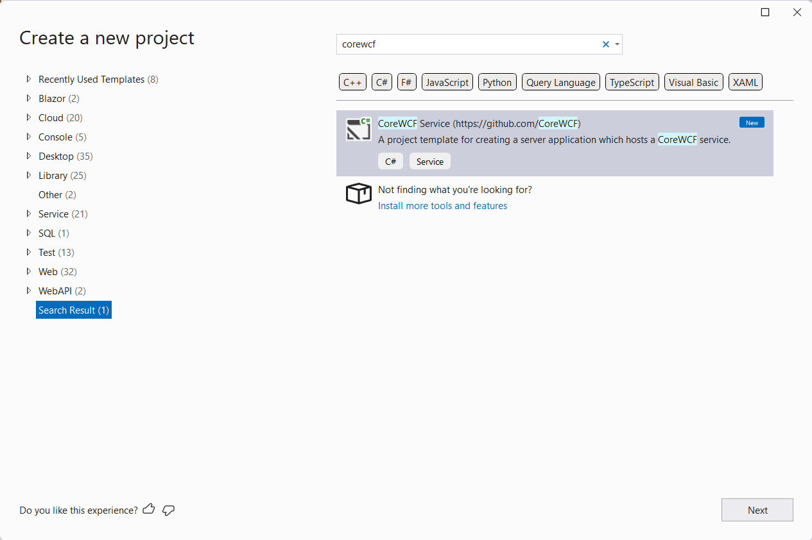
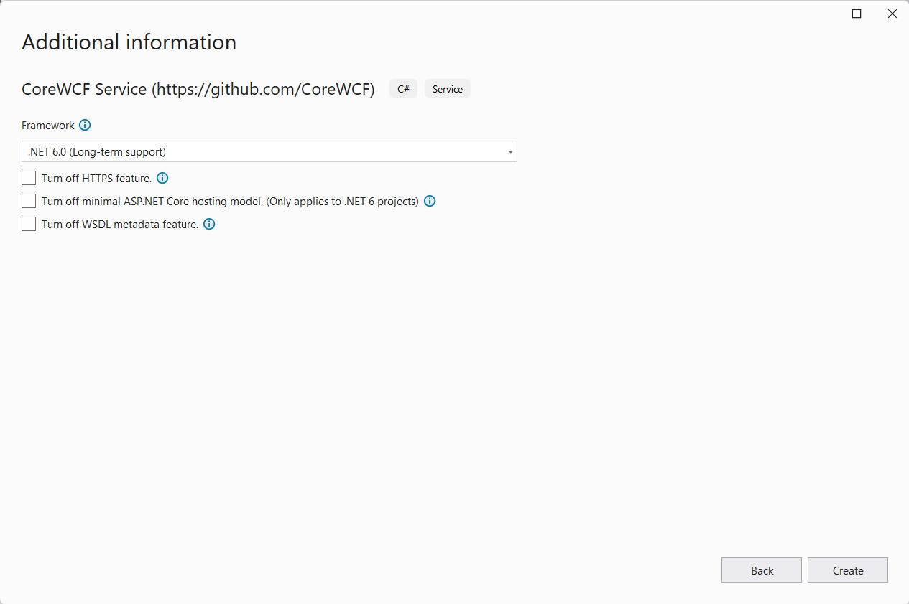

The CoreWCF project has a new release 1.1 which is an update to the [1.0 that was released in April](https://devblogs.microsoft.com/dotnet/corewcf-v1-released/). I want to take the opportunity to provide a quick update on the CoreWCF project, which is a port of WCF server functionality to .NET Core. CoreWCF provides a compatible implementation of SOAP, NetTCP, and WSDL. Usage in code is similar to WCF, but updated to use ASP.NET Core as the service host, and to work with .NET Core. 

## CoreWCF 1.1 Release

CoreWCF 1.1 is an incremental release for the project that provides some smaller features, mostly implemented by community members. As an incremental release, customers are recommended to update to it in their projects as there are no breaking changes to APIs.

The release contains the following new features:
- Impersonation support with Transport Security over HTTP, implemented by @jonlouie
- New APIs to modify generated Swagger file with WebHttpBinding, implemented by @JonathanHopeDMRC
- The X509CertificateClaimSet class has been made public, implemented by @petarpetrovt

Further details on these changes can be found in the [release notes](https://github.com/CoreWCF/CoreWCF/releases/tag/v1.1.0).

[Microsoft support is available for CoreWCF](https://github.com/CoreWCF/CoreWCF/blob/main/Documentation/Microsoft-Support.md), and is based on supporting the latest version. With this incremental release, support will continue to be available for v1.0 for 6 months (until 30th December 2022).

## Project Templates

The coolest feature in this release are the project templates that have been implemented by @g7ed6e. The templates include the essentials for creating a service using the `BasicHttpBinding`. The templates are installed using:

``` cmd
dotnet new --install CoreWCF.Templates
```

Once installed, new CoreWCF projects can be created using `dotnet new corewcf` or using the Visual Studio new project dialog (which relies on the command above for installation). 


The project templates include the following additional options:
| Option | Description |
| --- | --- |
| -f or --framework | The target framework for the project, the default is net6.0|
| --no-https | Whether to turn off HTTPS. The default is false so projects include https support |
| --use-program-main | Whether to generate an explicit Program class and Main method instead of top-level statements for .NET 6. The default is to use the minimal API syntax |
| --no-wsdl | Whether to turn off WSDL metadata feature. The default is false so WSDL generation is included |

They can be specified on the `dotnet new` command line, and also are shown as UI in Visual Studio:



The project templates make it very easy to create new CoreWCF projects. It may seem strange to have project templates given that CoreWCF is intended to assist with the modernization of existing WCF services, but a common migration strategy is to create a new project and either copy from it to the old project or vice-versa.

## Samples

The samples for CoreWCF have moved to their own GitHub repo https://github.com/CoreWCF/samples. This makes them easier to use as you can clone the repo or download as a zip and just get the samples. They now reference the nuget packages and so are usable without needing to build CoreWCF itself. We have worked on reducing the complexity of the samples so that they are easier to understand, and use as the basis for your projects.

## Survey

The goal of the CoreWCF project is to make it easier for developers to modernize their WCF applications to .NET Core. We want to drive the project based on the needs of developers modernizing their apps. To help us understand what those needs are we have a short survey for customers using CoreWCf and WCF.

https://www.surveymonkey.com/r/FW9VM6P

## Summary

We want to thank the contributors for their PRs that made this release possible. It's really great to see the community involvement in the project, and we welcome feedback, issues, questions and contributions for the project at https://github.com/CoreWCF/CoreWCF.