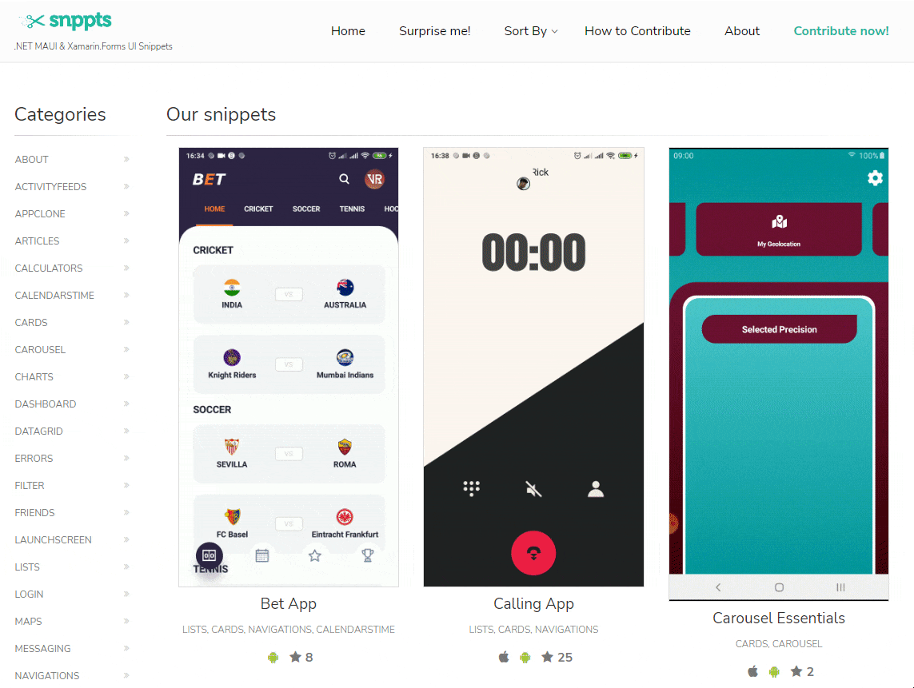
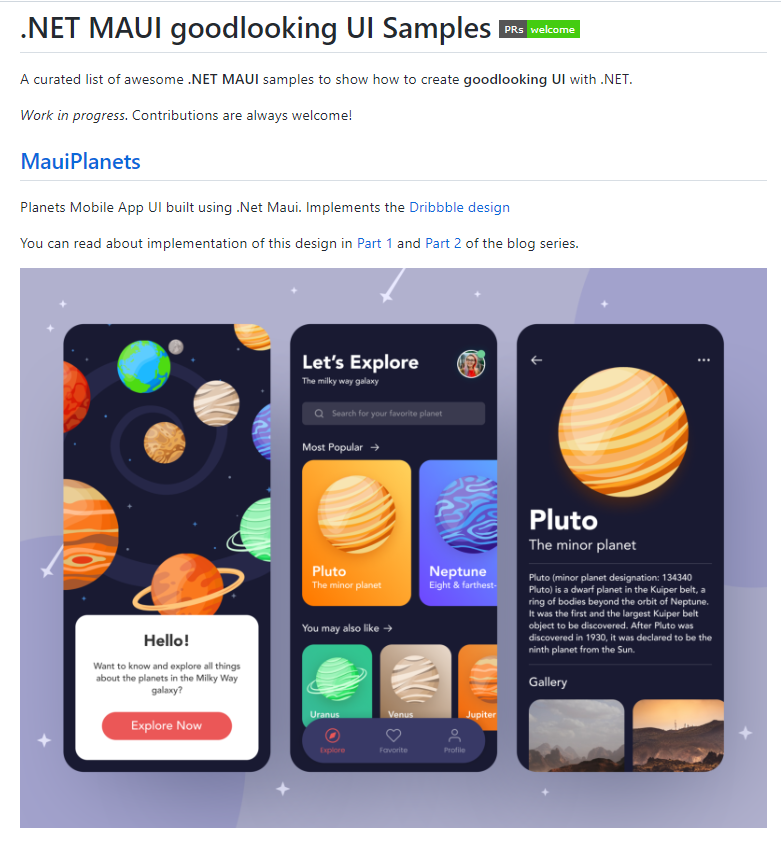
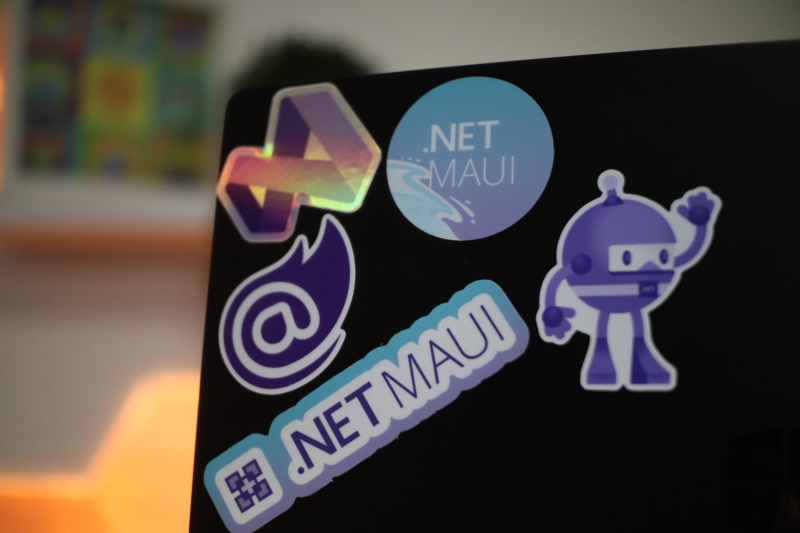

.NET MAUI doesn't just enable you to create cross-platform applications on Windows, macOS, iOS, and Android... it helps you to do it with style! You can create beautiful apps that delight your users, using great built-in features, native controls, and community libraries.

We're big fans of both Snppts and the .NET MAUI Good Looking UI Samples repo because they showcase the best of what the community is doing to build beautiful .NET MAUI UI. During the month of August, anyone who contributes to either of these community repos will get a sweet sticker pack from the .NET team!

## Snppts

[Snppts](https://snppts.dev/) is a community-run website helping aggregate beautiful .NET MAUI UI snippets for and from the community. We've been big fans for years, we ran a [Snppts community challenge](https://devblogs.microsoft.com/xamarin/snppts-community-challenge/) back in 2019! When you're building a .NET MAUI app and looking for either some inspiration or some reusable UI components to drop into your app... or even better, you've built some amazing UI you'd like to share... think of Snppts!

## .NET MAUI Good Looking UI Samples

Javier has been leading the charge in beautiful Xamarin.Forms apps for years with his *Xamarin.Forms Goodlooking UI* repo, and now he and the community are building out a [.NET MAUI Good Looking UI](https://github.com/jsuarezruiz/net-maui-goodlooking-UI) repo. While Snppts is a showcase for reusable components, *.NET MAUI Good Looking UI* is a showcase for complete applications.

Looking for some inspiration? You can start by implementing some [top mobile UI designs](https://dribbble.com/shots/popular/mobile) in .NET MAUI, or by porting some of the existing [Xamarin.Forms Good Looking UI](https://github.com/jsuarezruiz/xamarin-forms-goodlooking-UI) examples to .NET MAUI.

## Submit your samples and get a sticker pack

Share your beautiful design with *Snppts* .or *.NET MAUI Good Looking UI* (or both!) and we'll send you a sticker pack! Here's all you have to do:

1. Submit a pull request to [Snppts](https://github.com/snpptsdev/snppts) or [.NET MAUI Good Looking UI](https://github.com/jsuarezruiz/net-maui-goodlooking-UI).
1. Fill out a short form (links in the repos) to tell us about your experience and where to send the stickers by August 31.
1. Put the cool stickers on your things!

## Top submissions get famous on the .NET blog and On .NET Shows

Everyone's a winner, but we'll also be looking for some standouts to feature on the blog and our On .NET recap:

- Best overall application
- Best use of new APIs (shadows, borders, etc.)
- Best responsive application (works well at different device sizes)
- Best incorporation of native UI features

## Eligibility

To be eligible to be selected:

- You must submit a valid PR that is accepted and fill out the entry form.
- Giveaway is open to residents of [countries and localities where USPS can deliver](https://pe.usps.com/text/imm/immctry.htm).
- Giveaway is open to those who are 18 years of age or older.
- Entries must be submitted by August 31st, 2022 at 11:59 PM Pacific Time.

## Summary

We can't wait to see your submissions! Build some beautiful UI with .NET MAUI, and share it at [Snppts](https://github.com/snpptsdev/snppts) and [.NET MAUI Good Looking UI](https://github.com/jsuarezruiz/net-maui-goodlooking-UI)!
