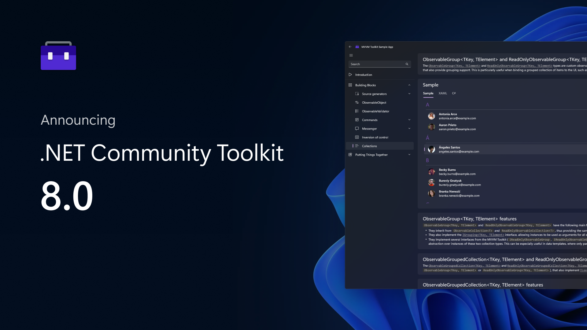
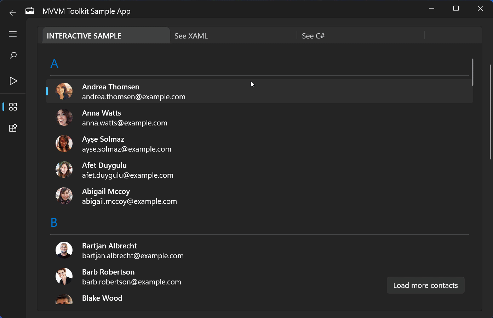
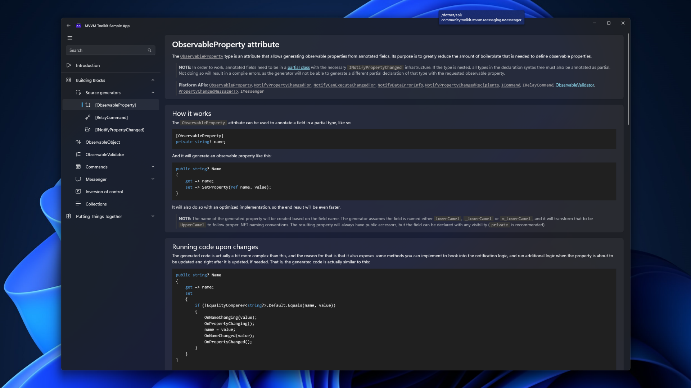

We're happy to announce the official launch of the new .NET Community Toolkit, which is now live on NuGet with version 8.0.0! This is a major release including a ton of new features, improvements, optimizations, bug fixes and many refactorings to also reflect the new project structure and organization, which this blog post will describe in detail.

[](https://aka.ms/toolkit/dotnet)

As with every Community Toolkit release, all changes were influenced by feedback received both by teams here at Microsoft using the Toolkit, as well as other developers in the community. We’re really thankful to everyone that has contributed and that keeps helping the .NET Community Toolkit get better every day! 🎉

## What's in the .NET Community Toolkit? 👀

The .NET Community Toolkit is a collection of helpers and APIs that work for all .NET developers and are agnostic of any specific UI platform. The toolkit is maintained and published by Microsoft, and part of the .NET Foundation. It's also used by several internal projects and inbox applications, such as the Microsoft Store. Starting from the new 8.0.0 release, the project is now in the [CommunityToolkit/dotnet](https://github.com/CommunityToolkit/dotnet) repository on GitHub, which includes all libraries that are part of the Toolkit.

All the available APIs have no dependencies on any specific runtime or framework, so they can be used by all .NET developers. These libraries multi-target from .NET Standard 2.0 to .NET 6, so they can both support as many platforms as possible and be optimized for best performance when used on newer runtimes.

The libraries in the .NET Community Toolkit include:

- `CommunityToolkit.Common`
- `CommunityToolkit.Mvvm` (aka “Microsoft MVVM Toolkit”)
- `CommunityToolkit.Diagnostics`
- `CommunityToolkit.HighPerformance`

## A little bit of history 📖

You might be wondering why the first release of the .NET Community Toolkit is version 8.0.0. Good question! The reason for that is all the libraries of the .NET Community Toolkit were originally part of the [Windows Community Toolkit](https://aka.ms/toolkit/windows), which is a collection of helpers, extensions, and custom controls which simplifies and demonstrates common developer tasks building UWP and .NET apps for Windows 10 and Windows 11.

Over time, the number of APIs just targeting .NET and without any Windows-specific dependencies grew, and we decided to split them off into a separate project so that they could be evolved independently and also be easier to find for .NET developers not doing any Windows development. That's how the .NET Community Toolkit was born. This also made it easier for us to better organize the [docs](https://aka.ms/toolkit/docs), which now have separate sections for each platform-specific Toolkit.

Since the last version of the Windows Community Toolkit before branching out was 7.1.x, we decided to follow that semantic versioning number to make the transition easier to understand for existing users, and that's why the first release of the .NET Community Toolkit is 8.0.0. Going forward, it will ve versioned separately from the Windows Community Toolkit, as each project will have its own separate roadmap and release schedule. 🎯

With that cleared up, let's now dive in into all the new features in this new major release of the .NET Community Toolkit libraries! 🚀

## MVVM Toolkit

As previously announced in the [7.0 release](https://blogs.windows.com/windowsdeveloper/2021/03/16/announcing-windows-community-toolkit-v7-0/), one of the main components of the .NET Community Toolkit is the MVVM Toolkit: a modern, fast, platform agnostic and modular MVVM library. This is the same MVVM library used by the Microsoft Store, the Photos app, and more!

The MVVM Toolkit is inspired by [MvvmLight](https://www.nuget.org/packages/MvvmLight), and is also the official replacement for it now that the library has been deprecated. We collaborated with [Laurent Bugnion](https://twitter.com/LBugnion) while developing the MVVM Toolkit as well, and he's endorsed the MVVM Toolkit as the path forwards for existing MvvmLight users (we also have [migration docs](https://docs.microsoft.com/dotnet/communitytoolkit/mvvm/migratingfrommvvmlight) for this).

There are a few key principles the MVVM Toolkit is built upon:

- **Platform agnostic**: meaning it doesn't have any dependencies on specific UI frameworks. You can use it to share code across UWP, WinUI 3, MAUI, WPF, Avalonia, Uno, and more!

- **Runtime agnostic**: the library multi-targets and supports down to .NET Standard 2.0, meaning you can get both performance improvements when running on modern runtimes (eg. .NET 6), as well as still being able to use it even on .NET Framework.

- **Simple to pick-up and use**: there are no strict requirements on the application structure or coding patterns to use. You can use the library to fit your own architecture and style.

- **À la carte**: all components are independent and can be used separately as well. There is no "all in" approach you're forced into: if you only wanted to use a single type from the whole library, you can do that just fine, and then gradually start using more features as needed.

- **Reference Implementation**: all the available APIs are meant to be lean and performant, providing "reference implementations" for interfaces that are included in the .NET Base Class Library, but lacks concrete types to use them directly. For instance, you'll be able to find a "reference implementation" for interfaces such as `INotifyPropertyChanged` or `ICommand`.

## MVVM Toolkit source generators 🤖

The biggest new feature in the 8.0.0 release of the MVVM Toolkit are the new MVVM source generators, which are meant to greatly reduce the boilerplate code that's needed to setup an application using MVVM. Compared to the preview generators [that we shipped in 7.1.0](https://devblogs.microsoft.com/ifdef-windows/windows-community-toolkit-7-1-preview-release/), they have also been completely rewritten to be [incremental generators](https://github.com/dotnet/roslyn/blob/main/docs/features/incremental-generators.md), meaning they will run much faster than before and they will help keep the IDE fast and responsive even when working on large scale projects.

You can find all of our docs on the new source generators [here](https://docs.microsoft.com/dotnet/communitytoolkit/mvvm/generators/overview), and if you prefer a video version, [James Montemagno](https://twitter.com/JamesMontemagno) has also done several videos on them, such as [this one](https://www.youtube.com/watch?v=AXpTeiWtbC8&t=600s). Let's also go over the main features powered by source generators that you will find in the MVVM Toolkit 🪄

### Commands

Creating commands can be quite repetitive, with the need to setup a property for every single method we want to expose in an abstract fashion to the various UI components in our applications that are meant to invoke them (such as buttons).

This is where the new `[RelayCommand]` attribute comes into play: this will let the MVVM Toolkit automatically generate commands (using the `RelayCommand` types included in the library) with the right signature, depending on the annotated method.

For comparison, here's how one would usually go about setting up a command:

```csharp
private IRelayCommand<User> greetUserCommand;

public IRelayCommand<User> GreetUserCommand => greetUserCommand ??= new RelayCommand<User>(GreetUser);

private void GreetUser(User user)
{
    Console.WriteLine($"Hello {user.Name}!");
}
```

This can now be simplified to just this:

```csharp
[RelayCommand]
private void GreetUser(User user)
{
    Console.WriteLine($"Hello {user.Name}!");
}
```

The source generator will take care of creating the right `GreetUserCommand` property based on the annotated method. Additionally, a `CanExecute` method can also be specified, and it is also possible to control the concurrency level for asynchronous commands. There are also additional options to fine tune the behavior of the generated commands, which you can learn more about [in our docs](https://docs.microsoft.com/dotnet/communitytoolkit/mvvm/).

### Observable properties

Writing observable properties can be extremely verbose, especially when also having to add additional logic to handle dependent properties being notifed. Now, all of this can be greatly simplified by using the new attributes from the MVVM Toolkit, and letting the source generator create observable properties behind the scenes.

The new attributes are `[ObservableProperty]`, `[NotifyPropertyChangedFor]` and `[NotifyCanExecuteChangedFor]`, `[NotifyDataErrorInfo]` and `[NotifyPropertyChangedRecipients]`. Let's quickly go over what all of these new attributes can do.

Consider a scenario where there are two observable properties, a dependent property and the command that was defined above, and where both the dependent property and the command need to be notified when any of the two observable properties change. That is, whenever either `FirstName` or `LastName` change, `FullName` is also notified, as well as the `GreetUserCommand`.

This is how it would have been done in the past:

```csharp
private string? firstName;

public string? FirstName
{
    get => firstName;
    set
    {
        if (SetProperty(ref firstName, value))
        {
            OnPropertyChanged(nameof(FullName));
            GreetUserCommand.NotifyCanExecuteChanged();
        }
    }
}

private string? lastName;

public string? LastName
{
    get => lastName;
    set
    {
        if (SetProperty(ref lastName, value))
        {
            OnPropertyChanged(nameof(FullName));
            GreetUserCommand.NotifyCanExecuteChanged();
        }
    }
}

public string? FullName => $"{FirstName} {LastName}";
```

This can now all be rewritten as follows instead:

```csharp
[ObservableProperty]
[NotifyPropertyChangedFor(nameof(FullName))]
[NotifyCanExecuteChangedFor(nameof(GreetUserCommand))]
private string? firstName;

[ObservableProperty]
[NotifyPropertyChangedFor(nameof(FullName))]
[NotifyCanExecuteChangedFor(nameof(GreetUserCommand))]
private string? lastName;

public string? FullName => $"{FirstName} {LastName}";
```

The MVVM Toolkit will handle code generation for those properties, including inserting all logic to raise the specified property change or can execute change events.

But wait, there's more! When using `[ObservableProperty]` to generate observable properties, the MVVM Toolkit will now also generate two partial methods with no implementations: `On<PROPERTY_NAME>Changing` and `On<PROPERTY_NAME>Changed`. These methods can be used to inject additional logic when a property is changed, without the need to fallback to using a manual property. Note that because these two methods are partial, void-returning and with no definition, the C# compiler will completely remove them if they are not implemented, meaning that when not used they will simply vanish and add no overhead to the application 🚀

This is an example of how they can be used:

```csharp
[ObservableProperty]
private string name;

partial void OnNameChanging(string name)
{
    Console.WriteLine($"The name is about to change to {name}!");
}

partial void OnNameChanged(string name)
{
    Console.WriteLine($"The name just changed to {name}!");
}
```

Of course, you’re also free to only implement one of these two methods, or none at all.

From that snippet above, the source generator will produce code analogous to this:

```csharp
public string Name
{
    get => name;
    set
    {
        if (!EqualityComparer<string>.Default.Equals(name, value))
        {
            OnNameChanging(value);
            OnPropertyChanging();
            name = value;
            OnNameChanged();
            OnPropertyChanged();
        }
    }
}

partial void OnNameChanging(string name);

partial void OnNameChanged(string name);
```

The `[ObservableProperty]` attribute also supports validation: if any of the fields representing a property has one or more attributes inheriting from `ValidationAttribute`, those will automatically be copied over to the generated properties, so this approach is also fully supported when using `ObservableValidator` to create validatable forms. If you also want the property to be validated whenever its value is set, you can also add `[NotifyDataErrorInfo]` to have validation code being generated as well in the property setter.

There's more features available for `[ObservableProperty]`, and just like with commands too, you can read more about them and see more examples [in our docs](https://aka.ms/toolkit/docs).

### Cancellation support for commands

A new property has been added to the `[RelayCommand]` attribute, which can be used to instruct the source generator to generate a cancel command alongside the original command. This cancel command can be used to cancel the execution of an asynchronous command.

This also showcases how `[RelayCommand]` can automatically adapt to asynchronous methods and methods that accept parameters as well, and create implementations of asynchronous commands behind the scenes. This also enables additional features like easy to setup binding to show progress indicators, and more!

This is an example of how they can be used:

```csharp
[RelayCommand(IncludeCancelCommand = true)]
private async Task DoWorkAsync(CancellationToken token)
{
    // Do some long running work with cancellation support
}
```

From this small snippet, the generator will produce the following code:

```csharp
private AsyncRelayCommand? doWorkCommand;

public IAsyncRelayCommand DoWorkCommand => doWorkCommand ??= new AsyncRelayCommand(DoWorkAsync);

ICommand? doWorkCancelCommand;

public ICommand DoWorkCancelCommand => doWorkCancelCommand ??= IAsyncRelayCommandExtensions.CreateCancelCommand(UpdateSomethingCommand);
```

This generated code, combined with the logic in the `IAsyncRelayCommandExtensions.CreateCancelCommand` API, allows you to just need a single line of code to have a command generated, notifying the UI whenever work has started or is running, with automatic concurrency control (the command is disabled by default when it is already running). The separate cancel command will be notified whenever the primary command starts or finishes running, and when executed will signal cancellation to the token passed to the method wrapped by the primary command. All of this, completely abstracted away and easily accessed with just a single attribute 🙌

### Broadcast change support for generated properties

We’ve also added a new `[NotifyPropertyChangedRecipients]` attribute which can be used on generated observable property from a type that inherits from `ObservableRecipient` (or that is annotated with `[ObservableRecipient]`). Using it will generate a call to the Broadcast method, to send a message to all other subscribed component about the property change that just happened. This can be useful in scenarios where a property change from a viewmodel needs to also be notified to other components in the application (Suppose there is an IsLoggedIn boolean property which updates when a user signs in; this can notify and trigger some other components in the application to refresh with the broadcasted message).

It can be used as follows:

```csharp
[ObservableProperty]
[NotifyPropertyChangedRecipients]
private string name;
```

And this will produce code analogous to this:

```csharp
public string Name
{
    get => name;
    set
    {
        if (!EqualityComparer<string>.Default.Equals(name, value))
        {
            OnNameChanging(value);
            OnPropertyChanging();
            string oldValue = name;
            name = value;
            Broadcast(oldValue, value, nameof(Name));
            OnNameChanged();
            OnPropertyChanged();
        }
    }
}
```

This is yet another feature to augment generated properties and to ensure they can be used in almost all scenarios, without being forced to fallback to manual properties.

### ViewModel composition

C# doesn’t have multiple inheritance, and this can sometimes get in the way.

What if there is a viewmodel that has to inherit from a specific type, but where you would also like to inject INotifyPropertyChanged support, or have it also inherit from ObservableRecipient to get access to its APIs?

The MVVM Toolkit now includes a way to work around this, by introducing attributes for code generation that allow injecting logic from these types into arbitrary classes. These are `[INotifyPropertyChanged]`, `[ObservableObject]` and `[ObservableRecipient]`.

Adding them to a class will cause the MVVM Toolkit source generator to include all logic from that type into that class, as if that class had also inherited from that type as well. For instance:

```csharp
[INotifyPropertyChanged]
partial class MyObservableViewModel : DatabaseItem
{
}
```

This `MyObservableViewModel` will inherit from `DatabaseItem` as you’d expect, but the use of `[INotifyPropertyChanged]` will let it also get support for `INotifyPropertyChanged`, along with all the helper APIs that `ObservableObject` includes on its own.

It is still recommended to inherit from the base types such as `ObservableObject` whenever needed, as that can also help reduce binary size, but having the ability to inject code this way when needed can help work around the C# limitations in cases where changing the base type of a viewmodel is just not possible, like in the example above.

## Improved messenger APIs 📬

Another commonly used feature in the MVVM Toolkit is the `IMessenger` interface, which is a contract for types that can be used to exchange messages between different objects.

This can be useful to decouple different modules of an application without having to keep strong references to types being referenced. It's also possible to send messages to specific channels, uniquely identified by a token, and to have different messengers in different sections of an application.

The MVVM Toolkit provides two implementations of this interface:
- `WeakReferenceMessenger`: which doesn't root recipients and allows them to be collected. This is implemented through dependent handles, which are a special type of GC references that allow this messenger to make sure to always allow registered recipients to be collected even if a registered handler references them back, but no other outstanding strong references to them exist.
- `StrongReferenceMessenger`: which is a messenger implementation rooting registered recipients to ensure they remain alive even if the messenger is the only object referencing them.

Here's a small example of how this interface can be used:

```csharp
// Declare a message
public sealed record LoggedInUserChangedMessage(User user);

// Register a recipient explicitly...
messenger.Register<MyViewModel, LoggedInUserChangedMessage>(this, static (r, m) =>
{
    // Handle the message here, with r being the recipient and m being the
    // input message. Using the recipient passed as input makes it so that
    // the lambda expression doesn't capture "this", improving performance.
});

// ...or have the viewmodel implement IRecipient<TMessage>...
class MyViewModel : IRecipient<LoggedInUserChangedMessage>
{
    public void Receive(LoggedInUserChangedMessage message)
    {
        // Handle the message here
    }
}

// ...and then register through the interface (other APIs are available too)
messenger.Register<LoggedInuserChangedMessage>(this);

// Send a message from some other module
messenger.Send(new LoggedInUserChangedMessage(user));
```

The messenger implementations in this new version of the MVVM Toolkit have been highly optimized in .NET 6 thanks to the newly available [public `DependentHandle` API](https://github.com/dotnet/runtime/pull/54246), which allows the messenger types to both become even faster than before, and also offer completely **zero-alloc** message broadcast. Here's some benchmarks showing how the messengers in the MVVM Toolkit fare against several other equivalent types from other widely used MVVM libraries:

|              Method |       Mean |     Error |    StdDev |  Ratio | RatioSD |      Gen 0 |     Gen 1 |     Allocated |
|-------------------- |-----------:|----------:|----------:|-------:|--------:|-----------:|----------:|--------------:|
|   **MVVMToolkitStrong** |   **4.025 ms** | 0.0177 ms | 0.0147 ms |   1.00 |    0.00 |          - |         - |             **-** |
|     **MVVMToolkitWeak** |   **7.549 ms** | 0.0815 ms | 0.0762 ms |   1.87 |    0.02 |          - |         - |             **-** |
|     MvvmCrossStrong |  11.483 ms | 0.0226 ms | 0.0177 ms |   2.85 |    0.01 |  9687.5000 |         - |  41,824,022 B |
|       MvvmCrossWeak |  13.941 ms | 0.1865 ms | 0.1744 ms |   3.47 |    0.04 |  9687.5000 |         - |  41,824,007 B |
|           MVVMLight |  52.929 ms | 0.1295 ms | 0.1011 ms |  13.14 |    0.06 |  7600.0000 |         - |  33,120,010 B |
|              Stylet |  91.540 ms | 0.6362 ms | 0.4967 ms |  22.73 |    0.17 | 35500.0000 |         - | 153,152,352 B |
|             MvvmGen | 141.743 ms | 2.7249 ms | 2.7983 ms |  35.31 |    0.70 | 19250.0000 |         - |  83,328,348 B |
|               Catel | 148.867 ms | 2.6825 ms | 2.5093 ms |  36.94 |    0.64 |  5250.0000 |         - |  22,736,316 B |
|               Prism | 150.077 ms | 0.5359 ms | 0.4184 ms |  37.26 |    0.13 | 17500.0000 |  250.0000 |  76,096,900 B |
|       CaliburnMicro | 280.740 ms | 3.7625 ms | 3.1418 ms |  69.74 |    0.82 | 88000.0000 | 2000.0000 | 381,859,608 B |
| MauiMessagingCenter | 673.656 ms | 1.7619 ms | 1.3755 ms | 167.26 |    0.63 |  8000.0000 |         - |  35,588,776 B |

Each benchmark run involves sending 4 different messages 1000 times, to 100 recipients. As you can see, `WeakReferenceMessenger` and `StrongReferenceMessenger` are both the fastest by far, and the only ones to not allocate even a single byte when broadcasting messages 🚀

## Revamped collection APIs 🏬

This new release of the MVVM Toolkit also moves all the observable grouped collection types from the `CommunityToolkit.Common` package to `CommunityToolkit.Mvvm`, while also doing some major changes to improve the API surface and make it useful in more scenarios. These APIs are particularly useful when working with grouped items (eg. to display a list of contacts), and they now also include extensions to greatly facilitate common operations such as inserting an item in the right position within a group (using either the default comparer or an input one, and creating a new group as well if needed).

Here’s a GIF showcasing a simple contacts view from the [MVVM Toolkit Sample App](https://aka.ms/mvvmtoolkit/samples):

[](https://aka.ms/mvvmtoolkit/samples)

## Announcing the MVVM Toolkit Sample App 🎈

To go along with the new release, we also published the sample app in the Microsoft Store! It includes all the documentation also available on MS Docs, along with interactive samples for many of the available APIs. It's meant to be a companion for the MVVM Toolkit, and we hope it will help people getting started with this library to become more familiar with it!

[Download it from the Microsoft Store](https://www.microsoft.com/store/apps/9NKLCF1LVZ5H) and try it out! 🙌

[](https://www.microsoft.com/store/apps/9NKLCF1LVZ5H)

## Improved diagnostics APIs

The `CommunityToolkit.Diagnostics` package has also received some new improvements, leveraging the new [C# 10 interpolated string handler](https://docs.microsoft.com/dotnet/csharp/whats-new/tutorials/interpolated-string-handler) and [caller argument expression](https://docs.microsoft.com/dotnet/csharp/language-reference/proposals/csharp-10.0/caller-argument-expression) features. Several `Guard` APIs previously taking a `string` now also accept a custom handler, allowing callsites to completely skip the interpolation step if no exception is thrown, and it is also no longer need to indicate the argument name manually.

Here's a quick before and after comparison:

```csharp
// Diagnostics 7.1
public static void SampleMethod(int[] array, int index, Span<int> span, string text)
{
    Guard.IsNotNull(array, nameof(array));
    Guard.HasSizeGreaterThanOrEqualTo(array, 10, nameof(array));
    Guard.IsInRangeFor(index, array, nameof(index));
    Guard.HasSizeLessThanOrEqualTo(array, span, nameof(span));
    Guard.IsNotNullOrEmpty(text, nameof(text));
}

// Diagnostics 8.0
public static void SampleMethod(int[] array, int index, Span<int> span, string text)
{
    Guard.IsNotNull(array);
    Guard.HasSizeGreaterThanOrEqualTo(array, 10);
    Guard.IsInRangeFor(index, array);
    Guard.HasSizeLessThanOrEqualTo(array, span);
    Guard.IsNotNullOrEmpty(text);
}
```

## .NET 6 support ✨

This new release of the .NET Community Toolkit also adds support for .NET 6 as a new target across all available libraries. This brings several improvements when running on the latest .NET runtime:

- Trimming support is now enabled for all libraries. To support this, all packages also have full trimming annotations for all APIs, to ensure that everything is either linker-friendly, or explicitly showing the correct warnings at compile-time (eg. this is the case for some validation APIs in the MVVM Toolkit, which use some APIs from the BCL that inherently need some reflection to work).
- The `Count<T>()` extension in the HighPerformance package now also supports `nint` and `nuint`.
- Several other optimizations across all packages have been introduced when on .NET 6.

Of course, all libraries will keep supporting down to .NET Standard 2.0, so you can keep referencing them from projects with different target frameworks as well. And due to how NuGet package resolution works, if you author a library using any of these packages and a lower target framework (eg. .NET Standard 2.0) and a consumer references it from a project targeting a new .NET version (eg. .NET 6), they’ll still automatically get the most optimized version of the .NET Community Toolkit assemblies that is available for them! 🎁

## Other changes ⚙️

There is so much more being included in this new release!

You can see the full changelog in the GitHub release page.

## Get started today! 🎉

You can find all source code [in our GitHub repo](https://aka.ms/toolkit/dotnet), some handwritten docs on the [MS Docs website](https://aka.ms/toolkit/docs), and complete API references in the .NET API browser website. If you would like to contribute, feel free to open issues or to reach out to let us know about your experience! To follow the conversation on Twitter, use the #CommunityToolkit hashtag. All your feedbacks greatly help in shape the direction of these libraries, so make sure to share them!

**Happy coding!** 💻