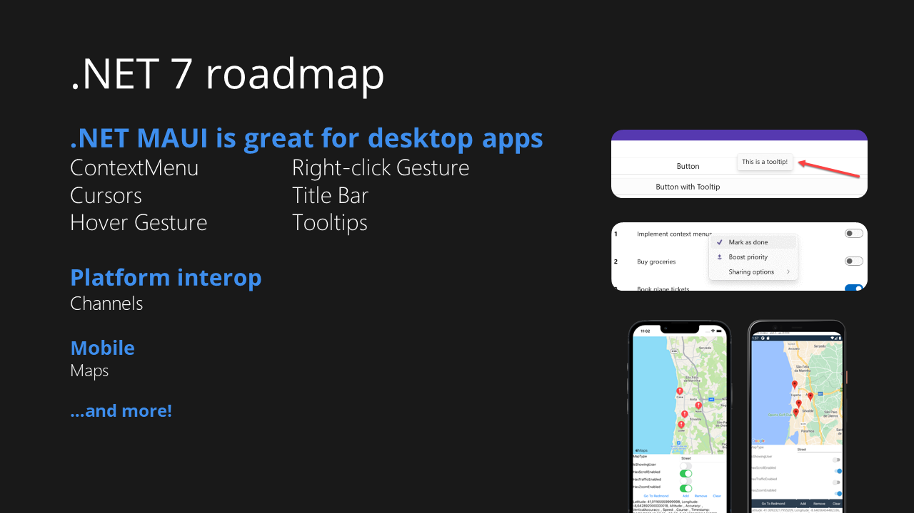
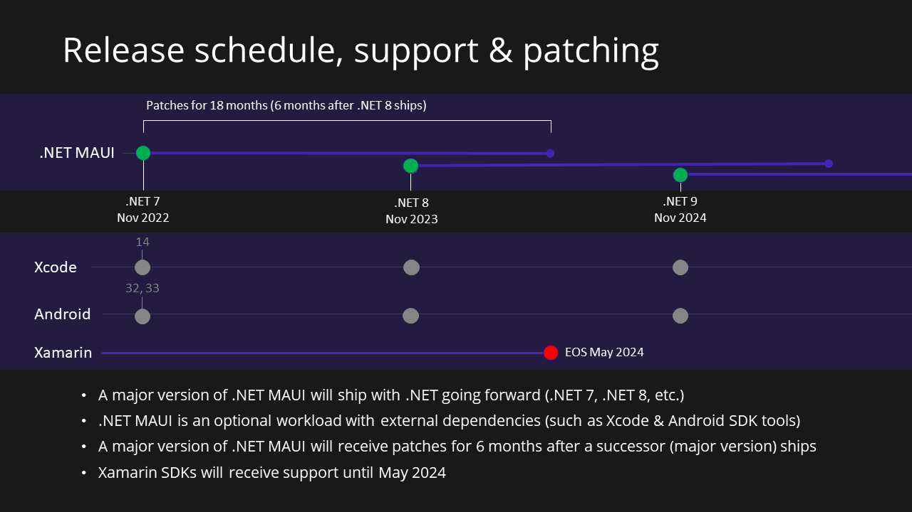
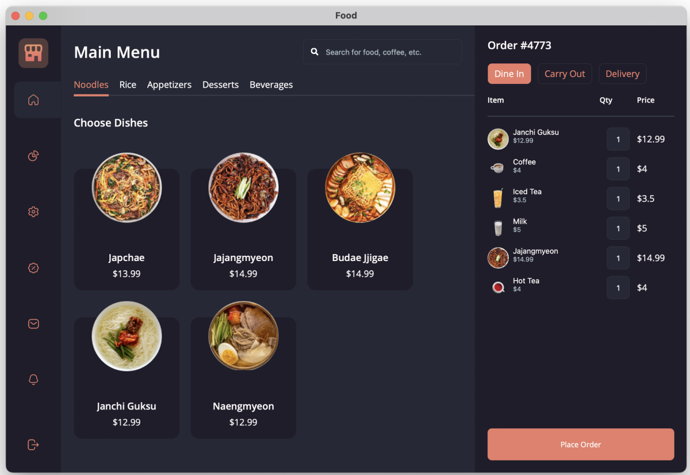

[.NET Conf: Focus on MAUI](https://focus.dotnetconf.net) is a wrap! Our one-day .NET MAUI developer conference coincided with the release of Visual Studio 2022 version 17.3 an the launch of general availability of .NET MAUI tooling. The day was packed with sessions covering all topics of building beautiful multi-platform apps with .NET MAUI including designing UI, publishing apps, real-time apps, and so much more. In this post, I will cover some highlights from the event and give you all the information to get caught up on recordings and ongoing .NET MAUI activities that you can get involved with today.

## Keynote highlights

Lead by David Ortinau and Maddy Montaquila, the .NET MAUI team and community brought 14 live sessions and another 10 pre-recorded sessions to this event.  Our speakers taught about the various framework capabilities, language features, and device interactions possible with .NET MAUI. We also introduced the [Visual Studio 17.3 release](https://devblogs.microsoft.com/dotnet/dotnet-maui-visualstudio-2022-release/) and announced our roadmap.

<iframe width="560" height="315" src="https://www.youtube-nocookie.com/embed/zp3Ja-jAjq4" title="YouTube video player" frameborder="0" allow="accelerometer; autoplay; clipboard-write; encrypted-media; gyroscope; picture-in-picture" allowfullscreen></iframe>

## Catch all the session recordings
 
All sessions are available on-demand sessions online on the [.NET YouTube channel](https://www.youtube.com/playlist?list=PLdo4fOcmZ0oWePZU3W162NJ9vcXqgpMVc) and [Microsoft Docs Events page](https://docs.microsoft.com/events/dotnetconf-focus-on-maui/). 

In addition to the live sessions, we also had several on-demand with some great deep-dive content for building apps with .NET MAUI:

- [Upgrading your JS Apps with .NET MAUI](https://www.youtube.com/watch?v=L5u6ImX6MfY&list=PLdo4fOcmZ0oWePZU3W162NJ9vcXqgpMVc&index=17) - [Alyssa Nicoll](https://twitter.com/AlyssaNicoll) 
- [Creating Accessible Apps with .NET MAUI](https://www.youtube.com/watch?v=sU_sR2eL2JM&list=PLdo4fOcmZ0oWePZU3W162NJ9vcXqgpMVc&index=16) - [Rachel Kang](https://twitter.com/therachelkang)
- [Performance Improvements in .NET MAUI](https://www.youtube.com/watch?v=Wsizdg3xnf4&list=PLdo4fOcmZ0oWePZU3W162NJ9vcXqgpMVc&index=18) - [Jonathan Peppers](https://twitter.com/JonathanPeppers)
- [Error monitoring for .NET MAUI with Sentry](https://www.youtube.com/watch?v=RW3hiukVXZQ&list=PLdo4fOcmZ0oWePZU3W162NJ9vcXqgpMVc&index=24) - [Matt Johnson-Pint](https://twitter.com/mattjohnsonpint)
- [Binding Native Libraries for .NET MAUI](https://www.youtube.com/watch?v=oibfI-ZsmzQ&list=PLdo4fOcmZ0oWePZU3W162NJ9vcXqgpMVc&index=19) - [Kinfey Lo](https://twitter.com/LJH8304)
- [Syncing data with Azure Mobile Apps and .NET MAUI](https://www.youtube.com/watch?v=7ZcchuKWODQ&list=PLdo4fOcmZ0oWePZU3W162NJ9vcXqgpMVc&index=21) - [Adrian Hall](https://twitter.com/FizzyInTheHall)
- [Unit Testing For Your .NET MAUI Applications](https://www.youtube.com/watch?v=b4OJSmgMAaw&list=PLdo4fOcmZ0oWePZU3W162NJ9vcXqgpMVc&index=25) - [Allan Ritchie](https://twitter.com/allanritchie911)
- [.NET Community Toolkit 8.0 - MVVM Goodness for .NET MAUI](https://www.youtube.com/watch?v=OP9g5dM0bgk&list=PLdo4fOcmZ0oWePZU3W162NJ9vcXqgpMVc&index=23) - [Sergio Pedri](https://twitter.com/SergioPedri)

## Get the slides and demo code

Want the slides and demo code so you can follow along, or use in your own events? They're [available on GitHub](https://github.com/dotnet-presentations/dotNETConf/tree/master/2022/FocusOnMAUI/Technical), including the fancy [.NET MAUI - Point of Sale demo app](https://github.com/dotnet/maui-samples/tree/main/6.0/Apps/PointOfSale) from the keynote.

## Even more MAUI fun on the way!

Ready for more? We've got a lot of great ways to keep learning and building with .NET MAUI for you!

### Show off your style in the Beautiful UI Challenge

Our [Beautiful UI challenge](https://devblogs.microsoft.com/dotnet/announcing-dotnet-maui-beautiful-ui-challenge/) is continuing through August 31. Submit your entry to [Snppts](https://snppts.dev/) or the [.NET MAUI Good Looking UI](https://github.com/jsuarezruiz/net-maui-goodlooking-UI) showcase for a fancy new sticker pack!

### Join us for a Learn Live event

We're kicking off a [Learn Live video series](https://aka.ms/maui/learnlive) every week starting September 7, 2022 through November 16, 2022 (7 episodes). 

Join us for this live learning experience where you will be guided by subject matter experts (James Montemagno, Matt Soucoup, Jon Galloway, and Katie Savage) through the Learn modules below in real time along with developers around the globe. Earn badges, prepare for certifications and Learn Live with a great community!

### Join a local Microsoft Reactor event

We are collaborating with community members around the globe through local in-person (and online) .NET MAUI events and meetups. Join Microsoft team members and the community to hear all about .NET MAUI and learn how you can create your first .NET MAUI project.

Join us at an [in-person event near you](https://dev.to/dotnet/local-net-maui-events-happening-around-the-world-2h8i), or catch a live stream from one of our [Microsoft Reactor events](https://docs.microsoft.com/events/learntv/reactor-netmaui-2022/).

### Host your own event
## Catch all the session recordings
 
All sessions are available on-demand sessions online on the [.NET YouTube channel](https://www.youtube.com/playlist?list=PLdo4fOcmZ0oWePZU3W162NJ9vcXqgpMVc) and [Microsoft Docs Events page](https://docs.microsoft.com/events/dotnetconf-focus-on-maui/). 

In addition to the live sessions, we also had several on-demand with some great deep-dive content for building apps with .NET MAUI:

- [Upgrading your JS Apps with .NET MAUI](https://www.youtube.com/watch?v=L5u6ImX6MfY&list=PLdo4fOcmZ0oWePZU3W162NJ9vcXqgpMVc&index=17) - [Alyssa Nicoll](https://twitter.com/AlyssaNicoll) 
- [Creating Accessible Apps with .NET MAUI](https://www.youtube.com/watch?v=sU_sR2eL2JM&list=PLdo4fOcmZ0oWePZU3W162NJ9vcXqgpMVc&index=16) - [Rachel Kang](https://twitter.com/therachelkang)
- [Performance Improvements in .NET MAUI](https://www.youtube.com/watch?v=Wsizdg3xnf4&list=PLdo4fOcmZ0oWePZU3W162NJ9vcXqgpMVc&index=18) - [Jonathan Peppers](https://twitter.com/JonathanPeppers)
- [Error monitoring for .NET MAUI with Sentry](https://www.youtube.com/watch?v=RW3hiukVXZQ&list=PLdo4fOcmZ0oWePZU3W162NJ9vcXqgpMVc&index=24) - [Matt Johnson-Pint](https://twitter.com/mattjohnsonpint)
- [Binding Native Libraries for .NET MAUI](https://www.youtube.com/watch?v=oibfI-ZsmzQ&list=PLdo4fOcmZ0oWePZU3W162NJ9vcXqgpMVc&index=19) - [Kinfey Lo](https://twitter.com/LJH8304)
- [Syncing data with Azure Mobile Apps and .NET MAUI](https://www.youtube.com/watch?v=7ZcchuKWODQ&list=PLdo4fOcmZ0oWePZU3W162NJ9vcXqgpMVc&index=21) - [Adrian Hall](https://twitter.com/FizzyInTheHall)
- [Unit Testing For Your .NET MAUI Applications](https://www.youtube.com/watch?v=b4OJSmgMAaw&list=PLdo4fOcmZ0oWePZU3W162NJ9vcXqgpMVc&index=25) - [Allan Ritchie](https://twitter.com/allanritchie911)
- [.NET Community Toolkit 8.0 - MVVM Goodness for .NET MAUI](https://www.youtube.com/watch?v=OP9g5dM0bgk&list=PLdo4fOcmZ0oWePZU3W162NJ9vcXqgpMVc&index=23) - [Sergio Pedri](https://twitter.com/SergioPedri)

## Get the slides and demo code

Want the slides and demo code so you can follow along, or use in your own events? They're [available on GitHub](https://github.com/dotnet-presentations/dotNETConf/tree/master/2022/FocusOnMAUI/Technical), including the fancy [.NET MAUI - Point of Sale demo app](https://github.com/dotnet/maui-samples/tree/main/6.0/Apps/PointOfSale) from the keynote.

[image from https://github.com/dotnet/maui-samples/tree/main/6.0/Apps/PointOfSale]

## Even more MAUI fun on the way!

Ready for more? We've got a lot of great ways to keep learning and building with .NET MAUI for you!

### Show off your style in the Beautiful UI Challenge

Our [Beautiful UI challenge](https://devblogs.microsoft.com/dotnet/announcing-dotnet-maui-beautiful-ui-challenge/) is continuing through August 31. Submit your entry to [Snppts](https://snppts.dev/) or the [.NET MAUI Good Looking UI](https://github.com/jsuarezruiz/net-maui-goodlooking-UI) showcase for a fancy new sticker pack!

### Join us for a Learn Live event

We're kicking off a [Learn Live video series](https://aka.ms/maui/learnlive) every week starting September 7, 2022 through November 16, 2022 (7 episodes). 

Join us for this live learning experience where you will be guided by subject matter experts (James Montemagno, Matt Soucoup, Jon Galloway, and Katie Savage) through the Learn modules below in real time along with developers around the globe. Earn badges, prepare for certifications and Learn Live with a great community!

### Join a local Microsoft Reactor event

We are collaborating with community members around the globe through local in-person (and online) .NET MAUI events and meetups. Join Microsoft team members and the community to hear all about .NET MAUI and learn how you can create your first .NET MAUI project.

Join us at an [in-person event near you](https://dev.to/dotnet/local-net-maui-events-happening-around-the-world-2h8i), or catch a live stream from one of our [Microsoft Reactor events](https://docs.microsoft.com/events/learntv/reactor-netmaui-2022/).

### Host your own event

Want to host an event at your local meetup? [Let us know](https://devblogs.microsoft.com/dotnet/announcing-dotnet-maui-focus-reactor-community-events/#host-your-own-virtual-and-in-person-events), and we'll help promote it and send you some swag to give away.
Want to host an event at your local meetup? [Let us know](https://devblogs.microsoft.com/dotnet/announcing-dotnet-maui-focus-reactor-community-events/#host-your-own-virtual-and-in-person-events), and we'll help promote it and send you some swag to give away.
## Get ready for .NET Conf - November 8-11!

We've got another [.NET Conf event](https://dotnetconf.net) planned for you, November 8-11 2022.  This event will feature the .NET 7 launch and a 24-hour around-the-world day of content for you by members of the .NET Community.  The call for content is open NOW, so if you are a speaker and would like to present as part of .NET Conf 2022 please [submit your topic ideas on Sessionize](https://www.sessionize.com/dotnetconf).

Thanks for watching and we'll see you in November!