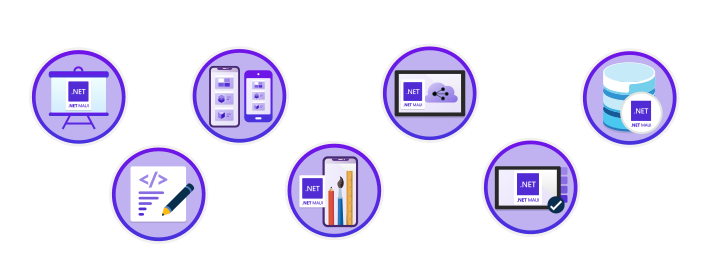

So far over 400 people have joined the .NET MAUI Cloud Skills Challenge to learn all about developing mobile and desktop apps with .NET MAUI and get some awesome stickers. And we have some good news - we're extending the challenge from August 31 to **September 30** so more people can join in!

## What's the challenge?

The .NET MAUI Cloud Skills Challenge is a fun and exciting way to learn .NET MAUI and grab the latest .NET MAUI sticker swag! All you need to do is go to the [registration page](https://aka.ms/maui/cloudchallenge) and sign up, finish all the [.NET MAUI training modules]( https://aka.ms/maui/cloudchallenge-reg) in the challenge (learning some amazing new skills along the way), and then we'll send some stickers to you!

You'll have until 11:59 PM Pacific on September 30, 2022 to finish the challenge, but don't wait, [get started today](https://aka.ms/maui/cloudchallenge)!

### What will you learn?

We have put together 7 training modules for you to complete. You'll learn about building your first .NET MAUI app, how to build the user interface, how to navigate between pages, use local data storage, even how to interact with web services!

### Already signed up?

Please head on over to the [registration page](https://aka.ms/maui/cloudchallenge) again. We need to get just a bit more info to make sure those stickers arrive to you in a timely manner. After that, complete all 7 modules and view your progress on the [challenge home page](https://aka.ms/maui/cloudchallenge-reg).

## Join the challenge

Sign-up for the challenge at [the registration page](https://aka.ms/maui/cloudchallenge), then complete all 7 modules and view your progress on the [challenge home page](https://aka.ms/maui/cloudchallenge-reg). Remember, you have until 11:59 PM Pacific time on September 30, 2022 to finish.

[cta-button align='center' text='Sign-up for the challenge today!' url='https://aka.ms/maui/cloudchallenge' color='#5C2D91']

And sneak peek - James Montemagno and Matt Soucoup will be putting on an epic 7-part Learn Live series where they'll cover every single one of the modules included in this challenge one-by-one. Starting on September 7 and going until November 16. Ask all the questions you want - it's going to be live! [Sign-up for the first episode today](https://docs.microsoft.com/events/learn-events/learnlive-mobile-desktop-apps-dotnet-maui).
