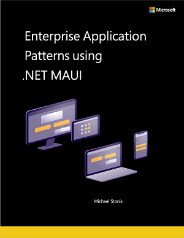
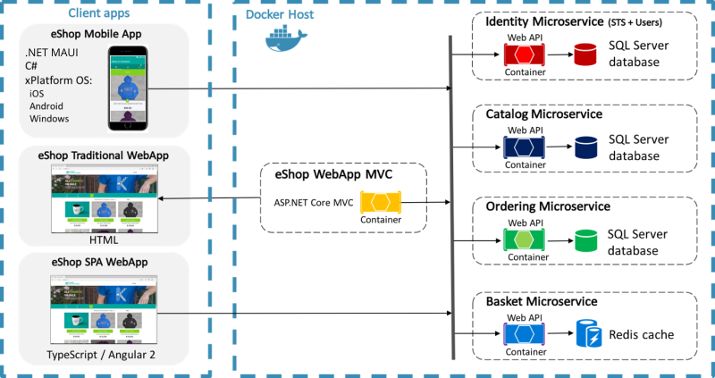

> This is a guest post by [Michael Stonis](https://twitter.com/MichaelStonis), a Microsoft MVP and mobile solution architect for [Eight-Bot](https://eightbot.com) where he helps customers build delightful products to help solve their business needs. He is also the author of the new .NET MAUI Application Patterns eBook.

The world of .NET and cross-platform user interface development has changed and expanded so much in the last decade. It's been a wild ride as we've gone from .NET Framework to .NET 6 and soon .NET 7 and from Xamarin.Forms to .NET MAUI. Now, we have an incredibly unified framework for building our multi-platform applications. The Enterprise Application Patterns Using .NET MAUI eBook (available as a [PDF](https://aka.ms/maui-ebook) or [viewable online](https://docs.microsoft.com/dotnet/architecture/maui/)) is there to help introduce all of the great things that we can do with .NET MAUI.  

## .NET MAUI Application Patterns

.NET MAUI is the latest multi-platform framework for building mobile and desktop applications with C# and XAML. Building an application across platforms brings a lot of design challenges and considerations. It can be a lot to take in, but fortunately for us, there are a lot of tried-and-true patterns that can be used when building an application that is adaptable, easy to maintain, and test. This is especially important for enterprise applications where requirements and needs often change over time. This book provides real-world examples and explanations to help you build a successful application.

This guide includes a sample application, [eShopOnContainers](https://github.com/dotnet-architecture/eshop-mobile-client). It includes a backend with a microservice architecture and three reference frontends:

* An MVC application developed with ASP.NET Core.
* A Single Page Application (SPA) developed with Angular 2 and Typescript. This approach for web applications avoids performing a round-trip to the server with each operation.
* A multi-platform app developed with .NET MAUI, which supports iOS, Android, macOS via Mac Catalyst, and Windows 10/11.

Topics in this book include:

* [The Model-View-ViewModel Pattern](https://docs.microsoft.com/dotnet/architecture/maui/mvvm)
* [Dependency Injection](https://docs.microsoft.com/dotnet/architecture/maui/dependency-injection)
* [Communicating Between Components](https://docs.microsoft.com/dotnet/architecture/maui/communicating-between-components)
* [Navigation](https://docs.microsoft.com/dotnet/architecture/maui/navigation)
* [Validation](https://docs.microsoft.com/dotnet/architecture/maui/validation)
* [Configuration Management](https://docs.microsoft.com/dotnet/architecture/maui/communicating-between-components)
* [Accessing Remote Data](https://docs.microsoft.com//dotnet/architecture/maui/accessing-remote-data)
* [Unit Testing](https://docs.microsoft.com/dotnet/architecture/maui/unit-testing)

The [.NET MAUI Architecture Guidance](https://dotnet.microsoft.com/learn/maui/architecture) provides additional resources and information on this topic.

## Migrating from Xamarin.Forms to .NET MAUI

For users that are transitioning an existing Xamarin.Forms application to .NET MAUI, there is a migration guide that provides the steps that were used for the eShop application. That guide is available at [Migrating eShop From Xamarin.Forms to MAUI](https://github.com/dotnet-architecture/eshop-mobile-client/wiki/Migrating-eShop-From-Xamarin.Forms-to-MAUI).

## Feedback

As .NET MAUI and the ecosystem around continue to evolve so will the book and sample application. If you have any comments or recommendations for the book, please [submit feedback](https://aka.ms/ebookfeedback).
