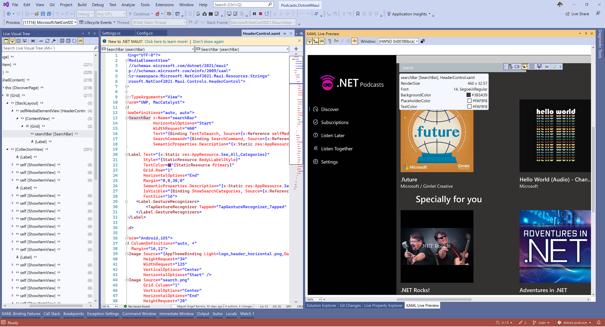
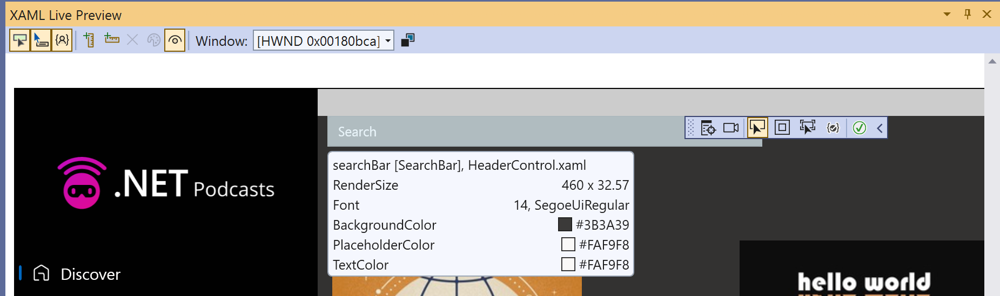
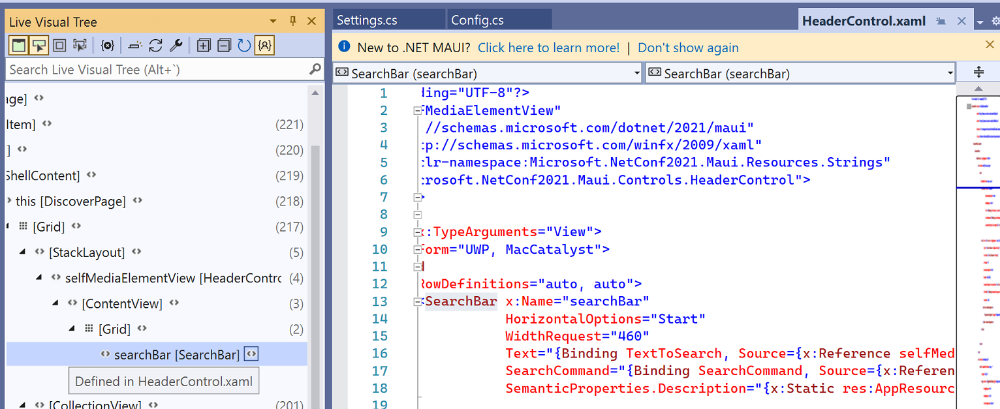
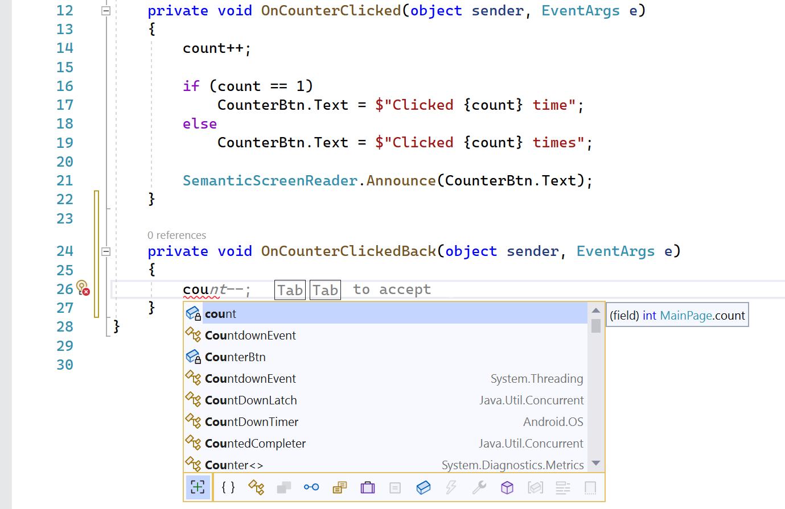
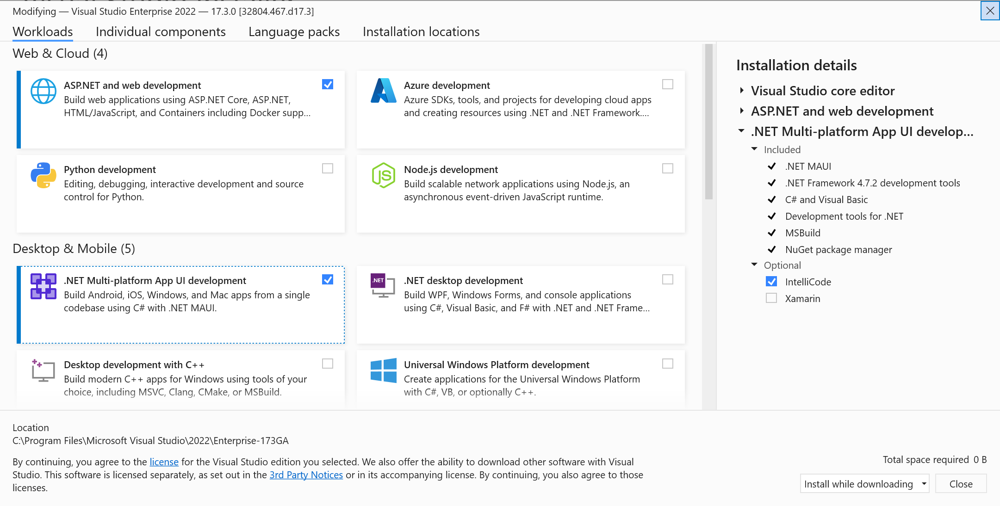

Today, we're excited to announce that .NET Multi-platform App UI has graduated from preview and is available in the release edition of [Visual Studio 2022 on Windows](https://visualstudio.microsoft.com/downloads/). Now, you have full access to productivity features that will help you build cross-platform native client apps with .NET faster than ever, and ship them to Android, iOS, macOS, and Windows from a single codebase.

> This release also delivers the latest stability improvements of the .NET MAUI SDK, our fifth release since it GA'd in May 2022. Find all the [release notes on GitHub](https://github.com/dotnet/maui/releases).

You can also tune in NOW to watch the [.NET Conf: Focus on MAUI](https://focus.dotnetconf.net) live stream happening today. Ask questions live and learn all about developing native mobile and desktop apps with .NET MAUI.

## One Project, Many Platforms

.NET MAUI provides a single project that handles all the multi-targeting across devices and their platforms.

Any platform-specific assets are placed in sub-folders so you can focus where you spend the majority of your effort - writing shared UI and code. The project contains a Resources folder so you have a single place to manage your app’s fonts, images, app icon, splash screen, raw assets, and styling. .NET MAUI does all the work to optimize them for each platform’s unique requirements.

## Visual and Live

We've built tools to help you develop your app without slowing you down or waiting for a rebuild. Hot Reload, Live Visual Tree, and [XAML Live Preview](https://docs.microsoft.com/visualstudio/xaml-tools/xaml-live-preview?view=vs-2022) speed up your development time by allowing you to apply code changes and see them immediately. With [XAML Hot Reload](https://docs.microsoft.com/dotnet/maui/xaml/hot-reload), you can make changes to your UI and see them in the running app with your real data right away. With [.NET Hot Reload](https://docs.microsoft.com/visualstudio/debugger/hot-reload?view=vs-2022), you can make changes to your code, save, and see those changes as well without losing your application state.

Using XAML Live Preview, you can capture the app's UI and bring it into a docked window within Visual Studio. This makes it easier to use XAML Hot Reload to change the app and then view those changes in real time as you make them. This is particularly useful if you don't have multiple monitors or are debugging onto a device that you can't screen mirror. Just F5 debug, start editing the XAML layout, and you will see the changes. You can also hover over each element in the XAML Live Preview window to see the specifications of the control. Click it, and it will navigate directly to the XAML for you.

You can use the Live Visual Tree to quickly navigate to your XAML as well. Click the angle brackets next to the name of the control in the tree and the editor will navigate to the code that element is defined.

## Powerful Editors

With AI-assisted code suggestions, your app basically writes itself! [IntelliCode](https://docs.microsoft.com/visualstudio/intellicode/intellicode-visual-studio) gives you a powerful set of automatic code completions that understand .NET MAUI app UI and code. Start typing and it will understand your code context, variable names, functions, and the type of code you're writing so it can provide better IntelliSense and even suggest whole line completions. This is incredibly helpful, particularly for those just getting started building apps.

You also get the full power of the Visual Studio 2022 64-bit IDE, the latest C# 10 features, and improved tools for live unit testing, source control, and team collaboration. Read all about what's available in the 17.3 release, as well as Visual Studio 2022 17.4 Preview 1 that released today, on the [Visual Studio team blog](https://devblogs.microsoft.com/visualstudio/).

## In Preview Now: Visual Studio for Mac Support

We've been working hard to get many of these amazing tools ready for our Mac developers, too. To use .NET MAUI on your Mac, install the new [Visual Studio 2022 for Mac (17.4 Preview 1)](https://visualstudio.microsoft.com/vs/mac/preview/). Visual Studio 2022 for Mac will GA .NET MAUI tooling support later this year.

## Get Started Today

To get started using .NET MAUI on Windows, [install or update Visual Studio 2022](https://visualstudio.microsoft.com/downloads/) to version 17.3. In the installer, choose the workload “.NET Multi-platform App UI development”.

> Note: We do not currently recommend installing .NET 7 Preview 7 at this time if you are building .NET MAUI apps with Visual Studio 2022.

Please report any issues with .NET MAUI in Visual Studio by clicking the "Send Feedback" icon in the upper right corner of Visual Studio.

Thank you for helping us make .NET MAUI in Visual Studio a fantastic release! We can't wait to see what you build!