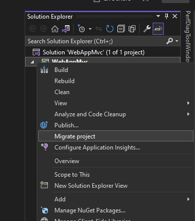
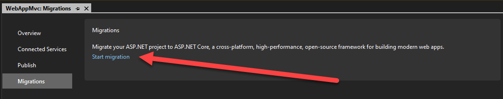
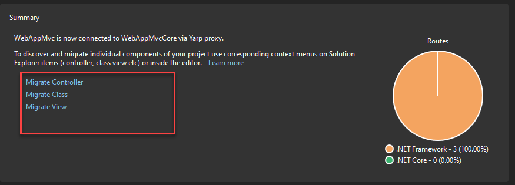
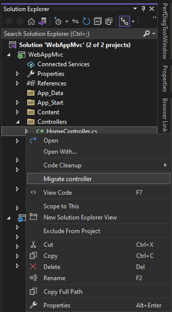
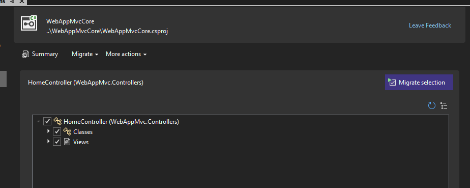
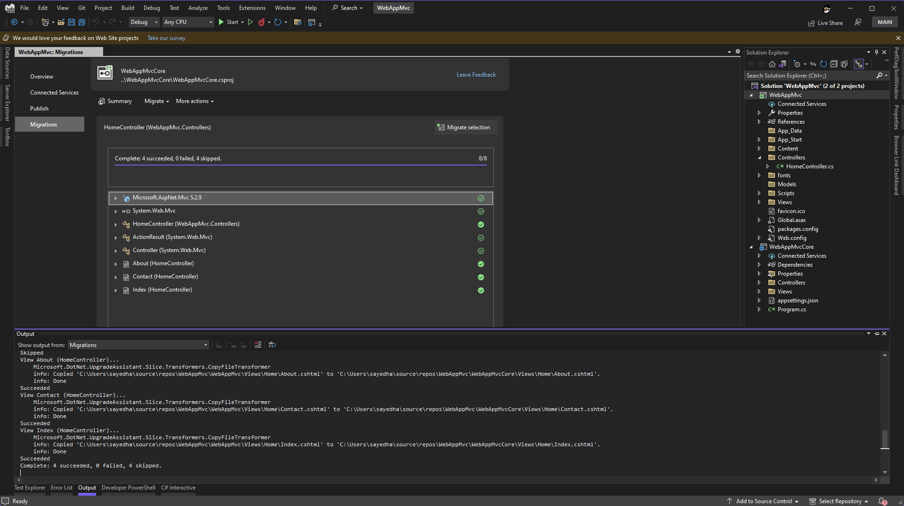
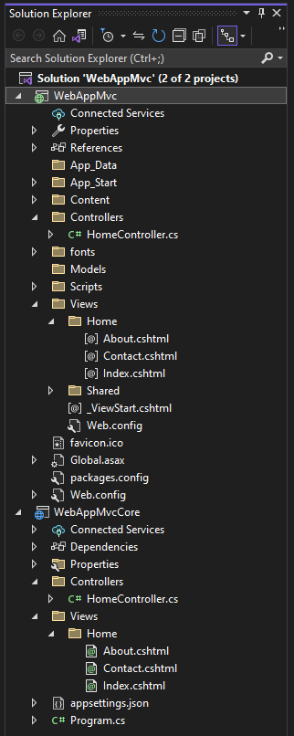
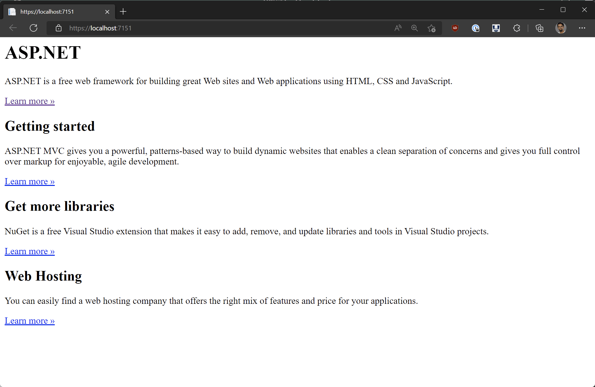

ASP.NET Core is a unified and modern web framework for .NET. Migrating existing ASP.NET apps to ASP.NET Core has many advantages, including better performance, cross-platform support, and access to all the latest improvements to the modern .NET web platform. But migrating from ASP.NET to ASP.NET Core can be very challenging and time consuming due to the many differences between the two frameworks. That's why we've been working to provide libraries and tooling for performing incremental migrations from ASP.NET to ASP.NET Core so that you can slowly migrate existing ASP.NET apps a piece at a time while still enabling ongoing app development. We've been working on tooling in Visual Studio to simplify the migration experience, and a new update to the incremental ASP.NET migration tooling is now available.

In previous blog posts, we introduced our [initial preview tooling and guidance for incremantal migration using YARP and System.Web adapters](https://devblogs.microsoft.com/dotnet/incremental-asp-net-to-asp-net-core-migration/), as well as our [second preview which added support for sharing authentication](https://devblogs.microsoft.com/dotnet/incremental-asp-net-migration-tooling-preview-2/). In this post we'll introduce the incremental ASP.NET migration tooling extension for Visual Studio and discuss its new capabilities and limitations. This is a very early experimental release, so you may run into some issues. The extension assists with the migration process, but manual migration steps are still required including resolve remaining compilation and runtime errors. With time we expect number of errors to be reduced. When using this tool, it's recommended that you use source control for your code in the case that you need to roll back. When appropriate, use branches to isolate this work from your other changes. We hope you'll give it a try and share your experience with us!

To try out the latest incremental ASP.NET migration, follow the [Getting Started guide](https://aka.ms/aspnet/incremental-migration).

## Overview

When working with real-world ASP.NET apps, the migration process to ASP.NET Core could take a significant amount of time. Depending on the app, it may take a few days, weeks or even several months. To facilitate a long process like this, it would be good if you can incrementally migrate pieces of your ASP.NET app over time. To do this, we can configure a new ASP.NET Core app which can supplement your existing ASP.NET app. In Visual Studio after installing the extension you'll start migrating your ASP.NET project by selecting _Migrate Project_. When you invoke Migrate Project, the following occurs

- A new ASP.NET Core project is created and added to the solution.
- The ASP.NET Core project is configured with [YARP](https://microsoft.github.io/reverse-proxy/) to proxy request back to the original ASP.NET project.
- Both projects will be configured as startup projects.

After going through Migrate Project, it would be a good time to create a new commit and check in the changes.

You can now start to migrate individual items from the ASP.NET project to the ASP.NET Core project. The tooling provides new gestures to help with this. Currently the extension supports the migration of the following items.

- Controllers
- Views
- Classes

To migrate items, you can right click on them in Solution Explorer, and select the Migrate command. When this is invoked, the extension will analyze the selected item to determine what items it depends on, and will attempt to migrate those as well. Along the way it may detect items which it cannot migrate, and these items will need to be migrated manually.

This tooling is meant to complement our existing [.NET Upgrade Assistant](https://dotnet.microsoft.com/platform/upgrade-assistant) tool. While .NET Upgrade Assistant is useful for upgrading Windows desktop and class library projects in place, this new incremental ASP.NET migration tooling offers a better experience for ASP.NET projects.

Now that we've gone through a high-level overview of the extension, let's try it out with a sample project.

## Migration experience

Let's get started with a very basic migration experience. Here I'm starting with a new ASP.NET MVC (.NET Framework) project which we want to incrementally migrate to ASP.NET Core. The first thing that you'll do is to migrate the project. In Solution Explorer, right click on the project and select Migrate Project.

After invoking this you'll be brought to the migrations page to start the migration. Click _Start Migration_ to migrate the project. See the image below.

When you start the migration, it will walk you through creating a new, or selecting an existing, ASP.NET Core project. Take a look at the animation below to see this experience.

[video src="https://devblogs.microsoft.com/dotnet/wp-content/uploads/sites/10/2022/08/03-start-migration-min.mp4"]

As shown in the above animation, a new project is added to the solution. The startup projects should also be configured to start both of these projects when you run, or debug, your application. The request flow is shown in the image below.

The ASP.NET Core app will handle the request if the corresponding route is implemented in the ASP.NET Core project. Otherwise, the request will be proxied to the original ASP.NET app to handle. Now that this has been configured, you can incrementally migrate the items from the ASP.NET project. For example, you can migrate a single controller (and it's dependencies) one at a time.

## Migrating individual items

There are three types of items that are currently supported for migration: Controllers, Classes and Views. You can use the links on the migration page to get started, or right click on the items in the Solution Explorer or in the editor to start the item migration. See the images below.

I'll go ahead and start the migration process for the HomeController. After you invoke _Migrate Controller_, you will be brought to the migration page with the dependencies for HomeController listed. See the image below.

On this screen you can uncheck dependencies if you'd like to skip migrating those. Later if needed you can re-run the migration for HomeController to migrate additional dependencies or previously skipped dependencies. When re-running a migration, it will skip any assets which have already been migrated, or the ones we did not find actionable modifications to be applied. From here, you can click on _Migrate selection_ to start the migration for the HomeController. After clicking that, the result should look similar to the image below.

From the progress bar we can see that the migration has successfully completed and that 8 items were migrated. In the list under the progress bar, there are two different icons that represent the status of migrating that dependency.

-  The item was successfully migrated.
-  Item was skipped for migration.
-  A warning has been reported.
-  An error has occurred.

The icons should give you a high-level indication of the status for that particular item. There is more information in the Output window for each step that was executed. When going through this process, you should always take a look at the Output window to better understand what happened. Items may be skipped for a few reasons, including: the item was migrated previously, the item is not supported for migration, there is no known action to migrate the selected item, and other reasons. See the Output window for more details. Let's take a look at the solution explorer after this operation.

You can see that both projects now have a HomeController file and views that the HomeController supports. The migration tool doesn't remove migrated content, that is left to you to remove when you are confident that the process has succeeded and you are pleased with the results. When a request comes into the application, it will be first routed to the WebAppMvcCore project. Since it contains a controller for that route (HomeController), the Core project will respond to the request. You could remove the HomeController in the WebAppMvc project at this time as well as the corresponding views. It's important to note that the current version of the migration extension doesn't attempt to migrate web content files like CSS, JavaScript, etc. At this time, you'll need to manually migrate those files to the new ASP.NET Core project. There are other known issues listed at the bottom of this post. If you were to run the app, you will see the following result.

Here we're not seeing any styling applied to the view. This is because the layout file was not migrated, and the underlying content files were not migrated as well. You can migrate the \_Layout.cshtml file, which will give you a good starting point, but you'll get some build errors because the default \_Layout.cshtml file for the ASP.NET app uses helpers like @Styles and @Scripts which are not supported in ASP.NET Core. In future releases we may be able to migrate these types of items as well, but for now you'll need to manually fix them up.

From here, you can continue to migrate other items in the ASP.NET app. Make sure to leverage source control so that you can create checkpoints along the way in case you need to rollback any migrated content.

## Known issues

We're still in the early stages of supporting incremental ASP.NET migration and there are various known issues and limitations with the current preview experience.

Here's a high-level list of some of the migration items which are not currently supported:

- Web content files (i.e. CSS/JS/etc) are not migrated
- Classes which use Entity Framework
- .NET Identity related files
- .NET Framework class library projects
- ASP.NET Web Forms Views.
- Razor views migration is very limited currently; no support for partial views or layout files currently.
- ASP.NET MVC areas

This isn't an exhaustive list; there are lots of item which are not currently supported.

One of the things that the extension doesn't currently support are referenced .NET Framework class libraries. At this time, it's recommended to use the [Upgrade Assistant](https://dotnet.microsoft.com/platform/upgrade-assistant) to migrate those projects. In a future release of this extension, we may add support to incrementally migrate class library projects as well.

## Give feedback

We want to hear from you how we can best improve the incremental ASP.NET migration experience. The best place to share your feedback with us is on GitHub in the [dotnet/systemweb-adapters repo](https://github.com/dotnet/systemweb-adapters). Use the 👍 reaction to indicate features or improvements that are most important to you.

This is a brief overview of this new extension. We'll be providing more info as we make more progress and you can check out the additional related resources listed below. Please try it out on your existing ASP.NET projects and share feedback so that we can continue to improve the incremental ASP.NET migration experience.

Thanks, and happy coding!

## Resources

- [Microsoft Project Migrations (Experimental) - Visual Studio Marketplace](https://marketplace.visualstudio.com/items?itemName=WebToolsTeam.aspnetprojectmigrations)
- [dotnet/systemweb-adapters (github.com)](https://github.com/dotnet/systemweb-adapters)
- [Incremental ASP.NET to ASP.NET Core Migration - .NET Blog (microsoft.com)](https://devblogs.microsoft.com/dotnet/incremental-asp-net-to-asp-net-core-migration/)
- [Incremental ASP.NET Migration Tooling Preview 2 - .NET Blog (microsoft.com)](https://devblogs.microsoft.com/dotnet/incremental-asp-net-migration-tooling-preview-2/)
- [YARP Documentation (microsoft.github.io)](https://microsoft.github.io/reverse-proxy/)
