The .NET team has continued improving performance in .NET 7, both generally and for Arm64.  You can check out the general improvements in the excellent and detailed [Performance Improvements in .NET 7](https://devblogs.microsoft.com/dotnet/performance_improvements_in_net_7/) blog by Stephen Toub. Following along the lines of [ARM64 Performance in .NET 5](https://devblogs.microsoft.com/dotnet/arm64-performance-in-net-5/), in this post I will describe the performance improvements we made for Arm64 in .NET 7 and the positive impact it had on various benchmarks. Stephen did touch upon some of the work in his blog post, but here, I will go through some more details and wherever possible include the improvements we have seen after optimizing a specific area.

When we started .NET 7, we wanted to focus on benchmarks that would impact wide range of customers. Along with the Microsoft hardware team, we did lot of research and thinking on what benchmarks should we pick that can improve the performance of both client and cloud scenarios. In this blog, I will  start by describing the performance characteristics that thought are important to have, the methodology we used, the criteria we evaluated to select the benchmarks used during .NET 7 work. After that, I will go through the incredible work that has gone into improving .NET's performance on Arm64 devices.

## Performance analysis methodology

The [instruction set architecture](https://en.wikipedia.org/wiki/Instruction_set_architecture) or the ISA of x64 and Arm64 is different for each one of them and this difference surfaces in the form of performance numbers. While this difference exists between the two platforms, we wanted to understand how performant is .NET when running on Arm64 platforms compared to x64, and what can be done to improve its efficiency. Not only will we aim to achieve performance parity between x64 and Arm64, but it would also help provide guidance to our customers who would like to move their .NET applications from x64 to Arm64.

We think that following should be the characteristics of an ideal benchmarks:
- It should represent a real-world code that any .NET developer will write for their software.
- It should be easy to execute and gather measurements with minimal prerequisite steps.
- Lastly, it should be executable for all the platforms on which we are interested in conducting performance measurements.

Here are some of the benchmarks that we shortlisted for our investigations.

### BenchmarkGames

[The Computer Language Benchmarks Game](https://benchmarksgame-team.pages.debian.net/benchmarksgame/index.html) are one of the popular benchmarks because they are implemented in several languages making it easy to measure and compare performance of various languages. To name few, [fannkuch-9](https://benchmarksgame-team.pages.debian.net/benchmarksgame/program/fannkuchredux-csharpcore-9.html), [knucleotide](https://benchmarksgame-team.pages.debian.net/benchmarksgame/program/knucleotide-csharpcore-6.html) and [mandelbrot-5](https://benchmarksgame-team.pages.debian.net/benchmarksgame/program/mandelbrot-csharpcore-5.html) were some of the benchmarks that we selected. The good part of these benchmarks is there is no extra setup needed on the developer machine and can simply be built and executed using available tooling. On the contrary, they represent a narrow slice of computation that are hand tuned and may not be a good representation of user code. We investigated performance 

### TechEmpower

[TechEmpower benchmarks](https://www.techempower.com/) (from here on, I will refer them as "TE benchmarks") are industry recognized server workload benchmarks that compare various frameworks cross languages. They are representations of real-world client/server workloads. Unlike BenchmarkGames, these benchmarks rely on the network stack and may not be CPU dominated. Another benefit of the TE Benchmarks is that we could compare relative performance of x64 and Arm64 across a number of different runtimes and languages, giving us useful a set of yardsticks to evaluate .NET's performance.

### Bing.com

While all the above benchmarks will give us some low hanging fruits in codegen space, it would be interesting to understand the characteristics of a real-world cloud application on Arm64. After [Bing switched to .NET core](https://devblogs.microsoft.com/dotnet/bing-com-runs-on-net-core-2-1/), .NET team worked closely with them to identify performance bottlenecks. By analyzing Bing's performance on Arm64, we got a sense of what a big cloud customer could expect if they switched their servers to Arm64 machines.

### ImageSharp

ImageSharp is a popular .NET tool that uses intrinsics extensively in their code. Their [benchmarks](https://github.com/SixLabors/ImageSharp/tree/master/tests/ImageSharp.Benchmarks) are based on [BenchmarkDotnet](https://github.com/dotnet/BenchmarkDotNet) framework and we had a PR to [enable the execution of these benchmarks on Arm64](https://github.com/SixLabors/ImageSharp/pull/1794). We also have an outstanding PR to be include [ImageSharp benchmarks in `dotnet/performance`](https://github.com/dotnet/performance/pull/2149).

### Paint.NET

The [Paint.NET](https://www.getpaint.net/) is image and photo editing software written in .NET. Not only is this a real-world application, analyzing the performance of such applications would give us insights on how the UI applications perform on different hardware and if there are other areas that we should explore to optimize the performance of .NET runtime.

### Micro benchmarks

[4600+ Micro benchmarks](https://github.com/dotnet/performance/tree/main/src/benchmarks/micro) are run every night by the "Dotnet Performance team" and results of various platforms can be seen at [this index page](https://pvscmdupload.blob.core.windows.net/reports/allTestHistory/TestHistoryIndexIndex.html).

We started our journey of .NET 7 by gathering the known Arm64 performance work items in [dotnet/runtime#64820](https://github.com/dotnet/runtime/issues/64820). We started measuring various benchmarks (client as well as server workload) performance difference between x64 and Arm64 and noticed (through multiple benchmarks) that Arm64 performance was severely slow on server workload and hence we started our investigation on TE benchmark.

As I discuss various optimizations that we made to .NET 7, I will interchangeably refer to one or more of the benchmarks that improved. In the end, we wanted to make sure that we impacted as many benchmarks and as much real-world code as possible.

-------------------------------------------------------

## Runtime improvements

.NET is built upon three main components. .NET "libraries" contains managed code (mostly C#) for common functionality that is consumed within the .NET ecosystem as well as by .NET developers. The "RyuJIT code generator" takes .NET Intermediate Language representation and convert it to machine code on the fly, the process commonly know as Just-in-time or JIT. Lastly, "runtime" facilitates the execution of program by having the information of type system, scheduling code generation, garbage collection, native support to certain .NET libraries, etc. The runtime is a critical part of any managed language platform and we wanted to closely monitor if there was any area in the runtime that was not optimal for Arm64. We found few fundamental issues that I will highlight below.

### L3 cache size

After starting our investigation, we found out that the TE benchmarks [were 4-8X slower on Arm64](https://github.com/dotnet/runtime/issues/60166) compared to x64. One key problem was that [Gen0 GC was happening 4X times](https://github.com/dotnet/runtime/issues/60166#issuecomment-938724532) more frequently on Arm64. We soon realized that we were [not correctly reading the L3 cache size from the Arm64 machine](https://github.com/dotnet/runtime/issues/60166#issuecomment-940421739) that was used to measure the performance. We eventually found out that L3 cache size is not accessible from the OS on some of the machines, including [Ampere Altra](https://d1o0i0v5q5lp8h.cloudfront.net/ampere/live/assets/documents/Altra_Rev_A1_PB_v1.35_20220728.pdf) (that was later fixed by the firmware update). In [dotnet/runtime#71029](https://github.com/dotnet/runtime/pull/71029), we changed our heuristics so that if a machine cannot read L3 cache size, the runtime uses an approximate size based on the number of cores present on the machine.

|Core count | L3 cache size |
|-----------|---------------|
|  1 ~ 4    |  4 MB         |
|  5 ~ 16   |  8 MB         |
|  17 ~ 64  |  16 MB        |
|  65+      |  32 MB        |

With this change, we saw around [670+ microbenchmark improvements](https://github.com/dotnet/perf-autofiling-issues/issues/6510) on Linux/arm64 and [170+ improvements](https://github.com/dotnet/perf-autofiling-issues/issues/6501) on Windows/arm64. In [dotnet/runtime#64576](https://github.com/dotnet/runtime/pull/64576), we started using modern hardware information for macOS 12+ to read the L3 cache size accurately.

### Thread pool scaling

We saw a significant degradation in performance on higher core (32+) machines. For instance, on Ampere machines, the performance dropped by almost 80%. In other words, we were seeing higher Requests/seconds (RPS) numbers on 28 cores than on 80 cores. The underlying problem was the way threads were using and polling the shared "global queue". When a worker thread needed more work, it would query the global queue to see if there is more work to be done. On higher core machines, with more threads involved, there was lot of contention happening while accessing the global queue. Multiple threads were trying to acquire lock on the global queue before accessing its contents. This led to stalling and hence degradation in performance as noted in [dotnet/runtime#67845](https://github.com/dotnet/runtime/issues/67845). The thread pool scaling problem is not just limited to the Arm64 machines but is true for any machines that has higher core count. This problem was fixed in [dotnet/runtime#69386](https://github.com/dotnet/runtime/pull/69386) and [dotnet/aspnetcore#42237](https://github.com/dotnet/aspnetcore/pull/42237) as seen in graph below. Although this shows significant improvements, we can notice that the performance doesn't scale linearly with more machine cores. We have ideas to improve this in future release.

<p align="center">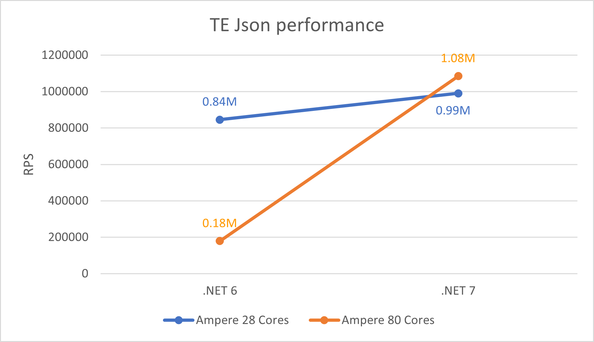</p>


### LSE atomics

In a concurrent code, there is often a need to access a memory region exclusively by a single thread. Developers use atomic APIs to gain exclusive access to critical region. On x86-x64 machines, read-modify-write (RMW) operation on a memory location can be performed by a single instruction by adding a `lock` prefix as seen in the example below. The method `Do_Transaction` calls one of the `Interlocked*` C++ API and as seen from the generated code by Microsoft Visual C++ (MSVC) compiler, the operation is performed using a single instruction on x86-x64.

```c++
long Do_Transaction(
    long volatile *Destination,
    long Exchange,
    long Comperand)
{
    long result =
        _InterlockedCompareExchange(
            Destination, /* The pointer to a variable whose value is to be compared with. */
            Comperand, /* The value to be compared */
            Exchange /* The value to be stored */);
    return result;
}
```

```assembly
long Do_Transaction(long volatile *,long,long) PROC                 ; Do_Transaction, COMDAT
        mov     eax, edx
        lock cmpxchg DWORD PTR [rcx], r8d
        ret     0
long Do_Transaction(long volatile *,long,long) ENDP                 ; Do_Transaction
```

However, until recently, on Arm machines, RMW operations were not permitted, and all operations were done through registers. Hence for concurrency scenarios, they had pair of instructions. "Load Acquire" (`ldaxr`) would gain exclusive access to the memory region such that no other core can access it and "Store Release" (`stlxr`) will release the access for other cores to access. In between these pair, the critical operations were performed as seen in the generated code below. If `stlxr` operation failed because some other CPU operated on the memory after we loaded the contents using `ldaxr`, there would be a code to retry (`cbnz` will jump back to retry) the operation.

```assembly
|long Do_Transaction(long volatile *,long,long)| PROC           ; Do_Transaction
        mov         x8,x0
|$LN4@Do_Transac|
        ldaxr       w0,[x8]
        cmp         w0,w1
        bne         |$LN5@Do_Transac|
        stlxr       wip1,w2,[x8]
        cbnz        wip1,|$LN4@Do_Transac|
|$LN5@Do_Transac|
        dmb         ish
        ret

        ENDP  ; |long Do_Transaction(long volatile *,long,long)|, Do_Transaction
```

Arm introduced LSE atomics instructions in v8.1. With these instructions, such operations can be done in less code and faster than the traditional version. The full memory barrier `dmb ish` at the end of such operation can also eliminated with the use of atomic instructions.

```assembly
|long Do_Transaction(long volatile *,long,long)| PROC           ; Do_Transaction
        casal       w1,w2,[x0]
        mov         w0,w1
        ret

        ENDP  ; |long Do_Transaction(long volatile *,long,long)|, Do_Transaction
```

You can ready more about what ARM atomics are and why they matter in [this](https://cpufun.substack.com/p/atomics-in-aarch64) and [this](https://mysqlonarm.github.io/ARM-LSE-and-MySQL/) blogs.

RyuJIT has had support for LSE atomics [since early days](https://github.com/dotnet/coreclr/pull/18130). For [threading interlocked APIs](https://docs.microsoft.com/dotnet/api/system.threading.interlocked?view=net-6.0), the JIT will generate the faster atomic instructions if it detects that the machine running the application supports LSE capability. However, this was only enabled for Linux. In [dotnet/runtime#70600](https://github.com/dotnet/runtime/pull/70600), we extended the support for Windows and saw a performance [win of around 45%](https://pvscmdupload.blob.core.windows.net/reports/allTestHistory/refs/heads/main_arm64_Windows%2010.0.25094/System.Threading.Tests.Perf_SpinLock.TryEnterExit.html) in scenarios involving locks.

<p align="center"></p>

In .NET 7, we not only wanted to use atomic instructions for just the managed code, but also take advantage of them in native runtime code. We use `Interlocked` APIs heavily for various scenarios like thread pool, helpers for .NET `lock` statement, garbage collection, etc. You can imagine how slow all these scenarios would become without the atomic instructions and that surfaced to some extent as part of performance gap compared to x64. To support wide range of hardware that runs .NET, we can only generate the lowest common denominator instructions that can execute on all the machines. This is called "architecture baseline" and for Arm64, it is `ARM v8.0`. In other words, for ahead of time compilation scenario (as opposed to just-in-time compilation), we must be conservative and generate only the instructions that are `ARM v8.0` compliant. This holds true for the .NET runtime native code as well. When we compile .NET runtime using MSVC/clang/gcc, we explicitly inform the compiler to restrict generating modern instructions that were introduced beyond Arm v8.0. This ensures that .NET can run on older hardware, but at the same time we were not taking advantage of modern instructions like atomics on newer machines. Changing the baseline to `ARM v8.1` was not an option, because that would stop .NET working on machines that do not support atomic instructions. Newer version of clang added a flag [`-moutline-atomics`](https://reviews.llvm.org/rG4d7df43ffdb460dddb2877a886f75f45c3fee188) which would generate both versions of code, the slower version that has `ldaxr/stlxr` and the faster version that has `casal` and add a check at runtime to execute the appropriate version of code depending on the machine capability. Unfortunately, .NET still uses `clang9` for its compilation and `-moutline-atomics` is not present in it. Similarly, MSVC also lacks this flag and the only way [to generate atomics was using the compiler switch `/arch:armv8.1`](https://devblogs.microsoft.com/cppblog/msvc-backend-updates-in-visual-studio-2022-version-17-2/).

Instead of relying on C++ compilers, in [dotnet/runtime#70921](https://github.com/dotnet/runtime/pull/70921) and [dotnet/runtime#71512](https://github.com/dotnet/runtime/pull/71512), we added two separate versions of code and a check in .NET runtime, that would execute the optimal version of code on given machine. As seen in [dotnet/perf#6347](https://github.com/dotnet/perf-autofiling-issues/issues/6347) and [dotnet/perf#6770](https://github.com/dotnet/perf-autofiling-issues/issues/6770), we saw `10% ~ 20%` win in various benchmarks.

<p align="center">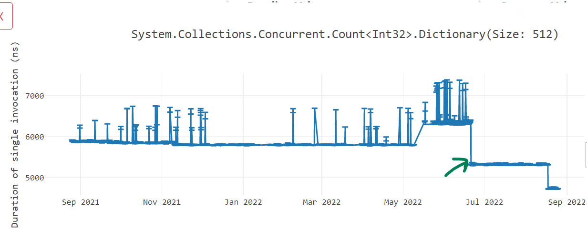</p>

### Environment.ProcessorCount

From the [documentation](https://docs.microsoft.com/dotnet/api/system.environment.processorcount?view=net-6.0), `Environment.ProcessorCount` returns the number of logical processors on the machine or if the process is running with CPU affinity, the number of processors that the process is affinitized to. [Starting Windows 11 and Windows Server 2022](https://docs.microsoft.com/windows/win32/procthread/processor-groups#behavior-starting-with-windows-11-and-windows-server-2022), the processes are no longer constrained to a single processor group by default. On the 80-cores Ampere machine that we tested, it had two processor groups, one had 16 cores and the other had 64 cores. On such machines, the `Environment.ProcessorCount` value would sometimes return `16` and other times it would return `64`. Since [a lot of user code](https://grep.app/search?q=Environment.ProcessorCount&filter[lang][0]=C%23) depends heavily on `Environment.ProcessorCount`, they would observe a drastic performance difference in their application on these machines depending on what value was obtained at process startup time. We fixed this issue in [dotnet/runtime#68639](https://github.com/dotnet/runtime/pull/68639) to take into account the number of cores present in all process groups.


## Libraries improvements

Continuing [our tradition](https://github.com/dotnet/runtime/issues/33308) of optimizing libraries code for Arm64 using intrinsics, we have made several improvements to some of the hot methods. In .NET 7, we did lot of work in [dotnet/runtime#53450](https://github.com/dotnet/runtime/pull/53450), [dotnet/runtime#60094](https://github.com/dotnet/runtime/pull/60094) and [dotnet/runtime#61649](https://github.com/dotnet/runtime/pull/61649) to add cross platform hardware intrinsics helpers for `Vector64`, `Vector128` and `Vector256` as described in [dotnet/runtime#49397](https://github.com/dotnet/runtime/issues/49397). This work helped us to unify the logic of multiple libraries code paths by removing hardware specific intrinsics and instead use hardware agnostic intrinsics. With the new APIs, a developer does not need to know various hardware intrinsic APIs offered for each underlying hardware architecture, but can rather focus on the functionality they want to achieve using simpler hardware agnostic APIs. Not only did it simplify our code, but we also got good performance improvements on Arm64 just by taking advantage of hardware agnostic intrinsic APIs. In [dotnet/runtime#64864](https://github.com/dotnet/runtime/pull/64864), we also added `LoadPairVector64` and `LoadPairVector128` APIs to the libraries that loads pair of `Vector64` or `Vector128` values and returns them as a tuple.

### Text processing improvements

[@a74nh](https://github.com/a74nh) rewrote `System.Buffers.Text.Base64` APIs `EncodeToUtf8` and `DecodeFromUtf8` from SSE3 based implementation to `Vector*` based API in [dotnet/runtime#70654](https://github.com/dotnet/runtime/pull/70654) and got [up to 60% improvement](https://github.com/dotnet/runtime/pull/70654#issuecomment-1164484184) in some of our benchmarks. A similar change made by rewriting `HexConverter::EncodeToUtf16` in [dotnet/runtime#67192](https://github.com/dotnet/runtime/pull/67192) gave us up to [50% wins on some benchmarks](https://github.com/dotnet/runtime/pull/67192#issuecomment-1106756616).

<p align="center">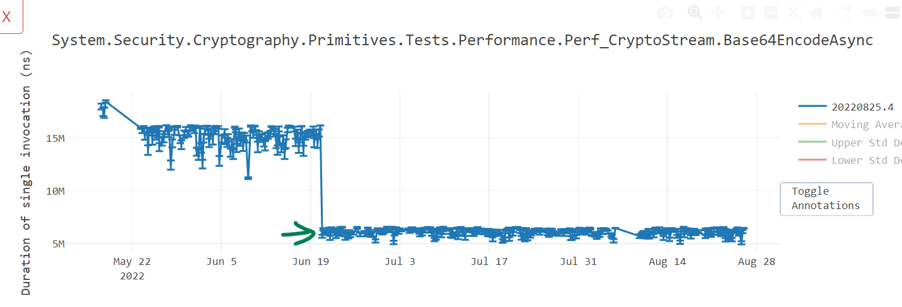</p>

[@SwapnilGaikwad](https://github.com/SwapnilGaikwad) likewise converted `NarrowUtf16ToAscii()` in [dotnet/runtime#70080](https://github.com/dotnet/runtime/pull/70080) and `GetIndexOfFirstNonAsciiChar()` in [dotnet/runtime#71637](https://github.com/dotnet/runtime/pull/71637) to get performance win of [up to 35%](https://github.com/dotnet/runtime/pull/71637#issuecomment-1184662254).

<p align="center">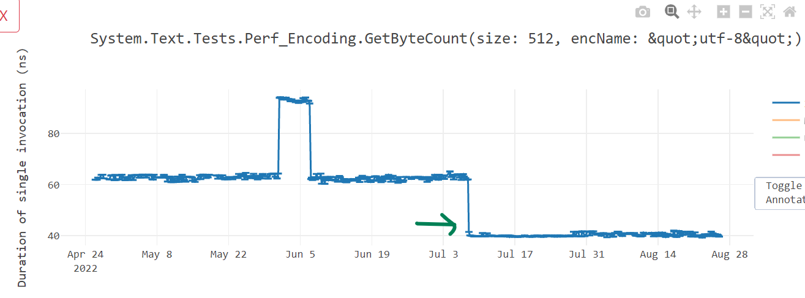</p>

Further, [dotnet/runtime#71795](https://github.com/dotnet/runtime/pull/71795) and [dotnet/runtime#73320](https://github.com/dotnet/runtime/pull/73320) vectorized the `ToBase64String()`, `ToBase64CharArray()` and `TryToBase64Chars()` methods and improved the performance (see [win1](https://github.com/dotnet/perf-autofiling-issues/issues/7250), [win2](https://github.com/dotnet/perf-autofiling-issues/issues/7244), [win3](https://github.com/dotnet/perf-autofiling-issues/issues/6960), [win4](https://github.com/dotnet/perf-autofiling-issues/issues/6983) and [win5](https://github.com/dotnet/perf-autofiling-issues/issues/6977)) of overall `Convert.ToBase64String()` not just for x64, but for Arm64 as well. [dotnet/runtime#67811](https://github.com/dotnet/runtime/pull/67811) improved `IndexOf` for scenarios when there is no match, while [dotnet/runtime#67192](https://github.com/dotnet/runtime/pull/67192) accelerated `HexConverter::EncodeToUtf16` to use the newly written cross platform `Vector128` intrinsic APIs with [nice wins](https://github.com/dotnet/runtime/pull/67192#issuecomment-1106756616).

### Reverse improvements

[@SwapnilGaikwad](https://github.com/SwapnilGaikwad) also rewrote `Reverse()` in [dotnet/runtime#72780](https://github.com/dotnet/runtime/pull/72780) to optimize for Arm64 and got us [up to 70% win](https://github.com/dotnet/perf-autofiling-issues/issues/7405).

<p align="center">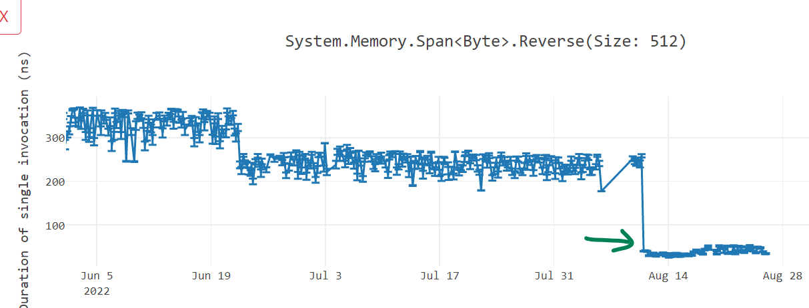</p>


## Code generation improvements

In this section, I will go through various work we did to improve the code quality for Arm64 devices. Not only did it improve the performance of .NET, but it also reduced the amount of code we produced.

### Addressing mode improvements

Addressing mode is the mechanism by which an instruction computes the memory address it wants to access. On modern machines, memory addresses are 64-bits long. On x86-x64 hardware, where instructions are of varying width, most addresses can be directly embedded in the instruction itself. On the contrary, Arm64 being a fixed-size encoding, has a fixed instruction size of 32-bits, most often the 64-bit addresses cannot be specified as "an immediate value" inside the instruction. Arm64 provides various ways to manifest the memory address. More on this can be read in [this excellent article](https://devblogs.microsoft.com/oldnewthing/20220728-00/?p=106912) about Arm64 addressing mode. The code generated by RyuJIT was not taking full advantage of many addressing modes, resulting in inferior code quality and slower execution. In .NET 7, we worked on improving the code and benefit from these addressing modes. 

Prior to .NET 7, when accessing an array element, we calculated the address of an array element in two steps. In the first step, depending on the index, we would calculate the offset of a corresponding element from the array's base address and in second step, add that offset to the base address to get the address of the array element we are interested. In the below example, to access `data[j]`, we first load the value of `j` in `x0` and since it is of type `int`, multiply it by `4` using `lsl x0, x0, #2`. We access the element by adding the calculated offset value with the base address `x1` using `ldr w0, [x1, x0]`. With those two instructions, we have calculated the address by doing the operation `*(Base + (Index << 2))`. Similar steps are taken to calculate `data[i]`.


```c#
void GetSet(int* data, int i, int j) 
    => data[i] = data[j];
```

```assembly
; Method Prog:GetSet(long,int,int):this
G_M13801_IG01:
            stp     fp, lr, [sp,#-16]!
            mov     fp, sp
G_M13801_IG02:
            sxtw    x0, w3
            lsl     x0, x0, #2
            ldr     w0, [x1, x0]
            sxtw    x2, w2
            lsl     x2, x2, #2
            str     w0, [x1, x2]
G_M13801_IG03:
            ldp     fp, lr, [sp],#16
            ret     lr
; Total bytes of code: 40
```

Arm64 has "register indirect with index" addressing mode, often also referred by many as "scaled addressing mode". This can be used in the scenario we just saw, where an offset is present in an unsigned register and needs to be left shifted by a constant value (in our case, the size of the array element type). In [dotnet/runtime#60808](https://github.com/dotnet/runtime/pull/60808), we started using "scaled addressing mode" for such scenarios resulting in the code shown below. Here, we were able to load the value of array element `data[j]` in a single instruction `ldr w0, [x1, x0, LSL #2]`. Not only did the code quality improve, but the code size of the method also reduced from 40 bytes to 32 bytes.

```assembly
; Method Prog:GetSet(long,int,int):this
G_M13801_IG01:
            stp     fp, lr, [sp,#-16]!
            mov     fp, sp
G_M13801_IG02:
            sxtw    x0, w3
            ldr     w0, [x1, x0, LSL #2]
            sxtw    x2, w2
            str     w0, [x1, x2, LSL #2]
G_M13801_IG03:
            ldp     fp, lr, [sp],#16
            ret     lr
; Total bytes of code: 32
```

<p align="center">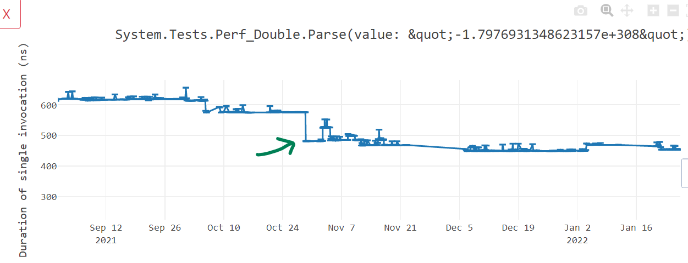</p>

In [dotnet/runtime#66902](https://github.com/dotnet/runtime/pull/66902), we did similar changes to improve the performance of code that operates on `byte` arrays.
```c#
byte Test(byte* a, int i) => a[i];
```

```diff
; Method Program:Test(long,int):ubyte:this
G_M39407_IG01:
        A9BF7BFD          stp     fp, lr, [sp,#-16]!
        910003FD          mov     fp, sp
G_M39407_IG02:
-       8B22C020          add     x0, x1, w2, SXTW
-       39400000          ldrb    w0, [x0]
+       3862D820          ldrb    w0, [x1, w2, SXTW #2]
G_M39407_IG03:
        A8C17BFD          ldp     fp, lr, [sp],#16
        D65F03C0          ret     lr
-; Total bytes of code: 24
+; Total bytes of code: 20
```

In [dotnet/runtime#65468](https://github.com/dotnet/runtime/pull/65468), we optimized codes that operates on `float` arrays.

```c#
float Test(float[] arr, int i) => arr[i];
```

```diff
G_M60861_IG01:
            stp     fp, lr, [sp,#-16]!
            mov     fp, sp
G_M60861_IG02:
            ldr     w0, [x1,#8]
            cmp     w2, w0
            bhs     G_M60861_IG04
-           ubfiz   x0, x2, #2, #32
-           add     x0, x0, #16
-           ldr     s0, [x1, x0]
+           add     x0, x1, #16
+           ldr     s0, [x0, w2, UXTW #2]
G_M60861_IG03:
            ldp     fp, lr, [sp],#16
            ret     lr
G_M60861_IG04:
            bl      CORINFO_HELP_RNGCHKFAIL
            brk_windows #0
-; Total bytes of code: 48
+; Total bytes of code: 44
```

This gave us [around 10% win](https://github.com/dotnet/perf-autofiling-issues/issues/3694) in some benchmarks as seen in below graph.

<p align="center">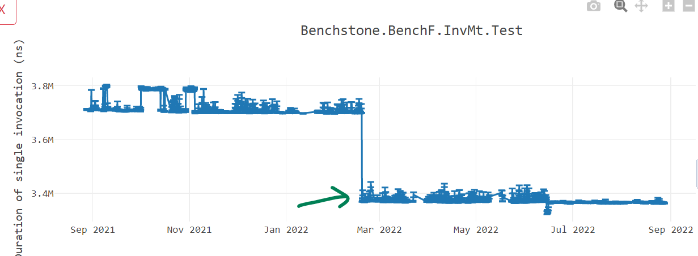</p>


In [dotnet/runtime#70749](https://github.com/dotnet/runtime/pull/70749), we optimized code that operates on `object` arrays giving us [a performance win of more than 10%](https://github.com/dotnet/runtime/pull/70749#issuecomment-1164655841).

```c#
object Test(object[] args, int i) => args[i];
```

```diff
; Method Program:Test(System.Object[],int):System.Object:this
G_M59644_IG01:
            stp     fp, lr, [sp,#-16]!
            mov     fp, sp
G_M59644_IG02:
            ldr     w0, [x1,#8]
            cmp     w2, w0
            bhs     G_M59644_IG04
-           ubfiz   x0, x2, #3, #32
-           add     x0, x0, #16
-           ldr     x0, [x1, x0]
+           add     x0, x1, #16
+           ldr     x0, [x0, w2, UXTW #3]
G_M59644_IG03:
            ldp     fp, lr, [sp],#16
            ret     lr
G_M59644_IG04:
            bl      CORINFO_HELP_RNGCHKFAIL
            brk_windows #0
```

<p align="center">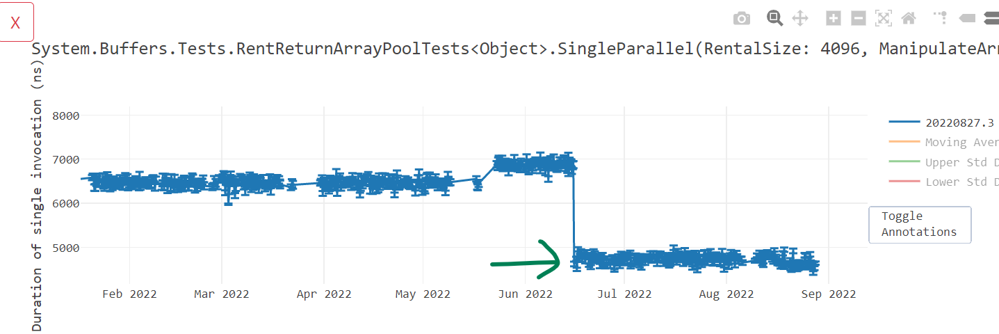</p>

In [dotnet/runtime#67490](https://github.com/dotnet/runtime/pull/67490), we improved the addressing modes of SIMD vectors that are loaded with unscaled indices. As seen below, to do such operations, we now take just 1 instruction instead of 2 instructions.

```c#
Vector128<byte> Add(ref byte b1, ref byte b2, nuint offset) =>
    Vector128.LoadUnsafe(ref b1, offset) + 
    Vector128.LoadUnsafe(ref b2, offset);
```

```diff
-        add     x0, x1, x3
-        ld1     {v16.16b}, [x0]
+        ldr     q16, [x1, x3]
-        add     x0, x2, x3
-        ld1     {v17.16b}, [x0]
+        ldr     q17, [x2, x3]
         add     v16.16b, v16.16b, v17.16b
         mov     v0.16b, v16.16b
```

### Memory barrier improvements

Arm64 has relatively weaker memory model than x64. The processor can re-order the memory access instructions to improve the performance of a program and developer will not know about it. It can execute the instructions in order that would minimize the memory access cost. This can affect multi-threaded programs functionally and "memory barrier" is a way for a developer to inform the processor to not do this rearrangement for certain code paths. The memory barrier ensures that all the preceding writes before an instruction are completed before any subsequent memory operations.


In .NET, developer can convey that information to the compiler by declaring a variable as `volatile`. We noticed that we were generating one-way barrier using store-release semantics for variable access when used with [`Volatile` class](https://docs.microsoft.com/dotnet/api/system.threading.volatile?view=net-6.0), but were not doing the same for the ones declared using `volatile` keyword as seen below making the performance of `volatile` 2X slow on Arm64.

```c#
private volatile int A;
private volatile int B;

public void Test1() {
    for (int i = 0; i < 1000; i++) {
        A = i;
        B = i;
    }
}

private int C;
private int D;

public void Test2() {
    for (int i = 0; i < 1000; i++) {
        Volatile.Write(ref C, i);
        Volatile.Write(ref D, i);
    }
}
```

```assembly
;; --------------------------------
;; Test1
;; --------------------------------
G_M12051_IG01:
            stp     fp, lr, [sp,#-16]!
            mov     fp, sp

G_M12051_IG02:
            mov     w1, wzr

G_M12051_IG03:
            dmb     ish             ; <-- two-way memory barrier
            str     w1, [x0,#8]
            dmb     ish             ; <-- two-way memory barrier
            str     w1, [x0,#12]
            add     w1, w1, #1
            cmp     w1, #0xd1ffab1e
            blt     G_M12051_IG03
            
G_M12051_IG04:
            ldp     fp, lr, [sp],#16
            ret     lr
;; --------------------------------
;; Test2
;; --------------------------------
G_M27440_IG01:
            stp     fp, lr, [sp,#-16]!
            mov     fp, sp
            
G_M27440_IG02:
            mov     w1, wzr
            add     x2, x0, #16
            add     x0, x0, #20
            
G_M27440_IG03:
            mov     x3, x2
            stlr    w1, [x3]        ; <-- store-release, one-way barrier
            mov     x3, x0
            stlr    w1, [x3]        ; <-- store-release, one-way barrier
            add     w1, w1, #1
            cmp     w1, #0xd1ffab1e
            blt     G_M27440_IG03
            
G_M27440_IG04:
            ldp     fp, lr, [sp],#16
            ret     lr
```

 [dotnet/runtime#62895](https://github.com/dotnet/runtime/pull/62895) and [dotnet/runtime#64354](https://github.com/dotnet/runtime/pull/64354) fixed these problems leading to [massive performance win](https://github.com/dotnet/runtime/pull/62895#issuecomment-1017667472).

 <p align="center">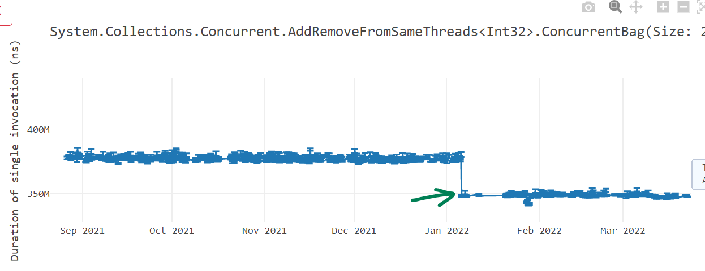</p>

Data memory barrier instructions `dmb ish*` are expensive and they guarantee that memory access that appear in program order before the `dmb` are honored before any memory access happening after the `dmb` instruction in program order. Often, we were generating two such instructions back-to-back. [dotnet/runtime#60219](https://github.com/dotnet/runtime/pull/60219) fixed that problem by removing the redundant memory barriers `dmb` present.

```c#
class Prog
{
    volatile int a;
    void Test() => a++;
}
```

```diff
; Method Prog:Test():this
G_M48563_IG01:
            stp     fp, lr, [sp,#-16]!
            mov     fp, sp
G_M48563_IG02:
            ldr     w1, [x0,#8]
-           dmb     ishld
+           dmb     ish
            add     w1, w1, #1
-           dmb     ish
            str     w1, [x0,#8]
G_M48563_IG03:
            ldp     fp, lr, [sp],#16
            ret     lr
-; Total bytes of code: 36
+; Total bytes of code: 32
```

Instructions are added as part of ARMv8.3 to support the weaker RCpc (Release Consistent processor consistent) model where a Store-Release followed by Load-Acquire to a different address can be reordered. [dotnet/runtime#67384](https://github.com/dotnet/runtime/pull/67384) added support for these instructions in RyuJIT so the machines (like Apple M1 that supports it) can take advantage of them.

### Hoisting expressions

Talking about array element access, in .NET 7, we restructured the way we were calculating the base address of an array. The way array element at `someArray[i]` is accessed is by finding the address of memory where the first array element is stored and then adding the appropriate index to it. Imagine `someArray` was stored at address `A` and the actual array elements start after `B` bytes from `A`. The address of first array element would be `A + B` and to get to the i<sup>th</sup> element, we would add `i * sizeof(array element type)`. So for a `int` array, the complete operation would be `(A + B) + (i * 4)`. If we are accessing an array inside a loop using loop index variable `i`, the term `A + B` is an invariant and we do not have to repeatedly calculate it. Instead, we can just calculate it once outside the loop, cache it and use it inside the loop. However, in RyuJIT, internally, we were representing this address as `(A + (i * 4)) + B` instead which prohibited us from moving the expression `A + B` outside the loop. [dotnet/runtime#61293](https://github.com/dotnet/runtime/pull/61293) fixed this problem as seen in the below example and gave us code size as well as performance gains ([here](https://github.com/dotnet/runtime/pull/61293#issuecomment-966430531), [here](https://github.com/dotnet/runtime/pull/61293#issuecomment-973574023) and [here](https://github.com/dotnet/runtime/pull/61293#issuecomment-977208252)).

```C#
int Sum(int[] array)
{
    int sum = 0;
    foreach (int item in array)
        sum += item;
    return sum;
}
```

```diff
; Method Tests:Sum(System.Int32[]):int:this
G_M56165_IG01:
            stp     fp, lr, [sp,#-16]!
            mov     fp, sp
G_M56165_IG02:
            mov     w0, wzr
            mov     w2, wzr
            ldr     w3, [x1,#8]
            cmp     w3, #0
            ble     G_M56165_IG04
+           add     x1, x1, #16             ;; 'A + B' is moved out of the loop
G_M56165_IG03:
-           ubfiz   x4, x2, #2, #32
-           add     x4, x4, #16
-           ldr     w4, [x1, x4]            
+           ldr     w4, [x1, w2, UXTW #2]   ;; Better addressing mode
            add     w0, w0, w4
            add     w2, w2, #1
            cmp     w3, w2
            bgt     G_M56165_IG03
G_M56165_IG04:
            ldp     fp, lr, [sp],#16
            ret     lr
-; Total bytes of code: 64
+; Total bytes of code: 60
```

<p align="center">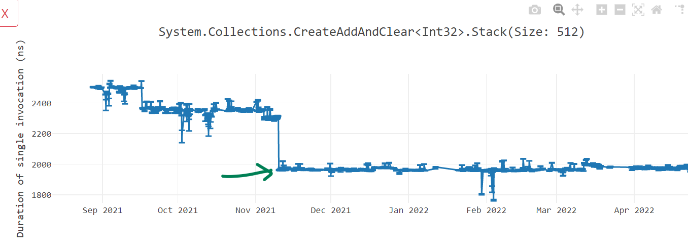</p>

While doing our Arm64 investigation on real world apps, we noted a [4-level nested for loop in ImageSharp](https://github.com/SixLabors/ImageSharp/blob/255226b03c8350f88e641bdb58c9450b68729ef7/src/ImageSharp/Processing/Processors/Quantization/WuQuantizer%7BTPixel%7D.cs#L418-L445) code base that was doing the same calculation repeatedly inside the nested loops. Here is the simplified version of the code.

```c#

private const int IndexBits = 5;
private const int IndexAlphaBits = 5;
private const int IndexCount = (1 << IndexBits) + 1;
private const int IndexAlphaCount = (1 << IndexAlphaBits) + 1;

public int M() {
    int sum = 0;
    for (int r = 0; r < IndexCount; r++)
    {
        for (int g = 0; g < IndexCount; g++)
        {
            for (int b = 0; b < IndexCount; b++)
            {
                for (int a = 0; a < IndexAlphaCount; a++)
                {
                    int ind1 = (r << ((IndexBits * 2) + IndexAlphaBits))
                                + (r << (IndexBits + IndexAlphaBits + 1))
                                + (g << (IndexBits + IndexAlphaBits))
                                + (r << (IndexBits * 2))
                                + (r << (IndexBits + 1))
                                + (g << IndexBits)
                                + ((r + g + b) << IndexAlphaBits)
                                + r + g + b + a;
                    sum += ind1;
                }
            }
        }
    }
    return sum;
}

```

As seen, a lot of calculation around `IndexBits` and `IndexAlphaBits` is repetitive and can be done just once outside the relevant loop. While compiler should take care of such optimizations, unfortunately until .NET 6, those invariants were not moved out of the loop and we had to [manually move it out](https://github.com/SixLabors/ImageSharp/pull/1818) in the C# code. In .NET 7, we addressed that problem in [dotnet/runtime#68061](https://github.com/dotnet/runtime/pull/68061) by enabling the hoisting of expressions out of multi nested loop. That increased the code quality of such loops as seen in the screenshot below. A lot of code has been moved out from `IG05` (b-loop) loop to outer loop `IG04` (g-loop) and `IG03` (r-loop).

<p align="center">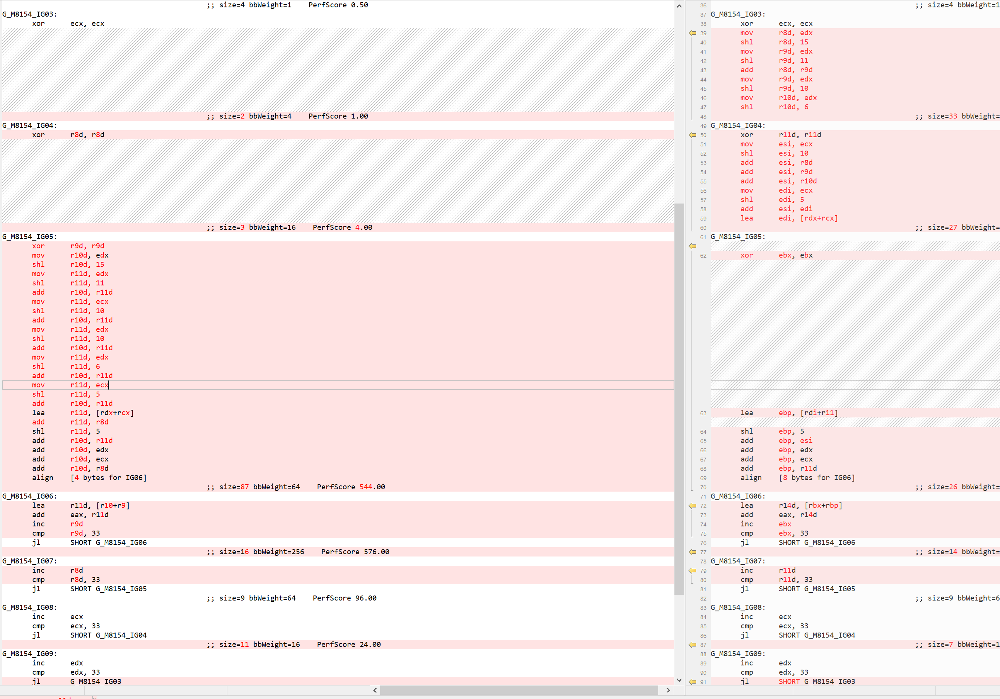</p>

While this optimization is very generic and applicable for all architectures, the reason I mentioned it in this blog post is because its significance and impact to the Arm64 code. Remember, Arm64 uses fixed-length 32-bits instruction encoding, it takes 3-4 instructions to manifest a 64-bit address. This can be seen in many places where the code is trying to load a method address or a global variable. For example, below code accesses a `static` variable inside a nested loop, a very common scenario to have.

```c#
private static int SOME_VARIABLE = 4;

int Test(int n, int m) {
    int result = 0;
    for (int i = 0; i < n; i++) {
        for (int j = 0; j < m; j++) {
            result += SOME_VARIABLE;
        }
    }
    return result;
}
```

To access the `static` variable, we manifest the address of the variable and then read its value. Although "manifesting the address of the variable" portion is invariant and can be moved out of the i-loop, until .NET 6, we were only moving it out of j-loop as seen in below assembly.

```assembly
G_M3833_IG03:                               ; i-loop
            mov     w23, wzr
            cmp     w19, #0
            ble     G_M3833_IG05
            movz    x24, #0x7e18            ; Address 0x7ff9e6ff7e18
            movk    x24, #0xe6ff LSL #16
            movk    x24, #0x7ff9 LSL #32
            mov     x0, x24
            mov     w1, #4
            bl      CORINFO_HELP_GETSHARED_NONGCSTATIC_BASE
            ldr     w0, [x24,#56]

G_M3833_IG04:                               ; j-loop
            add     w21, w21, w0
            add     w23, w23, #1
            cmp     w23, w19
            blt     G_M3833_IG04

G_M3833_IG05:
            add     w22, w22, #1
            cmp     w22, w20
            blt     G_M3833_IG03
```

In .NET 7, with [dotnet/runtime#68061](https://github.com/dotnet/runtime/pull/68061), we changed the order in which we evaluate the loops and that made it possible to move the address formation out of i-loop.

```assembly
            ...
            movz    x23, #0x7e18            ; Address 0x7ff9e6ff7e18
            movk    x23, #0xe6ff LSL #16
            movk    x23, #0x7ff9 LSL #32
                                                
G_M3833_IG03:                               ; i-loop
            mov     w24, wzr
            cmp     w19, #0
            ble     G_M3833_IG05
            mov     x0, x23
            mov     w1, #4
            bl      CORINFO_HELP_GETSHARED_NONGCSTATIC_BASE
            ldr     w0, [x23,#0x38]

G_M3833_IG04:                               ; j-looop
            add     w21, w21, w0
            add     w24, w24, #1
            cmp     w24, w19
            blt     G_M3833_IG04

G_M3833_IG05:
            add     w22, w22, #1
            cmp     w22, w20
            blt     G_M3833_IG03
```

### Improved code alignment

In .NET 6, we added support of [loop alignment](https://devblogs.microsoft.com/dotnet/loop-alignment-in-net-6/) for x86-x64 platforms. In [dotnet/runtime#60135](https://github.com/dotnet/runtime/pull/60135), we extended the support to Arm64 platforms as well. In [dotnet/runtime#59828](https://github.com/dotnet/runtime/pull/59828), we started aligning methods at 32-byte address boundary. Both these items were done to get both performance improvement and stability of the .NET applications running on Arm64 machines. Lastly, we wanted to make sure that the alignment does not cause any adverse effect on performance and hence in [dotnet/runtime#60787](https://github.com/dotnet/runtime/pull/60787), we improved the code by hiding the alignment instructions, whenever possible, behind an unconditional jump or in code blocks. As seen in below screenshot, previously, we would align the loop `IG06` by adding the padding just before the loop start (in the end of `IG05` in below example). Now, we align it by adding the padding in `IG03` after the unconditional jump `b G_M5507_IG05`.

<p align="center">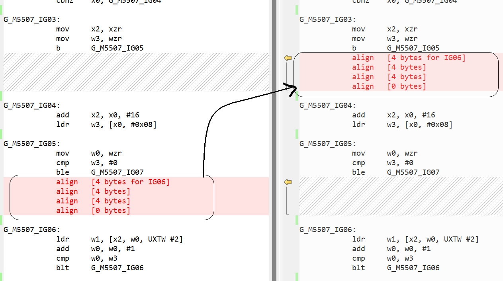</p>

### Instruction selection improvements

There was lot of code inefficiency due to poor instruction selection, and we fixed most of the problems during .NET 7. Some of the optimization opportunties in this section were found by analyzing BenchmarkGames benchmarks.

We improved [long pending](https://github.com/dotnet/runtime/issues/34937) performance problems around modulo operation. There is no Arm64 instruction to calculate modulo and compilers have to translate the `a % b` operation into `a - (a / b) * b`. However, if `divisor` is power of 2, we can translate the operation into `a & (b - 1)` instead. [dotnet/runtime#65535](https://github.com/dotnet/runtime/pull/65535) optimized this for `unsigned a`, [dotnet/runtime#66407](https://github.com/dotnet/runtime/pull/66407) optimized it for `signed a` and [dotnet/runtime#70599](https://github.com/dotnet/runtime/pull/70599) optimized for `a % 2`. If `divisor` is not a power of 2, we end up with three instructions to perform modulo operation.

```c#
int CalculateMod(a, b) => a % b
```

```assembly
tmp0 = (a / b)
tmp1 = (tmp0 * b)
tmp2 = (a - tmp1)
return tmp2
```
Arm64 has an instruction that can combine multiplication and subtraction into a single instruction `msub`. Likewise, multiplication followed by an addition can be combined into a single instruction `madd`. [dotnet/runtime#61037](https://github.com/dotnet/runtime/pull/61037) and [dotnet/runtime#66621](https://github.com/dotnet/runtime/pull/66621) addressed these problems leading to better code quality than what it was in .NET 6 and more performant ([here](https://github.com/dotnet/perf-autofiling-issues/issues/4624), [here](https://github.com/dotnet/perf-autofiling-issues/issues/4733) and [here](https://github.com/dotnet/perf-autofiling-issues/issues/2143)).

Lastly, in [dotnet/runtime#62399](https://github.com/dotnet/runtime/pull/62399), we transformed the operation `x % 2 == 0` into `x & 1 == 0` earlier in the compilation cycle which gave us better code quality. 

To summarize, here are few methods that use mod operation.

```c#
    int Test0(int n) {
        return n % 2;
    }

    int Test1(int n) {
        return n % 4;
    }

    int Test2(int n) {
        return n % 18;
    }

    int Test3(int n, int m) {
        return n % m;
    }

    bool Test4(int n) {
        return (n % 2) == 0;
    }
```

```diff
;; Test0

 G_M29897_IG02:
-            lsr     w0, w1, #31
-            add     w0, w0, w1
-            asr     w0, w0, #1
-            lsl     w0, w0, #1
-            sub     w0, w1, w0
+            and     w0, w1, #1
+            cmp     w1, #0
+            cneg    w0, w0, lt

;; Test1

 G_M264_IG02:
-            asr     w0, w1, #31
-            and     w0, w0, #3
-            add     w0, w0, w1
-            asr     w0, w0, #2
-            lsl     w0, w0, #2
-            sub     w0, w1, w0
+            and     w0, w1, #3
+            negs    w1, w1
+            and     w1, w1, #3
+            csneg   w0, w0, w1, mi

;; Test2

 G_M2891_IG02:
-            movz    w0, #0xd1ffab1e
-            movk    w0, #0xd1ffab1e LSL #16
+            movz    w0, #0xD1FFAB1E
+            movk    w0, #0xD1FFAB1E LSL #16
             smull   x0, w0, w1
             asr     x0, x0, #32
             lsr     w2, w0, #31
             asr     w0, w0, #2
             add     w0, w0, w2
-            mov     x2, #9
-            mul     w0, w0, w2
-            lsl     w0, w0, #1
-            sub     w0, w1, w0

+            mov     w2, #18
+            msub    w0, w0, w2, w1


;; Test3

 G_M38794_IG03:
             sdiv    w0, w1, w2
-            mul     w0, w0, w2
-            sub     w0, w1, w0
+            msub    w0, w0, w2, w1

;; Test 4

 G_M55983_IG01:
-            stp     fp, lr, [sp,#-16]!
+            stp     fp, lr, [sp, #-0x10]!
             mov     fp, sp

 G_M55983_IG02:
-            lsr     w0, w1, #31
-            add     w0, w0, w1
-            asr     w0, w0, #1
-            lsl     w0, w0, #1
-            subs    w0, w1, w0
+            tst     w1, #1
             cset    x0, eq

 G_M55983_IG03:
-            ldp     fp, lr, [sp],#16
+            ldp     fp, lr, [sp], #0x10
             ret     lr

-G_M55983_IG04:
-            bl      CORINFO_HELP_OVERFLOW

-G_M55983_IG05:
-            bl      CORINFO_HELP_THROWDIVZERO
-            bkpt

```

Notice that in `Test4`, we also eliminated some of the `OVERFLOW` and `THROWDIVZERO` checks with these optimizations. Here is the graph that shows the impact.

<p align="center">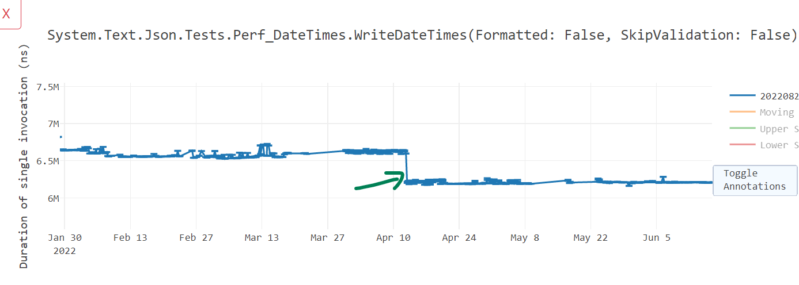</p>

While we were investigating, we found a similar problem with MSVC compiler. It too did not generate optimal `madd` instruction sometimes and that [is on track to be fixed in VS 17.4](https://developercommunity.visualstudio.com/t/Missed-Arm64-madd-opportunity-is-multip/10054905).

In [dotnet/runtime#64016](https://github.com/dotnet/runtime/pull/64016), we optimized the code generated for `Math.Round(MindpointRounding.AwayFromZero)` to avoid calling into helper, but use `frinta` instruction instead.

```c#
double Test(double x) => Math.Round(x, MidpointRounding.AwayFromZero);
```

```diff
             stp     fp, lr, [sp,#-16]!
             mov     fp, sp

-            mov     w0, #0
-            mov     w1, #1
+            frinta  d0, d0
+
             ldp     fp, lr, [sp],#16
-            b       System.Math:Round(double,int,int):double ;; call, much slower
-; Total bytes of code: 24
+            ret     lr
+; Total bytes of code: 20
```

In [dotnet/runtime#65584](https://github.com/dotnet/runtime/pull/65584), we started using `fmin` and `fmax` instructions for `float` and `double` variants of `Math.Min()` and `Math.Max()` respectively. With this, we were producing minimal code needed to conduct such operations.

```c#
double Foo(double a, double b) => Math.Max(a, b);   
```
.NET 6 code:

```assembly
G_M50879_IG01:
            stp     fp, lr, [sp,#-32]!
            mov     fp, sp
						
G_M50879_IG02:
            fcmp    d0, d1
            beq     G_M50879_IG07
						
G_M50879_IG03:
            fcmp    d0, d0
            bne     G_M50879_IG09
            fcmp    d1, d0
            blo     G_M50879_IG06
						
G_M50879_IG04:
            mov     v0.8b, v1.8b
						
G_M50879_IG05:
            ldp     fp, lr, [sp],#32
            ret     lr
						
G_M50879_IG06:
            fmov    d1, d0
            b       G_M50879_IG04
						
G_M50879_IG07:
            str     d1, [fp,#24]
            ldr     x0, [fp,#24]
            cmp     x0, #0
            blt     G_M50879_IG08
            b       G_M50879_IG04
						
G_M50879_IG08:
            fmov    d1, d0
            b       G_M50879_IG04
						
G_M50879_IG09:
            fmov    d1, d0
            b       G_M50879_IG04
```

.NET 7 code:

```assembly
G_M50879_IG01:
            stp     fp, lr, [sp, #-0x10]!
            mov     fp, sp
						
G_M50879_IG02:
            fmax    d0, d0, d1
						
G_M50879_IG03:
            ldp     fp, lr, [sp], #0x10
            ret     lr
```

In [dotnet/runtime#61617](https://github.com/dotnet/runtime/pull/61617), for `float`/`double` comparison scenarios, we eliminated an extra instruction to move `0` into a register and instead embedded `0` directly in the `fcmp` instruction. And in [dotnet/runtime#62933](https://github.com/dotnet/runtime/pull/62933), [dotnet/runtime#63821](https://github.com/dotnet/runtime/pull/63821) and [dotnet/runtime#64783](https://github.com/dotnet/runtime/pull/64783), we started eliminating extra `0` for vector comparisons as seen in below differences.

```diff
 G_M44024_IG02:        
-            movi    v16.4s, #0x00
-            cmeq    v16.4s, v16.4s, v0.4s
+            cmeq    v16.4s, v0.4s, #0
             mov     v0.16b, v16.16b
             ...
-            movi    v16.2s, #0x00
-            fcmgt   d16, d0, d16
+            fcmgt   d16, d0, #0
```

Likewise, in [dotnet/runtime#61035](https://github.com/dotnet/runtime/pull/61035), we fixed the way we were accounting for an immediate value `1` in addition and subtraction and that gave us [massive code size improvements](https://github.com/dotnet/runtime/pull/61035#issue-1040204551). As seen below, `1` was easily encoded in `add` instruction itself and it saved us 1 instruction (4 bytes) for such use cases.

```c#
static int Test(int x) => x + 1;
```

```diff
-        mov     w1, #1
-        add     w0, w0, w1
+        add     w0, w0, #1
```

In [dotnet/runtime#61045](https://github.com/dotnet/runtime/pull/61045), we improved the instruction selection for left shift operations that are of known constants.

```c#
static ulong Test1(uint x) => ((ulong)x) << 2;
```

```diff
; Method Prog:Test1(int):long
G_M16463_IG01:
            stp     fp, lr, [sp,#-16]!
            mov     fp, sp
G_M16463_IG02:
-           mov     w0, w0
-           lsl     x0, x0, #2
+           ubfiz   x0, x0, #2, #32
G_M16463_IG03:
            ldp     fp, lr, [sp],#16
            ret     lr
-; Total bytes of code: 24
+; Total bytes of code: 20
```

[dotnet/runtime#61549](https://github.com/dotnet/runtime/pull/61549) improved some of the instruction sequence to use [extended register operations](https://devblogs.microsoft.com/oldnewthing/20220727-00/?p=106907) which are shorter and performant. In the example below, earlier we would sign extend the value in register `w20` and store it in `x0` and then add it with a different value say `x19`. Now, we use the extension `SXTW` as part of the `add` instruction directly.

```diff
-       sxtw    x0, w20	
-       add     x0, x19, x0
+       add     x0, x19, w20, SXTW

```

[dotnet/runtime#62630](https://github.com/dotnet/runtime/pull/62630) performed a peep hole optimization to eliminate a zero/sign extension that was being done after loading its value in the previous instruction using `ldr` which itself does the required zero/sign extension.

```c#
static ulong Foo(ref uint p) => p;
```

```diff
; Method Prog:Foo(byref):long
G_M41239_IG01:
            stp     fp, lr, [sp,#-16]!
            mov     fp, sp
G_M41239_IG02:
            ldr     w0, [x0]
-           mov     w0, w0
G_M41239_IG03:
            ldp     fp, lr, [sp],#16
            ret     lr
-; Total bytes of code: 24
+; Total bytes of code: 20
```

We also improved a specific scenario that involves vector comparison with `Zero` vector. Consider the following example. 

```c#
static bool IsZero(Vector128<int> vec) => vec == Vector128<int>.Zero;
```

Previously, we would perform this operation using 3 steps:
1. Compare the contents of `vec` and `Vector128<int>.Zero` using `cmeq` instruction. If the contents are equal, the instruction would set every bit of the vector element to `1`, otherwise would set to `0`.
2. Next, we find the minimum value across all the vector elements using `uminv` and extract that out. In our case, if `vec == 0`, it would be `1` and if `vec != 0`, it would be `0`.
3. And at last, we compare if the outcome of `uminv` was `0` or `1` to determine if `vec == 0` or `vec != 0`.

In .NET 7, we improved this algorithm to do the following steps instead:
1. Scan through the `vec` elements and find the maximum element using `umaxv` instruction.
2. If the maximum element found in step 1 is greater than `0`, then we know the contents of `vec` are not zero. 

Here is the code difference between .NET 6 and .NET 7.

```diff
; Assembly listing for method IsZero(System.Runtime.Intrinsics.Vector128`1[Int32]):bool
    stp     fp, lr, [sp,#-16]!
    mov     fp, sp
-   cmeq    v16.4s, v0.4s, #0
-   uminv   b16, v16.16b
-   umov    w0, v16.b[0]
+   umaxv   b16, v0.16b
+   umov    w0, v16.s[0]
    cmp     w0, #0
-   cset    x0, ne
+   cset    x0, eq
    ldp     fp, lr, [sp],#16
    ret     lr
-; Total bytes of code 36
+; Total bytes of code 32
```

With this, we got [around 25% win](https://github.com/dotnet/runtime/pull/65632#issuecomment-1058297582) in various benchmarks.

<p align="center">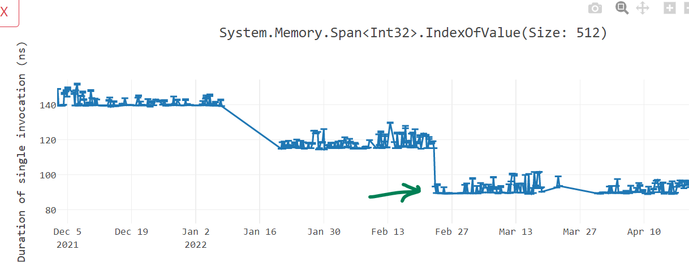</p>

In [dotnet/runtime#69333](https://github.com/dotnet/runtime/pull/69333), we started using [bit scanning intrinsics](https://docs.microsoft.com/cpp/intrinsics/arm64-intrinsics?view=msvc-170#I) and it gave us good throughput wins for Arm64 compilation.

### Memory initialization improvements

At the beginning of the method, most often developers initialize their variables to a default value. Natively, at the assembly level, this initialization happens by writing `zero value` to the stack memory (since local variables are on stack). A typical zeroing the memory instruction sequence consists of moving a zero register value to a stack memory like `mov xzr, [fp, #80]`. Depending on the number of variables we are initializing, the number of instructions to zero the memory can increase. In [dotnet/runtime#61030](https://github.com/dotnet/runtime/pull/61030), [dotnet/runtime#63422](https://github.com/dotnet/runtime/pull/63422) and [dotnet/runtime#68085](https://github.com/dotnet/runtime/pull/68085), we switched to using SIMD registers for initializing the memory. SIMD registers are 64-byte or 128-byte long and can dramatically reduce the number of instructions to zero out the memory. Similar concept is applicable for block copy. If we need to copy a large memory, previously, we were using a pair of 8-byte registers, which would load and store values 16-bytes at a time from source to destination. We switched to using SIMD register pairs which would instead operate on 32-bytes initialization in a single instruction. For addresses that are not aligned at 32-bytes boundary, the algorithm would smartly revert back to the 16-bytes or 8-bytes initialization as seen below.

```diff
-            ldp     x1, x2, [fp,#80]   // [V17 tmp13]
-            stp     x1, x2, [fp,#24]   // [V32 tmp28]
-            ldp     x1, x2, [fp,#96]   // [V17 tmp13+0x10]
-            stp     x1, x2, [fp,#40]   // [V32 tmp28+0x10]
-            ldp     x1, x2, [fp,#112]  // [V17 tmp13+0x20]
-            stp     x1, x2, [fp,#56]   // [V32 tmp28+0x20]
-            ldr     x1, [fp,#128]      // [V17 tmp13+0x30]
-            str     x1, [fp,#72]       // [V32 tmp28+0x30]
+            add     xip1, fp, #56
+            ldr     x1, [xip1,#24]
+            str     x1, [fp,#24]
+            ldp     q16, q17, [xip1,#32]   ; 32-byte load
+            stp     q16, q17, [fp,#32]     ; 32-byte store
+            ldr     q16, [xip1,#64]        ; 16-byte load
+            str     q16, [fp,#64]          ; 16-byte store
```

In [dotnet/runtime#64481](https://github.com/dotnet/runtime/pull/64481), we did several optimizations by eliminating zeroing the memory when not needed and use better instructions and addressing mode. Before .NET 7, if the memory to be copied/initialized was big enough, we would inject a loop to do the operation as seen below. Here, we are zeroing out the memory at `[sp, #-16]`, decreasing the `sp` value by `16` (post-index addressing mode) and then looping until `x11` value does not become 0.

```assembly
            mov     w7, #96
G_M49279_IG13:
            stp     xzr, xzr, [sp,#-16]!
            subs    x7, x7, #16
            bne     G_M49279_IG13
```

In .NET 7, We started unrolling some of this code if the memory size is within 128 bytes. In below code, we start by zeroing `[sp-16]` to give a hint to CPU the sequential zeroing and prompt it to switch to [write streaming mode](https://developer.arm.com/documentation/100798/0300/functional-description/level-1-memory-system/cache-behavior/write-streaming-mode).

```assembly
            stp     xzr, xzr, [sp,#-16]!
            stp     xzr, xzr, [sp,#-80]!
            stp     xzr, xzr, [sp,#16]
            stp     xzr, xzr, [sp,#32]
            stp     xzr, xzr, [sp,#48]
            stp     xzr, xzr, [sp,#64]
```

Talking about "write streaming mode", we also recognized in [dotnet/runtime#67244](https://github.com/dotnet/runtime/issues/67244) the need of using [DC ZVA instruction](https://developer.arm.com/documentation/ddi0595/2021-06/AArch64-Instructions/DC-ZVA--Data-Cache-Zero-by-VA) and [suggested it to MSVC team](https://developercommunity.visualstudio.com/t/Arm64:-Use-optimized-DC-ZVA-instructio/10054880?space=62&q=Optimize+Arm64+memset&entry=problem).

We noted that in certain situations, for operations like `memset` and `memmove`, in x86-x64, we were forwarding the execution to the CRT implementation, but in Arm64, we had [hand written assembly](https://github.com/dotnet/runtime/blob/2453f16807b85b279efc26d17d6f20de87801c09/src/coreclr/vm/arm64/crthelpers.asm) to perform such operation.

Here is the x64 code generated for [CopyBlock128](https://github.com/dotnet/performance/blob/9e4217922650b8cf8e54e835c395fb8117b9ee57/src/benchmarks/micro/runtime/StoreBlock/StoreBlock.cs#L156-L162) benchmark.

```assembly
G_M19447_IG03:
       lea      rcx, bword ptr [rsp+08H]
       lea      rdx, bword ptr [rsp+88H]
       mov      r8d, 128
       call     CORINFO_HELP_MEMCPY  ;; this calls into "jmp memmove"
       inc      edi
       cmp      edi, 100
       jl       SHORT G_M19447_IG03
```

However, until .NET 6, the Arm64 assembly code was like this:

```assembly
G_M19447_IG03:
            ldr     x1, [fp,#152]
            str     x1, [fp,#24]
            ldp     q16, q17, [fp,#160]
            stp     q16, q17, [fp,#32]
            ldp     q16, q17, [fp,#192]
            stp     q16, q17, [fp,#64]
            ldp     q16, q17, [fp,#224]
            stp     q16, q17, [fp,#96]
            ldr     q16, [fp,#0xd1ffab1e]
            str     q16, [fp,#128]
            ldr     x1, [fp,#0xd1ffab1e]
            str     x1, [fp,#144]
            add     w0, w0, #1
            cmp     w0, #100
            blt     G_M19447_IG03
```

We switched to using CRT implementation of `memmove` and `memset` long back for [windows/linux x64](https://github.com/dotnet/coreclr/pull/25750) as well as for [linux arm64](https://github.com/dotnet/coreclr/pull/17536). In [dotnet/runtime#67788](https://github.com/dotnet/runtime/pull/67788), we switched to using CRT implementation for windows/arm64 as well and saw [up to 25% improvements](https://github.com/dotnet/perf-autofiling-issues/issues/4623) in such benchmarks.

<p align="center">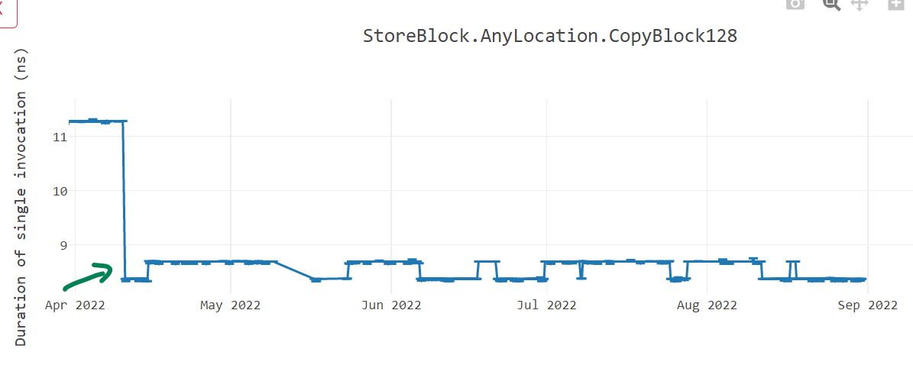</p>

Most important optimization we added during .NET 7 is [conditional execution instructions](https://devblogs.microsoft.com/oldnewthing/20220817-00/?p=106998). With [dotnet/runtime#71616](https://github.com/dotnet/runtime/pull/71616), @a74nh from Arm made contribution to generate conditional comparison instructions and in future with [dotnet/runtime#73472](https://github.com/dotnet/runtime/pull/73472), we will soon have "conditional selection" instructions.

With "conditional comparison" `ccmp`, we can do the comparison based upon the result of previous comparison. Let us try to deciper what is going on in below example. Previously, we would compare `!x` using `cmp w2, #0` and if true, set `1` in `x0` using `cset` instruction. Likewise condition `y == 9` is checked using `cmp w1, #9` and `1` is set in `x3` if they are equal. Lastly, it will compare the contents of `w0` and `w3` to see if they match and jump accordingly. In .NET 7, we perform the same comparison of `!x` initially. But then we perform `ccmp w1, #9, c, eq` which compares equality (`eq` in the end) of `w1` and `9` and if they are equal, set the zero flag. If the results do not match, it sets the carry `c` flag. The next instruction simply checks if zero was set and jump accordingly. If you see the difference, it eliminates a comparison instruction and give us performance improvement.

```C#
bool Test() => (!x & y == 9);
```
```diff
             cmp     w2, #0
-            cset    x0, eq
-            cmp     w1, #9
-            cset    x3, ls
-            tst     w0, w3
-            beq     G_M40619_IG09
+            ccmp    w1, #9, c, eq
+            cset    x0, ls
+            cbz     w0, G_M40619_IG09
```

## Tooling improvements

As many are familiar, if a developer is interested in seeing the disassembly for their code during development, they can paste a code snippet in https://sharplab.io/. However, it just shows the disassembly for x64. There was no similar online tool to display Arm64 disassembly. [@hez2010](https://github.com/hez2010) [added the support for .NET (C#/F#/VB)](https://github.com/compiler-explorer/compiler-explorer/pull/3168) in godbolt. Now, developer can paste their .NET code and [inspect the disassembly](https://godbolt.org/z/dab19aWs7) for all platforms we support including Arm64. There is also a Visual Studio extension [Disasmo](https://marketplace.visualstudio.com/items?itemName=EgorBogatov.Disasmo) that can be installed to inspect the disassembly but in order to use that, you need to have dotnet/runtime repository present and built on your local machine.

## Impact

As seen from various graphs above, with our work in .NET 7, many Micro benchmarks improved by 10~60%. I just want to share another graph of TE benchmarks run on Linux OS in the asp.net performance lab. As seen below, when we started in .NET 7, the Requests/Second (RPS) was lower for Arm64 but as we made progress, the line climbs up towards x64 over various .NET 7 previews. Likewise, the latency (measured in milliseconds) climbs down from .NET 6 to .NET 7.

<p align="center"></p>

<p align="center">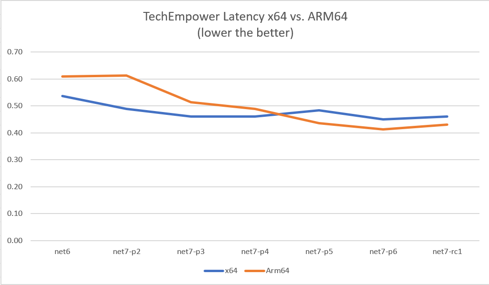</p>

## Benchmark environment

How can we discuss performance and not mention the environment in which we conducted our measurements? For Arm64 context, we run two sets of benchmarks regularly and monitor the performance of those benchmarks build over build. [The TE benchmarks](https://github.com/aspnet/Benchmarks) are run in performance lab owned by ASP.NET team using [crank](https://github.com/dotnet/crank) infrastructure. The results are posted on https://aka.ms/aspnet/benchmarks. We run the benchmarks on `Intel Xeon` x64 machine and `Ampere Altra` Arm64 machine as seen in the [list of environment](https://msit.powerbi.com/view?r=eyJrIjoiYTZjMTk3YjEtMzQ3Yi00NTI5LTg5ZDItNmUyMGRlOTkwMGRlIiwidCI6IjcyZjk4OGJmLTg2ZjEtNDFhZi05MWFiLTJkN2NkMDExZGI0NyIsImMiOjV9) on our results site. We run on both Linux and Windows Operating System.

The other sets of benchmarks that are run regularly are [Micro benchmarks](https://github.com/dotnet/performance/tree/main/src/benchmarks/micro). They are run in a performance lab owned by .NET team and the results are posted [on this site](https://pvscmdupload.blob.core.windows.net/reports/allTestHistory/TestHistoryIndexIndex.html). Just as TE benchmark environment, we run these benchmarks on wide variety of devices like `Surface Pro X`, `Intel`, `AMD` and `Ampere` machines.

In .NET 7, we added [Rick Brewster](https://github.com/rickbrew)'s `Paint.NET` tool to our benchmarks. It tracks various aspects of a UI tool like Startup, Ready state and rendering as seen in below graph and we monitor these metrics for both x64 and Arm64.

<p align="center">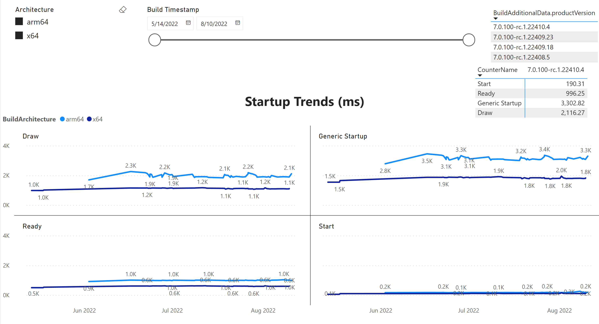</p>

### Hardware with Linux OS

[Ampere Altra Arm64](https://www.anandtech.com/show/16315/the-ampere-altra-review/3)

```console
Architecture:           aarch64
  CPU op-mode(s):       32-bit, 64-bit
  Byte Order:           Little Endian
CPU(s):                 80
  On-line CPU(s) list:  0-79
Vendor ID:              ARM
  Model name:           Neoverse-N1
    Model:              1
    Thread(s) per core: 1
    Core(s) per socket: 80
    Socket(s):          1
    Stepping:           r3p1
    Frequency boost:    disabled
    CPU max MHz:        3000.0000
    CPU min MHz:        1000.0000
    BogoMIPS:           50.00
    Flags:              fp asimd evtstrm aes pmull sha1 sha2 crc32 atomics fphp asimdhp cpuid asimdrdm lrcpc dcpop asimddp ssbs
Caches (sum of all):  
  L1d:                  5 MiB (80 instances)
  L1i:                  5 MiB (80 instances)
  L2:                   80 MiB (80 instances)
  L3:                   32 MiB (1 instance)
NUMA:                   
  NUMA node(s):         1
  NUMA node0 CPU(s):    0-79
Vulnerabilities:        
  Itlb multihit:        Not affected
  L1tf:                 Not affected
  Mds:                  Not affected
  Meltdown:             Not affected
  Mmio stale data:      Not affected
  Retbleed:             Not affected
  Spec store bypass:    Mitigation; Speculative Store Bypass disabled via prctl
  Spectre v1:           Mitigation; __user pointer sanitization
  Spectre v2:           Mitigation; CSV2, BHB
  Srbds:                Not affected
  Tsx async abort:      Not affected
  ```

[Intel Cascade lake x64](https://www.intel.com/content/www/us/en/products/platforms/details/cascade-lake.html)

  ```console
  Architecture:            x86_64
  CPU op-mode(s):        32-bit, 64-bit
  Address sizes:         46 bits physical, 48 bits virtual
  Byte Order:            Little Endian
CPU(s):                  52
  On-line CPU(s) list:   0-51
Vendor ID:               GenuineIntel
  Model name:            Intel(R) Xeon(R) Platinum 8272CL CPU @ 2.60GHz
    CPU family:          6
    Model:               85
    Thread(s) per core:  1
    Core(s) per socket:  26
    Socket(s):           2
    Stepping:            7
    CPU max MHz:         2600.0000
    CPU min MHz:         1000.0000
    BogoMIPS:            5200.00
    Flags:               fpu vme de pse tsc msr pae mce cx8 apic sep mtrr pge mca cmov pat pse36 clflush dts acpi mmx fx
                         sr sse sse2 ss ht tm pbe syscall nx pdpe1gb rdtscp lm constant_tsc art arch_perfmon pebs bts re
                         p_good nopl xtopology nonstop_tsc cpuid aperfmperf pni pclmulqdq dtes64 monitor ds_cpl vmx smx
                         est tm2 ssse3 sdbg fma cx16 xtpr pdcm pcid dca sse4_1 sse4_2 x2apic movbe popcnt tsc_deadline_t
                         imer aes xsave avx f16c rdrand lahf_lm abm 3dnowprefetch cpuid_fault epb cat_l3 cdp_l3 invpcid_
                         single intel_ppin ssbd mba ibrs ibpb stibp ibrs_enhanced tpr_shadow vnmi flexpriority ept vpid
                         ept_ad fsgsbase tsc_adjust bmi1 avx2 smep bmi2 erms invpcid cqm mpx rdt_a avx512f avx512dq rdse
                         ed adx smap clflushopt clwb intel_pt avx512cd avx512bw avx512vl xsaveopt xsavec xgetbv1 xsaves
                         cqm_llc cqm_occup_llc cqm_mbm_total cqm_mbm_local dtherm arat pln pts hwp hwp_act_window hwp_ep
                         p hwp_pkg_req pku ospke avx512_vnni md_clear flush_l1d arch_capabilities
Virtualization features:
  Virtualization:        VT-x
Caches (sum of all):
  L1d:                   1.6 MiB (52 instances)
  L1i:                   1.6 MiB (52 instances)
  L2:                    52 MiB (52 instances)
  L3:                    71.5 MiB (2 instances)
NUMA:
  NUMA node(s):          2
  NUMA node0 CPU(s):     0-25
  NUMA node1 CPU(s):     26-51
Vulnerabilities:
  Itlb multihit:         KVM: Mitigation: VMX disabled
  L1tf:                  Not affected
  Mds:                   Not affected
  Meltdown:              Not affected
  Mmio stale data:       Mitigation; Clear CPU buffers; SMT disabled
  Retbleed:              Mitigation; Enhanced IBRS
  Spec store bypass:     Mitigation; Speculative Store Bypass disabled via prctl and seccomp
  Spectre v1:            Mitigation; usercopy/swapgs barriers and __user pointer sanitization
  Spectre v2:            Mitigation; Enhanced IBRS, IBPB conditional, RSB filling
  Srbds:                 Not affected
  Tsx async abort:       Mitigation; TSX disabled
  ```

[Intel Skylake x64](https://ark.intel.com/content/www/us/en/ark/products/120474/intel-xeon-gold-5120-processor-19-25m-cache-2-20-ghz.html)

```console
Architecture:                    x86_64
CPU op-mode(s):                  32-bit, 64-bit
Byte Order:                      Little Endian
Address sizes:                   46 bits physical, 48 bits virtual
CPU(s):                          28
On-line CPU(s) list:             0-27
Thread(s) per core:              2
Core(s) per socket:              14
Socket(s):                       1
NUMA node(s):                    1
Vendor ID:                       GenuineIntel
CPU family:                      6
Model:                           85
Model name:                      Intel(R) Xeon(R) Gold 5120 CPU @ 2.20GHz
Stepping:                        4
CPU MHz:                         1000.131
BogoMIPS:                        4400.00
Virtualization:                  VT-x
L1d cache:                       448 KiB
L1i cache:                       448 KiB
L2 cache:                        14 MiB
L3 cache:                        19.3 MiB
NUMA node0 CPU(s):               0-27
Vulnerability Itlb multihit:     KVM: Mitigation: Split huge pages
Vulnerability L1tf:              Mitigation; PTE Inversion; VMX conditional cache flushes, SMT vulnerable
Vulnerability Mds:               Mitigation; Clear CPU buffers; SMT vulnerable
Vulnerability Meltdown:          Mitigation; PTI
Vulnerability Spec store bypass: Mitigation; Speculative Store Bypass disabled via prctl and seccomp
Vulnerability Spectre v1:        Mitigation; usercopy/swapgs barriers and __user pointer sanitization
Vulnerability Spectre v2:        Mitigation; Retpolines, IBPB conditional, IBRS_FW, STIBP conditional, RSB filling
Vulnerability Srbds:             Not affected
Vulnerability Tsx async abort:   Mitigation; Clear CPU buffers; SMT vulnerable
Flags:                           fpu vme de pse tsc msr pae mce cx8 apic sep mtrr pge mca cmov pat pse36 clflush dts acpi mmx fxsr sse sse2 ss ht tm pbe sysca
                                 ll nx pdpe1gb rdtscp lm constant_tsc art arch_perfmon pebs bts rep_good nopl xtopology nonstop_tsc cpuid aperfmperf pni pclmu
                                 lqdq dtes64 monitor ds_cpl vmx smx est tm2 ssse3 sdbg fma cx16 xtpr pdcm pcid dca sse4_1 sse4_2 x2apic movbe popcnt tsc_deadl
                                 ine_timer aes xsave avx f16c rdrand lahf_lm abm 3dnowprefetch cpuid_fault epb cat_l3 cdp_l3 invpcid_single pti intel_ppin ssb
                                 d mba ibrs ibpb stibp tpr_shadow vnmi flexpriority ept vpid ept_ad fsgsbase tsc_adjust bmi1 hle avx2 smep bmi2 erms invpcid r
                                 tm cqm mpx rdt_a avx512f avx512dq rdseed adx smap clflushopt clwb intel_pt avx512cd avx512bw avx512vl xsaveopt xsavec xgetbv1
                                  xsaves cqm_llc cqm_occup_llc cqm_mbm_total cqm_mbm_local dtherm ida arat pln pts pku ospke md_clear flush_l1d
```

### Hardware with Windows OS

We have wide range of machines running Windows 10, Windows 11, Windows Server 2022. Some of them are client devices like [Surface Pro X Arm64](https://www.microsoft.com/surface/business/surface-pro-x/processor), while others are heavy server devices like [Intel Cascade lake x64](https://www.intel.com/content/www/us/en/products/platforms/details/cascade-lake.html), [Ampere Altra Arm64](https://www.anandtech.com/show/16315/the-ampere-altra-review/3) and [Intel Skylake x64](https://ark.intel.com/content/www/us/en/ark/products/120474/intel-xeon-gold-5120-processor-19-25m-cache-2-20-ghz.html).


### Conclusion

To conclude, we had a great .NET 7 release with lots of improvements made in various areas from libraries to runtime, to code generation. We closed the performance gap between x64 and Arm64 on specific hardware. We discovered many critical problems like poor thread pool scaling and incorrect L3 cache size determination, and we addressed them in .NET 7. We improved generated code quality by taking advantage of Arm64 addressing modes, optimizing `%` operation, and improving general array accesses. We had great partnership with Arm engineers [@a74nh](https://github.com/a74nh), [@SwapnilGaikwad](https://github.com/SwapnilGaikwad) and [@TamarChristinaArm](https://github.com/TamarChristinaArm) from Arm made a great contribution by converting some hot .NET library code to using intrinsics. We want to thank multiple contributors who made us possible to ship a faster .NET 7 on Arm64 devices.


Thank you for taking time to read and do let us know your feedback on using .NET on Arm64. Happy coding on Arm64!
